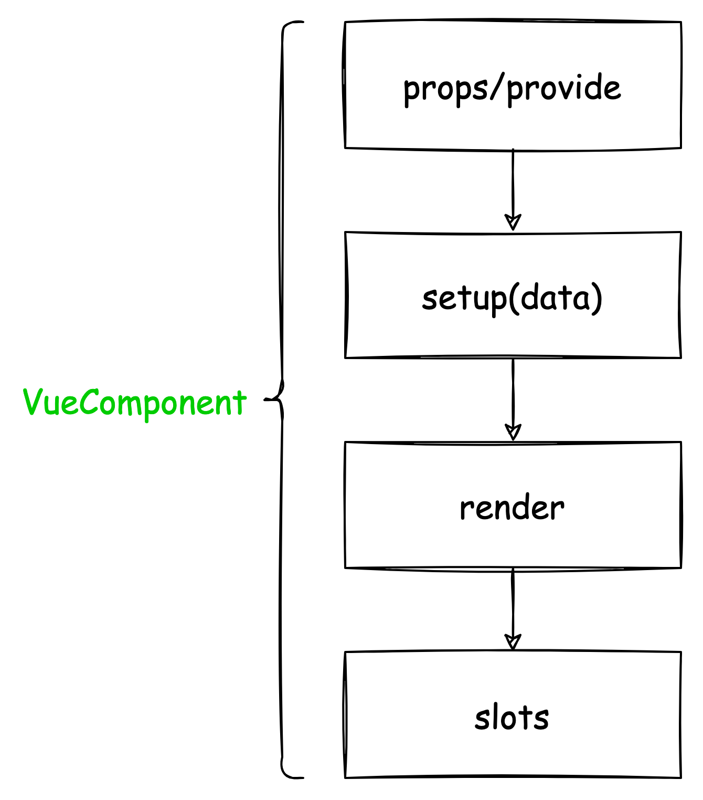
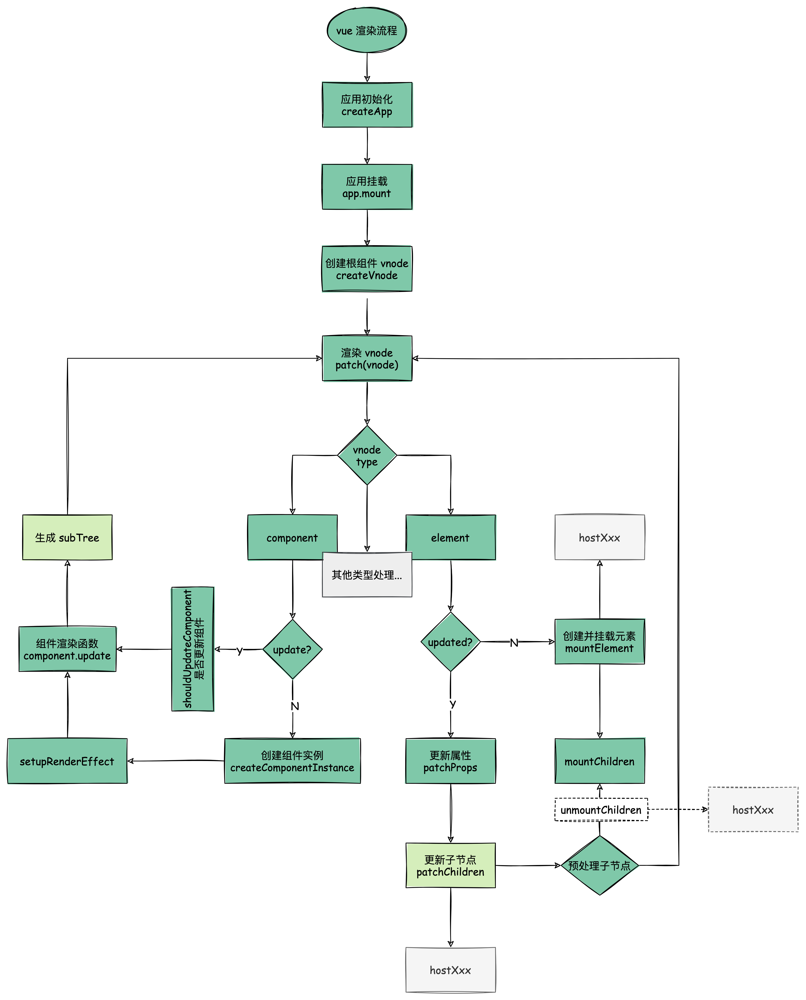

# vue 组件渲染流程

> 以下示例代码、内容都是基于 vue3 为主

任何前端框架，最主要的核心功能就是渲染视图。在 Vue 中，整个应用的页面都是通过**组件**来构成并渲染成页面。

  

## VNode

Vue 的渲染原理中使用 **Virtual DOM 机制去抽象描述真实的 DOM**。**Virtual DOM 本质是一个 JS 对象**，用 JS 对象来模拟 DOM 结构。

> 在 vue 中 Virtual DOM 为 vnode

我们可以用一个 vnode 对象去表示`<button>`节点。一个 VNode 的属性最主要的是节点类型 `type`，节点属性 `props`，字节点 `children`。

```html
<button class="btn" style="width:100px;height:50px">click me</button>
```

```javascript
const vnode = {
  type: 'button',
  props: { 
    'class': 'btn',
    style: {
      width: '100px',
      height: '50px'
    }
  },
  children: 'click me'
}
```

引入 VNode 的好处：

1. 任何常规的 GUI 都能用**类 DOM 数据结构**去描述，引入 VNode主要是将视图**抽象化**，提供了**跨平台**能力
2. **UI is a value** 视图也是一种变量值，能够进行编程化
3. 基于虚拟 DOM 实现 MDV（状态驱动视图） 的 UI 开发方式：避免了手动操作 DOM 效率低下；以及某些场景下操作不当引发导致的性能问题。比如布局抖动，可利用虚拟 DOM 去缓存状态变更，最后通过 diff 精准计算 DOM 的最小变更操作

vue 还提供很多的 VNode 类型：

```javascript
// packages/runtime-core/src/vnode.ts
export type VNodeTypes =
  | string // element
  | VNode // slot
  | Component // 组件
  | typeof Text // 文本
  | typeof Static // 静态
  | typeof Comment // 注释
  | typeof Fragment // 片段
  | typeof TeleportImpl // 传送组件
  | typeof SuspenseImpl // 挂载组件

export interface VNode<
  HostNode = RendererNode,
  HostElement = RendererElement,
  ExtraProps = { [key: string]: any }
> {
  type: VNodeTypes
  props: (VNodeProps & ExtraProps) | null
  children: VNodeNormalizedChildren
	...
}
```

## Vue 组件
  
组件是一种抽象概念、一种复用手段。

前端领域的组件化，即以视图为单位进行页面分割及复用，组件 = 视图模板 + 逻辑状态。

> 但是以这样的组件为基本复用单位，在前端领域你会发现很难复用。有时视图模板符合了但逻辑状态稍微得修改，代码只会加入更多的 case by case；有时逻辑状态符合了模板样式却不符合 UI。
> 
> 最佳形式是**视图模板与逻辑状态可分开，与组件都是最小复用单位**。

Vue 组件是 vue 渲染的基本单位，是视图与状态的连接的桥梁。一个 vue 组件的主要构成分层：

  

每一层都是自顶向下依赖：

1. props/provide 外部对组件的输入
2. setup(data) 组件内部逻辑组织、视图状态输出
3. render 渲染视图状态
4. slots 对外部提供自定义渲染接口

定义并渲染一个组件：

```js
import { createVNode, render, h } from 'vue';

// 组件定义
const CustomComponent = {
  props: {
    name: String,
  },
  setup(props) {
    return {
      resolveName: `hello ${props.name}`,
    };
  },
  render() {
    return h('div', [this.resolveName, this.$slots.default()]);
  },
};

// 组件渲染
// 1. 创建组件的 vnode
const vnode = createVNode(
  CustomComponent,
  { name: 'world' },
  {
    default: '!',
  }
);
// vnode
//{
//  type: CustomComponent,
//  props: { 
//    name: 'test'
//  },
//  children: '!'
//}

// 2. 渲染 vnode（patch vnode）
render(vnode, document.querySelector('#app'));
// <div>hello world!</div>
```

渲染组件核心就两步：

1. 创建 vnode
2. 渲染 vnode（patch vnode） 

## 组件渲染流程

渲染流程分初始渲染和更新渲染，下面源码分析先从初始渲染流程。

### 创建应用对象

```javascript
// 在 Vue3 中，一个 vue 应用创建标准流程如下
import { createApp } from 'vue'
import App from './app'
const app = createApp(App)
app.mount('#app')

-------------------------------------------------------------

// runtime-dom 包中包含了 web 平台的渲染器
// packages/runtime-dom/src/index.ts
const createApp = ((...args) => {
  // 1. 创建 web 渲染器、创建 app 对象
  const app = ensureRenderer().createApp(...args)

  const { mount } = app

  // 重写 mount 方法
  app.mount = (containerOrSelector) => {
    const container = normalizeContainer(containerOrSelector)
    // 2. 调用 app.mount 核心标准方法，创建 vnode, 渲染 vnode
    mount(container)
    // ...
  }

  return app
})

```
#### 渲染器 renderer

```javascript
// packages/runtime-dom/src/index.ts
const app = ensureRenderer().createApp(...args) // 延迟创建渲染，方便 tree-shakable

// 创建自定义渲染器
// vue 为了跨平台支持，抽象标准化渲染器的平台渲染接口。
// renderer = createRenderer(nodeOps)
function ensureRenderer() {
  return renderer || (renderer = createRenderer<Node, Element>(rendererOptions))
}

// 实现不同平台的渲染操作接口
const rendererOptions = extend({ patchProp, forcePatchProp }, nodeOps)
```

nodeOps(packages/runtime-dom/src/nodeOps.ts)，实现了 web 平台下的渲染接口。通过创建自定义渲染器我们可以实现不同平台下的渲染。

  


```javascript
// packages/runtime-core/src/renderer.ts

// createRenderer 是 vue 自定义渲染器的核心方法
function createRenderer(nodeOps) {
  return baseCreateRenderer(nodeOps)
}

function baseCreateRenderer(nodeOps) {

  //接口定义
  const remove: RemoveFn = vnode => {
    // 接口调用
    nodeOps.remove()
  }

  //...

  // 利用闭包，将 nodeOps 保存下来
  function render(vnode, container) {
    // 组件渲染的核心逻辑
    patch(vnode, container)
  }

  // 返回包含 render 方法的渲染器
  return {
    render,
    // createAppAPI 创建 createApp 
    createApp: createAppAPI(render)
  }
}

```

除了将渲染器的跨平台渲染标准化，还将应用创建流程也标准化。

#### createAppAPI

相比以前使用插件、挂载全局属性方法都落到 Vue 构造函数和原型上，createApp 创建一个应用上下文，允许我们创建多个 vue 应用并进行全局配置隔离。

createApp 函数内部的 app.mount 方法是一个标准的跨平台的组件渲染流程：**先创建 vnode，再渲染 vnode，生成 DOM**。

```javascript
// Vue.js 利用闭包和函数柯里化，createAppAPI 包装 render
function createAppAPI(render) {
  // createApp createApp 方法接受的两个参数：根组件的对象和 prop
  return function createApp(rootComponent, rootProps = null) {
    const app = {
      _component: rootComponent,
      _props: rootProps,
      mount(rootContainer) {
        // 创建根组件的 vnode
        const vnode = createVNode(rootComponent, rootProps)
        // 调用渲染器的 render vnode
        render(vnode, rootContainer)
        app._container = rootContainer
        return vnode.component.proxy
      }
    }
    return app
  }
}
```

这里的代码的执行逻辑都是与平台无关的，启动标准渲染流程。但我们可能需要在外部重写这个方法，来完善特定平台下的渲染逻辑。

进入应用挂载阶段后，接下来就是核心的组件渲染流程。

### 组件渲染

#### 创建 vnode

```javascript
// packages/runtime-core/src/vnode.ts
function _createVNode(
  type: VNodeTypes | ClassComponent | typeof NULL_DYNAMIC_COMPONENT,
  props: (Data & VNodeProps) | null = null,
  children: unknown = null,
  patchFlag: number = 0,
  dynamicProps: string[] | null = null,
  isBlockNode = false
): VNode {

  if (props) {
    // 处理 props 相关逻辑，标准化 class 和 style
  }

  // 对 vnode 类型信息编码
  // 以便在后面的 patch 阶段，可以根据不同的类型执行相应的处理逻辑
  const shapeFlag = isString(type)
    ? ShapeFlags.ELEMENT
    : __FEATURE_SUSPENSE__ && isSuspense(type)
      ? ShapeFlags.SUSPENSE
      : isTeleport(type)
        ? ShapeFlags.TELEPORT
        : isObject(type)
          ? ShapeFlags.STATEFUL_COMPONENT
          : isFunction(type)
            ? ShapeFlags.FUNCTIONAL_COMPONENT
            : 0

  const vnode: VNode = {
    type,
    props,
    key: props && normalizeKey(props),
    ...
  }
	
  // 标准化子节点，把不同数据类型的 children 转成数组或者文本类型
  normalizeChildren(vnode, children)

  return vnode
}
```

工厂模式创建 vnode，并且对 props、children 做标准化处理、对 vnode 的 type、childre 做信息编码等。

#### 渲染 vnode（patch vnode）

```javascript
const render: RootRenderFunction = (vnode, container, isSVG) => {
  if (vnode == null) {
    // 销毁组件
    if (container._vnode) {
      unmount(container._vnode, null, null, true)
    }
  } else {
    // 创建或者更新组件
    patch(container._vnode || null, vnode, container, null, null, null, isSVG)
  }
  
  // 缓存 vnode 节点，表示已经渲染
  container._vnode = vnode
}
```

**patch 的功能是 diff 新旧 vnode，然后根据不同的 vnode 类型派发任务给 process 处理**。

但初始渲染时旧 vnode 为 null，最终处理结果基本是 mount 操作:

`diff => process => mount`

比如根 vnode 是个组件类型，故 processComponent进行处理，调用 mountComponent 方法渲染组件。

```ts
const patch: PatchFn = (
    n1,
    n2,
    container,
    anchor = null,
    parentComponent = null,
    parentSuspense = null,
    isSVG = false,
    slotScopeIds = null,
    optimized = false
  ) => {
    // 如果存在新旧节点, 且新旧节点类型不同，则销毁旧节点
    if (n1 && !isSameVNodeType(n1, n2)) {
      anchor = getNextHostNode(n1)
      unmount(n1, parentComponent, parentSuspense, true)
      n1 = null
    }

    const { type, ref, shapeFlag } = n2
    switch (type) {
      case Text:...
      case Comment:...
      case Static:...
      case Fragment:...
      default:
        if (shapeFlag & ShapeFlags.ELEMENT) {
         ...
        } else if (shapeFlag & ShapeFlags.COMPONENT) {
          processComponent(
            n1,
            n2,
            container,
            anchor,
            parentComponent,
            parentSuspense,
            isSVG,
            slotScopeIds,
            optimized
          )
        } else if (shapeFlag & ShapeFlags.TELEPORT) {
          ...
        } else if (__FEATURE_SUSPENSE__ && shapeFlag & ShapeFlags.SUSPENSE) {
         ...
        } else if (__DEV__) {
          ...
        }
    }
          

 const processComponent = (n1, n2, container, anchor, parentComponent, parentSuspense, isSVG, optimized) => {

  if (n1 == null) {
   // 挂载组件
   mountComponent(n2, container, anchor, parentComponent, parentSuspense, isSVG, optimized)
  }
  else {
    // 更新组件
    updateComponent(n1, n2, parentComponent, optimized)
  }
}
 

// 挂载组件
const mountComponent = (initialVNode, container, anchor, parentComponent, parentSuspense, isSVG, optimized) => {

  // 创建组件实例
  const instance = (initialVNode.component = createComponentInstance(initialVNode, parentComponent, parentSuspense))

  // 调用组件的 setup 
  setupComponent(instance)

  // 设置并运行渲染副作用
  setupRenderEffect(instance, initialVNode, container, anchor, parentSuspense, isSVG, optimized)
}
```

`mountComponent` 方法渲染组件中最主要的是 `setupRenderEffect`，**该函数利用响应式库的 effect 函数创建了一个组件的渲染副作用，当组件的数据发生变化时，effect 函数包裹的组件渲染函数会重新执行一遍，从而达到重新渲染组件的目的**。

```javascript
const setupRenderEffect = (instance, initialVNode, container, anchor, parentSuspense, isSVG, optimized) => {

  // 创建响应式的副作用渲染函数

  instance.update = effect(function componentEffect() {

    if (!instance.isMounted) {

      // 调用组件的 render 方法，生成 subTree
      const subTree = (instance.subTree = renderComponentRoot(instance))

      // patch subTree 
      patch(null, subTree, container, anchor, instance, parentSuspense, isSVG)

      // 保留渲染生成的子树根 DOM 节点
      initialVNode.el = subTree.el

      instance.isMounted = true

    }

    else {

      // 更新组件

    }

  }, prodEffectOptions)


  // 初始渲染
  instance.update()
}
```

**组件在 vnode tree 中只是个抽象节点，实际渲染的是组件的 render 函数生成 subTree，故还要继续 patch subTree**。

经过 patch 函数的深度递归处理，**普通元素类型的节点**处理才会是最终反应到页面上。

```javascript
// patch => processElement => mountElement
const mountElement = (vnode, container, anchor, parentComponent, parentSuspense, isSVG, optimized) => {

  let el

  const { type, props, shapeFlag } = vnode

  // 创建 DOM 元素节点

  el = vnode.el = hostCreateElement(vnode.type, isSVG, props && props.is)

  if (props) {

    // 处理 props，比如 class、style、event 等属性

    for (const key in props) {

      if (!isReservedProp(key)) {

        hostPatchProp(el, key, null, props[key], isSVG)

      }

    }

  }

  if (shapeFlag & 8 /* TEXT_CHILDREN */) {

    // 处理子节点是纯文本的情况
    hostSetElementText(el, vnode.children)
  }

  else if (shapeFlag & 16 /* ARRAY_CHILDREN */) {

    // 处理子节点是数组的情况
    mountChildren(vnode.children, el, null, parentComponent, parentSuspense, isSVG && type !== 'foreignObject', optimized || !!vnode.dynamicChildren)

  }

  // 把创建的 DOM 元素节点挂载到 container 上
  hostInsert(el, container, anchor)
}
```

**在 mountElement 方法调用平台渲染方法，比如 `hostCreateElement`，在 web 平台底层就是调用 `document.createElement` 方法**。

深度递归 vnode tree 的过程，**挂载的顺序是先子节点，后父节点，最终挂载到最外层的容器上**，完成渲染。


## 总结

1. 创建应用 createApp，可以让我们进行应用环境隔离
2. 渲染组件核心就两步
   1. 创建组件类型的 vnode
   2. 渲染 vnode（patch vnode）
      > 在深度递归 patch 时其实涉及到一个 diff 算法，这主要应用在更新流程，因为初始渲染时并没有 old tree 需要对比。
3. vue 组件是抽象节点，是不会生成真实节点，调用组件模板生成 subTree 去渲染
4. 元素类型的节点才会最终落实渲染成真实 DOM 节点
5. 渲染的最终是调用平台的渲染接口，生成真实的 DOM

> 下图为 vue 渲染流程，其中更新流程也包括在里面

  


下篇 [vdom diff 更新流程](./vdom%20diff%20更新流程.md)。