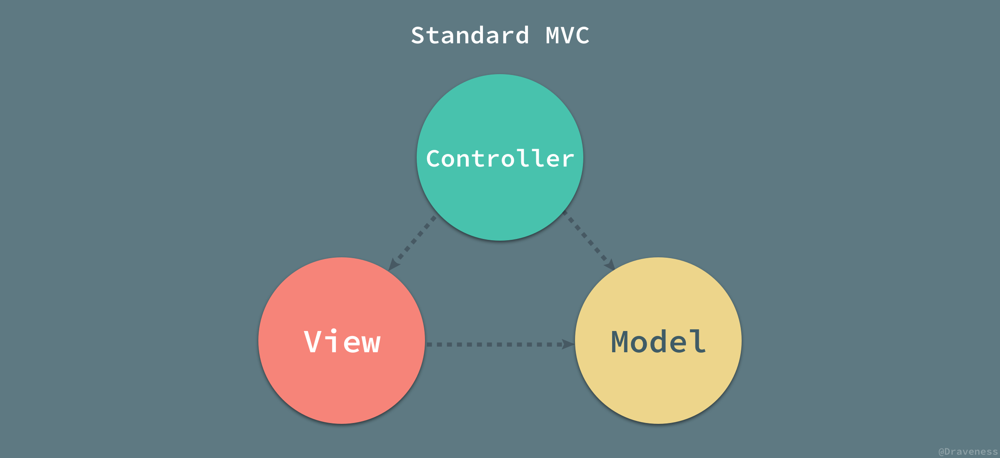

# 视图驱动下的前端业务开发模式

- 前端架构发展
  - 前后端分离模式
  - RestFul 架构
- 视图驱动、组件优先
  - 组件化：问题
    - 状态管理
    - 逻辑耦合
      - 分层架构
- 状态管理

## 前端架构发展

如今的前后分离模式已经不能再单纯从代码运行的位置进行划分，而是从分工角度：前端负责渲染逻辑、后端负责业务逻辑。既然是前端

CSR → SSR → NSR → ESR

## RestFul 架构

什么是 RestFul？RestFul 是 3 个单词的合并缩写：

- Re（Representational）：前端（浏览器、应用等）没有业务状态，却又要展示内容，因此前端拥有的是状态的表示，也就是 Representation
- st（State）：在 RestFul 架构中，状态仅仅存在于服务端，前端无状态。状态（State）可以理解为业务的状态，这个状态是由服务端管理的
- Ful（Transfer）：即改变状态。

Restful 讲的是一套前端无状态、服务端管理状态，中间设计转化途径（请求、函数等）的架构方法。这个方法可以让前后端职责清晰，前端负责渲染， 服务端负责业务。前端不需要业务状态，只需要展示。服务端除了关心状态，还要提供状态的转换接口。

[前后端接口规范 - RESTful 版](https://mp.weixin.qq.com/s/DCQGjHizp88FDX7Vgcqggw)

## 视图驱动、组件优先

- 视图驱动
  - 在前后分离的模式下，**大多数前端业务开发流程都是以视图驱动为主**
    1. 先根据 UI 稿子拆分成组件、面向组件写页面
    2. 再根据原型文档与接口完成业务交互
- 组件优先
  - 在如今以 React、Angular、Vue 为首的主流前端开发框架都是以组件为中心的开发范式下，在视图组件里编写一切代码成了一个流行趋势，**组件同时承载了业务的逻辑和界面的交互逻辑**。
  - 组件概念借鉴了“OOP”的封装概念，但抛弃了传统的“OOP”的继承和多态思想，通过面向对象之类的思想来对界面或者业务做模块化尝试复用

### 逻辑分离

- 路由层（控制层）
- 视图层 View：视图表达、渲染、视图逻辑
- 逻辑层
  - 交互模型 ViewModel
  - 领域服务 Service：完成不同场景的业务处理需求
  - 领域模型 Model：描述业务的实体对象模型

## 状态管理

组件模式下，整个应用最终以组件树的形式组织展示，组件封装状态逻辑，逻辑自治，分散在组件树，树形结构阻碍了组件数据通信。

组件 = 视图逻辑 + 状态逻辑

1. 关联组件直接通过事件通知
2. 跨组件则状态提升
3. 深层组件则全局单例

"状态管理" 的核心就是解决数据通信及规范化问题。

> 理解「状态」是什么，理解「状态」的类型

- 状态分类
  - 本地 UI 状态
    - 状态提升、自定而下、
  - 远程服务状态
    - [react-query](https://github.com/tannerlinsley/react-query)
  - 应用状态
  - 业务流程状态
    - 状态机
  - 事件流
    - rxjs

"状态管理" 的核心就是解决数据通信及规范化问题，现代化前端的状态管理库基本有以下考量：
1. 如何驱动 UI
2. 组合与抽象
3. 全局单例 vs 树形结构的局部单例
4. 状态订阅
5. 状态更新的方法是同步或异步的、副作用隔离
6. TypeScript
7. 提供异步事件流管理方案
8. 性能优化：运行时重复渲染性能优化
9. 内存优化


- data的reactivity应当仅用于从model向view的数据绑定，除此之外的逻辑都不应该依赖data的reactivity。
- 数据驱动视图，事件驱动业务逻辑。数据驱动用来实现业务逻辑就是滥用
  - 纯粹的事件驱动的方案会将导致代码非常离散
- 响应式开发的思想：watch state 本来就没错，数据即事件
  - 另外就是你说根据事件来反应繁琐，那是因为整个前端技术栈相当一部分技术积累就是错的。
  - 为什么redux这么火，就是因为读写分离。
  - 当然redux也有别的缺点，但在遵循event driven和command pattern上是没有问题的。


## 组件优先

智能组件/容器组件：与服务通信并渲染子组件

哑组件/展现组件：通过 Input 接受数据，通过 Output 发送数据变更

数据流向下，事件流向上。


## 分层架构

MVC 是一种软件架构模式，通常用于开发用户界面，主要是在解决数据逻辑和视图逻辑的分离问题；**MVC 在不同编程领域有不同的通信模型变化**，而在 web 前端领域里通常是 MVP 和 MVVM 的 MVC 变种模型，并且前端的 MVC 对应整个 web 应用的 MVC 模型中的 V。

MVC，其核心思想就是将数据和视图分离
通过通信方式和控制器的不同实现，又分为
MVP
MVVM


主要由三部分组成

- Model：应用的状态管理和业务逻辑
- View：视图渲染和视图逻辑管理
- Controller：控制器，接受、处理用户指令，调度数据模型和视图通信

  


我觉得全部用外部状态，状态在组件使用的时候和view建立映射响应，是比较合适的方案。好处在于数据逻辑可以脱离视图，而不是只在组件层做复用；有点类似于 mvvm中 vm的概念；但应该是 modelView；而不是react 或者vue组件中所提供的vm


- 视图层：前端业务开发本质上是视图驱动
  - 现代视图渲染引擎
    - UI = f(state)
    - MDV
    - Component First
- 逻辑层
  - 组件化：应用逻辑拆分、复用
  - 视图逻辑
  - 业务逻辑
- 数据层：
  - Service + Store/Model + IOC + Context
  - Servcie = Store + API


- 数据层
  - Store
  - Service：前端和后端的数据交互层
- 逻辑层
- 视图层
  - V
  - VM


一个前端组件应该包含以下两种类型的state：
1. 业务型state，这种一般由后端直接返回，跟后端的View是保持一致的

2. 交互型state，纯前端的state
怎样合理管理以上两种state决定了组件的复杂程度，可能需要解决两种逻辑分离？逻辑复用？解耦？

前后分离的，前端本身就没正真意义上的 Model，有也是缓存部分业务数据和用户交互的那部分业务逻辑

框架本身核心就是要提供一个更好用的视图层，框架的 model 还是服务于 view 的。至于业务的 model，并不是他们所关心的，而是要开发者自己去设计。

- 状态
  - UI 状态（对业务数据的聚合转换）
  - 部分业务状态
    - 状态机：业务本质就是状态之间的转移
- 逻辑
  - 视图逻辑：完成用户交互
  - 业务逻辑
    - 业务数据展示
    - 
- mvc
- 基于组件的架构
- component first + hooks composite
- 视图层 = 视图逻辑 + 视图状态
- 业务层 = 业务数据状态 + 交互指令
- 控制层 = 视图、业务指令调度
  - 不同端

组件是视图构成基本单位、视图模板与逻辑状态是最小复用单位

组件以视图为中心、视图驱动，视图模型 = 组件 + 视图逻辑，State 是围绕 View 的消费和交互需求而产生的，View 是组件真正核心的部分

- 过去思路：视图驱动，组件优先
  - State/View 放到一个函数里，还是 class 里，State/View 之间都构成了一一对应的绑定关系。State 是围绕 View 的消费和交互需求而产生的，View 是组件真正核心的部分。
  - 当 State 和 View 绑定起来时，难以达到最大化 Model 层代码复用的目标。
   1. state 离不开视图
   2. 需要什么请求什么


1. hook 分离
2. model = action + state
3. 视图层 数据消费
4. view 分层
   1. Container-Component；
   2. Atom-Component/Atom-Element；


## 响应式体系下的组件化

最佳形式是组件是视图构成基本单位、视图模板与逻辑状态是最小复用单位
视图模板 = 模板 + （原子）样式

- 实践
  - 元数据化
  - 去中心？
    - 顶层请求，下发数据 → 组件自身处理请求
    - 状态提升 → 组件自治
    - Provider & Container components → just Hooks
      - Container components 唯一单例


   
1. 不要基于响应式实现业务逻辑
   1. 响应式开发下，关注点的已经是数据流
   2. 业务开发下，更应该关注的是业务模型，行为指令，这才是最好维护的。
2. 不要视图驱动业务模型
3. 不要在组件里写业务逻辑
4. 视图层只做 data 消费，业务写在 Model 层
5. 视图驱动
6. 组件只是应用逻辑划分，视图构成基本单位；
7. 通信
   1. 注入
   2. 领域

```js
class User {
  userID

  @asyncComputed
  user() {
    return fetch('/api/user/' + this.userID)
  }
}
```


- 如何组件化？
  - 组件 = 状态逻辑 + 渲染
  - 状态处置
    - 外置
      - props
      - context
    - 内置
  - 组件分类
    - 有状态：容器组件
    - 无状态：展示组件
    - 半状态：交互组件
      - 内部状态获取
        - event emit
        - context
  - 状态逻辑解耦思考
    1. 业务状态逻辑分散在各个组件，但组件树结构导致通信困难？
    2. Redux，将散落在组件里面的状态聚拢起来成单例模式，形成状态 action => store => component 的单向通模型
       - 范式啰嗦
       - 缺失模块化
    3. 状态逻辑：面向对象 + 面向组合
  - 状态共享：消除状态多级分割带来的痛心困难，以平铺一级的单例模式进行状态共享
  - 状态上下文：利用多级结构形成上下文控制
  - 状态依赖：响应式、数据流、组合计算
  - 组件状态逻辑复用：hooks + 组合
    - 原子
    - 容器

## 数据流设计

- Pina
 - TypeScript 支持
 - DevTools 支持
   - 动作、响应追踪
   - 商店出现在使用它们的组件中
   - 时间旅行和更容易的调试
 - 热模块更换
 - SSR 支持
 - 插件扩展
 - 轻量、tree-shaking
 - api
   - defineStore 定义数据模型
- featrue
  - class 范式
  - DI

```js
import { inject, provide, reactive } from "vue";
const STORE_KEY = "xxx";
export function useUserService(options) {
  return inject(STORE_KEY) && createUserService(options);
}
export function createUserService(options) {
  return provide(STORE_KEY, Service, options);
}

@Injectable()
class UserService {
  #name;

  constructor() {
    super();
  }
  get fullName() {
    return;
  }
}

class User {}

@Use(User)
class Student {}

export { createStore, useStore };
```

## Vue3 组件开发范式

```js
// 1.对象式 setup 组件
const App = {
  name: "xxx",
  props: ["xxx"],
  setup(props, ctx) {
    // 1.返回状态
    //return {}

    // 2.返回渲染函数
    return () => h("xxx");

    // 探索模板字符串标签
    // return () => vue`<div>{{xxx}}</div>`
  },
};

// 2.函数式组件（本质渲染函数，vue3 后函数组件的函数签名跟状态组件 setup 保持一致）
// const App = (props, ctx) => {
//   return <div>{xxx}</div>
// }

// 3. setup 函数
// const App = (props, ctx) => {
//   return () => <div>{xxx}</div>
// }
// defineComponent(App)

// App.props = ['value']
// App.emits = ['click']
```


  
try catch 分流

数据  =》 service
状态（对象在不同时间段所处的样子）
事件流


## Vue 模块


## 参考

- [面向 Model 编程的前端架构设计](https://mp.weixin.qq.com/s/g4hnfirDmyeuXAdEt-zk9w)


