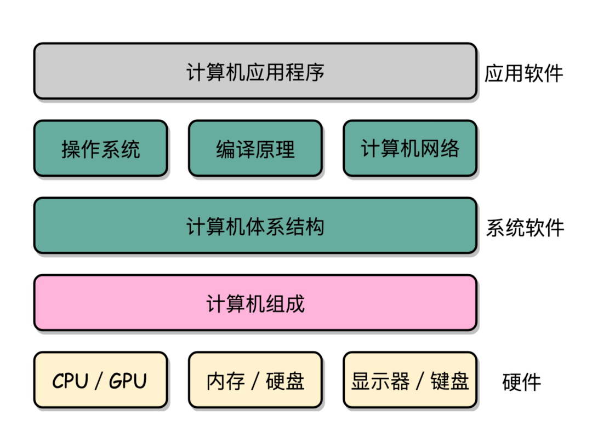

1. [ ] Job

## 语录

- 处世
  - 人生最重要的不是胡一把好牌，而是打好一把烂牌
  - 弱小和无知不是生存的障碍，傲慢才是
- 处事
  - 计划任何事目标要以成品为向导
- 学习
  - 学习模式
    - 体系了解（有什么）
    - 学习（怎么用）
    - 应用（怎么做）
    - 深入（分支）
    - 探索、创新
  - 学习一件新事物的较好方式是和你已掌握的做对比，通过二者之间通用的概念帮你快速熟悉新的事物
- 规划
  - 降低期望，接受普通自己
  - 专注、从小积累做起

## 技术栈

- 技术栈
  - 技术领域：Web 开发
    - HTTP
      - [ ] 《透视 HTTP 协议》
    - 浏览器原理及WebAPI
      - [ ] 《浏览器原理及实践》
    - 前端框架
      - Vue
        - [ ] 深入 Vue 框架源码及生态
        - [ ] 技术输出：vue 深入系文
    - [前端工程化](./前端工程化/README.md)
    - 容器技术
  - 底层基础
    - 软件工程化（流程化、工具自动化、框架化）
    - 软件设计：软件架构与设计模式
    - 程序语言设计与实现原理
      - [JavaScript](./JavaScript/README.md)
        - [ ] 《JavaScript 核心原理精讲》 
      - Typescript
      - NodeJS
      - Rust
        - [ ] 基础入门（2022.5 - 2022.12.31）
        - [ ] 应用：Webassembly
    - 计算机基础    
      - [数据结构与算法](./数据结构与算法/README.md)
        - [ ] 熟练 leetcode 200道 简单、中度
      - 操作系统
        - [ ] 《趣谈Linux操作系统》
      - 编译原理
        - [ ] 《编译原理实战课》
      - 计算机网络
      - 计算机图形学
      - 计算机组成
    - 数学与应用

## 技术栈结构

    

   

1. 计算机基础
   1. 计算机组成原理
   2. 操作系统
      - [重学操作系统](https://kaiwu.lagou.com/course/courseInfo.htm?courseId=478#/content)
   3. 计算机网络
      - [HTTP](./HTTP/README.md)
   4. 计算机图形学
   5. 程序语言设计及实现
      - [计算机程序的构造和解释](https://github.com/DeathKing/Learning-SICP)
   6. 编译原理
      - babel
        - [ babel 插件通关秘籍](https://juejin.cn/book/6946117847848321055/section)
        - https://github.com/QuarkGluonPlasma/babel-plugin-exercize
        - https://github.com/estree/estree

## 收集待看

- JS
  - [理解 ECMAScript 规范, 第1部分](https://v8.js.cn/blog/understanding-ecmascript-part-1/)
- NodeJS
  - [Node.js 进程、线程调试和诊断的设计和实现](https://mp.weixin.qq.com/s?__biz=MzkxNDIzNTg4MA==&mid=2247486092&idx=1&sn=1c330dfab4398b8dc3eafa23f4905367&scene=21#wechat_redirect)
- 语言设计及编译原理
  - [如何用JavaScript实现一门编程语言 - 保护堆栈](https://zhuanlan.zhihu.com/p/455124551)
- 表单
  - [formilyjs](https://v2.formilyjs.org/)
- 低代码
  - [amis](https://github.com/baidu/amis)
  - [imove](https://github.com/i5ting/imove)
  - [designable](https://github.com/alibaba/designable)
- SSR
  - [能让你纵享丝滑的 SSR 技术，转转这样实践](https://mp.weixin.qq.com/s/JO5SWE9wd93ICM5ccZ71FQ)
  - [Nuxt 实现的 SSR 页面性能优化的进一步探索与实践](https://mp.weixin.qq.com/s?__biz=MzU0OTExNzYwNg==&mid=2247484670&idx=1&sn=b56e53dd80b27fa73db05aa0f87fe864&st=44750C9EB200D36504EB6D425B420DBB6B15C56ACA80A204C54C8323EDC1801EA5A5F3B820B554A82F62E4033B31A51709D75E975D62F9DF6D44CAE16D1789B8AD72E2CD5F9B783F67AD99F4F2798CF2C68E30FA529A9493650C4F2DBC668A6BDF60C19EBD53E8095436171B77B43F8379F0786B6B7CC24FF5D8D3F7E9234CB1AAF8E432ACBF7660C8D5A46943940625F334223CFD292F52C622C9D71CA23109&vid=1688853671357556&cst=84C66BDBB38DB9209F2CBE20568358526FE0CB352D65E68D84CDC8560959A5D0CF245948AFF68C1B51377FEEFF49EFA4&deviceid=28ea5b9c-c888-47c9-a3cf-e19b1d9eaf5c&version=3.0.40.6184&platform=mac&scene=21#wechat_redirect)

  - React

    - [React 技术揭秘](https://react.iamkasong.com)
    - [react-illustration-series](https://github.com/7kms/react-illustration-series)
  

- 浏览器渲染原理

  - canvas
    - https://www.html5canvastutorials.com/tutorials/html5-canvas-wrap-text-tutorial/
    - https://joshondesign.com/p/books/canvasdeepdive/toc.html
    - https://juejin.cn/post/6844903828916011022
    - https://www.kirupa.com/canvas/canvas_high_dpi_retina.htm
    - https://github.com/jondavidjohn/hidpi-canvas-polyfill
  - 资源调度
    - https://mp.weixin.qq.com/s/K24X2uNPvtbD4vZlXwJMYA
    - https://github.com/GoogleChromeLabs/preload-webpack-plugin
    - https://medium.com/reloading/preload-prefetch-and-priorities-in-chrome-776165961bbf
  - https://www.youtube.com/watch?v=kNzoswFIU9M&list=PLNYkxOF6rcICgS7eFJrGDhMBwWtdTgzpx

- 计算机导论

  - https://www.coursera.org/learn/jisuanji-biancheng/home/week/1
  - https://www.bilibili.com/video/av21376839/
