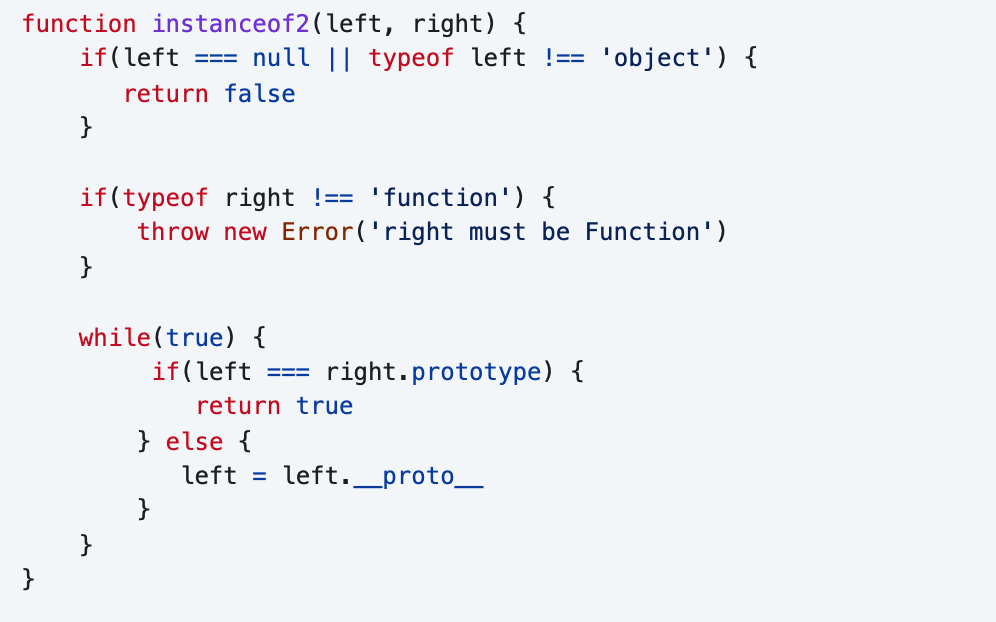
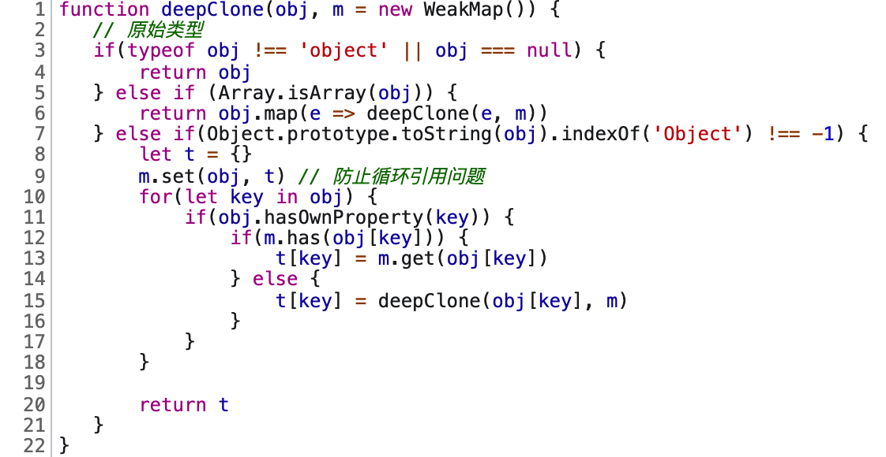
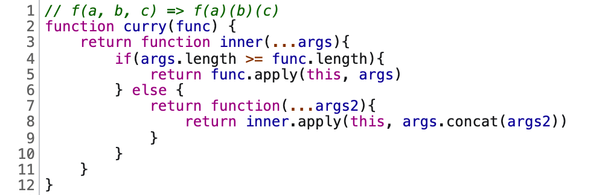
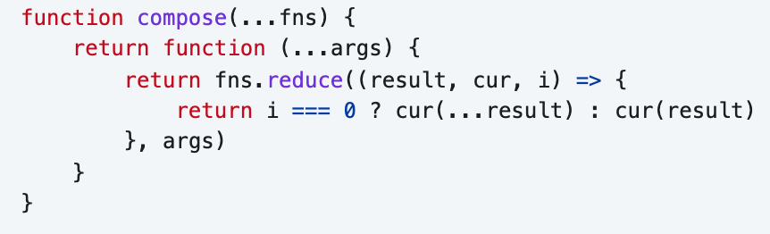
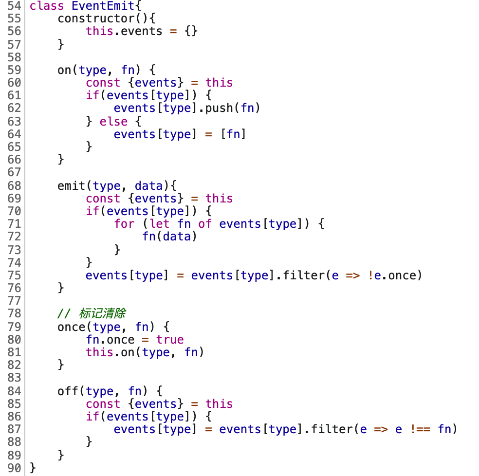

- 前端面试准备

  - 简历
  - 自我介绍
  - 项目经验
    - 讲讲项目，说说你的亮点
      - 性能优化？
      - CICD？
  - 规划发展
    - 最大的优点和缺点
  - 提问环节

- 项目经验
  - 性能优化?
  - 监控?
  - H5
    - 滚动穿透
  - 抓包工具
    - Wireshark
  - 技术、规范相关
  - 项目难点
    - UI 交互

题目

1. 滚动穿透

      

通过 Lighthouse 进行测量，根据 Lighthouse 给出的建议 进行优化
一个网站 SEO 怎么优化

如果不用 Lighthouse，Lighthouse 那不就只是能在谷歌上测吗(大概是这么个问题)

WebPageTest 不过我用的比较少，没深挖

Lighthouse 也可以通过 npm 进行下载使用

SSR 了解及原理

登录鉴权

说了对称加密和非对称加密，具体不清楚

那你说下 https 握手过程？

不知道啊

http 的缺点 明文不加密，内容可能被窃听；不验证通信方身份，可能遭遇伪装，无法证明报文的完整性，可能被篡改。https 就是披着 SSL 外壳的 HTTP，SSL 会建立安全通信线路，查明对手证书...

知道 http 的内容是如何窃听的?

不知道，不过可以一些抓包工具抓

浏览器怎么验证证书的?

那对称加密和非对称加密怎么之间选择？

说下 cdn 缓存？

你所知道的白屏原因

怎么优化？

三列布局

flex: 1; 是复合属性，说下其他属性？

扩展比例，缩放比列，基准大小（x 轴覆盖宽度，y 轴覆盖高度）

## 题目整理

- 前端工程
  - babel 转换代码的过程
    - parser => transfrom => generator，可以根据自己的理解，展开说说
  - tree-shaking 原理？
    - 利用 ES Module 做静态分析
    - 利用 ES Module 做静态分析，通过分析 ast 语法树，对每个模块维护了一个作用域，收集模块内部使用的变量，然后分析作用域，将 import 进来未被使用的模块删除，最后递归处理文件。
- js 手写题
  - 回文字符串(这个问题好常见)，判断一个字符串最多只删 1 个字符，是否能成为一个回文字符串，let str = "ABCDABA"
- typescript
  - TypeScript 高级用法， Pick 和 Omit
- 正则
  - 用正则表达式获取 url 中 query 参数 let str = "https://juejin.cn?name=zhangsan&age=18&id=123";
- 浏览器
  - 重绘和重排？
  - 介绍一下同源策略？你知道那些跨域方法？cors 跨域的原理是什么有了解过吗？
  - 浏览器渲染过程
  - 键入网址再按下回车，后面究竟发生了什么？
- css
  - flex: 1 代表什么意思
  - 用过 flex 布局吗？都有哪些属性？
  - 说说什么是 BFC，一般你都用来干什么，解决了什么问题？
  - 实现元素水平垂直居中？尽可能说多一些方法？
  - 左侧固定 + 右侧自适应布局？说说几种方案？
- 设计模式
  - 什么是抽象工厂模式
  - 发布订阅模式和观察者模式有什么区别
  - 你项目里面都用了哪些设计模式
- es
  - for of 和 for in 的区别，怎么让 for of 可以遍历一个对象？

- JS
  - 0.1 + 0.2 !== 0.3？为什么？
    - IEEE 754 二进制浮点数运算
    - 解决
      - Math.js、big.js
      - BigInt
  - event loop - 你刚刚说到 js 是单线程，那线程跟进程有什么区别？
    浏览器新开了一个页面，有几个线程？
    为什么要设计成微任务先执行，宏任务后执行。
  - 垃圾回收机制
    你刚刚提到的标记清除法有什么缺点？怎么解决？
    你刚刚提到的引用计数法有什么缺点吗？
    v8 里面的垃圾回收机制是什么？
    v8 是怎么解决循环引用的？

  

- js
- html&css
- web
- 工程
- 算法
- http

## 题目

- js
  - 语法
    - [ ] for of和for in 的区别以及原理
      - [ ] for of是否可以使用async await
      - [ ] for in 能不能遍历出构造函数原型的属性
  - 变量&类型
    - [x] 变量交换
      - 解构
      - 位运算：异或
    - [x]  ==、=== 区别
    - [x] 类型转换
    - symbol 有什么用处
      - 创建唯一标识符，作为对象属性名，防止冲突
      - 创建对象的“隐藏”属性
        - 系统 Symbol
        - 全局注册 Symbol.for/keyFor
    - [x] 0.1 + 0.2不等于0.3
      - ECMAScript 中的 Number 类型使用 IEEE754 标准来表示整数和浮点数
      -  64 位来表示一个数字：1 符号位 + 11 指数位 + 52 尾数
      - 0.1 和 0.2 转换成二进制的时候尾数会发生无限循环，会被截断造成精度丢失
      - 精度丢失可能出现在进制转换和对阶运算中
  - 对象
    - [x] 手写 call、apply、bind
      -   
      -   
      -   
    - [x] 手写 new
      1. 以构造器函数的 prototype 属性值为原型创建新对象
      2. 将 this 指向该对象
      3. 将this、参数传给构造函数并执行
      4. 若构造函数返回对象则直接返回，否则使用新创建的对象返回
      5.   
    - [x] 手写 instanceof
      - 用法：左边任意值，右边必须构造器
      - 本质：判断左值的原型链上是否存在右边的构造函数的prototype对象
      -   
    - [x] [原型及原型链](./JavaScript/JavaScript%20对象.md)
      - 原型：所有对象都有私有属性 `[[prototype]]`（目前大多数浏览器厂商非标准实现 `__proto__` 属性）保持对原型的引用
      - 原型的 5 种修改方式
        - `__proto__`
        - new + 构造器.prototype
        - es5
          - Object.create
          - Object.getPrototypeOf
          - Object.setPrototypeOf
      - 原型链：当对象查找一个属性的时候，如果没有在自身找到，那么就会查找自身的原型，如果原型还没有找到，那么会继续查找原型的原型，直到为空为止，这条查找链路就是原型链
        - 原型链中 Function 比较特殊的地方就是 `Function.__proto__` 指向自己的 `Function.prototype`
    - [x] 原型继承
      - 通过原型链实现继承，具体是修改对象的原型设置为另外一个对象
      - 主要是基于原型链的继承（原型代理）：通过**借用构造函数**实现独享数据属性，通过**原型链**继承共享方法属性
      - 原型继承  
          
      - ES5 与 ES6 继承区别
        - 同：都是基于原型机制
        - 异
          - ES6 的继承机制：创建的空对象必须先继承父类的属性和方法，再将该对象作为子类的实例返回给子类的 this；
          - ES5 的继承机制：直接一个子类的实例对象，然后应用父类构造器继承父类的属性和方法，即“实例在前，继承在后”。
    - 对象深浅拷贝
      - 浅拷贝：Object.assign
      - [x] 深拷贝
        -   
  - [ ] 模块发展历程
  - 函数编程
    - [ ] 普通函数和箭头函数区别
      - 箭头函数的 this 绑定外层上下文中的 this
      - 箭头函数不能通过 new 关键字调用
      - arguments
    - [x] 柯里化
      - 把多参数的函数转换成逐渐接受剩余参数的函数
      -  
    - [x] compose
      -   
  - [x] 数组
    - [x] 数组扁平化
      -   
    - [x] 数组去重 `[...new Set(nums)]`
  - 设计模式
    - [ ] 发布-订阅与观察者模式区别
    - [x] 手写 EventEmitter
      -   
  - [ ] js 执行机制
    - [x] 变量提升、var、let、const 区别及暂时性死区
    - [ ] 闭包
      - 本质
      - 缺点
      - 场景
    - [ ] this
  - 异步编程
    - [ ] Promise
    - [ ] 异步代码执行顺序
    - [ ] promise 哪些方法是原型上的，哪些方法是实例上的
    - [ ] async、await的实现原理
    - [ ] Promise.all原理：计数器模式
  - 代码题
    - [x] 节流、防抖
      - 防抖：防止重复执行，事件触发 n 秒后再执行，如果期间再次触发则重新计算时间，最终只会执行一次
      - 节流：减少函数的执行频率，每隔 n 秒执行一次
      -   P
  - V8
    - [ ] 垃圾回收机制
- web
  - [ ] 渲染流程
    - [ ] 重绘
    - [ ] 分层
      - will-change,3D属性transform之类
  - [ ] 事件循环
    - 为什么要用 setTimeout 模拟 setInterval ？
  - cookie、localStorage、sessionStorage 区别以及使用场景
  - 安全
    - 同源策略
    - [x] XSS（跨站脚本攻击）
      - 类型
        - 存储型 XSS 攻击
        - 反射型 XSS 攻击
        - 基于 DOM 的 XSS 攻击
      - 防范
    - [x] CSRF（跨站请求伪造）
  - [ ] 输入 URL 到页面展示发生了什么
  - [ ] js脚本加载问题，async、defer问题
  - DOM
    - DOM 事件模型
- 工程
  - [ ] webpack5 介绍
  - [ ] webpack 性能优化你是怎么做的？
    - https://juejin.cn/post/6844904093463347208
  - 说了下 webpack 构建流程
  - webpack 有几种 hash，它们有什么区别？一般你在项目里面是用哪种 hash？
    - hash，是整个项目的 hash 值，每次编译之后都会生成新的 hash
    - chunkhash，根据不同的入口文件(Entry)进行依赖文件解析、构建对应的 chunk，生成对应的哈希值（来源于同一个 chunk，则 hash 值就一样）
    - contenthash，根据文件内容生成 hash 值，文件内容相同 hash 值就相同
  - Webpack 了解多少
    1. webapck 的四个核心概念，并介绍一些其他的模块，例如 mode，依赖图的概念等等。
    2. 介绍几个 webpack 的插件，如压缩 gzip、如何处理 dev 中的 console.log 的模块等等
  - loader、plugin 区别
    - loader 主要是对源文件进行转换处理
    - plugin 可以用来监听 webpack 构建生命周期，做一些操作，去扩展 webpack 功能
    - loader 本质是一个函数，plugin 本质是一个类，
  - loader 执行顺序
    - 从右往左
  - Tree Shaking
  - 代码分割
  - 打包优化技巧
  - 热模块更新
  - Docker
    - [ ] Docker容器化带来的好处
      - 持续部署与测试（消除了线上线下的环境差异）
      - 环境标准化与版本控制（回滚，压缩、备份）
      - 跨平台性与镜像
- http
  - [x] http、https 区别
  - [ ] https，解释一下加密过程，为什么说 HTTPS 是安全的
  - [ ] http1.0/1.1/2.0/3.0
  - [x] 浏览器 http 缓存
  - [x] Etag、last-modified 区别
    - Etag 优先级高
    - 为什么要 Etag
    - ETag 是资源的一个唯一标识，文件内容的 hash 值。
    - ETag 还有“强”“弱”之分。强 ETag 要求资源在字节级别必须完全相符，弱 ETag 在值前有个“W/”标记，只要求资源在语义上没有变化，但内部可能会有部分发生了改变
  - [x] get 和 post 区别
    - 参数、编码、大小（要支持 IE，则最大长度为 2083byte，若只支持 Chrome，则最大长度 8182byte）、缓存
  - [ ] 说一下三次握手四次挥手
  - [ ] TCP, UDP 的区别
  - [ ] http2, TCP 丢包阻塞问题
  - [x] DNS 解析过程
- 框架 vue
  - 原理
    - [ ] vue2 初始化过程
    - [x] 什么是虚拟 DOM，以及为什么
      - 本质描述真实 DOM 的 javascript 对象
      - 抽象视图，跨平台化
      - 可编程化、基于虚拟 DOM 实现状态驱动的开发方式，避免了手动操作 DOM 效率低下
    - [x] diff 算法，index key 问题
      - vue3 去头尾的最长递增子序列算法和 vue2 双端比较算法
      - key：建立索引，快速找到复用节点
    - [ ] vue 响应式原理
    - [x] vue 双向绑定原理？
        - 只有数据到视图单向绑定
        - 视图到数据是通过事件监听的方式来实现
        - 数据到视图的绑定是通过响应式数据将视图渲染副作用作为依赖收集，当数据发生变化就会触发视图渲染
        - 单向数据流
          - 单向绑定
          - 单向更新
            - 组件树的更新过程是自顶向下，如果发生逆向数据流修改，会导致当前渲染的数据和视图映射不一致，重复多一次渲染。
  - API
    - [ ] vue 新旧生命周期、生命调用顺序
    - [x] vue2、vue3 的 nextTick 原理
      - vue 异步更新机制：使用队列缓存更新任务，在事件循环中安排一个异步任务执行队列中所有任务
    - [ ] 普通函数、computed、watch 对比区别
  - 其他
    - [ ] 了解mvc/mvp/mvvm的区别
    - [ ] vue2 和 vue3 对比
      - vue2.x中如何监测数组变化？
        - 使用了函数劫持的方式，重写了数组的方法，Vue将data中的数组进行了原型链重写，指向了自己定义的数组原型方法，当调用数组api时，可以通知依赖更新。
        - 如果数组中包含着引用类型，会对数组中的引用类型再次递归遍历进行监控。这样就实现了监测数组变化。
      - defineProperty => proxy
      - 初始化响应 => 按需响应
    - [ ] vue 和 react 对比
      - 同
        - 底层上使用 virtual dom 机制渲染视图
      - 异
        - diff 上优化及调度优化
        - 编程上 react 偏向函数式、不可变。vue 则是可变、响应式
        - 生态上：
  - vue-router
    - [ ] hash模式和history模式实现原理分别是什么
    - [ ] 路由懒加载
    - [ ] Vue-router 导航守卫有哪些
          全局前置/钩子：beforeEach、beforeResolve、afterEach
          路由独享的守卫：beforeEnter
          组件内的守卫：beforeRouteEnter、beforeRouteUpdate、beforeRouteLeave
- NodeJS
  - [ ] 浏览器事件循环跟 NodeJS 有什么区别
- 操作系统
  - [ ] 线程跟进程区别
  - 定义
    - 进程是资源分配和调度的基本单位
    - 线程是 CPU 运算调度的最小单位

    关系及特点

    - 线程是依附于进程的，一个进程能有多个线程，但任意一线程执行出错，都会导致整个进程的崩溃
    - 线程之间共享进程中的数据
    - 进程关闭，操作系统会回收进程所占用的内存
    - 进程之间的内容相互隔离
- 项目
  - cli的原理和研发过程遇到的问题
  - 移动端适配
  - 性能优化
    - 虚拟列表
    - excel 文件下载
  - 微前端
    - 场景：老项目技术栈升级兼容维护难、多种技术栈混合场景
  - H5与客户端的通讯方式
    JSBridge
    双向通讯
- TypeScript类型推导
typeof
联合类型
断言
泛型

## 单词

- stopPropagation
- yield
- fibonacci 斐波那契
- yield
- recursion
- Expires
- revalidate
- traverse
- justify-items: stretch;
- align-content: space-evenly;
- prototype
- toPrimitive
- iterator
- Suspense
- Portals
- flatten

对于多年工作经验的人来说，项目就比较重要了，所以要着重准备项目，理清项目中用到的技术、遇到的难点有哪些、又是怎么解决的、对项目做过哪些性能优化、做过的亮点有哪些 等等

着重准备 项目中遇到的难点有哪些、又是怎么解决的、对项目做过哪些性能优化、做过的亮点有哪些、把一个项目的关键模块回顾并吃透，特别有用，而且还占很大一个比重，而且还能由你自由发挥引导，这不重点准备还准备啥呢？

es6有哪些东西
const、let 重新赋值
object.assgin

同级比较，再比较子节点
先判断一方有子节点一方没有子节点的情况(如果新的children没有子节点，将旧的子节点移除)
比较都有子节点的情况(核心diff)
递归比较子节点

- 项目
  - tailwindcss 好处
    - 命名
    - 原子
    - 按需构建
      - purgcss
      - uncss
  - webpack
    - webpack-bundle-analyzer
    - 第三方库以模块按需引入
    - image
      - imagemin-webpack-plugin
      - cdn
      - 懒加载
    - 分割
      - split-chunk（cache）
        - 基础库
        - 公共代码
      - 路由懒加载
    - 压缩
      - js -> terser
      - css -> cssnano
      - compress-webpack-plugin + gzip nginx
      - tree-shaking

从项目的结构、所用到的技术、难点、亮点都要知道，要能够自己描述出项目中用了哪些，自己完成了哪些。

- 你还有什么要问我的吗
  - 假如入职以后，工作职责是什么？

 - TCP 是一个有状态的协议，需要先与对方建立连接然后才能发送数据，而且保证数据不丢失不重复。
   - TCP 的数据是连续的“字节流”，有先后顺序，而 UDP 则是分散的小数据包，是顺序发，乱序收。

