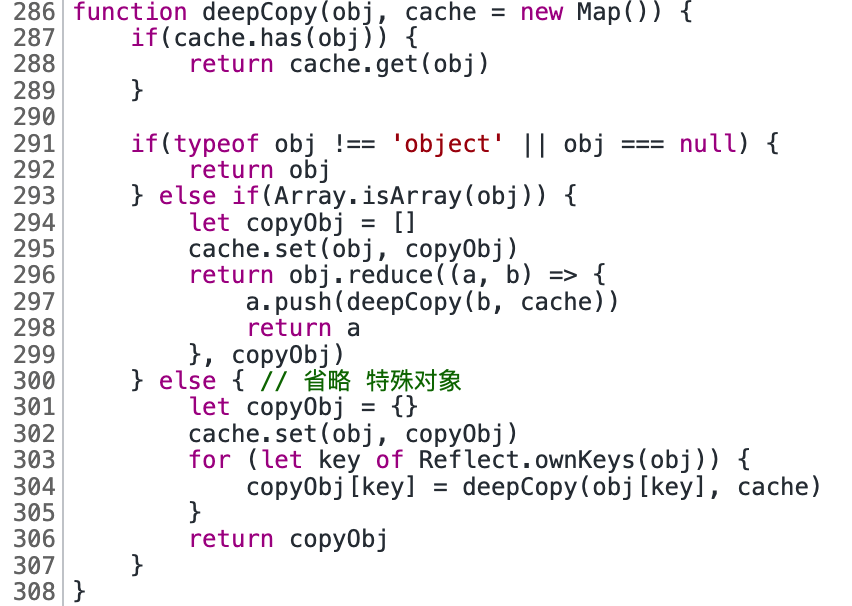

- 面试
  - 简历
  - 自我介绍
    - 面试官好，我叫\*\*，今天来应聘贵公司的前端工程师岗位。我从事前端开发两年多，有 X 年多的 Vue 开发经验，一年 React 开发经验，在上家公司主要从事 H5 页面，后台管理系统，混合 App 等项目开发。平常喜欢逛一些技术社区丰富自己的技术，像思否，掘金之类，并且自己也独立开发了个人博客网站，记录自己的工作总结和学习心得。 我的性格比较温和，跟同事朋友相处时比较外向，在工作中代码开发时我喜欢全心全意的投入，对于工作我总抱着认真负责的态度。面试官，以上是我的介绍，谢谢。
  - 项目经验
    - 讲讲项目，说说你的亮点
      - 性能优化？
      - CICD？
  - 规划发展
    - 最大的优点和缺点
  - 提问环节
    - 假如入职以后，工作职责是什么？
- 项目经验
  - 性能优化?
  - 监控?
  - H5
    - 滚动穿透
  - 抓包工具
    - Wireshark
  - 技术、规范相关
  - 项目难点
    - UI 交互
- 目标公司
  - 小鹏
  - 广州金山
  - 字节
  - 腾讯系
  - 阿里系
  - 美团
  - 京东
  - 顺丰
  - 平安

题目

1. 滚动穿透

一个网站 SEO 怎么优化

登录鉴权

说了对称加密和非对称加密，具体不清楚

那你说下 https 握手过程？

不知道啊

http 的缺点 明文不加密，内容可能被窃听；不验证通信方身份，可能遭遇伪装，无法证明报文的完整性，可能被篡改。https 就是披着 SSL 外壳的 HTTP，SSL 会建立安全通信线路，查明对手证书...

知道 http 的内容是如何窃听的?

不知道，不过可以一些抓包工具抓

浏览器怎么验证证书的?

那对称加密和非对称加密怎么之间选择？

说下 cdn 缓存？

你所知道的白屏原因

怎么优化？

三列布局

flex: 1; 是复合属性，说下其他属性？

扩展比例，缩放比列，基准大小（x 轴覆盖宽度，y 轴覆盖高度）

## 题目整理

- 前端工程
  - babel 转换代码的过程
    - parser => transfrom => generator，可以根据自己的理解，展开说说
  - tree-shaking 原理？
    - 利用 ES Module 做静态分析
    - 利用 ES Module 做静态分析，通过分析 ast 语法树，对每个模块维护了一个作用域，收集模块内部使用的变量，然后分析作用域，将 import 进来未被使用的模块删除，最后递归处理文件。
- js 手写题
  - 回文字符串(这个问题好常见)，判断一个字符串最多只删 1 个字符，是否能成为一个回文字符串，let str = "ABCDABA"
- typescript
  - TypeScript 高级用法， Pick 和 Omit
- 浏览器
  - 介绍一下同源策略？你知道那些跨域方法？cors 跨域的原理是什么有了解过吗？
- css
  - 用过 flex 布局吗？都有哪些属性？
  - 说说什么是 BFC，一般你都用来干什么，解决了什么问题？
  - 实现元素水平垂直居中？尽可能说多一些方法？
  - 左侧固定 + 右侧自适应布局？说说几种方案？
- 设计模式
  - 什么是抽象工厂模式
  - 发布订阅模式和观察者模式有什么区别
  - 你项目里面都用了哪些设计模式
- es

  - for of 和 for in 的区别，怎么让 for of 可以遍历一个对象？

- JS

  - 0.1 + 0.2 !== 0.3？为什么？
    - IEEE 754 二进制浮点数运算
    - 解决
      - Math.js、big.js
      - BigInt
  - 垃圾回收机制
    你刚刚提到的标记清除法有什么缺点？怎么解决？
    你刚刚提到的引用计数法有什么缺点吗？
    v8 里面的垃圾回收机制是什么？
    v8 是怎么解决循环引用的？

- js
- html&css
- web
- 工程
- 算法
- http

## 题目

- html&css
  - flex: 1 代表什么意思
    - flex-grow: 1
    - flex-shrink: 1
    - flex-basis: 0% 
  - [ ] 选择器优先级
  - BFC
- js
  - 语法
    - [ ] for of 和 for in 的区别以及原理
      - [ ] for of 是否可以使用 async await
      - [ ] for in 能不能遍历出构造函数原型的属性
  - 变量&类型
    - [x] 变量交换
      - 解构
      - 位运算：异或
    - [x] ==、=== 区别
    - [x] 类型转换
    - symbol 有什么用处
      - 创建唯一标识符，作为对象属性名，防止冲突
      - 创建对象的“隐藏”属性
        - 系统 Symbol
        - 全局注册 Symbol.for/keyFor
    - [x] 0.1 + 0.2 不等于 0.3
      - ECMAScript 中的 Number 类型使用 IEEE754 标准来表示整数和浮点数
      - 64 位来表示一个数字：1 符号位 + 11 指数位 + 52 尾数
      -
      - 0.1 和 0.2 转换成二进制的时候尾数会发生无限循环，会被截断造成精度丢失
      - 精度丢失可能出现在进制转换和对阶运算中
  - 对象
    - [x] 手写 call、apply、bind
      - 
      - 
      - 
      - 
    - [x] 手写 new
      1. 以构造器函数的 prototype 属性值为原型创建新对象
      2. 将 this 指向该对象
      3. 将 this、参数传给构造函数并执行
      4. 若构造函数返回对象则直接返回，否则使用新创建的对象返回
      5. 
    - [x] 手写 instanceof
      - 用法：左边任意值，右边必须构造器
      - 本质：判断左值的原型链上是否存在右边的构造函数的 prototype 对象
      - 
    - [x] [原型及原型链](./JavaScript/JavaScript%20对象.md)
      - 原型：所有对象都有私有属性 `[[prototype]]`（目前大多数浏览器厂商非标准实现 `__proto__` 属性）保持对原型的引用
      - 原型的 5 种修改方式
        - `__proto__`
        - new + 构造器.prototype
        - es5
          - Object.create
          - Object.getPrototypeOf
          - Object.setPrototypeOf
      - 原型链：当对象查找一个属性的时候，如果没有在自身找到，那么就会查找自身的原型，如果原型还没有找到，那么会继续查找原型的原型，直到为空为止，这条查找链路就是原型链
        - [ ] 原型链判断
        - 原型链中 Function 比较特殊的地方就是 `Function.__proto__` 指向自己的 `Function.prototype`
    - [x] 继承
      - 原型继承:通过原型链实现继承，具体是修改对象的原型设置为另外一个对象
      - 主要是基于原型链的继承（原型代理）：通过**借用构造函数**实现独享数据属性，通过**原型链**继承共享方法属性
      - 原型继承  
        
      - ES5 与 ES6 继承区别
        - 同：都是基于原型机制
        - 异
          - ES6 的继承机制：先内部创建的空对象继承父类的属性和方法，再将该对象作为子类的实例返回给子类的 this；
          - ES5 的继承机制：直接一个子类的实例对象，然后应用父类构造器继承父类的属性和方法，即“实例在前，继承在后”。
    - 对象深浅拷贝
      - 浅拷贝：Object.assign
      - [x] 深拷贝
        - 
  - [x] 模块发展历程
    - 原始阶段：
      - 文件划分模块
      - 对象命名空间+IIFE：解决全局污染和命名冲突、成员访问控制
    - 社区标准化阶段
      - AMD 适用于浏览器的异步模块加载机制
        - RequireJS
      - CommonJS 同步模块加载，用于服务端
      - UMD 通用模块标准
    - ES Modules：ECMASCript 标准
  - 函数编程
    - [ ] 普通函数和箭头函数区别
      - 箭头函数的 this 绑定外层上下文中的 this
      - 箭头函数不能通过 new 关键字调用
      - arguments
    - [x] 柯里化
      - 把一个多参数的函数转成可以逐渐接受剩余参数的函数
      - 
    - [x] compose
      - 
  - [x] 数组
    - [x] 类数组转化数组
      - Array.from
      - Array.apply(null, like)
      - Array.prototype.slice.apply(a)
      - Array.prototype.concat.call([], like)
    - [x] 数组扁平化
      - 
      - 
    - [x] 数组去重 `[...new Set(nums)]`
  - 设计模式
    - [ ] 发布-订阅与观察者模式区别
    - [x] 手写 EventEmitter
      -   
  - [ ] js 执行机制
    - [x] 变量提升、var、let、const 区别及暂时性死区
    - [ ] 闭包
      - 本质
      - 缺点
      - 场景
    - [ ] this
  - 异步编程
    - [x] 手写 Promise
      - [x] promise 哪些方法是原型上的，哪些方法是实例上的
        - 3: then、catch、finally
        - 6: resolve、reject、all、allSettled、race、any
        - 扩展思考:如何取消 promise:Promise.race()方法可以用来竞争 Promise 可以借助这个特性 自己包装一个 空的 Promise 与要发起的 Promise 来实现
      - [x] Promise.all 原理：计数器模式
        - 
    - [ ] 异步代码执行顺序
    - [ ] async、await 的实现原理
  - 正则
    - 
    - 用正则表达式获取 url 中 query 参数 let str = "https://juejin.cn?name=zhangsan&age=18&id=123";
      - Array.from("https://juejin.cn?name=zhangsan&age=18&id=123#".matchAll(/(?<=\?)[^#]\*/g))
      - Array.from("https://juejin.cn?name=zhangsan&age=18&id=123#".matchAll(/\?([^#]*)/g))
  - 手写代码
    - [x] 节流、防抖
      - 防抖：防止重复执行，事件触发 n 秒后再执行，如果期间再次触发则重新计算时间，最终只会执行一次
      - 节流：减少函数的执行频率，每隔 n 秒执行一次
      - 
    - [x] 写版本号排序的方法
      - 
    - [ ] 手写 AJAX 实现
      - 
    - [x] 如何实现 chunk 函数，数组进行分组
      - 
    - [x] 实现模板字符串解析功能
      - 
    - [x] flatTree
      - 
  - V8
    - [ ] 垃圾回收机制
- web
  - [ ] 渲染流程
    - [ ] 重绘和重排？
      - 
    - [ ] 分层
      - will-change,3D 属性 transform 之类
  - [ ] 事件循环
    - 为什么要用 setTimeout 模拟 setInterval ？
      - setInterval 每隔指定时间就会往队列里插入任务前会队列中是否存在上次任务，如果当前任务执行过长，会导致后边的间隔任务被跳过；
      - 可能多个定时器会连续执行
  - cookie、localStorage、sessionStorage 区别以及使用场景
  - 安全
    - 同源策略
    - [x] XSS（跨站脚本攻击）
      - 类型
        - 存储型 XSS 攻击
        - 反射型 XSS 攻击
        - 基于 DOM 的 XSS 攻击
      - 防范
    - [x] CSRF（跨站请求伪造）
  - [ ] 导航流程：输入 URL 到页面展示发生了什么
    - 输入处理
    - 重定向
    - 缓存
    - DNS 域名解析
    - 根据 ip 建立 TCP 连接
    - 建立 TSL 连接 
    - 发送请求
    - 响应处理
    - 页面渲染
    - 断开连接
  - DOM
    - DOM 事件模型
  - [x] async 或 defer 
    - 都是异步加载 js
    - async 加载完立刻执行
    - defer 在DOM 解析完毕，DOMContentLoaded 事件之前保持其相对顺序执行
- 工程
  - webpack
    - [ ] webpack5 介绍
      - 持久化缓存
  - [ ] webpack 性能优化你是怎么做的？
    - https://juejin.cn/post/6844904093463347208
  - 说了下 webpack 构建流程
  - webpack 有几种 hash，它们有什么区别？一般你在项目里面是用哪种 hash？
    - hash，是整个项目的 hash 值，每次编译之后都会生成新的 hash
    - chunkhash，根据不同的入口文件(Entry)进行依赖文件解析、构建对应的 chunk，生成对应的哈希值（来源于同一个 chunk，则 hash 值就一样）
    - contenthash，根据文件内容生成 hash 值，文件内容相同 hash 值就相同
  - Webpack 了解多少
    1. webapck 的四个核心概念，并介绍一些其他的模块，例如 mode，依赖图的概念等等。
    2. 介绍几个 webpack 的插件，如压缩 gzip、如何处理 dev 中的 console.log 的模块等等
  - loader、plugin 区别
    - loader 主要是对源文件进行转换处理
    - plugin 可以用来监听 webpack 构建生命周期，做一些操作，去扩展 webpack 功能
    - loader 本质是一个函数，plugin 本质是一个类，
  - loader 执行顺序
    - 从右往左
  - 性能优化
  - 树摇
    - 它与 CommonJS 规范最大的区别在 ES6 中的 import 和 export 都是静态的。静态意味着一个模块要暴露或引入的所有方法在编译阶段就全部确定了，之后不能再改变。
  - CI/CD
    - Docker
      - [ ] Docker 容器化带来的好处
        - 持续部署与测试（消除了线上线下的环境差异）
        - 环境标准化与版本控制（回滚，压缩、备份）
        - 跨平台性与镜像
- http
  - [x] http、https 区别
  - [ ] https，解释一下加密过程，为什么说 HTTPS 是安全的
  - [ ] http1.0/1.1/2.0/3.0
  - [x] 浏览器 http 缓存
    1. 缓存查找：查找不到直接发送请求，http 缓存需要经过 service worker 缓存
    2. 强制缓存：通过 Expires 和 Cache-Control: max-age 判断缓存是否可用是否到期，如果可用则直接使用，否则协商缓存
    3. 服务端会返回 Last-modified、ETag 信息，客户端则携带 If-Modified-Since 、If-None-Match 去请求后台，服务器根据条件请求字段判断资源是否更新
       - 若资源更新，返回资源和 200 状态码
       - 否则，返回 304，告诉浏览器直接从缓存获取资源
  - [x] Etag、last-modified 区别
    - Etag 优先级高
    - 为什么要 Etag
      - ETag 是资源的一个唯一标识，文件内容的 hash 值。
      - ETag 还有“强”“弱”之分。强 ETag 要求资源在字节级别必须完全相符，弱 ETag 在值前有个“W/”标记，只要求资源在语义上没有变化，但内部可能会有部分发生了改变
  - [x] get 和 post 区别
    - 参数、编码、大小（要支持 IE，则最大长度为 2083byte，若只支持 Chrome，则最大长度 8182byte）、缓存
  - [ ] 说一下三次握手四次挥手
    - 为什么需要三次握手，两次不行吗？
      - TCP 的可靠性是通过请求-应答模式
  - [ ] TCP, UDP 的区别
  - [ ] http2, TCP 丢包阻塞问题
  - [x] DNS 解析过程
  - [ ] CDN 缓存
  - vary：可作为缓存验证条件
- 框架 vue
  - 原理
    - [ ] vue2 初始化过程
    - [x] 什么是虚拟 DOM，以及为什么
      - 本质描述真实 DOM 的 javascript 对象
      - 抽象视图，跨平台化
      - 避免直接手动操作 DOM，保证了性能下限以及规避一定 XSS 风险
    - [x] diff 算法，index key 问题
      - key：建立索引，快速找到复用节点
      - 具体
        - 只做同层比较
        - 根据 type & key 去判断是否为相同节点
          - 如果不是则重新销毁创建新的节点
          - 如果是同一类型则继续更新节点 props 等信息、然后对比子节点
        - 根据新旧 vnode 子节点不同类型分别处理：其中最为复杂的情况是数组类型
          - vue2 双端比较算法
          - vue3 去头尾的最长递增子序列算法
            - 先对齐的前置元素和后置元素
            - 中间部分未知子序，找出公共最长递增子序列部分，这样使得移动节点最少
        - 然后继续深度递归
    - [ ] vue 响应式原理
      - 响应式数据，实现上：数据劫持+观察者模式
        - vue2 defineProperty vue3 proxy
      - [ ] 手写响应式数据实现
      - [x] 数据绑定原理
        - 渲染视图时访问到响应式数据，会被数据劫持将视图渲染当作副作用做为依赖收集，当数据发生变化就会触发视图渲染
        - [x] vue 双向绑定原理？
          - 只有数据到视图单向绑定
          - 视图到数据是通过事件监听的方式来实现
          - [x] 单向数据流
            - 数据到视图单向绑定
            - 组件树自顶向下单向更新，父组件更新后通过 props 向子组件传递数据，子组件不能更新 props
            - 如果发生逆向数据流修改，会使当前渲染的视图与状态映射不一致，导致重复渲染。
    - [x] vue2、vue3 的 nextTick 原理
      - 使用场景：nextTick 用于执行异步方法，可以保证在 DOM 更新后执行，获取最新 DOM，vue 内部则使用 nextTick 是实现视图异步更新
      - 实现原理 异步队列 + 异步方法：使用队列缓存异步任务，采用微任务优先的方式调用系统异步 api 去执行队列任务
      - vue2 会根据环境、采用不同的降级方案使用系统异步 API，而 vue3 直接使用 Promise
    - [ ] vue3 了解
      - 对比 vue2
        - 响应式
        - 性能
        - 内置 API
  - API
    - [x] computed、watch 对比区别
      - computed 计算属性，基于其他响应式依赖缓存计算结果，只有当依赖发生变化才会需要重新计算，computed 是延迟计算的，只有被访问时才真正执行计算。computed 常用于模板渲染中。
      - watch 侦听属性适用于观测某个值的变化去立刻执行一段复杂的业务逻辑
  - 其他
    - [x] 简述 mvvm
      - Model 层代表数据模型，View 代表 UI 组件，ViewModel 是 View 和 Model 层的桥梁，数据会绑定到 viewModel 层并自动将数据渲染到页面中，视图变化的时候会通知 viewModel 层更新数据。
    - vue 性能优化
      - 不需要响应式的数据不要放到 data 中，或者可以用 Object.freeze() 冻结数据
      - v-for 遍历必须加 key
      - keep-alive 缓存组件、v-once、v-meno 去防止重复渲染
      - 组件按需引入
      - 路由懒加载
      - 防抖、节流运用
      - 虚拟列表/虚拟表格
      - 防止内部泄漏，组件销毁后把全局变量和事件销毁
    - [x] vue 组件通信
      - 父子 props、emit
      - 直接引用组件实例 parent、children
      - provide/inject
      - 像 eventBus、vuex 之类的全局单例模式 + 事件订阅
    - [x] vue2、3 新旧生命周期、生命调用顺序
      - 生命周期
        - setup vue3
        - 创建
        - 挂载
        - 更新
        - 销毁 vue3 卸载
        - activated
        - deactivated
      - 生命周期调用顺序
      - [x] 异步请求在哪一步发起
        - created
        - 能更快获取到服务端数据，减少页面 loading 时间；
        - ssr 不支持 beforeMount 、mounted 钩子函数，所以放在 created 中有助于一致性；
    - 内置指令
      - v-if 优先级高于 v-for
    - [x] Vue 如何检测数组变化
      - vue2.x 中如何监测数组变化？
        - 重写一些数组方法：对 7 种数组（push,shift,pop,splice,unshift,sort,reverse）方法进行重写
        - 出于性能原因的考量，Vue 是对数组元素进行了监听，而没有对数组本身的变化进行监听。
    - [ ] vue2 与 vue3 对比
      - 响应式原理中数据劫持实现：defineProperty => proxy
        - 初始化响应 => 按需响应
        - 能够监听属性新增和删除
      - 性能
      - api
    - [x] Vue 事件绑定原理
      - 原生事件绑定是通过 addEventListener 绑定给真实元素的，组件事件绑定是基于自己实现的一个发布订阅模式的事件中心。
    - [ ] vue 和 react 对比
      - 同
        - 底层上使用 virtual dom 作为渲染机制
      - 异
        - diff 上优化及调度优化
        - 编程上 react 偏向函数式、不可变。vue 则是响应式、可变
        - 生态上：
    - 作用于插槽
      - 伏组件可以拿到自组建传递的数据
  - SSR
    - SSR 也就是服务端渲染，在服务端完成 vue 渲染，直接对客户端输出 html
    - SSR 有着更好的 SEO、并且首屏加载速度更快
    - 缺点：开发条件会受到限制，写代码时注意 API 运行环境：比如服务器端渲染只支持 beforeCreate 和 created 两个钩子
      - 服务器有更大的负载、运维需求
  - vuex
    - vuex 是专门为 vue 提供的全局状态管理系统
    - state、getter、mutations、action、module
      - mutations 是唯一更改 store 中状态的方法且必须是同步
      - action 可执行异步逻辑，提交 mutations
  - vue-router
    - [x] hash 模式和 history 模式实现原理分别是什么
      - hash
        - 通过修改 location.hash 改变 URL 中#后面的值
        - URL hash 发生改变不会重新刷新页面，而且会浏览器的访问历史中增加一个记录
        - 通过 hashchange 事件监听 hash 路由变化
        - 特点：兼容性好但是不美观
      - history
        - 利用 HTML5 History Interface 中新增的 pushState() 和 replaceState() 方法对浏览器历史记录栈进行修改。
        - 同样当前 URL 改变了，但浏览器不会刷新页面
        - 通过 PopStateEvent 事件监听路由变化
        - 特点：虽然美观，但是刷新会出现 404 需要后端进行配置
    - [ ] 路由懒加载
    - [x] Vue-router 导航守卫有哪些
      - 全局前置/钩子：beforeEach、beforeResolve、afterEach
      - 路由独享的守卫：beforeEnter
      - 组件内的守卫：beforeRouteEnter、beforeRouteUpdate、beforeRouteLeave
      - 导航解析流程
      - 
- NodeJS
  - [ ] 浏览器事件循环跟 NodeJS 有什么区别
- 操作系统

  - [ ] 线程跟进程区别
  - [ ]
  - 定义

    - 进程是资源分配和调度的基本单位
    - 线程是 CPU 运算调度的最小单位

    关系及特点

    - 线程是依附于进程的，一个进程能有多个线程，但任意一线程执行出错，都会导致整个进程的崩溃
    - 线程之间共享进程中的数据
    - 进程关闭，操作系统会回收进程所占用的内存
    - 进程之间的内容相互隔离

- 算法
  - [x] LRU
    - 
  - [ ] 排序
- 项目
  - cli 的原理和研发过程遇到的问题
  - 移动端适配
  - 性能优化
    - 虚拟列表
    - excel 文件下载
  - 微前端
    - 场景：老项目技术栈升级兼容维护难、多种技术栈混合场景
  - H5 与客户端的通讯方式
    JSBridge
    双向通讯
- TypeScript 类型推导
  typeof
  联合类型
  断言
  泛型

## 单词

- stopPropagation
- yield
- fibonacci 斐波那契
- yield
- recursion
- Expires
- revalidate
- traverse
- justify-items: stretch;
- align-content: space-evenly;
- prototype
- toPrimitive
- iterator
- Suspense
- Portals
- flatten

对于多年工作经验的人来说，项目就比较重要了，所以要着重准备项目，理清项目中用到的技术、遇到的难点有哪些、又是怎么解决的、对项目做过哪些性能优化、做过的亮点有哪些 等等

着重准备 项目中遇到的难点有哪些、又是怎么解决的、对项目做过哪些性能优化、做过的亮点有哪些、把一个项目的关键模块回顾并吃透，特别有用，而且还占很大一个比重，而且还能由你自由发挥引导，这不重点准备还准备啥呢？

- 项目
  - tailwindcss 好处
    - 命名
    - 原子
    - 按需构建
      - purgcss
      - uncss
  - webpack
    - webpack-bundle-analyzer
    - 第三方库以模块按需引入
    - image
      - imagemin-webpack-plugin
      - cdn
      - 懒加载
    - 分割
      - split-chunk（cache）
        - 基础库
        - 公共代码
      - 路由懒加载
    - 压缩
      - js -> terser
      - css -> cssnano
      - compress-webpack-plugin + gzip nginx
      - tree-shaking

从项目的结构、所用到的技术、难点、亮点都要知道，要能够自己描述出项目中用了哪些，自己完成了哪些。

- TCP 是一个有状态的协议，需要先与对方建立连接然后才能发送数据，而且保证数据不丢失不重复。
  - TCP 的数据是连续的“字节流”，有先后顺序，而 UDP 则是分散的小数据包，是顺序发，乱序收。

创建项目模板(用于快速生成新项目的目录模板，并集成一系列体系化工具的安装，能够提升前端开发人员的效率，减少 copy 操作)，参考 vue-cli 交互及设计思路

- 安全

  - WAF
  - CSRF
  - XSS
  - 反爬虫
    - UA

- 构建

  - 提速
    - cache
      - hashSourcewebpack plugin
      - webpack5 cache
    - esbuild
    - resolve
      - include/exclude
    - 多进程
  - 体积
    - gzip/brotli

- 自动化测试
  - CI
    - when -> 选定分支
  - 前端异常监听
    - onerror
    - 框架
    - unhandlereject
  - 上报
    - 网络监控
      - git
      - sendBeacon

lint-staged 原理

- pre-commit

- koa

  - 洋葱
  - koa-body
  - koa-router
    - 正则
    - path-to-exgexp
    - 前缀树
      - find-my-way

- 项目经验
  - tailwindcss
    - 优点
      - utility class 的集合
      - 语义化，减少命名烦恼
      - 样式原子性：可组合可复用,样式利用率极高
      - JIT
    - 缺点
      - 模板样式复杂
        - 样式更 windcss 做为属性，而不是拥挤在 class 中，class 保持 BEM 的命名方式
    - 最佳实践
      - 类名多的时候最好分离目标，成为单独类 @apply
      - 使用全类名，而不是动态类名（动态类型 PurgeCSS 无法清除
  - 虚拟列表
  - 混合开发
  - 大文件导出
  - 跨域
    - proxy
    - [ ] cors 一个？
    - 四层负载
      - CNAME + document.domain
    - jsonp
  - 性能优化
    - 缓存
      - http
      - cdn
      - service-worker
  - 规范
    - eslint
  - 人事
  - 小程序

包

- main
- module

- HTTPS 强化通信链路安全
- HTTP/2 优化传输效率
- Nginx/OpenResty 提升网站服务能力
- WAF 抵御网站入侵攻击
- CDN 作用网络加速，缩短访问链路，就近访问原则
