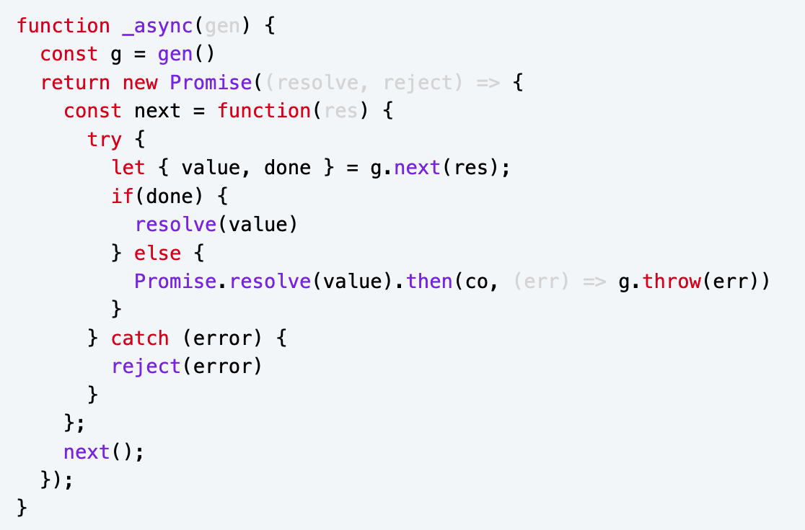
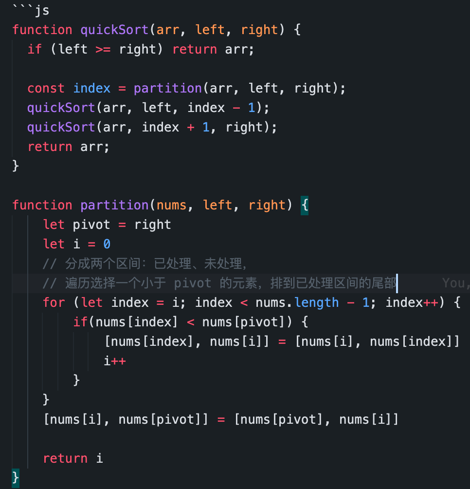

## 目标

- [ ] 小鹏
- [ ] 广州金山
- [ ] 字节
- [ ] 腾讯系
- [ ] 阿里系
- [ ] 美团
- [ ] 京东
- [ ] 顺丰
- [ ] 平安
- [ ] 荔枝
- [ ] 文远知行
- [ ] 比亚迪

## 技术栈

- webpack
- typescript
- vue
- js、html、css

## 题目
  
- html&css
  - 布局
    - [ ] 实现元素水平垂直居中？尽可能说多一些方法？
    - [ ] 左侧固定 + 右侧自适应布局？说说几种方案？
  - flex
    - [x] 用过 flex 布局吗？都有哪些属性？
      - 容器
        - flex-direction
        - flex-wrap
        - flex-flow
        - justify-content
        - align-content
        - place-content
        - align-items
        - gap
      - 项目
        - flex
        - flex-grow
        - flex-shrink
        - flex-basis
        - order
        - align-self
    - [ ] flex: 1 代表什么意思
      - flex: 1 = flex:1 1 0%
      - flex-grow: 1
      - flex-shrink: 1
      - flex-basis: 0% ：项目在主轴空间的大小
  - [x] 选择器优先级
        第一优先级：!important 会覆盖页面内任何位置的元素样式 1.内联样式，如 style="color: green"，权值为 1000
        2.ID 选择器，如#app，权值为 0100 3.类、伪类、属性选择器，如.foo, :first-child, div[class="foo"]，权值为 0010 4.标签、伪元素选择器，如 div::first-line，权值为 0001 5.通配符、子类选择器、兄弟选择器，如\*, >, +，权值为 0000 6.继承的样式没有权值
  - [x] 盒子模型
    - 盒子模型：content + padding + border + margin
    - 怪异模型和标准模型
      - 标准模型元素宽度 width = content
        - `box-sizing: border-box`
      - 怪异模型元素宽度 width = content + padding + border
        - `box-sizing: content-box`
  - [x] 说说什么是 BFC，一般你都用来干什么，解决了什么问题？
    - BFC 块级格式化上下文，即一个独立的布局环境，规定了内部的块级盒子如何布局，不受外部影响。
    - 特征
      - BFC 中块级盒子垂直排放
      - 同一个 BFC 下的块级盒子垂直方向会边距重叠
      - 同一 BFC 下一个 BFC 块容器不会与浮动盒子重叠
      - 在计算 BFC 的高度时，浮动元素也参与计算
    - 创建 BFC 条件
      - 浮动元素
      - 绝对定位元素
      - display 为 inline-blocks、flow-root, 或者 Table cells，Flex items，Grid items 等的元素;
      - overflow 不为 visible 的元素
    - 应用
      - 防止边距重叠
      - 多列布局
      - 包含浮动元素，防止高度坍塌
- js
  - 语法
    - [x] for of 和 for in 的区别以及原理
      - for in 遍历对象的可枚举属性
      - for of 遍历可迭代对象
      - Symbel.iterator 返回一个带有 next 方法的对象，next 返回{done,value}
      - Object.keys/values/entries
    - [ ] 迭代器有了解吗，哪些是可迭代的
  - 变量&类型
    - [x] 变量交换，不要使用中间变量
      - 解构
      - 位运算：异或
    - [x] 类型判断
      - typeof
        - 无法判断除了 function 类型以外的其他具体引用类型
        - `typeof null === 'object'`
      - instanceof
        - 可以判断具体引用类型，但是不能正确判断基础数据类型
        - instanceof 本质上是判断右边的构造函数的 prototype 对象是否存在于左边的原型链上。但根据原型链，`... instanceof Object` 都返回 true。
      - Object.prototype.toString.call
        - 能够更加准确判断数据类型并统一返回格式为 “[object Xxx]” 的字符串，`Object.prototype.toString.call(null) // '[object Null]'`
        - Symbol.toTagString()
    - [ ] 手写类型判断工具函数
    - [x] ==、=== 区别
      - 严格相等运算符 === 在进行比较时不会做任何的类型转换。
      - undefined 与 null 相等
      - 字符串和 bool 都转为数字再比较
      - 对象转换成 primitive 类型再比较
    - [x] 类型转换
      - 显示转换，如 `String('123')`
      - 隐式转换，运算符会自动触发类型转换，如 `+'123'`
        - 类型转换规则  
          在 JS 中类型转换情况：toNumber 、 toString 、 toBoolean、toObject
          
          - StringToNumber
            - Number
            - parseInt
            - parseFloat
          - NumberToString
            - String
          - 对象跟基本类型之间的转换
            - 装箱转换
              - 包装类
            - 拆箱转换
              1. valueOf
              2. toString
              3. Symbol.toPrimitive(o [ , PreferredType ])
    - [x] symbol 有什么用处
      - 创建唯一标识符，可以作为对象属性名，防止命名冲突，还能起到“隐藏”属性
        - 系统 Symbol
        - 全局注册 Symbol.for/keyFor
    - [x] 0.1 + 0.2 不等于 0.3
      - ECMAScript 中的 Number 类型使用 IEEE754 标准
      - 双精确度 64 位来表示一个数字：1 符号位 + 11 指数位 + 52 尾数
      - 0.1 和 0.2 转换成二进制的时候尾数会发生无限循环，会被截断造成精度丢失
      - 精度丢失可能出现在进制转换和对阶运算中
      - 怎么解决浮点数运算缺失
        - bigInt
        - 第三方库：math.js
        - 整型存储，再格式化显示
        - 转换成字符串运算
        - 使用 Number.EPSILON 误差范围：`Math.abs(0.1 + 0.2 - 0.3) <= Number.EPSILON`
  - 对象
    - [x] 手写 call、apply、bind
      - 都可以改变函数 this 指针
      - 时机
      - 传参
      - bind 特殊
      - 
      - 
      - 
      - 
    - [x] 手写 new
      1. 以构造器函数的 prototype 属性值为原型创建新对象
      2. 将 this 指向该对象
      3. 将 this、参数传给构造函数并执行
      4. 若构造函数返回对象则直接返回，否则使用新创建的对象返回
      5. 
    - [x] 手写 instanceof
      - 用法：左边任意值，右边必须构造器
      - 本质：判断左值的原型链上是否存在右边的构造函数的 prototype 对象
      - 
    - [x] [原型及原型链](./JavaScript/JavaScript%20对象.md)
      - 原型：所有对象都有私有属性 `[[prototype]]`（目前大多数浏览器厂商非标准实现 `__proto__` 属性）保持对原型的引用
      - 原型的 5 种修改方式
        - `__proto__`
        - new + 构造器.prototype
        - es5
          - Object.create
          - Object.getPrototypeOf
          - Object.setPrototypeOf
      - 原型链：当对象查找一个属性的时候，如果没有在自身找到，那么就会查找自身的原型，如果原型还没有找到，那么会继续查找原型的原型，直到为空为止，这条查找链路就是原型链
        - [x] 原型链判断
          - 原型链中 Function 比较特殊的地方就是 `Function.__proto__` 指向自己的 `Function.prototype`
    - [x] 继承
      - [ ] 继承和原型链的各种问题
      - [ ] js中继承有哪几种，现在最常用的继承是什么，Babel转换 Class是转换成什么继承的方法。
      - 原型继承:通过原型链实现继承，具体是修改对象的原型设置为另外一个对象
      - 主要是基于原型链的继承（原型代理）：通过**借用构造函数**实现独享数据属性，通过**原型链**继承共享方法属性
      - 原型继承  
        
      - ES5 与 ES6 继承区别
        - 同：都是基于原型机制
        - 异
          - 语法
            - 构造器函数
            - class
          - 继承机制
            - ES6 的继承机制：先内部创建的空对象继承父类的属性和方法，再将该对象作为子类的实例返回给子类的 this；
            - ES5 的继承机制：直接一个子类的实例对象，然后应用父类构造器继承父类的属性和方法，即“实例在前，继承在后”。
    - [x] 对象深浅拷贝
      - 浅拷贝：Object.assign
      - [x] 深拷贝
        - 
  - [x] 模块发展历程
    - 原始阶段：
      - 文件划分模块
      - 对象命名空间+IIFE：解决全局污染和命名冲突、成员访问控制
    - 社区标准化阶段
      - AMD 适用于浏览器的异步模块加载机制
        - RequireJS
      - CommonJS 同步模块加载，用于服务端
      - UMD 通用模块标准
    - ES Modules：ECMASCript 标准
  - [ ] common.js 和 es6 中模块引入的区别？
    - CommonJS 模块输出的是一个值的拷贝，ES6 模块输出的是值的引用。
    - CommonJs 是单个值导出，ES6 Module 可以导出多个
    - CommonJs 的 this 是当前模块，ES6 Module 的 this 是 undefined
  - 函数编程
    - [ ] 普通函数和箭头函数区别
      - 箭头函数的 this 绑定外层上下文中的 this
      - 箭头函数不能通过 new 关键字调用
      - arguments
    - [x] 柯里化
      - 把一个多参数的函数转成可以逐渐接受剩余参数的函数
      - 
    - [x] compose
      - 
  - 数组
    - [x] 类数组转化数组
      - Array.from
      - Array.apply(null, like)
      - Array.prototype.slice.apply(a)
      - Array.prototype.concat.call([], like)
    - [x] 数组扁平化
      - 
      - 
    - [x] 数组去重 `[...new Set(nums)]`
  - [ ] 设计模式
    - [ ] 什么是抽象工厂模式
    - [ ] 发布订阅模式和观察者模式有什么区别
      - 发布-订阅模式在观察者模式的基础上，在目标和观察者之间增加了一个调度中心。
    - [ ] 你项目里面都用了哪些设计模式
    - [x] 手写 EventEmitter
      - 
  - js 执行机制
    - [x] js如何保证在一定时间后执行某段代码?
      - web worker
    - [x] 变量提升、var、let、const 区别及暂时性死区
    - [x] 闭包
      - 在 JavaScript 中，闭包就是绑定了执行环境的函数。根据词法作用域原则，内层函数中访问到其外层函数的作用域。但是 JavaScript 中函数是一等公民，函数也可以作为变量赋值，意味着函数可以脱离当前作用域在其他作用域被调用。这时就需要将内部函数引用到的外部作用域变量保留下来，跟该函数关联起来，以便引擎执行该函数代码能够继续查找到原词法位置中外部的变量。
      - 本质
      - 触发
        - 外层函数包裹内层函数- 内层函数引用外层函数的变量- 外层函数返回内层函数
        - setTiemout 回调
      - 缺点
        - 如果闭包使用不正确，会很容易造成内存泄漏的。
      - 场景
        - 创建私有变量
        - 延长变量的生命周期
          - 柯里化函数
    - [x] this
      - 默认情况下普通函数执行上下文中的 this 是指向全局对象 window 的，但在严格模式下，this 值则是 undefined
      - 对象方法调用（指向该对象）
      - call、bind、apply（指向传入的参数对象）
      - 构造函数（this 指向新创建的对象）
      - 箭头函数（执行上下文没有 this，依靠作用域链继承外层作用域的 this）
  - 异步编程
    - [x] 手写 Promise    
    - [x] promise 哪些方法是原型上的，哪些方法是实例上的
      - 实例
        - then、catch、finally
          - 链式调用
          - 延迟绑定
          - 值穿透、错误冒泡：当我们不在 then 中放入参数，或者参数不为 function，例：promise.then().then()，那么其后面的 then 依旧可以得到之前 then 返回的值
          - 返回值穿透
          - onResolved 和 onRejected 这两项函数需要异步调用
      - 原型
        - **resolve**
          - 参数为 Promise 对象，直接返回
          - 参数为 Thenable 对象
          - 其他数据类型，作为新 Promise 的 result
        - reject
        - all：所有 Promises 状态成功就返回，否则返回失败的 Promises
        - allSettled：所有的 Promise 状态完成就返回，不管其是否处理成功
        - any：优先返回状态成功的 Promise，否则返回全部失败结果
        - race：优先返回优先完成的 Promise
    - [ ] 请求取消
      - promise:Promise.race()方法可以用来竞争 Promise 可以借助这个特性 自己包装一个 空的 Promise 与要发起的 Promise 来实现
    - [x] Promise.all 原理：计数器模式  
    - [x] 实现并发限制    
    - [ ] p-reduce
    - [ ] p-waterfall
    - [ ] p-series
    - [x] 异步代码执行顺序
      - 事件循环模型
      - await => Promise.resolve
      - promise.then
    - [x] async、await 的实现原理
      - Async/Await 其实只是语法糖，本质上类似 Generator & co 的方案，总的来说：通过编译器编译成生成器函数和实现一个通过 promise.then 不断调 generator.next 方法的自动执行器。
      - value 用 Promise.resolve(value) 包装
      -   
    - [x] 为什么微任务
      - 微任务优先级比宏任务高
      - 执行下一个红任务前必须清空所有微任务
  - [x] 正则
    - 
    - 用正则表达式获取 url 中 query 参数 let str = "https://juejin.cn?name=zhangsan&age=18&id=123";
      - Array.from("https://juejin.cn?name=zhangsan&age=18&id=123#".matchAll(/(?<=\?)[^#]\*/g))
      - Array.from("https://juejin.cn?name=zhangsan&age=18&id=123#".matchAll(/\?([^#]*)/g))
  - 手写代码
    - [x] 节流、防抖
      - 防抖：防止重复执行，事件触发 n 秒后再执行，如果期间再次触发则重新计算时间，最终只会执行一次
      - 节流：减少函数的执行频率，每隔 n 秒执行一次
      - 
    - [x] 写版本号排序的方法
      - 
    - [ ] 手写 AJAX 实现
      - 
    - [x] 如何实现 chunk 函数，数组进行分组
      - 
    - [x] flatTree
      - 
    - 生成一个长度为 n 的不重复随机数组
      - Math.random() \* testArray.length
      - 缓存
  - JS 内存管理机制
    - [x] JS 垃圾回收机制：标记清除算法
      - 标记清除算法
        1. 标记：从一组根对象开始进行**可达性分析**，标记活动对象和非活动对象
        2. 清理：回收非活动对象所占据的内存
        3. 整理（这步其实是可选的，因为有的垃圾回收器不会产生内存碎片）：对内存碎片化进行整理
      - 可达性：从根对象的引用链开始遍历到的对象都是具有可访问性的
      - 根对象有：全局的 window 对象（位于每个 iframe 中）、DOM、栈上变量
    - [ ] 你刚刚提到的标记清除法有什么缺点？怎么解决？
      - 空间碎片化
      - 全停顿
    - [x] 你刚刚提到的引用计数法有什么缺点吗？
      - 循环引用
    - [x] v8 是怎么解决循环引用的？
      - 使用可达性分析，从根对象的引用链检查对象是否可访问到
    - [x] v8 引擎垃圾回收策略 
      - 分代收集：V8 将堆内存分新生代和老生代
      - 新生代使用 Scavenge 算法
        1. 将内存分为两个对等空间，分别为 From 区域和 To 区域。 
        2. 新加入的对象都会存放到 From 区域
        3. 当 From 区域快被写满时执行清除操作：跟踪 From 区域的活动对象并复制到 To 区域
        4. 完成复制后，From 区域与 To 区域进行角色翻转
      - 老生代使用Mark-Sweep-Compact算法完成
        1. 标记：从一组 GC Root 对象开始进行**可达性分析**，标记活动对象和非活动对象
        2. 清除：清除非活动对象，并将碎片空间记录到空闲列表以便复用  
        3. 整理：当高度碎片化时，将所有存活的对象移动到一端的空闲位置
    - [ ] 内存泄漏及优化
      - 内存泄漏：当一块内存不再被应用程序使用的时候，由于某种原因，这块内存没有被回收，一直被占用着造成内存浪费
  - 元编程
    - [x] 实现模板字符串解析功能     
- web
  - 页面渲染
    - [ ] 渲染流程
    - [x] 重排与重绘，怎么减少重排
      - 重排、重绘分别对应浏览器渲染流程中 Layout、Paint 阶段，Layout 位于 Paint 前，重排一定会导致重绘，重绘不一定会导致重排：
      - 一般来说，当元素位置、大小等几何信息发生变化时就会发生重排；重绘就是页面结构没有变化，只是外观变了，比如改变字体颜色、背景颜色这样的，就只会发生重绘
      - 性能优化，怎么减少重排
        - 避免强制同步布局和布局抖动，读写分离，尽量不要在修改 DOM 结构时再去执行 DOM 查询操作
        - 缩小重排范围，利用分层合成机制
    - [ ] 分层
      - will-change,3D 属性 transform 之类
  - 事件循环机制
    - [x] 说下事件循环机制
      - 事件循环是一个单线程协调各类事件任务的模型，可以简单理解有一个执行线程循环不断从任务队列取任务执行
      - 在浏览器中的任务队列又分为 macro-task（宏任务）与 micro-task（微任务）
      - 宏任务
        - 脚本 script
        - 用户输入事件处理
        - MessageChannel、postMessage
        - requestAnimationFrame
          - 由系统 VSync 信号触发调度，在每一帧渲染之前执行
          - 如果页面未激活的话，requestAnimationFrame 也会停止渲染，这样既可以保证页面的流畅性，又能节省主线程执行函数的开销
        - UI 渲染任务
        - 计时器 setTimeout、setInterval
          - 计时器的回调不一定在指定时间后能执行。而是在指定时间后，将回调函数放入事件循环的队列中，如果当前任务执行时间过久，会影响定时器任务的执行
          - setTimeout
            - 在 Chrome 中，定时器被嵌套调用 5 次以上，那么系统会设置最短时间间隔为 4 毫秒
            - 未激活的页面，setTimeout 执行最小间隔是 1000 毫秒
            - 延时执行时间有最大值 大约 24.8 天
        - 网络请求 ajax、fetch
        - requestIdleCallback
      - 微任务
        - promise.then、promise.reject
        - MutationObserver
        - queueMicrotask
      - 浏览器中事件循环大致顺序是
        - 主线程从宏任务队列取一任务执行执行完后
        - 再循环执行完微任务队列里的所有任务
        - UI 渲染判断
        - 重复原来操作
    - [x] 为什么要用 setTimeout 模拟 setInterval ？
      - 计时器是在指定时间到达后，将回调函数放入事件循环的队列中，如果前面任务执行过久，会导致setInterval两次回调函数的时间间隔总会小于设定的间隔
      - 使用 setInterval 时，某些间隔会被跳过；setInterval 在每次把任务 push 到任务队列前，都要进行一下判断(看上次的任务是否仍在队列中，如果有则不添加，没有则添加)
      -   
    - [x] requestAnimationFrame vs requestIdleCallback
      - requestAnimationFrame
        - 由系统 VSync 信号触发，在每一帧渲染之前执行
        - 如果页面未激活的话，requestAnimationFrame 也会停止渲染，这样既可以保证页面的流畅性，又能节省主线程执行函数的开销
      - requestIdleCallback
        - 是在“浏览器重排/重绘”后如果当前帧还有空余时间时被调用的
        - 可以设置超时强制
  - [x] 跨域
    - [x] CORS 跨域的原理
      - jsonp 只可以使用 GET 方式提交、调试麻烦、安全性差 xss 注入
      - 分为简单请求和非简单请求
      - 简单请求为
        - 法：GET、HEAD、POST
        - 头部字段不超
          - `accept`
          - `accept-language`
          - `content-language`
          - Content-Type：`text/plain`、`multipart/form-data`、`application/x-www-form-urlencoded`
      - 非简单请求有预请求
        - Access-Control-Request-Method
        - Access-Control-Request-Headers
      - 无论是哪一种，请求都会携带 origin，后端都需要返回 Access-Control-Allow-Origin
      - Access-Control-Allow-Methods
      - Access-Control-Allow-Headers
      - Access-Control-Expose-Headers
      - Access-Control-Max-Age
      - 发送身份凭证信息或者响应设置 cookie，那必须满足三个条件：
        - 后端 Response header 有 Access-Control-Allow-Credentials: true
        - 后端 Response header 的 Access-Control-Allow-Origin 不能是\*，要明确指定
        - 前端请求加上 withCredentials: 'include'
    - [x] JSONP
      - 利用了 script 标签的 src 属性来实现跨域数据交互的，因为浏览器解析 HTML 代码时，原生具有 src 属性的标签，浏览器都赋予其 HTTP 请求的能力，而且不受跨域限制，使用 src 发送 HTTP 请求，服务器直接返回一段 JS 代码的函数调用，将服务器数据放在函数实参中，前端提前写好响应的函数准备回调，接收数据，实现跨域数据交互
    - Proxy Server
  - [x] 安全
    - 同源：协议、域名和端口都相同
    - 同站：协议 、eTLD（有效顶级域） + 1 域相同
    - [x] XSS（跨站脚本攻击）：XSS 攻击是指页面中**注入恶意脚本**
      - 类型
        - 存储型 XSS 攻击
        - 反射型 XSS 攻击
        - 基于 DOM 的 XSS 攻击
      - 防范
        - 输入来源
          - 客户端和服务器对用户**输入**内容进行过滤、限制其输入长度
        - 输出执行
          - 拼接 HTML 字符串：对 HTML 进行转义编码（HTML 的编码是十分复杂的，在不同的上下文里要使用相应的转义规则）
          - 防止 JavaScript 执行时，把**不可信的输入数据**当作**字符串代码**执行
            - DOM 操作
              - 在使用 `.innerHTML`、`.outerHTML`、`document.write()` 时要特别小心，不要把不可信的数据作为 HTML 插到页面上，而应尽量使用 `.textContent`、`.setAttribute()`、 `.style` 等
              - `<a>` 标签的 href 属性
            - eval
            - function
            - setTimeout、setInterval
            - window.location
            - 等
        - 其他
          - 充分利用 [CSP 内容安全策略](https://developer.mozilla.org/zh-CN/docs/Web/HTTP/CSP)
          - cookie 使用 HttpOnly 属性
          - 验证码：防止脚本冒充用户提交危险操作
    - [x] CSRF（跨站请求伪造）
      - 原理：攻击者诱导受害者进入第三方网站，利用受害者在被攻击网站已经获取的登陆凭证，向被攻击网站发送跨站请求，这样就绕过后台的用户验证，达到冒充用户对被攻击的网站执行某项操作的目的。
      - 攻击方式
        - 自动 get 类型，如 img
        - 自动 post 类型，如表单
        - 链接类型
      - 防范
        - CSRF（通常）发生在第三方域名，对第三方域限制
          - 验证请求的来源站点（通过 HTTP 请求头中的 Referer 和 Origin 属性）
          - 充分利用好 Cookie 的 SameSite 属性
            - Cookie 正是浏览器和服务器之间维护登录状态的一个关键数据，通常 CSRF 攻击都是从第三方站点发起的，要防止 CSRF 攻击，我们最好能实现从第三方站点发送请求时禁止 Cookie 的发送
        - CSRF 攻击不是将恶意代码注入用户的页面，不能获取页面数据信息
          - 重要接口加验证参数
            - CSRF Token
            - 图片、短信验证
    - http 劫持
  - [x] 导航流程：输入 URL 到页面展示发生了什么
    - 解析 URL
    - 重定向判断
    - 缓存查找
    - DNS 域名解析
    - 根据 ip 建立 TCP 连接
    - 建立 TSL 连接（可选）
    - 发送请求
    - 响应处理
    - 页面渲染
    - 断开 TCP 连接
  - DOM
    - [x] DOM 事件模型
      - DOM2 Events 规范规定事件流分为 3 个阶段: **事件捕获、到达目标 和 事件冒泡**，
      - 事件委托的原理：不给每个子节点单独设置事件监听器，而是设置在其父节点上，然后利用冒泡原理设置每个子节点。
        - 减少内存消耗和 dom 操作
        - 不必为新增子元素绑定事件监听
  - [x] async 或 defer
    - 都是异步加载 js
    - async 加载完立刻执行
    - defer 在 DOM 解析完毕，DOMContentLoaded 事件之前保持其相对顺序执行
  - [ ] 讲讲 fetch 和 xhr 的区别
  - [x] cookie 和 session 的区别
    - Session 是在服务端保存的一个数据结构，用来跟踪用户的状态，这个数据可以保存在集群、数据库、文件中；Cookie 是客户端保存用户信息的一种机制，用来记录用户的一些信息，也是实现 Session 的一种方式。
  - [ ] cookie、localStorage、sessionStorage 区别以及使用场景
  - [ ] 你所知道的白屏原因，怎么优化？
  - [ ] 常见性能指标
  - [ ] 前端监控
  - [ ] 请你介绍下前端性能优化？
- 工程
  - webpack
    - [x] webpack 有用过哪些 loader、plugin 都有什么作用
      - loader
        - js
          - babel-loader
          - vue-loader
        - css
          - style-loader
          - css-loader
          - sass-loader
          - postcss-loader
        - file
          - file-loader
          - url-loader
      - plugin
        - SplitChunksPlugin
    - [ ] webpack5 介绍
      - 持久化缓存
    - [ ] webpack 性能优化你是怎么做的？
      - https://juejin.cn/post/6844904093463347208
    - [ ] 说了下 webpack 构建流程
    - [x] webpack 有几种 hash，它们有什么区别？一般你在项目里面是用哪种 hash？
      - hash，反映的是项目的构建版本，每次编译之后都会生成新的 hash
      - chunkhash，根据不同的入口文件(Entry)进行依赖文件解析、构建对应的 chunk，生成对应的哈希值（来源于同一个 chunk，则 hash 值就一样）
      - **contenthash**，根据文件内容生成 hash 值，文件内容相同 hash 值就相同
    - Webpack 了解多少
      1. webapck 的四个核心概念，并介绍一些其他的模块，例如 mode，依赖图的概念等等。
      2. 介绍几个 webpack 的插件，如压缩 gzip、如何处理 dev 中的 console.log 的模块等等
    - [ ] loader、plugin 区别
      - loader 主要是对源文件进行转换处理
      - plugin 可以用来监听 webpack 构建生命周期，做一些操作，去扩展 webpa
      - ck 功能
      - loader 本质是一个函数，plugin 本质是一个类，
    - [ ] 怎么实现loader，plugin
    - extenral 通过 extenrals 选项，可以将依赖从输出的 bundle 中移除，并保持资源引入
    - loader 执行顺序
      - 从右往左
    - [ ] webpack 构建阶段优化
    - [ ] webpack 产物阶段优化
      - 提取公共代码、代码分割、代码压缩、按需加载、预加载
    - [ ] 热更新原理
    - [ ] 树摇原理
      - 它与 CommonJS 规范最大的区别在 ES6 中的 import 和 export 都是静态的。静态意味着一个模块要暴露或引入的所有方法在编译阶段就全部确定了，之后不能再改变。
    - [ ] webpack 构建优化
    - [ ] Webpack 构建流程
    - [ ] devtool 配置差异
    - [ ] 热更新（HRM）原理
    - [ ] Webpack 核心库 Tapabel 介绍
  - CI/CD
    - Docker
      - [x] Docker 容器化带来的好处
        - 持续部署与测试（消除了线上线下的环境差异）
        - 环境标准化与版本控制（回滚，压缩、备份）
        - 跨平台性与镜像
  - babel
    - js 编译器
    - preset-env + corejs
    - [ ] Babel 的处理流程
      - 解析成 ast、转化、生成
  - [ ] tree-shaking 原理？
    - 通过 ES Module 做静态分析，删除未使用的代码
    - 利用 ES Module 做静态分析，通过分析 ast 语法树，对每个模块维护了一个作用域，收集模块内部使用的变量，然后分析作用域，将 import 进来未被使用的模块删除，最后递归处理文件。
- http
  - [x] http 特点
    - 请求-应答模式
    - 灵活、易于扩展
      > 只规定了报文的基本格式，比如用空格分隔单词，用换行分隔字段，“header+body”等，报文里的各个组成部分都没有做严格的语法语义限制，可以由开发者任意定制。  
      > “灵活、易于扩展”的特性还表现在 HTTP 对“可靠传输”的定义上，它不限制具体的下层协议，不仅可以使用 TCP、UNIX Domain Socket，还可以使用 SSL/TLS，甚至是基于 UDP 的 QUIC，**下层可以随意变化，而上层的语义则始终保持稳定**。
    - 无状态（“状态”其实就是客户端或者服务器里保存的一些数据或者标志，记录了通信过程中的一些变化信息。）
      > 实现上不需要额外的资源来记录状态信息，减轻服务器的负担，能够把更多的 CPU 和内存用来对外提供服务。  
      > 而且，“无状态”也表示服务器都是相同的，没有“状态”的差异，可以轻松实现集群化，让负载均衡把请求转发到任意一台服务器，扩展性能
    - 可靠性，数据必须保证完整到达才可处理，“可靠”只是向使用者提供了一个“承诺”，会在下层用多种手段“尽量”保证数据的完整送达
    - 明文传输，数据完全肉眼可见，能够方便地研究分析，但也容易被窃听；
    - 不安全的：无法验证通信双方的身份，也不能判断报文是否被篡改；
  - [x] https 是什么，与 http 区别
    - HTTP 是超文本传输协议，信息是明文传输
      - HTTPS 是在 HTTP 和 TCP 之间建立了一个安全层，对发起 HTTP 请求的数据进行加密操作和对接收到 HTTP 的内容进行解密操作
    - HTTP 的端口号是 80，HTTPS 的端口号是 443
  - [ ] https 握手流程
  - [x] https 原理，为什么说 HTTPS 是安全的
    - 服务器与浏览器协商出加密套件（非对称+签名+对称+摘要）
    - 然后服务器会发送数字证书过来
    - 浏览器会通过数字证书 + 数字签名保证网站身份安全
    - 通过证书里的公匙进行非对称加密协商出一个用于对称加密的密钥
    - 之后对传输内容进行对称加密
    - 通过摘要算法保证内容完整
    - 数字签名过程:根据证书内容用摘要算法得出 hash，然后用私钥加密 hash
    - 签名验证：
      - 证书链找到根证书，然后逐级使用上一集公要验证下一级证书
      - 具体：用公钥解密出 hash 跟证书内容进行摘要对比
  - [ ] http1.0/1.1/2.0/3.0
    - http 0.9
      - 只传输 ASCII 编码的超文本内容 HTML，并且只有一个请求行只支持 GET 请求
    - http 1
      - 增加了响应状态码；
      - 引入了 HTTP Header（头部）的概念，让 HTTP 处理请求和响应更加灵活；
      - 支持多种文件类型传输
    - http1.1
      - 增加了 PUT、DELETE、OPTIONS、PATCH 等新的方法
      - 支持响应数据分块传输
      - 增加了 cache-control
      - 增加了 cookie 机制
      - 支持长连接 keep-alive
      - 引入管道机制
    - http2：改进性能，解决了 http-队头阻塞
      - http 头部压缩
      - 二进制分帧传输
      - 支持多路复用：请求、返回会被拆分成切片，然后同一个连接混合传输
      - 支持帧控制
      - 服务推送
    - HTTP/3：主要解决 TCP 队头阻塞、TCP 及 TSL 握手消耗
      - 基于 UDP
  - [x] http/1 队头阻塞
    - http 队头阻塞，设计之初是一个简单纯文本传输协议，基本上是一个字符流，消息必须作为一个连续的数据流完整地发送，并且连接不能用于其他任何事情，只能传输该消息直到它完成，这造就了 http 是一个请求-应答模式
    - 管道机制：管道也可以并行发送请求，但是返回响应的顺序则必须是发送时候的顺序
    - 并行连接
      - 在 HTTP/1.x 中，如果客户端要想发起多个并行请求以提升性能，则必须使用多个 TCP 连接
      - 浏览器 TCP 限制：域名分片
    - http2.0 是怎么解决的？
    - 多路复用：在一条 tcp 连接上，可以并行发送请求、接受消息，而无需相互等待
    - 具体：将 HTTP 消息分割成多个的**数据帧**并且带有唯一**流 ID**，然后交错发送，最后再在另一端将同一流 ID 的帧重新组装起来
  - [x] 头部压缩的原理是什么
    - “HPACK”
    - 浏览器和服务器会维护一个相同的静态表和一个动态表，以及内置一个静态霍夫曼编码表
      1. 静态表存储的是常见的一些头部，和一些很常见的头部键值对
         
      2. 动态表初始为空，添加在静态表后面，结构相同
      3. 请求、响应头部中对于静态表里未出现过的字段或者对应值则经过哈夫曼压缩编码发送之后，客户端和服务器更新自己的动态表；对应已有的则只需发送索引值
         
  - [x] 说说你对 options 请求的理解
    - options 是一种预检测请求、请求某个资源在服务器中都支持哪些操作方法，在响应头 Allow 相关字段里返回
    - 常见应用场景 cors，当我们发起复杂跨域请求时，会自动先发出 options 请求，用于确认目标资源是否支持跨域，然后浏览器会根据服务端响应的 header 自动处理剩余的请求，如果响应支持跨域，则继续发出正常请求
  - [x] Cache-Control 字段
    - no-store，不允许缓存
    - no-cache ，资源依然会被缓存，并且这个缓存要服务器验证后才可以使用
    - max-age，缓存时间，相对响应报文的创建时刻
    - must-revalidate，当缓存失效时必须与回源服务器验证
    - 代理：
    - private，表示缓存只能在客户端保存，不能放在代理上与别人共享
    - public，缓存完全开放，谁都可以存，谁都可以用
    - proxy-revalidate，缓存失效时代理服务器验证即可
    - s-maxage，单独设置代理服务器缓存时间，与 max-age 区别开
    - no-transform，禁止代理服务对资源做转换
  - [x] max-age=0 和 no-cache 等价吗
    - max-age 到期是 应该(SHOULD) 重新验证，而 no-cache 是 必须(MUST) 重新验证
    - 一般情况下他们俩的行为还是一致的
    - 但某些特殊情况及时 max-age=0 浏览器还是会继续使用缓存，比如断网或者设置 stale-while-revalidate 情况下
    - 严格来说 max-age=0 + must-revalidate 才和 no-cache 等价
  - [x] 浏览器 http 缓存
    - HTTP 缓存又分为强缓存和协商缓存
      1. 缓存查找：查找不到直接发送请求
      2. 强制缓存：通过 Expires 和 Cache-Control 判断缓存是否可用，如果可用则直接使用，否则协商缓存
      3. 协商缓存：客户端直接发起请求并携带 If-Modified-Since 、If-None-Match 去请求后台，服务器根据条件请求字段判断资源是否更新
         - 若资源更新，返回资源和 200 状态码
         - 否则，返回 304，告诉浏览器直接从缓存获取资源
  - [x] Etag、last-modified 区别
    - Etag 优先级高
    - Last-Modified 的精确度是秒，如果某个文件在 1 秒内发生变化，那么他们的 Last-Modified 其实并没有体现出来修改
    - 有时一个文件内容没什么变化，但修改时间发生了变化。
    - ETag 是资源的一个唯一标识，文件内容的 hash 值。
    - ETag 还有“强”“弱”之分。强 ETag 要求资源在字节级别必须完全相符，弱 ETag 在值前有个“W/”标记，只要求资源在语义上没有变化，但内部可能会有部分发生了改变
  - [x] 请求方法
    - GET：获取资源
    - POST：提交资源
    - PATCH：差量修改数据
    - PUT：全量修改数据
    - DELETE：删除资源
    - HEAD：获取资源的元信息，HEAD 则是跟 GET 类似，但只返回响应头（想象一个业务情景：欲判断某个资源是否存在，我们通常使用 GET，但这里用 HEAD 则意义更加明确。）
    - CONNECT：要求服务器为客户端和另一台远程服务器建立一条特殊的链接，这时 Web 服务器充当代理的角色，多用于 HTTPS 和 WebSocket
    - OPTIONS：要求服务器列出可对资源实行的操作方法，在响应头 Allow 字段里返回，常用于跨域资源共享
  - [ ] vary：可作为缓存验证条件
  - [x] get 和 post 区别
    - 参数
    - 编码
    - 大小（要支持 IE，则最大长度为 2083byte，若只支持 Chrome，则最大长度 8182byte）
    - 缓存
  - [x] TCP 连接过程：说一下三次握手四次挥手
    - 握手
      1. 客户端向服务端发送一个 SYN 报文(SYN = 1，seq = x)请求建立连接，并指明客户端的初始化序列号
      2. 服务端返回 SYN+ACK (SYN = 1，ACK = 1，seq=y,ack=x+1) 报文，并指明服务端端的初始化序列号给客户端
      3. 客户端发送 ACK（ACK = 1, seq= x+1,ack = y+1）确认报文给服务端
    - 挥手
      - 客户端发送 FIN
      - 服务端发送 ACK
      - 服务端发送 FIN
      - 客户端 ACK
  - [x] 为什么需要三次握手，两次不行吗？
    - 为了确认对方的发送和接收能力，如果只握手前两次，服务端不确定客户端是否准备好了
    - 这是由于 TCP 可靠性基于请求-应答模式，无论哪一方收到数据后，都需要给发送方一个 ACK（Acknowledgement）响应。如果一个请求没有响应，发送方可能会认为自己需要重发这个请求
  - [x] 为什么四次挥手
    - 因为 TCP 是全双工通信的。当主动方发送断开连接的请求（即 FIN 报文）给被动方时，仅仅代表主动方不会再发送数据报文了，但主动方仍可以接收数据报文。当被动方也发送 FIN 报文时才意味着连接可以断开。无论是哪方收到消息后，都需要给发送方一个 ACK（Acknowledgement）响应。如果一个请求没有响应，发送方可能会认为自己需要重发这个请求。所以总共四次挥手。
  - [x] TCP, UDP 的区别
    - TCP 是一种面向连接、可靠的、基于字节流的传输数据的协议，适用于要求可靠传输的应用，例如文件传输
    - 而 UDP 则是面向数据报文的协议，不需要连接，但在网络环境差的时候可能会丢包比较严重，
      - 但是因为 UDP 不需要连接，资源消耗低，灵活性高，适用于实时应用，比如音频、视频传输这种
      - 而且 UDP 协议结构简单，适合扩展，比如 http3 的 QUIC
  - [x] CNAME 记录的作用？
    - CNAME 是一种 DNS 记录，它的作用是将一个域名映射到另一个域名。域名解析的时候，如果看到 CNAME 记录，则会从映射目标重新开始查询。 
  - [x] DNS 查询过程
    1. 客户端向其本地域名服务器发起域名查询，如果存在记录则直接返回结果
    2. 否则，本地域名服务器代替客户端向根域名服务器发起查询，得到顶级域名服务器的 IP 地址
    3. 本地域名服务器向顶级域名服务器发起查询，得到权威 DNS 服务器的 IP 地址。
    4. 本地域名服务器向权威域名服务器发起查询，得到所查询的主机 IP 地址。
    5. 本地 DNS 服务器缓存 DNS 记录并返回给客户端
  - [x] CDN 介绍，回源是什么？CDN 的原理是什么？ 
    - CDN，内容分发网络（Content Dilivery Network，CDN）是一个专门用来分发静态内容的分布式应用。通过部署各地网络节点，让不同地域的用户可以就近获取内容，从而达到加速访问的效果。
    - CDN 回源就是 CDN 节点到源站请求资源，重新设置缓存。通常服务提供方在使用 CDN 的时候，会在自己的某个域名发布静态资源，然后将这个域名交给 CDN。
    - CDN 的原理
      - CDN 核心技术 = 智能 DNS + 缓存系统
      1. CDN 厂商会提供 CDN 域名给你，你可以将自己的业务域名 CNAME 到厂商的 CDN 域名
      2. CDN 域名的解析（NS）会最终由厂商的CDN 智能域名系统处理
      3. CDN 智能域名系统返回最近节点的 IP 地址
      4. 用户端根据 IP 地址发起节点请求资源
      5. 若节点有缓存则直接返回，否则回源请求并重新缓存返回给客户端
  - [x] 网络协议栈
    - TCP/IP 协议栈
      - 应用
      - 传输
      - 网络
      - 链路
    - OSI 协议栈
      - 应用
      - 表示
      - 会话
      - 传输
      - 网络
      - 数据链路
      - 物理
  - [x] 状态码
    - 1xx：提示信息，表示目前是协议处理的中间状态，还需要后续的操作
      - 101 切换请求协议，从 HTTP 切换到 WebSocket
    - 2xx：请求处理成功
      - 200：请求成功
      - 204：请求成功，但没有返回任何内容
      - 206：分块传输
    - 3xx: 重定向，表示客户端请求的资源发生了变动，需要重新请求
      - 301：永久性重定向
      - 302：临时性重定向
      - 304：资源未被修改，客户端重定向缓存
    - 4xx：客户端错误，表示请求报文有误，服务器无法处理
      - 400：请求参数错误
      - 401：未授权，请求要求身份验证
      - 403：禁止访问
      - 404：表示请求资源不存在
      - 405：请求方法错误
    - 5xx：表示服务器端错误
      - 500：服务端错误
      - 503：服务端暂时性错误或者繁忙，稍后再试
      - 504：网关超时
- Vue
  - 原理
    - [ ] Compisition API 实现原理
    - [x] 什么是虚拟 DOM，以及为什么
      - 本质描述真实 DOM 的 javascript 对象
      - 抽象视图，跨平台化；把视图当作 javascript 对象，能够进行**编程化**
      - 避免直接手动操作 DOM，对 DOM 进行读写分离以及以批处理的方式保证了性能下限，同时可以规避一定 XSS 风险
    - [x] diff 算法，index key 问题
      - key：内部建立节点索引，快速找到复用节点
      - 具体
        - 只做同层比较
        - 根据 标签type & key 去判断是否为相同节点
          - 然后销毁或创建新的节点
          - 如果是同一类型则继续更新节点属性信息、然后对比子节点
        - 根据新旧 vnode 子节点不同类型分别处理：其中最为复杂的情况是数组类型
          - vue2 双端比较算法
          - vue3 去头尾的最长递增子序列算法
            - 先对齐的前置元素和后置元素
            - 中间部分未知子序，找出公共最长递增子序列部分，这样使得移动节点最少
        - 然后继续深度递归
    - [ ] vue 响应式原理
      - 响应式数据，实现上：数据劫持+观察者模式
        - 数据劫持
          - vue2 defineProperty
          - vue3 proxy
      - [ ] 手写响应式数据实现
    - [x] 数据绑定原理
      - 渲染视图时访问到响应式数据，会被数据劫持将视图渲染做为依赖收集，当数据发生变化就会触发视图渲染
    - [x] 单向数据流原则理解
      - 数据到视图单向绑定
      - 组件树自顶向下单向更新，父组件更新后通过 props 向子组件传递数据，子组件不能更新 props
      - 如果发生逆向数据流修改，会使当前渲染的视图与状态映射不一致，导致重复渲染。
    - [x] vue2、vue3 的 nextTick 原理
      - 使用场景：数据更新后，调用 nextTick 可以确保回调任务在 DOM 更新后执行
      - 实现原理：使用队列缓存当前事件循环中 nextTick 的回调任务，以微任务优先的方式在下次循环中执行队列任务
      - vue2 会根据环境、采用不同的降级方案使用系统异步 API，而 vue3 直接使用 Promise
        - Promise.then、MutationObserver 和 setImmediate、messagechannel，如果执行环境不支持，则会采用 setTimeout(fn, 0)
  - API
    - [x] v-if和v-for哪个优先级更高？
      - 实践中不应该把v-for和v-if放一起
      - vue2中，v-for的优先级是高于v-if
      - vue3中则完全相反，v-if的优先级高于v-for，所以v-if执行时，它调用的变量还不存在，就会导致异常
      - 为了过滤列表中的项目，先用计算属性
      - 为了避免渲染本应该被隐藏的列表，把 v-if 放到外层容器元素或者外面包一层template即可
    - [x] vue 组件通信
      - 直接父子组件通过 props、emit；或者直接引用组件实例 parent、children、ref
      - 非直接父子组件、深层级或远距离组件的通信，则依赖于 "状态提升" + props 层层传递的方式或者使用 provide/inject 模块领域的方式
      - 也可以使用像 eventBus、vuex 等之类的全局单例 + 事件订阅模式
    - [x] vue2、3 新旧生命周期、生命调用顺序
      - 生命周期
        - 创建
          - setup(vue3)
          - beforeCreate
          - created
        - 挂载
          - beforeMount
          - mounted
        - 更新
          - beforeUpdate
          - updated
        - 销毁 
          - beforeDestory/beforeUnmount(vue3)
          - destroyed/unmounted(vue3)
        - 其他
          - activated
          - deactivated
          - errorCaptured
          - vue3
            - renderTracked
            - renderTriggered
            - serverPrefetch
      - 生命周期调用顺序
      - 异步请求在哪一步发起
        - 一般 created 或者 mounted
        - 但 ssr 场景不支持 beforeMount 、mounted 钩子函数，可用放在 created 中有助于一致性；而在 vue3 SSR 数据获取统一成 serverPrefetch
    - [x] vue 双向绑定原理（v-model）
      - v-model 只是个语法糖，通过vue的编译器默认情况会转成 value 数据属性绑定 + input 事件监听，在事件回调函数中会做变量更新操作
      - v-model 通常在表单项上使用v-model，还可以在自定义组件上使用
      - v-model 如果用在表单元素，编译器根据表单元素的不同会展开不同的DOM属性和事件对，比如text类型的input和textarea会展开为value和input事件；checkbox和radio类型的input会展开为checked和change事件；select用value作为属性，用change作为事件。
    - [ ] 自定义组件使用v-model如果想要改变事件名或者属性名应该怎么做
      - vue2: model { prop, event }
    - [ ] keep-alive 原理
    - [ ] computed 实现原理
    - [x] computed、watch 对比区别
      - computed 计算属性，主要是基于其他响应式依赖**缓存计算结果**，只有当依赖发生变化才会需要重新计算；computed 是延迟计算的，只有被访问时才真正执行计算。computed 常用于模板渲染中。
      - watch 侦听属性适用于观测某个值的变化去立刻执行一段复杂的业务逻辑
  - 其他
    - [ ] 组件设计原则
    - [x] vue 的 data 为什么要用函数返回一个对象？
      - 多个组件实例会共享 data 数据
    - [x] MVC 与 MVVM 的区别
      - MVC 主要将代码分为
        - Model 数据模型，封装数据及业务逻辑
        - View 视图渲染
        - Control，接受用户指令，作为数据模型和视图之间通信的桥梁
      - MVVM 
      - 数据会绑定到 viewModel 层并自动将数据渲染到页面中，视图变化的时候会通知 viewModel 层更新数据。
    - vue 性能优化
      - 不需要响应式的数据不要放到 data 中，或者可以用 Object.freeze() 冻结数据
      - v-for 遍历必须加 key
      - keep-alive 缓存组件、v-once、v-meno 去防止重复渲染
      - 组件按需引入
      - 路由懒加载
      - 防抖、节流运用
      - 虚拟列表/虚拟表格
      - 防止内部泄漏，组件销毁后把全局变量和事件销毁
    - 内置指令
      - v-if 优先级高于 v-for
    - [x] Vue 如何检测数组变化
      - vue2.x 中如何监测数组变化？
        - 重写一些数组方法：对 7 种数组（push,shift,pop,splice,unshift,sort,reverse）方法进行重写
        - 出于性能原因的考量，Vue 是对数组元素进行了监听，而没有对数组本身的变化进行监听。
    - [x] Vue 事件绑定原理
      - 原生事件绑定是通过 addEventListener 绑定给真实元素的，组件事件绑定是基于自己实现的一个发布订阅模式的事件中心。
    - [x] Vue 和 React 对比
      - 同
        - 底层上都是使用 virtual dom 作为渲染机制
        - 都采用数据驱动的思想
      - 异
        - 更新优化方式
          - vue 通过数据劫持 + 编译优化 + 运行时优化，精确 vdom diff 范围
          - react 采用 fiber 架构，使用链表表示 DOM 结构 可以在 diff 时随时中断和继续，利用 requestIdleCallback 在空闲时 diff，防止数据量大 diff 时间长导致卡顿，偏重运行时
        - 编程上 react 偏向不可变、函数式编程。vue 则是响应式编程、可变数据
        - 模板书写上
          - react jsx 有完全 js 编程能力
          - vue template 虽然缺失一定灵活，但起到限制规范
  - Vue3
    - [ ] Vue2、Vue3有什么区别
    - [ ] vue3 项目实践过程问题及心得
      - 以前对象配置写法逻辑按功能分类，如果 setup 臃肿，现在 setup 写法，按逻辑组织封装成 hook 组合使用
      - ref .value 问题，最好变量命名 xxxRef 后缀
      - 封装成响应式流
    - [x] reactive vs ref，为什么 ref
      - 数据劫持的实现上无论是 Object.defineProperty、proxy 都有个缺点就是必须是对象类型，不支持原始类型
      - （个人觉得）ref 主要是规范化对原始类型的响应式化，即将原始类型包装成带 value 属性的对象再进行响应化
      - 顾使用 ref 对数据访问需要通过 value 属性，reactive 则不需要
      - reactive 是通过 proxy 实现
      - ref 的实现上使用 object.defineProperty 的 get 与 set 完成的，但对于非原始类型的参数则转换成 reactive 去响应化（Why？个人猜测，如果一个原始类型直接通过 reactive 支持，需要创建一个 Map 对象，参考上面 [reactive 实现的缓存结构](#缓存结构)，有点浪费）
  - SSR
    - [ ] SSR 原理
    - [ ] SSR介绍：什么是 SSR、为什么 SSR、SSR 缺点
      - 优点
        - 有利于SEO
        - 首屏加载速度更快
    - SSR 也就是服务端渲染，在服务端完成 vue 渲染，直接对客户端输出 html
      - 缺点：开发条件会受到限制，写代码时注意 API 运行环境：比如服务器端渲染只支持 beforeCreate 和 created 两个钩子
      - 服务器有更大的负载、运维需求
  - vuex
    - vuex 是专门为 vue 提供的全局状态管理系统
    - state、getter、mutations、action、module
      - mutations 是唯一更改 store 中状态的方法且必须是同步
      - action 可执行异步逻辑，提交 mutations
  - Vite
    - [ ] 原理
    - [ ] webpack 和 Vite 和 Rollup 有啥区别
  - vue-router
    - [x] hash 模式和 history 模式实现原理分别是什么
      - hash
        - 使用 URL 中#后面的内容作为路由地址
        - URL hash 发生改变不会重新刷新页面，而且会浏览器的访问历史中增加一个记录
        - 可以通过 hashchange 事件监听路由变化，根据当前路由地址找到对应组件重新渲染，但。。。
        - 特点：兼容性好但是不美观
      - history
        - 使用 URL 路径部分作为路由地址
        - 利用 HTML5 History Interface 中新增的 pushState() 和 replaceState() 方法对浏览器历史记录栈进行修改，但不会刷新页面
        - 通过 PopStateEvent 事件监听路由变化，根据当前路由地址找到对应组件重新渲染
        - 特点：虽然美观，但是刷新会出现 404 需要后端进行配置
        - history.pushState()或者 history.replaceState()不会触发 popstate 事件；popstate 事件会在点击后退、前进按钮(或调用 history.back()、history.forward()、history.go()方法)时触发
        - vue-router
          - popstate 监听路由变化
          - 使用 history pushState 模拟 hash 模式
    - [x] 路由懒加载
      - Vue 的异步组件和 Webpack 对动态 import 做代码分割功能
    - [x] Vue-router 导航守卫有哪些
      - 全局前置/钩子：beforeEach、beforeResolve、afterEach
      - 路由独享的守卫：beforeEnter
      - 组件内的守卫：beforeRouteEnter、beforeRouteUpdate、beforeRouteLeave
      - 导航解析流程
      - 
- NodeJS
  - [x] 浏览器事件循环跟 NodeJS 有什么区别
    - 定义
      - 在浏览器中有 HTML 规范来定义事件循环的处理模型
      - Node.js 中事件循环的定义与实现均来自于 Libuv。
    - 事件类型
      - node 没有 HTML 渲染、鼠标键盘等事件，但有文件 IO 等系统事件，而浏览器反向
    - 执行顺序
      - node 的宏任务分为六个固定优先级阶段；而浏览器则动态优先级
        - timer
        - pending callback
        - idle
        - poll
        - check
        - close
      - node11 之前，node 先清空某个优先级的红任务队列任务再清空所有微任务然后接着下一优先级的红任务队列，以此类推
      - node 11 之后，跟浏览器保持一样，都是执行完宏任务队列里的一个红任务就清空所有微任务
- 操作系统
  - [x] 线程跟进程区别
    - 进程是资源分配和调度的基本单位
    - 线程是 CPU 运算调度的最小单位
    - 一个进程能有多个线程，但任意一线程执行出错，都会导致整个进程的崩溃
    - 线程之间共享本进程中的内存空间，进程之间的资源则相互隔离
    - 进程关闭，操作系统会回收进程所占用的内存
- 算法
  - [x] 散列表：散列表用的是数组支持按照下标随机访问数据的特性，所以散列表其实就是数组的一种扩展
    - [x] 散列冲突
      - 开放寻执法
      - 链表法
    - [ ] 字母异位
    - [ ] 两树之和
    - [x] LRU 
  - [ ] 数组
    - [x] 排序算法
      - 冒泡：两两比较 
      - 选择：每次从剩余未排序中选择最小 
      - 插入：从后往前插 
      - 快排：找个中间点，分两边，反复递归 
      - 归并：递归分两遍，再合并 
    - [ ] 二分查找
    - 连续子数组的最大和
    - 顺时针打印矩阵
  - 双指针/滑动窗口
    - [x] 三数之和 
    - [x] 无重复字符的最长子串 
  - [x] 链表
    - 插入 b.next = a.next a.next = b
    - 删除 a.next = a.next.next
    - 链表操作
      - 注意空指针
      - 带头链表：简化操作，针对链表的插入、删除操作，需要对插入第一个结点和删除最后一个结点的情况进行特殊处理
    - 反转 
    - 部分交换 
    - 有无环
      - 
      - 快慢指针
      - 散列表
    - 倒数第 n 节点 
    - 中间节点 
    - 回文链表 
    - 合并链表
    - 链表中环的入口节点
  - [x] 栈、队列
    - 括号是否合法
    - 简单说下栈和队列？如何用栈实现队列？
    - 用队列实现栈
    - 滑动窗口的最大值
  - [x] 树
    - 二叉树、满二叉树、完全、二叉搜索树
    - 对二叉查找树进行中序遍历，就可以输出一个从小到大的有序数据队列
    - 遍历(广、深)、层序遍历、深度(广)
    - 翻转二叉树    
    - 验证搜索二叉树  
      -  
      - 中序遍历    
    - 二叉树的最大深度/最小深度
      -  
      -   
    - 按之字形顺序打印二叉树
  - [x] 堆
    - 堆实现
    - 数据流中的中位数
    - 最小的k个数
    - Top K、前 K：703.数据流中的第 K 大元素
      - 优先队列：二叉堆
      - 快排
  - [ ] 递归、分治、贪心、回溯、动规
    - 递归
      - 子集
    - 分治
    - 回溯
      - 排列
      - 组合
      - N皇后问题
    - 动规
      - 找硬币/零钱兑换
      - 打家劫舍
      - 最小路径和
      - 斐波拉契数列
      - 跳台阶
- typescript
  - [ ] TypeScript 高级用法， Pick 和 Omit
  - [x] 枚举和 object 的区别
    - 枚举和对象的重要差异在于，对象是单向映射的，枚举是双向映射的，即你可以从枚举成员映射到枚举值，也可以从枚举值映射到枚举成员
    - 枚举编译后也是 obejct 对象
  - [x] 什么是范型
    - 泛型是指在定义函数、接口或类的时候，不预先指定具体的类型，使用时再去指定类型的一种特性。简单的说，“泛型就是把类型当成参数”。
  - [x] 什么是双变、协变和逆变？
    - 逆变：可以接受父类但不接受子类
    - 协变：可以接受子类但不接受夫类
    - 双变：同时接受`subtype`和`supertype`
  - [x] const 和 readonly 的区别
    - const 用于变量声明，声明引用是不可变的。但所指对象仍然是可变的。
    - readonly 只用于类型声明中，声明只读属性、只读数组
    - const 在运行时检查，readonly 在编译时检查
  - [x] never 与 void 区别
    - never 表示永远不存在的类型，比如函数总抛出异常或者死循环、两个不存在交集的类型强行进行交集运算，这些都不会产生值产生类型
      - never 类型仅能被赋值给另外一个 never 类型
    - void：表示一个空值类型，常用于表示一个函数没有返回操作或者没有显式返回一个值的函数的返回值
      - void 类型无法赋值给其他类型
      - 如果一个变量为 void 类型，只能赋予 undefined 或者 null
  - [x] interface 和 type 的区别
    - type 可以表示任何类型数据，而 interface 主要用来声明对象结构类型
    - 同名的 interface 可以声明合并，type 则无法
    - 同样在对象扩展情况下，interface 使用 extends 关键字，而 type 使用交叉类型（&）。
    - type 能够进行复杂类型编程
  - [x] abstract vs Interface
    - 都是描述类的结构，Interface 还能描述函数结构
    - Interface 编译后就不存在，而 abstract 则会存在
  - [x] ts中的访问修饰符
    - public：任何地方能被访问。
    - protected，该类和子类中访问
    - private：该类的内部被访问
    - readonly：属性设置为只读，不能修改
  - [x] null vs undefined vs void
    - 在 JavaScript 中，null 与 undefined 分别表示“这里有值，但是个空值”和“这里没有值”，而在 TypeScript 中，null 与 undefined 类型都是有具体意义的类型
    - void：表示一个空类型，常用于表示一个没有返回操作或者没有显式返回一个值的函数的返回值
  - [x] 枚举和常量枚举区别
    - 枚举是可双向映射（只有数字key）使用，常量枚举只能单向映射使用
    - 枚举会被编译时会编译成一个对象，可以被当作对象使用
    - const枚举会在ts编译期间被删除，对应使用的位置直接内联替换成值
  - [x] any、unkown 区别
    - any 表示任意类型，可以将其他类型赋值给 any 或者将 any 赋值给其他类型，相当于 typescript 逃生门，会跳过类型检查
    - unknown类型和any类型类似。与any类型不同的是，但 unknown 类型的值只能赋值给 unknown 或 any，并且使用 unknown 类型的变量，TypeScript 会强制类型检测，你必须使用**类型缩小、类型断言**手段去确定类型
- React
  - [ ] React Hooks 的原理
    - hooks 的实现原理其实不复杂，就是在某个上下文中存放一个链表，然后 hooks api 从链表不同的元素上访问对应的数据来完成各自的逻辑。这个上下文可以是 vdom、fiber 甚至是全局变量。
  - [ ] Fiber 机制
- 其他
  - 微前端
    - [x] 什么是微前端、了解
      - 微前端：把前端应用、组件或者逻辑当作服务，可组合共享，合并成整体服务使用
      - 好处：与技术栈无关、独立开发、独立部署
      - 微前端 = 加载器 + 运行时容器（js、css隔离方案、容器通信机制）

## 其他

- [ ] 自我介绍
  - 面试官好，我叫\*\*，今天来应聘贵公司的前端工程师岗位。我从事前端开发两年多，有 X 年多的 Vue 开发经验，一年 React 开发经验，在上家公司主要从事 H5 页面，后台管理系统，混合 App 等项目开发。平常喜欢逛一些技术社区丰富自己的技术，像思否，掘金之类，并且自己也独立开发了个人博客网站，记录自己的工作总结和学习心得。 我的性格比较温和，跟同事朋友相处时比较外向，在工作中代码开发时我喜欢全心全意的投入，对于工作我总抱着认真负责的态度。面试官，以上是我的介绍，谢谢。
- [ ] 工作中遇到的具有挑战的事情
- [ ] 最大的优点和缺点
- [ ] 自己做过的项目中有那些是你值得说的
- [ ] 开发流程一般都是怎么做的
- [ ] 空窗期
- [ ] 职业规划
  - 希望在未来的两到三年时间，拓充技术能力的同时，在业务能力上有所沉淀成为业务，形成一定的见解，同时谋求从大头兵向小组长的一个转变
- 提问环节
  - 假如入职以后，工作职责是什么？
- 面试策略
  - 尽量把自己会的东西以及常用的东西，尽量让面试官问不倒你
  - 不会的东西可以跟面试官说不会，不怎么了解

## 项目复盘

- 项目
  - 人事系统、人事H5(人事流程、自主考勤)、活动H5
  - 转介绍、校友录、服务号
  - 食堂、订阅系统
- 技术复盘
  - 团队、工程提效
    - 项目构建优化
    - 模板创建
      - 创建项目模板(用于快速生成新项目的目录模板，并集成一系列体系化工具的安装，能够提升前端开发人员的效率，减少 copy 操作)，参考 vue-cli 交互及设计思路
      - 平常如果经常有多项目开发的需求，整理出差异和统一的部分，建立团队内部的脚手架避免重复劳动
    - gitlab + docker 自动部署方案
      - docker 环境隔离
    - jtest
    - 包共享
      - 尝试搭建 CI / CD 平台，尝试搭建 npm 私服维护自己公司内部的通用包
      - 日常的业务开发中不局限于完成功能，是否有去思考项目结构如何设计，如何封装基础工具，基础组件如何设计、开发、共享
    - 代码规范
      - 接入 eslint、prettier 等代码检验、风格统一的插件
      - 提交规范
    - 组件文档生成
      - vuepress-plugin-docgen
  - 项目性能优化
    - 虚拟列表
    - WebWorker excel 文件下载
    - http 封装
    - 自定义 keep-alive
  - H5
    - 移动端适配
    - bug
      - 滚动穿透
    - 与客户端的通讯方式
      - JSBridge
      - 双向通讯
    - 海报
      - 生成及适配
  - 引进 tailwindcss 方案
  - 引进 pnpm，使用 pnpm workspaces 对项目进行 monorepo 管理
    - [x] 为什么用 pnpm
      - npm 管理痛点，如何解决
      - 节省空间，兼容性好，相比较 yarn、npm 安全性高
      - 比如项目中可同时存在 vue2、vue3，不会产生冲突
      - pnpm workspaces 相关命令比 learn + yarn workspaces 简洁
    - [ ] 为什么 monorepo
    - [x] pnpm 对比 npm、yarn
      - 对比 yarn/npm
        - npm@3 之前： `嵌套结构`
          - 过度嵌套
          - 依赖重复、占用空间
        - yarn/npm@3 之后：`扁平化结构`
          > 本质上是**依赖提升**带来的问题
          - 依赖结构的**不确定性**，依据声明顺序
            - lock 文件虽在一定程度维持依赖结构，但随着包升级还是可能带来结构破坏
          - 扁平化算法本身的**复杂性**很高，耗时较长
          - 幽灵依赖：项目中仍然可以**非法访问**没有声明过依赖的包，因为 `Node Module Resolution` 机制
          - [npm 分身](https://rushjs.io/zh-cn/pages/advanced/npm_doppelgangers/)：依赖重复安装、打包，破坏单例安装
      - pnpm
        - 依赖结构：`平铺结构 + 符号链接`
          - 所有的包都平铺在 `.pnpm` 内，并通过**符号链接**依赖关系
          - 所有的包通过硬链接到 store 内部真实文件位置
        - [半严格模式](#半严格模式)

## 单词

- stopPropagation
- yield
- fibonacci 斐波那契
- yield
- recursion
- Expires
- revalidate
- traverse
- justify-items: stretch;
- align-content: space-evenly;
- prototype
- toPrimitive
- iterator
- Suspense
- Portals
- flatten

  - tailwindcss 好处
    - 命名
    - 原子
    - 按需构建
      - purgcss
      - uncss
  - webpack
    - webpack-bundle-analyzer
    - 第三方库以模块按需引入
    - image
      - imagemin-webpack-plugin
      - cdn
      - 懒加载
    - 分割
      - split-chunk（cache）
        - 基础库
        - 公共代码
      - 路由懒加载
    - 压缩
      - js -> terser
      - css -> cssnano
      - compress-webpack-plugin + gzip nginx
      - tree-shaking

- 项目
  - 背景
  - 技术
  - 难点及解决、收益：问题 → 方案 → 收益的模式来描述

Situation（背景）：做这个项目的背景是什么，比如这是个人项目还是团队项目，为什么需要做这个 项目，你的角色是什么，等等。
Target（目标）：该项目要达成的目标是什么？为了完成这个目标有哪些困难？
Action（行动）：针对所要完成目标，你做了哪些工作？如何克服了其中一些困难？
Result（结果）：项目最终结果如何？有哪些成就？有哪些不足之处可以改进？

- 构建

  - 提速
    - cache
      - hashSourcewebpack plugin
      - webpack5 cache
    - esbuild
    - resolve
      - include/exclude
    - 多进程
  - 体积
    - gzip/brotli

- 自动化测试
  - CI
    - when -> 选定分支
  - 前端异常监听
    - onerror
    - 框架
    - unhandlereject
  - 上报
    - 网络监控
      - git
      - sendBeacon

lint-staged 原理

- pre-commit

- 项目经验

  - tailwindcss
    - 优点
      - utility class 的集合
      - 语义化，减少命名烦恼
      - 样式原子性：可组合可复用,样式利用率极高
      - JIT
      - 原子 css 提高 css 利用率及缩减大小
      - 可配置设计系统
    - 缺点
      - html模板样式复杂
        - 样式更 windcss 做为属性，而不是拥挤在 class 中，class 保持 BEM 的命名方式
        - class component BEM
        - Tailwind确实通过减少编写描述性类名称和担心具体性所花费的时间来帮助您更快地创建。但是使用BEM等方法的类名也提供语义含义并创建（希望有用）抽象层
    - 最佳实践
      - 类名多的时候最好分离目标，成为单独类 @apply
      - 使用全类名，而不是动态类名（动态类型 PurgeCSS 无法清除
  - 虚拟列表
  - 混合开发
  - 大文件导出
  - 跨域
    - proxy
    - [ ] cors 一个？
    - 四层负载
      - CNAME + document.domain
    - jsonp
  - 性能优化
    - 缓存
      - http
      - cdn
      - service-worker
  - 规范
    - eslint
  - 人事
  - 小程序

- HTTPS 强化通信链路安全
- HTTP/2 优化传输效率
- Nginx/OpenResty 提升网站服务能力
- WAF 抵御网站入侵攻击
- CDN 作用网络加速，缩短访问链路，就近访问原则

webpack 原理、热更新原理、动态加载原理、常见 plugins、loader、常见优化，怎么打包、怎么分 chunk，怎么写一个 plugins，生命周期，微内核源码等内容，以及 rollup、gulp 的使用、应用场景。

层创建标准
什么情况下能使元素获得自己的层？虽然 Chrome 的启发式方法(heuristic)随着时间在不断发展进步，但是从目前来说，满足以下任意情况便会创建层：

3D 或透视变换(perspective transform) CSS 属性
使用加速视频解码的 `<video>` 元素
拥有 3D (WebGL) 上下文或加速的 2D 上下文的 `<canvas>` 元素
混合插件(如 Flash)
对自己的 opacity 做 CSS 动画或使用一个动画变换的元素
拥有加速 CSS 过滤器的元素
元素有一个包含复合层的后代节点(换句话说，就是一个元素拥有一个子元素，该子元素在自己的层里)
元素有一个 z-index 较低且包含一个复合层的兄弟元素(换句话说就是该元素在复合层上面渲染)

PurgeCSS
cssnano

devtool coverage

- http - https://mp.weixin.qq.com/s/By-iXlONjSZLKFG2Xd7rpg 重复 - https://mp.weixin.qq.com/s/NfyxtWUzjHh6ucXvBF9B4Q 缓存 - https://mp.weixin.qq.com/s/E4SdYEkEzurfrnJrBu3bjA 并发下载 - https://mp.weixin.qq.com/s/8RJSBwCDTvwX3Oql31ckkg 重试 - https://mp.weixin.qq.com/s/lGqnGg-Zdnt-b7grdh9NnQ 压缩

- babel 的 preset 和 pollyfill 可以互相替代吗，为什么可以/不可以
- babel7 相较于之前做了哪些优化
- DOM 的事件机制，怎么阻止事件捕获
- 常用的 ES6 语法有哪些，var 怎么实现 let
- React 中的 useCallback 和 useMemo 有什么区别，什么情况下需要用 useCallback
- setState 是同步还是异步的
- Set 的用法，用 Set 实现数组去重
- 移动端适配方案, rem 和 em 的区别
- 编程题：输入两个数组 [1,2,3,2,1], [3,2,1,4,7] 返回公共的并且长度最长子数组的长度
- 大文件的分片上传和断点续传怎么做的
- 抖音 APP 与 H5 如何通信
- 如何针对性能指标做优化，有没有了解过业界的性能指标统计方式
- less-loader 的 less 转成 css 的底层原理
- webpack 常用插件
- webpack 如何做代码拆分
- webpack 动态导入原理
- esm 和 commonjs 的区别
- TS 的 type 和 interface 的区别
- TS 怎么做枚举
- TS 泛型
- canvas 绘制流程，canvas 里的图片跨域怎么处理
- 了解哪些设计模式，实现其中一个设计模式
- canvas 绘制流程，遇到了哪些问题
- 移动端布局方案
- H5 开发时遇到了哪些问题，怎么定位的
- requestAnimationFram 与 requestIdleCallback 的区别
- gitflow 流程、分支管理
- 编程题：设计一个 flat 函数将如下数组 arr=[1,2,['3',4,'5',[6,[7,8],9]]]输出为 1,2,'3',4,'5',6,7,8,9。至少写出两种方法,要求不能改变数组中的原始数据类型
- 对称加密和非对称加密的使用场景
- script 标签里分别设置 defer 和 async， 它们的执行顺序是怎么样的
- 解释下浏览器的同源策略

- 网络安全

  - SYN 泛洪攻击：攻击者不回应 ACK 包（第三次握手不进行）

- 代理层

  - 防火墙
  - 负载均衡
  - 资源缓存

- ES6
  - 迭代器
  - 解构赋值
  - 集合

工作经历
    2015年7月~2016年1月，实习于东方海外（OOCL），参与AngularJS、Node.js开发。
    2016年3月~2018年4月，就职于科大讯飞教育业务部门，承担多个系统前后端开发工作，包括服务端（Java SSM、ASP.Net MVC、Node.js & MySQL、Oracle、MongoDB）, 客户端C++, C# (WinForm/WPF/CEF), NW.js, 以及前端AngularJS、Vue的开发。期间负责的其中两个系统服务端的性能优化工作，关键业务性能提升近十倍。
    2018年4月后，入职软视软件（ZOOM），参与会议室相关的业务开发：
        2018年，解决了某重量级Node.js系统的多个可用性及性能问题：CPU占用率过高，进程Crash，内存泄漏，缓存，限流，负载均衡等等。并用Typescript和RxJS对其中一个实时通信组件重写；
        2018年11月左右，开始参与后端业务拆分和微服务化转型，主导云原生DevOps方案落地，包括构建Kubernetes集群，Prometheus监控告警平台，SpringCloud项目的CI/CD流水线，Docker基础镜像以及容器编排等，同时构建并标准化了新的前后端分离Vue项目的CI/CD流程。
        2019年5月开始，负责其中一个子业务进行SpringCloud微服务化重构，包括前端和后台开发，新旧系统间数据同步和迁移，基础公共组件的开发等等。
关于我
    2016年本科毕业于南京大学软件工程专业，长期参与一线开发工作，喜欢尝试新技术，读源码思考原理。JS/TS的前后端开发比较熟练，对Node.js有一些理解；在云原生技术栈方面，对Golang、Kubernetes、Service Mesh等技术略知一二，在DevOps领域有一些实践和理解；Java技术栈工作使用较多，相对熟练。业余时间喜欢捯饬单片机和单板计算机，学习探索物联网领域。

+ 私有化定制化交付
    + 多分支开发
    + 基于功能清单配置

commit 规范 & changelog 生成
首先，使用 husky 插件， 在 pre-commit 阶段添加钩子，限制该项目提交的 git commit 信息。

之后，我们再利用 conventional-changelog[2] 插件， 把历史 commit 信息进行筛选提炼，自动化生成统一规划的 CHANGELOG 文件。

- 大厂
  - js
  - 框架原理
    - vue 模板编译原理
  - http
    - options
  - web 安全
  - web渲染原理
  - 算法
    - 最长公共子串

要根据开发者工具，比如看 network 是否是由于资源体积太大导致请求慢，还是后端处理慢，还是资源太多了加载慢.

如果这些都不是，可能是因为 渲染慢，再去分析 performce 面板，看一下是 js 执行慢，还是啥原因。

整理 Vue 与 React 框架的所有横向对比，包括渲染原理、虚拟 dom、diff、patch、fiber、批量更新，手写响应式，框架用到的模式、设计思想，性能优化，相关生态技术等等
建议从多个角度去聊，比如框架特性、生态、开发体验、社区评价、性能、源码等多个角度聊

- Vue 与 React 框架的对比
  - 有react fiber，为什么不需要 vue fiber呢；
- 渲染机制
- 设计思想
- 响应式原理
  - react
    - 不可变、setState
    - 会自顶向下重新渲染组件，自顶向下的含义是，该组件以及它的子组件全部需要渲染
    - 手动优化
  - vue
    - 可变、响应式
    - vue使用Object.defineProperty（vue@3迁移到了Proxy）对数据的设置（setter）和获取（getter）做了劫持，也就是说，vue能准确知道视图模版中哪一块用到了这个数据，并且在这个数据修改时，告诉这个视图，你需要重新渲染了
  - 所以当一个数据改变，react的组件渲染是很消耗性能的——父组件的状态更新了，所有的子组件得跟着一起渲染，它不能像vue一样，精确到当前组件的粒度。

每次的视图更新流程是这样的：

组件渲染生成一棵新的虚拟dom树；
新旧虚拟dom树对比，找出变动的部分；（也就是常说的diff算法）
为真正改变的部分创建真实dom，把他们挂载到文档，实现页面重渲染；

由于react和vue的响应式实现原理不同，数据更新时，第一步中react组件会渲染出一棵更大的虚拟dom树？

react fiber：
在数据更新时，react生成了一棵更大的虚拟dom树
为什么需要react fiber：在数据更新时，react生成了一棵更大的虚拟dom树，给第二步的diff带来了很大压力
diff 过程切片
react fiber使得diff阶段有了被保存工作进度的能力

旧 diff 算法 = 同层对比 + 深度优先 + 前序遍历?

树的递归过程没法暂时停止

在新的架构中，每个节点有三个指针：分别指向第一个子节点、下一个兄弟节点、父节点。这种数据结构就是fiber，它的遍历规则如下：

从根节点开始，依次遍历该节点的子节点、兄弟节点，如果两者都遍历了，则回到它的父节点；
当一个节点的所有子节点遍历完成，才认为该节点遍历完成；
根据这个规则，同样在图中标出了节点遍历完成的顺序。跟树结构对比会发现，虽然数据结构不同，但是节点的遍历开始和完成顺序一模一样。不同的是，当遍历发生中断时，只要保留下当前节点的索引，断点是可以恢复的——因为每个节点都保持着对其父节点的索引。

Fiber 带来的好处：

用户响应变快，渲染总时间不变

有react fiber，为什么不需要 vue fiber呢；
react因为先天的不足——无法精确更新，所以需要react fiber把组件渲染工作切片；而vue基于数据劫持，更新粒度很小，没有这个压力；

之前递归遍历虚拟dom树被打断就得从头开始，为什么有了react fiber就能断点恢复呢；

react fiber这种数据结构使得节点可以回溯到其父节点，只要保留下中断的节点索引，就可以恢复之前的工作进度；

vue 增量 diff

- hooks 实现内部实现实际将组件状态放在组件实例对应的Fiber节点里面。
- hooks 对并发友好：并发过程React内核可以维护多份数据模型，并发渲染“多个版本”的组件树。
  - 而如果你用了class组件，就很容易出问题，因为“多个版本”的组件树，其中class组件的实例对象是共享的，