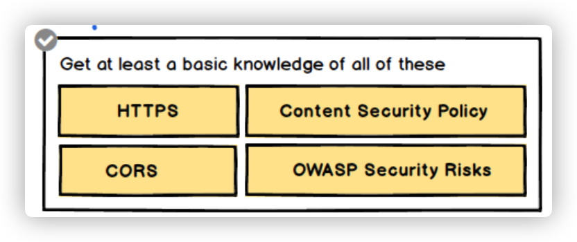

## 技术栈结构

1. 软件工程
   - 流程图
   - UML
     - [什么是统一建模语言（UML）？](https://www.visual-paradigm.com/cn/guide/uml-unified-modeling-language/what-is-uml/)
2. 工程化（工具链 + 方案化 + 定制化 = 统一标准工程化）
   - [前端工程化](./前端工程化/README.md)
   - web 前端性能优化
3. 工具链
   - typescript
     - https://github.com/type-challenges/type-challenges
     - [api-extractor](https://api-extractor.com/)
     - https://github.com/dsherret/ts-morph
4. 框架技术
   - [Vue](./Vue/README.md)
     - vue3 conf https://node.fequan.com/videodetail/1621773573110
   - React
     - [react-router-5-course](https://github.com/ReactTraining/react-router-5-course)
   - 微前端
   - 容器技术
     - Docker
   - Web
     - [浏览器工作原理及 API](./浏览器原理及API/README.md)
     - https://github.com/Troland/how-javascript-works
     - canvas
       - https://joshondesign.com/p/books/canvasdeepdive/toc.html
   - NodeJS
5. [软件设计、软件工程](./编程语言/软件设计与工程.md)
   - JavaScript 设计模式与开发实践
   - 依赖注入
     - https://github.com/mgechev/injection-js
6. 编程语言
   - [HTML&CSS](./HTML&CSS/README.md)
     - https://web.dev/learn/css/box-model/
   - [JavaScript](./JavaScript/README.md)
     - [Deep JavaScript](https://exploringjs.com/deep-js/toc.html)
   - Flutter
7. 计算机基础
   1. 计算机组成原理
   2. 操作系统
      - [重学操作系统](https://kaiwu.lagou.com/course/courseInfo.htm?courseId=478#/content)
   3. 计算机网络
      - [HTTP](./HTTP/README.md)
   4. [数据结构与算法](./数据结构与算法/README.md)
      - 极客算法训练营
        - [] 刷到期中、动态、排序、字符串
      - [leetcode 图解算法数据结构](https://leetcode-cn.com/leetbook/detail/illustration-of-algorithm/)
   5. 图形学
   6. 编译原理
      - babel
        - [ babel 插件通关秘籍](https://juejin.cn/book/6946117847848321055/section)
        - https://github.com/QuarkGluonPlasma/babel-plugin-exercize
        - https://github.com/estree/estree
## 2021 技术目标

- JavaScript 深入
- Typescript 重学
- 前端框架 Vue 深入
- Web 进阶
- 数据结构与算法
- HTTP 学习
- Node 学习与应用
- Rust 学习
- Flutter 学习
## 收集待看

- WebAssembly
  - https://github.com/WasmEdge/WasmEdge
- 微前端
  - https://github.com/bytedance/magic-portal
  - https://github.com/bytedance/magic-microservices
- 框架
  - NodeJS
    - 架构
      - https://developers.redhat.com/blog/2021/03/08/introduction-to-the-node-js-reference-architecture-part-1-overview#
    - 内存泄漏
      - https://www.arbazsiddiqui.me/a-practical-guide-to-memory-leaks-in-nodejs/
  - 浏览器
  - React
    - [手写系列-实现一个铂金段位的 React](https://mp.weixin.qq.com/s/C4pjEzYPZocRnJOaF1q0Jg)
    - [React技术揭秘](https://react.iamkasong.com)
    - [react-illustration-series](https://github.com/7kms/react-illustration-series)
    - 状态管理
      - https://github.com/umijs/hox
    - [你可能不知道的流式 React Hooks（关于组织代码的最佳实践）](https://zhuanlan.zhihu.com/p/413141904)
  - Flutter
    - [企业微信超大型工程-跨全平台UI框架最佳实践](https://mp.weixin.qq.com/s/JdQmgQ57nWQM99JW_ueFVg)
- 设计模式、架构
  - [复杂系统架构设计应对之道](https://mp.weixin.qq.com/s/u5hW529GczJNZU0RdVPgeg)
- 计算基础
  - 计算机网络
    - 趣谈网络协议
    - [Web协议详解与抓包实战](https://www.youtube.com/playlist?list=PLoZQ0sz6CBHGLlYNKB-yzDRasrAYytelS)

- 浏览器渲染原理
  - 渲染管道
    - https://docs.google.com/presentation/d/1ak7YVrJITGXxqQ7tyRbwOuXB1dsLJlfpgC4wP7lykeo/edit#slide=id.p
    - https://docs.google.com/document/d/1aitSOucL0VHZa9Z2vbRJSyAIsAz24kX8LFByQ5xQnUg/edit?pli=1#heading=h.dr7ct95ht2sw
    - https://fed.taobao.org/blog/taofed/do71ct/performance-composite/?spm=taofed.homepage.header.13.7eab5ac8Ut2aYd
    - https://docs.google.com/presentation/d/1boPxbgNrTU0ddsc144rcXayGA_WF53k96imRH8Mp34Y/edit#slide=id.g60f92a5151_40_0
  - canvas
    - https://www.html5canvastutorials.com/tutorials/html5-canvas-wrap-text-tutorial/
    - https://joshondesign.com/p/books/canvasdeepdive/toc.html
    - https://juejin.cn/post/6844903828916011022
    - https://www.kirupa.com/canvas/canvas_high_dpi_retina.htm
    - https://github.com/jondavidjohn/hidpi-canvas-polyfill
  - 资源调度
    - https://mp.weixin.qq.com/s/K24X2uNPvtbD4vZlXwJMYA
    - https://github.com/GoogleChromeLabs/preload-webpack-plugin
    - https://medium.com/reloading/preload-prefetch-and-priorities-in-chrome-776165961bbf
  - https://www.youtube.com/watch?v=kNzoswFIU9M&list=PLNYkxOF6rcICgS7eFJrGDhMBwWtdTgzpx
  - 编译
    - https://www.youtube.com/watch?v=5nmpokoRaZI
    - https://www.youtube.com/watch?v=KM9coMpy5sQ&t=499s
    - https://www.youtube.com/watch?v=p-iiEDtpy6I
    - https://zhuanlan.zhihu.com/p/28590489

  - http://nodejs.cn/learn/introduction-to-nodejs
  - cli
    - https://github.com/iwfan/chore-cli
    - https://github.com/google/zx/blob/main/index.mjs
    - https://github.com/Tencent/feflow

- 重学 typescript
  - https://www.typescriptlang.org/docs/handbook/intro.html

- 计算机导论
  - https://www.coursera.org/learn/jisuanji-biancheng/home/week/1
  - https://www.bilibili.com/video/av21376839/

- web 安全

  

- 包管理工具

- CSS 处理工具

  - scss
  - postcss

- 构建工具

  - 工作流命令工具 npm script
  - 打包工具
    - webpack
    - rollup
  - lint & prettier

- 前端框架

  - vue

- 现代化 CSS

  - BEM
  - CSS Modules
  - CSS in JS
  - Atom css

- Web component

- 测试

  - Jest

- 类型检测

  - Typescript

- 性能测试工具

  

7FC8A9
D5EEBB
5F7A61
444941