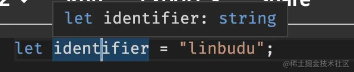
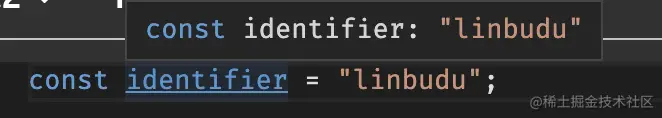
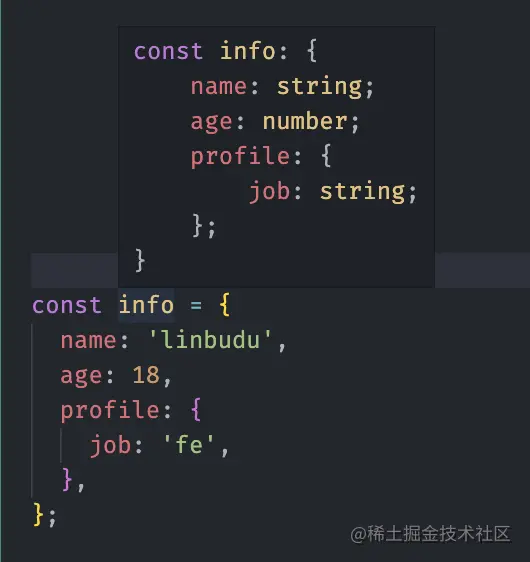
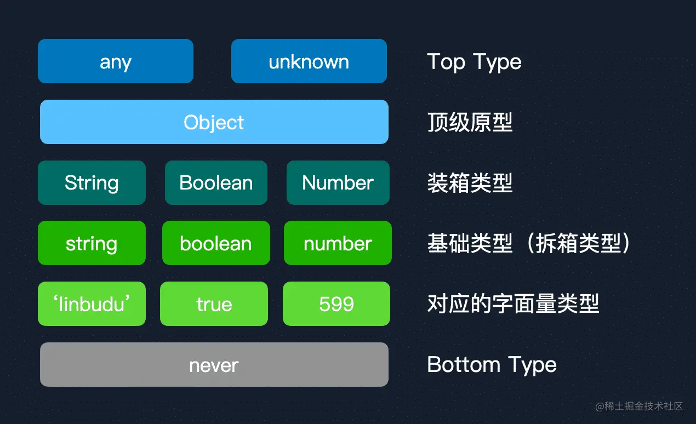
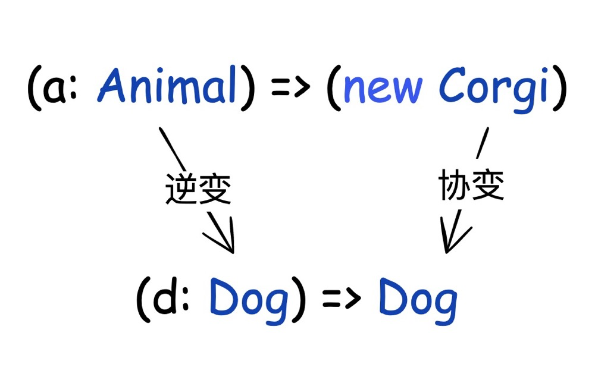

# TypeScript 类型推导及类型系统

TypeScript 中除了手动声明类型，还会自动类型推导，即基于开发者代码进行类型推导分析。类型推导：

- [变量声明推导](#letconst-的变量声明推导)
- [类型流程分析与类型守卫](#类型流程分析与类型守卫)
- 上下文类型约束
- 类型兼容判断

类型推导过程中，免不了对类型兼容判断，即将一个值是否可以赋值给另一个变量类型，这其中判断离不开 TypeScript 的类型系统设计原理：

- 类型兼容
  - [结构化类型系统]()
  - 类型层级
  - 函数的协变与逆变
  - 联合类型

类型断言：在 TypeScript 类型分析不正确或不符合预期时，将其断言为此处的正确类型。

- `variable as type`、`<type>variable`
- `as const`：推断为常量类型
- 非空断言 `!`

## let、const 的变量声明推导

- 使用 let 声明的变量是可以再次赋值的，在 TypeScript 中要求赋值类型始终与原类型一致（如果声明了的话）。因此对于 let 声明，只需要推导至这个值从属的类型即可。
- 而 const 声明的原始类型变量将不再可变，因此类型可以直接一步到位收窄到最精确的字面量类型，但对象类型变量仍可变（但同样会要求其属性值类型保持一致）。







## 类型流程分析与类型守卫

类型的控制流分析：typescript 会分析代码控制流程结构，借助类型守卫不断尝试**收窄类型**。定义类型守卫的方式有：

- typeof：通过类型判断的方式
- in：通过属性存在差异或者类型差异的方式
  - 无法对复合类型构成的联合类型的同名属性做类型守卫，同名属性类型判断必须精确到字面量
- instanceof：通过判断原型链的方式

```ts
// typeof

declare const strOrNumOrBool: string | number | boolean;

if (typeof strOrNumOrBool === "string") {
  // 一定是字符串！
  strOrNumOrBool.charAt(1);
} else if (typeof strOrNumOrBool === "number") {
  // 一定是数字！
  strOrNumOrBool.toFixed();
} else if (typeof strOrNumOrBool === "boolean") {
  // 一定是布尔值！
  strOrNumOrBool === true;
} else {
  //...
}
```

```ts
// in

interface Foo {
  foo: string;
  kind: "foo";
  fooOnly: boolean;
  shared: string;
}

interface Bar {
  bar: string;
  kind: "bar";
  barOnly: boolean;
  shared: number;
}

function handle(input: Foo | Bar) {
  // 属性存在差异
  if ("foo" in input) {
    input.fooOnly;
  } else {
    input.barOnly;
  }

  // 无法对复合类型构成的联合类型的同名属性做类型守卫
  if (typeof input.shared === "string") {
    input.fooOnly; // 报错
  }

  // 同名但不同类型的属性要精确到字面量进行区分
  if (input.kind === "foo") {
    input.fooOnly;
  } else {
    input.barOnly;
  }
}
```

```ts
// instanceof

class FooBase {}

class BarBase {}

class Foo extends FooBase {
  fooOnly() {}
}
class Bar extends BarBase {
  barOnly() {}
}

function handle(input: Foo | Bar) {
  if (input instanceof FooBase) {
    input.fooOnly();
  } else {
    input.barOnly();
  }
}
```

### 类型守卫函数

通常我们会把某些分支判断逻辑封装到一个函数里去，称为守卫函数。但在 TypeScript 类型控制流分析做不到跨函数上下文来进行类型的信息收集（但别的类型语言中可能是支持的）。

```ts
function isString(input: unknown): input is number {
  return typeof input === "string";
}

function foo(input: string | number) {
  if (isString(input)) {
    // 报错，在这里变成了 number 类型
    input.replace("linbudu", "linbudu599");
  }
  if (typeof input === "number") {
  }
  // ...
}
```

TypeScript 引入了 is 关键字来显式地提供类型信息，通过这种方式的函数叫做类型守卫：

```ts
function isString(input: unknown): input is string {
  return typeof input === "string";
}
```

- input 函数的某个参数；
- is string，即 **is 关键字 + 预期类型**，即如果这个函数成功返回为 true，那么 is 关键字前这个入参的类型就是指定类型，而且这个类型守卫调用方后续的类型控制流分析收集到

## 类型兼容判断

在 TypeScript 代码中，判断类型兼容的方式：

1. 条件类型来判断类型兼容性
   ```ts
   type Result = "linbudu" extends string ? 1 : 2;
   ```
2. 通过赋值来进行兼容性检查的方式
   ```ts
   let test: number = "123"; // 报错
   ```

理论上来说，只要具备“父子关系”的子类型才能够被父类型兼容，父子关系类型的情况有：

- 结构化类型
- 类型层级
- 函数的协变与逆变
- 联合类型：比较一个联合类型是否可被视为另一个联合类型的子集，即这个联合类型中所有成员在另一个联合类型中都能找到

### 结构化类型

TypeScript 的**对象类型是基于结构化类型系统**：TypeScript 比较两个类型并非基于类型及名显示继承的方式进行兼容性判断的类型系统（标称类型系统），而是比较这两个类型上实际拥有的属性与方法。TypeScript 遵循面向对象编程中的里氏替换原则，只要子类型结构包含兼容父类型结构即可：

```ts
class Cat {
  eat(): boolean {
    return true
  }
}

class Dog {
  eat(): boolean {
    return 599;
  }
}

function feedCat(cat: Cat) { }

feedCat(new Dog())


type test = {key: }
```

#### 在 TypeScript 中模拟标称类型系统

> 类型的重要意义之一是限制了数据的可用操作与实际意义

这一点在标称类型系统中的体现要更加明显。在下面例子中，结构化类型系统会把 USD 与 CNY （分别代表美元单位与人民币单位）被认为是两个完全一致的类型，因此在 addCNY 函数中类型不起到限制，可以传入 USD 类型的变量。

```ts
type USD = number;
type CNY = number;

const CNYCount: CNY = 200;
const USDCount: USD = 200;

function addCNY(source: CNY, input: CNY) {
  return source + input;
}

addCNY(CNYCount, USDCount);
```

在结构化类型系统中，如何像标称类型系统，类型名称起到实际意义呢？**只要通过类型附带的额外信息来实现即可**。

1. 交叉类型的方式来实现信息的附加（基于类型层面）

   ```ts
   declare const tag: unique symbol;

   declare type Tagged<Token> = {
     readonly [tag]: Token;
   };

   export type Opaque<Type, Token = unknown> = Type & Tagged<Token>;
   ```

   > 虽然对象类型和原始数据类型的交集，按集合逻辑应该是空集，但在 ts 中最终表现为 装箱 后与对象类型的属性并集。这实际上完全是为了另一个目的：nominal，即使得“类型别名”(type)具有唯一性（或者叫 tag）

2. class 方式：可通过非公开（即 private / protected ）的额外属性实现了类型信息的附加。基于 class 即可做到类型检查，还能在运行时检查。

   ```ts
   class CNY {
     private __tag!: void;
     constructor(public value: number) {}
   }
   class USD {
     private __tag!: void;
     constructor(public value: number) {}
   }

   const CNYCount = new CNY(100);
   const USDCount = new USD(100);

   function addCNY(source: CNY, input: CNY) {
     return source.value + input.value;
   }

   addCNY(CNYCount, CNYCount);
   // 报错了！
   addCNY(CNYCount, USDCount);
   ```

### 类型层级

类型层级实际上反映的是 TypeScript 类型系统中所有类型的兼容关系。

类型层级模型：



1. 任意类型都可以赋值给 Top Type
2. Object：包含了下层所有的类型（TypeScript 继承 JavaScript 设计：Object 是原型链顶端）
3. 字面量类型 < 对应的原始类型 < 对应的装箱类型 < Object
4. never 表示一个“虚无”的类型，一个根本不存在的类型，处于最底层，是任何类型的子类型
   1. never 表示永远不存在的类型，比如函数总抛出异常或者死循环、两个不存在交集的类型强行进行交集运算，这些都不会产生值产生类型
   2. never 类型仅能被赋值给另外一个 never 类型
5. 表示一个对象类型有三种：Object vs {} vs object，而且这三种关系比较特别
   - object：object 的引入就是为了解决对 Object 类型的错误使用，它代表所有非原始类型的类型，即数组、对象与函数类型这些对象类型
     ```ts
     type t = String extends object ? true : false; // true
     type t1 = string extends String ? true : false; // true
     type t2 = string extends object ? true : false; // false
     ```
     系统设定下，Object、object 都是表示对象类型，故这里比较特殊，形成了你中有我、我中有你的神奇现象。
     ```ts
     type Result17 = object extends Object ? 1 : 2; // 1
     type Result20 = Object extends object ? 1 : 2; // 1
     ```
   - `{}`：类似 Object，但又可以看作是一个对象字面量
     ```ts
     type Result16 = {} extends object ? 1 : 2; // 1
     type Result18 = object extends {} ? 1 : 2; // 1
     type Result19 = Object extends {} ? 1 : 2; // 1
     type Result21 = {} extends Object ? 1 : 2; // 1
     ```
     这里的 `{} extends` 和 `extends {}` 实际上是两种完全不同的比较方式。`{} extends object` 和 `{} extends Object` 意味着， `{}` 是 object 和 Object 的字面量类型，是从类型信息的层面出发的，即字面量类型在基础类型之上提供了更详细的类型信息。`object extends {}` 和 `Object extends {}` 则是从结构化类型系统的比较出发的，即 `{}` 作为一个一无所有的空对象，几乎可以被视作是所有类型的基类，万物的起源

类型层级下的心智模型：

1. 子类型可赋值给父类型，即向上转换（upcast）：TypeScript 遵循 Liskov 替换原则，向上转换是安全的，因此编译器可以让您隐式执行它，无需提出任何问题。

   ```ts
   let t: number = 123;
   let a: any = t;
   ```

   实际上类型断言的工作原理也和类型层级有关，在判断断言是否成立，即差异是否能接受时，实际上是向上转型看否能够找到一个相同的父类型。

   ```ts
   (t as string) = "123"(
     // Type 'number' is not assignable to type 'string'.

     // 利用类型层级，先向上断言，再向下断言
     t as unknown as string
   ) = "123";
   ```

   当然 TypeScript 也有不允许隐式向上转换的情况：**赋值时不允许字面量对象隐式向上转换**

   ```ts
   type UserWithEmail = { name: string; email: string };
   type UserWithoutEmail = { name: string };

   type A = UserWithEmail extends UserWithoutEmail ? true : false; // true
   // 但是下面情况却不被允许
   let userB: UserWithoutEmail = { name: "foo", email: "foo@gmail.com" };

   let userB2: UserWithoutEmail = {
     name: "foo",
     email: "foo@gmail.com",
   } as UserWithEmail;
   ```

2. 父类型不可以赋值给子类型，即向下转换（downcast），但在 Typescirpt 还是存在一些特例情况：

   any 类型可赋值给任意子类型，any 类型的存在是为了作为 Typescript 逃到 JavaScript 世界的后门

   ```ts
   let any: any;

   let num: number = any;
   ```

   实践的时候更多推荐使用 unknown，毕竟可以将任意类型的值赋值给 unknown，但 unknown 类型的值只能赋值给 unknown 或 any

### 函数的协变与逆变

如何比较函数类型？在上面提到的类型层级上的类型比较好像少了函数类型，因为函数类型的比较只在函数与函数之间才有意义。如果放到类型层级，你可以把函数当作一个对象类型，在 JavaScript 中函数本质上是一个对象，况且 TypeScript 是在 JavaScript 之上进行的类型扩展。

对于函数类型比较，实际上我们要比较的即是参数类型与返回值类型。在 Typescript 配置中 `strictFunctionTypes` 默认开启的情况下，函数参数类型必须是**逆变**，返回类型则是**协变**，否则采用双变。

- 逆变：接受`supertype`但不接受`subtype`
- 协变：接受`subtype`但不接受`supertype`
- 双变：同时接受`subtype`和`supertype`

```ts
class Animal {
  doAnimalThing(): void {
    console.log("I am a Animal!");
  }
}

class Dog extends Animal {
  doDogThing(): void {
    console.log("I am a Dog!");
  }
}

class Corgi extends Dog {
  doCorgiThing(): void {
    console.log("I am a Corgi!");
  }
}

const t: (d: Dog) => Dog = (a: Animal) => new Corgi();
```



实践推荐：使用 TypeScript 的 strictFunctionTypes 选项。并且它只对函数属性的正确类型检查。

```ts
//  method 声明，接受双变
interface T1 {
  func(arg: string): number;
}

// property 声明，参数逆变、返回值协变
interface T2 {
  func: (arg: string) => number;
}
```

```ts
interface T {
  func(d: Dog): Dog;
}

interface TT {
  func: (d: Dog) => Dog;
}

const tt: T = {
  func: (a: Corgi) => new Corgi(), // 双变
};

const ttt: TT = {
  func: (a: Corgi) => new Corgi(), // 报错，只接受参数逆变
};
```

## 学习参考

- [TypeScript 全面进阶指南](https://juejin.cn/book/7086408430491172901)
- [The Type Hierarchy Tree](https://www.zhenghao.io/posts/type-hierarchy-tree#the-bottom-of-the-tree)
- [How I understand Covariance & Contravariance in typescript](https://dev.to/codeoz/how-i-understand-covariance-contravariance-in-typescript-2766)
