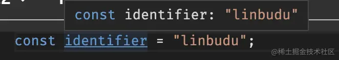

# TypeScript

- TypeScript
  - 类型系统
    - 数据类型
      - 原始类型
        - null vs undefined vs void
          - 在 JavaScript 中，null 与 undefined 分别表示“这里有值，但是个空值”和“这里没有值”，而在 TypeScript 中，null 与 undefined 类型都是有具体意义的类型
          - void：表示一个空类型，常用于表示一个没有返回操作或者没有显式返回一个值的函数的返回值
      - 复合类型
        - 数组
          - 只读数组
            - `ReadonlyArray`
            - `let arr: readonly any[] = [1, 2, 3];`
          - 元组（Tuple）
            - 具名元组 `const arr7: [name: string, age: number, male: boolean] = ['linbudu', 599, true];`
        - 对象
          - 属性修饰符
            - readonly
            - 可选属性 `?`
            - 索引签名
              - 索引签名类型也可以和具体的键值对类型声明并存，但这时这些具体的键值类型也需要符合索引签名类型的声明
          - Object vs {} vs object
            - Object：包含了所有的类型（承接 JS Object 设计）
              原型链的顶端是 Object 以及 Function，这也就意味着所有的原始类型与对象类型最终都指向 Object，在 TypeScript 中就表现为 Object 包含了所有的类型，例如  
              `type t = '123' extends Object ? true : false // true`
            - {}：类似 Object，但表示一个空对象结构，意味着无法访问其属性
            - object：object 的引入就是为了解决对 Object 类型的错误使用，它代表所有非原始类型的类型，即数组、对象与函数类型这些
          - Interface：声明描述对象的结构，也可以声明函数对象结构
          - Class
            - 成员修饰符：`public / private / protected / readonly / override`
              - override：确保派生类尝试覆盖的方法一定在基类中存在定义
            - 抽象类 abstract vs Interface
              - 都是描述类的结构，Interface 还能描述函数结构
              - Interface 编译后就不存在，而 abstract 则会存在
          - 属性继承 extends
          - 实践推荐
            - 使用 interface、class 去表示描述具体对象
            - 对于“模糊”对象，不要使用 Object 以及类似的装箱类型、{}，使用 object 去表示对象类型。更推荐进一步区分，也就是使用 `Record<string, unknown>` 表示对象，`unknown[]`表示数组，`(...args: unknown[]) => unknown` 表示函数
        - [枚举](#枚举)
          - 特征
            - 枚举和对象的重要差异在于，对象是单向映射的，枚举是双向映射的，即你可以从枚举成员映射到枚举值，也可以从枚举值映射到枚举成员
            - 字符串枚举成员只会进行单次映射
          - 枚举 vs 常量枚举
            - 枚举是可双向映射使用，常量枚举只能单向映射使用
            - 枚举会被编译时会编译成一个对象，可以被当作对象使用
            - const 枚举会在 ts 编译期间被删除，对应使用的位置直接内联替换成值
          - 实践推荐
            - 字面量类型与联合类型 vs 枚举/常量枚举的使用区别
              - 数字枚举得使用“枚举/常量枚举”方式
              - 字符串枚举两者皆可
      - 字面量类型：无论是原始类型还是对象类型的字面量类型，它们的本质都是类型而不是值，它们在编译时同样会被擦除
        - 对象字面量：对象字面量类型就是一个结构化对象类型，并且这个对象的值全都为字面量值
        - 模板字面量
        - 字符串字面量
        - 数字字面量
        - 布尔字面量
      - 函数类型
        - [函数类型声明](#函数类型声明)
        - 函数重载：将入参类型和返回值类型的可能情况进行关联，获得了更精确的类型标注能力
          - 按照重载的声明顺序往下查找的
          - 实现签名必须兼容重载签名
      - 内置特殊类型
        - any、unkown 区别
          - any 表示任意类型，可以将其他类型赋值给 any 或者将 any 赋值给其他类型，相当于 typescript 逃生门，会跳过类型检查
          - unkown 表示未知类型，可以将任意类型的值赋值给 unknown，但 unknown 类型的值只能赋值给 unknown 或 any，并且使用 unknown，TypeScript 会强制类型检测，你必须使用**类型缩小、类型断言**手段去确定类型
        - never、void 区别
          - never 表示永远不会发生值的类型，比如函数抛出异常、死循环、
          - never 类型的变量能够赋值给另一个 never 类型变量
    - 类型断言：在 TypeScript 类型分析不正确或不符合预期时，将其断言为此处的正确类型
      - `variable as type`、`<type>variable`
      - `as const` 推断为常量类型
      - 非空断言 `!`
    - [类型推导](#类型推导)
      - [let、const 的类型推导](#letconst-的类型推导)
      - [类型流程分析与类型守卫](#类型流程分析与类型守卫)
        - 类型收窄
        - 类型拓展
      - 类型兼容判断
        - 结构化类型
        - [类型层级](#类型层级)
        - 联合类型
    - 类型编程
      - 类型别名（变量声明）
      - 类型操作
        - 联合类型 `|`
        - 交叉类型 `&`
        - 索引类型 `keyof`
        - 索引类型访问 `type[expression]`：通过索引类型映射到值类型
        - 映射类型：映射类型(`in`)建立在索引签名的语法之上，基于键名映射到键值类型
          ```ts
          type Stringify<T> = {
            [K in keyof T]: string;
          };
          ```
        - 类型查询 `typeof`
        - 条件类型
          - 检查类型兼容性
          - 泛型约束
      - [泛型](#泛型)
        - 泛型约束与默认值
        - 应用
          - 类型工具
          - 泛型函数
          - 泛型对象
      - 内置类型工具
        - Partial
        - Pick
  - 编译器
    - tsc
      - `--init`
      - `--watch`
    - tsconfig.json
      - `strictNullChecks`：没有开启情况下，null 与 undefined 会被视作其他类型的子类型
      - [`rootDir` + `outDir`：控制输出的目录结构生成](https://www.typescriptlang.org/zh/tsconfig#rootDir)
      - `noImplicitAny: true`：防止隐式地推导类型为 any
  - 工程实践
    - [Monorepo & Project References](#monorepo--project-references)
    - 类型增强
      - 类型声明文件(d.ts)
      - 类型声明库 [DefinitelyTyped](https://github.com/DefinitelyTyped/DefinitelyTyped)
    - [Monorepo & Project References](#monorepo--project-references)
    - VSCode 集成
      - 内置 TypeScript Language Service
      - VS Code 中指定项目 ts 版本
        ```js
        {
          "typescript.tsdk": "node_modules/typescript/lib"
        }
        ```
    - JS + JSDoc + DTS
      - [typescript & jsdoc](https://www.typescriptlang.org/docs/handbook/jsdoc-supported-types.html)
    - 配置复用(extends)
      > 配置文件中的相对路径都是相对于它们的源配置文件，故相对路径配置选项时必须在子配置文件中，不能进行继承
    - 模块声明解析
      - 第三方模块
      - 自定义模块
    - 声明文件生成
  - 学习资料
    - [深入理解 TypeScript](https://jkchao.github.io/typescript-book-chinese/#why)
    - [TypeScript 全面进阶指南](https://juejin.cn/book/7086408430491172901)
  - VSCode 插件
    - [TypeScript Importer](https://marketplace.visualstudio.com/items?itemName=pmneo.tsimporter)
    - [JavaScript and TypeScript Nightly](https://marketplace.visualstudio.com/items?itemName=ms-vscode.vscode-typescript-next)

## 枚举

```ts
// 如果你没有声明枚举的值，它会默认使用数字枚举，并且从 0 开始，以 1 递增
enum Items {
  Foo, // 0
  Bar, // 1
  Baz, // 2
}

// 编译结果
("use strict");
var Items;
(function (Items) {
  Items[(Items["Foo"] = 0)] = "Foo";
  Items["Bar"] = "BarValue";
  Items["Baz"] = "BazValue";
})(Items || (Items = {}));

enum Items {
  Foo, // 0
  Bar = 599, // 下一项从当前数值开始递增
  Baz, // 600
  Tea = "fefe", // 遇到非数字项，下一项得初始化
  Taa = 44, // 必须初始化
  Tee, // 45
}

// 编译结果
var Items;
(function (Items) {
  Items[(Items["Foo"] = 0)] = "Foo";
  Items[(Items["Bar"] = 599)] = "Bar";
  Items[(Items["Baz"] = 600)] = "Baz";
  Items["Tea"] = "fefe"; // 字符串枚举成员仍然只会进行单次映射
  Items[(Items["Taa"] = 44)] = "Taa";
  Items[(Items["Tee"] = 45)] = "Tee";
})(Items || (Items = {}));

// 常量枚举
const enum Items {
  Foo,
  Bar,
  Baz,
}
// 只能通过枚举成员访问枚举值（而不能通过值访问成员）
const fooValue = Items.Foo; // 编译时是直接内联替换为枚举的值
```

## 函数类型声明

```ts
function foo(name: string): number {
  return name.length;
}

const foo = function (name: string): number {
  return name.length;
};

const foo = (name: string): number => {
  return name.length;
};

type FuncFoo = (name: string) => number;

const foo: FuncFoo = (name) => {
  return name.length;
};

// JS 函数类型本质上也是一个结构固定的类型
interface FuncFooStruct {
  (name: string): number;
}

// 可选参数
function foo(name: string, age?: number): number {}

// 剩余参数
function foo1(arg1: string, ...rest: [number, boolean]) {}

// 函数重载
function func(foo: number, bar: true): string;
function func(foo: number, bar?: false): number;
// 实现签名必须兼容重载签名
function func(foo: number, bar?: boolean): string | number {
  if (bar) {
    return String(foo);
  } else {
    return foo * 599;
  }
}

// 构造器函数
interface FooStruct {
  new (): Foo;
}
```

## 类型推导

### let、const 的类型推导

- 使用 let 声明的变量是可以再次赋值的，在 TypeScript 中要求赋值类型始终与原类型一致（如果声明了的话）。因此对于 let 声明，只需要推导至这个值从属的类型即可。
- 而 const 声明的原始类型变量将不再可变，因此类型可以直接一步到位收窄到最精确的字面量类型，但对象类型变量仍可变（但同样会要求其属性值类型保持一致）。





### 类型流程分析与类型守卫

类型的控制流分析：typescript 会分析代码控制流程结构，不断尝试收窄类型。类型收窄的方式有：

- typeof：通过类型判断的方式
- in：通过属性存在差异或者类型差异（同类型差异要精确到字面量）的方式
- instanceof：通过判断原型链的方式

```ts
declare const strOrNumOrBool: string | number | boolean;

if (typeof strOrNumOrBool === "string") {
  // 一定是字符串！
  strOrNumOrBool.charAt(1);
} else if (typeof strOrNumOrBool === "number") {
  // 一定是数字！
  strOrNumOrBool.toFixed();
} else if (typeof strOrNumOrBool === "boolean") {
  // 一定是布尔值！
  strOrNumOrBool === true;
} else {
  //...
}
```

```ts
interface Foo {
  foo: string;
  kind: "foo";
  fooOnly: boolean;
  shared: number;
}

interface Bar {
  bar: string;
  kind: "bar";
  barOnly: boolean;
  shared: number;
}

function handle(input: Foo | Bar) {
  // 属性存在差异
  if ("foo" in input) {
    input.fooOnly;
  } else {
    input.barOnly;
  }

  // 类型差异要精确到字面量
  if (input.kind === "foo") {
    input.fooOnly;
  } else {
    input.barOnly;
  }
}
```

```ts
class FooBase {}

class BarBase {}

class Foo extends FooBase {
  fooOnly() {}
}
class Bar extends BarBase {
  barOnly() {}
}

function handle(input: Foo | Bar) {
  if (input instanceof FooBase) {
    input.fooOnly();
  } else {
    input.barOnly();
  }
}
```

#### 类型守卫

通常我们会把某些分支判断逻辑封装到一个函数里去，称为守卫函数。但在 TypeScript 类型控制流分析做不到跨函数上下文来进行类型的信息收集（但别的类型语言中可能是支持的）。

```ts
function isString(input: unknown): input is number {
  return typeof input === "string";
}

function foo(input: string | number) {
  if (isString(input)) {
    // 报错，在这里变成了 number 类型
    input.replace("linbudu", "linbudu599");
  }
  if (typeof input === "number") {
  }
  // ...
}
```

TypeScript 引入了 is 关键字来显式地提供类型信息，通过这种方式的函数叫做类型守卫：

```ts
function isString(input: unknown): input is string {
  return typeof input === "string";
}
```

- input 函数的某个参数；
- is string，即 **is 关键字 + 预期类型**，即如果这个函数成功返回为 true，那么 is 关键字前这个入参的类型就是指定类型，而且这个类型守卫调用方后续的类型控制流分析收集到


### 类型兼容判断

在 TypeScript 代码中，判断类型兼容的方式：

1. 条件类型来判断类型兼容性
   ```ts
   type Result = "linbudu" extends string ? 1 : 2;
   ```
2. 通过赋值来进行兼容性检查的方式
   ```ts
   let test: number = '123' // 报错
   ```

理论上来说，只有具备“父子关系”的子类型才能被父类型兼容，父子关系类型的情况有：

- 对象结构化类型
- 类型层级
- 联合类型

#### 对象结构化类型

TypeScript 的**对象类型是基于结构化类型系统**：TypeScript 比较两个类型并非通过类型的名称，而是比较这两个类型上实际拥有的属性与方法，面向对象编程中的里氏替换原则，只要子类型结构包含兼容父类型结构即可。

```ts
class Cat {
  eat() { }
}

class Dog {
  eat() { }
}

function feedCat(cat: Cat) { }

feedCat(new Dog())
```

> 判断对象类型是否兼容除了**基于类型结构进行兼容性判断的结构化类型系统**以外，还有**一种基于类型名显示继承进行兼容性判断的类型系统，标称类型系统**，`class Foo extends Bar`。

#### 类型层级

类型层级实际上反映的是 TypeScript 类型系统的父子类型关系，。

类型层级模型


```ts
```

在此下的心智模型：

1. 子类型可赋值给父类型，即向上转换（upcast）：根据 Liskov 替换原则，向上转换是安全的，因此编译器可以让您隐式执行它，无需提出任何问题。

   ```ts
   let t: number = 123;
   let a: any = t;
   ```

   实际上类型断言的工作原理也和类型层级有关，在判断断言是否成立，即差异是否能接受时，实际上判断的即是这两个类型是否能够找到一个最近公共的父类型。

   ```ts
   (t as string) = "123"(
     // Type 'number' is not assignable to type 'string'.

     // 利用类型层级，先向上断言，再向下断言
     t as unknown as string
   ) = "123";
   ```

   当然 TypeScript 也有不允许隐式向上转换的情况：赋值时不允许字面量对象隐式向上转换

   ```ts
   type UserWithEmail = { name: string; email: string };
   type UserWithoutEmail = { name: string };

   type A = UserWithEmail extends UserWithoutEmail ? true : false; // true
   // 但是下面情况却不被允许
   let userB: UserWithoutEmail = { name: "foo", email: "foo@gmail.com" };

   let userB2: UserWithoutEmail = {
     name: "foo",
     email: "foo@gmail.com",
   } as UserWithEmail;
   ```

2. 父类型不可以赋值给子类型，即向下转换（downcast），但在 Typescirpt 还是存在一些特例情况：

   any 类型可赋值给任意子类型，any 类型的存在是为了作为 Typescript 逃到 JavaScript 世界的后门

   ```ts
   let any: any;

   let num: number = any;
   ```

   实践的时候更多推荐使用 unknown，毕竟可以将任意类型的值赋值给 unknown，但 unknown 类型的值只能赋值给 unknown 或 any

## 类型编程

### 泛型

- 泛型
  - 类型工具：带有泛型的类型别名相当于带参的函数
  - 泛型函数
    - 泛型会在函数调用时自动地得填充为对应的参数类型
  - 对象类型中的泛型：泛型类和泛型接口

```ts
// 默认值
type Factory<T = boolean> = T | number | string;
//约束
type ResStatus<ResCode extends number> = ResCode extends 10000 | 10001 | 10002
  ? "success"
  : "failure";
// 无需显式传入泛型参数也能默认调用
type ResStatus<ResCode extends number = 1000> = ResCode extends
  | 10000
  | 10001
  | 10002
  ? "success"
  : "failure";

// 多泛型参数
type Conditional<Type, Condition, TruthyResult, FalsyResult> =
  Type extends Condition ? TruthyResult : FalsyResult;
// 泛型参数联动
type ProcessInput<
  Input,
  SecondInput extends Input = Input,
  ThirdInput extends Input = SecondInput
> = number;

// 接口泛型
interface IRes<TData = unknown> {
  code: number;
  error?: string;
  data: TData;
}

// 泛型函数
function handle<T>(input: T): T {}
const handle = <T>(input: T): T => {};
```

## Monorepo & Project References

> 官方文档 [Project References](https://www.typescriptlang.org/docs/handbook/project-references.html)

Project References 可以把一个 typescirpt 大项目拆分，分开构建。引入 references 后：

1. 可通过 `tsc --build` 自动、顺序、增量构建 reference project 及目标项目
2. 编译时不会加入 reference project 的代码，只会加载其声明文件

在 monorepo 项目结构中根项目 tsconfig.json 中通过 `references` 引入其他项目，即可在根工作路径下享受 `tsc -b` 一个命令启动相关项目编译，无需编写多个 `tsc -p` 命令编排。

root tsconfig.json

```json
{
    "references": [
        {
            "path": "./tsconfig.esm.json"
            "prepend": true
        },
        {
            "path": "./tsconfig.cjs.json"
        }
    ],
    "files": []
}
```

> ⚠️ 必须添加 `"files": []` 不然会造成重复编译

reference project tsconfig.json

```json
{
  "compilerOptions": {
    "composite": true, // 必须开启
    "declaration": true, // 必须开启
    "declarationDir": "types",
    "outDir": "lib",
    "rootDir": "src/node"
  },
  "include": ["src/node"]
}
```

1. **composite，必须开启**
2. declaration 自动默认为 true。
3. **必须 include 或者 files 指定包含编译文件**。如果违反了这一约束，tsc 将告诉你哪些文件没有被指定。
4. 如果没有明确指定 rootDir，则默认为包含 tsconfig.json 文件的目录。

可以参考笔者这个[项目](https://github.com/laoergege/laoergege-blog/tree/master/packages/vuepress-plugin-vssue-next-compat)配置。

## 学习参考

- [TypeScript 全面进阶指南](https://juejin.cn/book/7086408430491172901)
- [The Type Hierarchy Tree](https://www.zhenghao.io/posts/type-hierarchy-tree#the-bottom-of-the-tree)

never what how

TypeScript 创建 never 了一个空类型（又名不可居住的类型）：一种我们在运行时无法获得实际值的类型，我们也不能对该类型做任何事情，例如访问其实例上的属性。典型的用例 never 是当我们想从一个永远不会返回的函数中输入一个返回值。

一个函数可能不会返回有几个原因：它可能会在所有代码路径上抛出异常，它可能会永远循环，因为它有我们想要连续运行的代码，直到整个系统关闭，比如事件循环。所有这些场景都是有效的。

any 类型的万能性也导致我们经常滥用它，比如类型不兼容了就 any 一下，类型不想写了也 any 一下，不确定可能会是啥类型还是 any 一下

产生 never 类型的另一种方法是使两种不兼容的类型相交 - 例如{x: number} & {x: string}.
