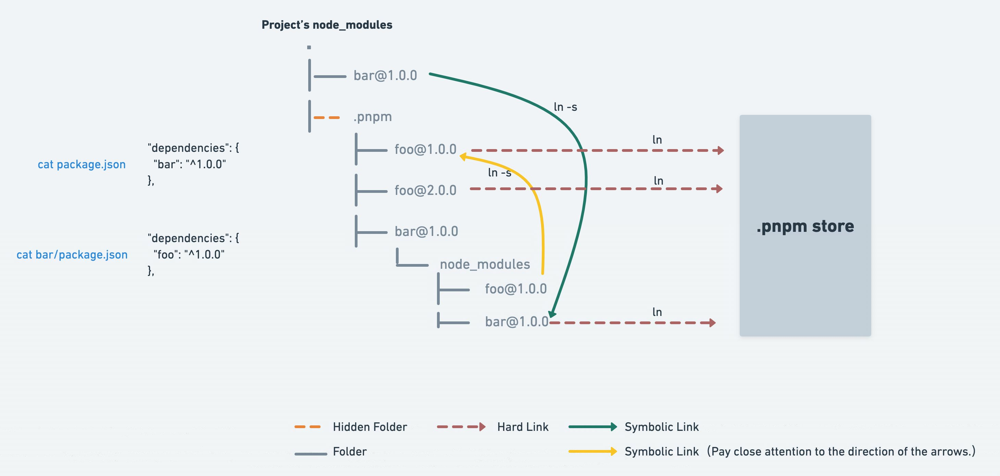
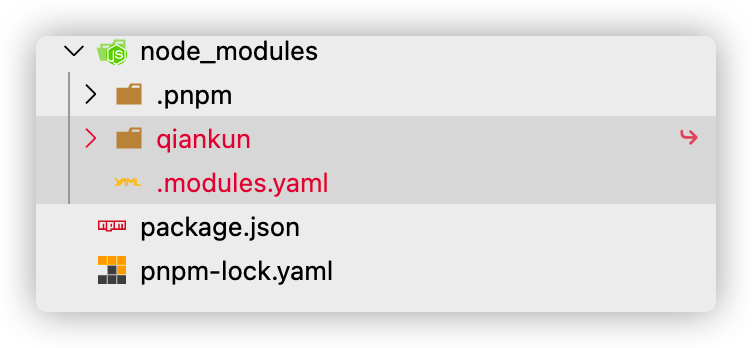
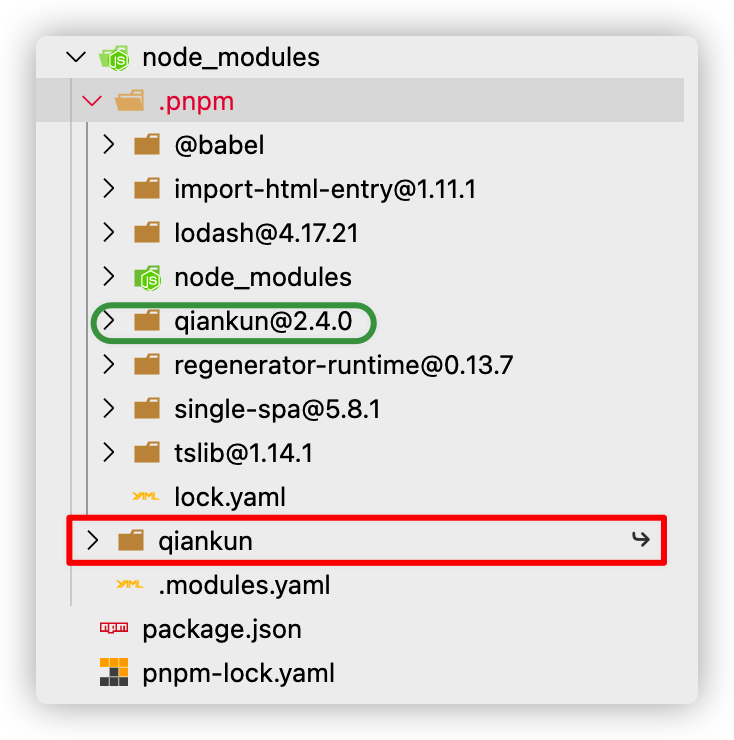
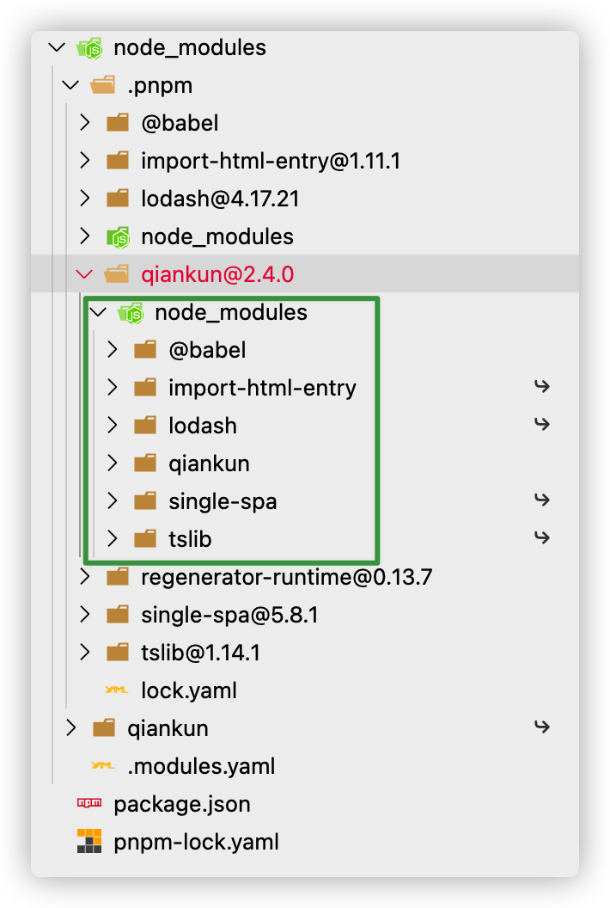
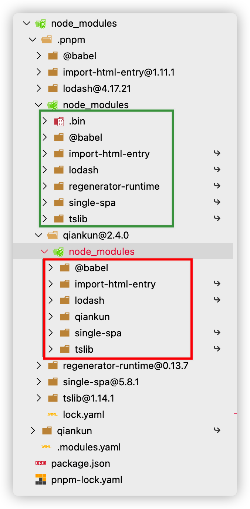

# pnpm

> pnpm 的两大核心卖点：很好的解决了 npm 的依赖安装速度、安全问题以及

- pnpm
  - 依赖管理
    - [依赖安装机制](#依赖安装机制)
  - 存储机制
    - store
    - 基于内容寻址
    - hardlink
  - [Monorepo](#monorepo)
    - [pnpm + turborepo + changeset](#pnpm--turborepo--changeset)
  - NPM 发包
    - [Publish 工作流](#发布工作流)
  - npm scripts

## 依赖管理

### 依赖安装机制

- 对比 yarn/npm
  - npm@3 之前： `嵌套结构`
    - 过度嵌套
    - 依赖重复、占用空间
  - yarn/npm@3 之后：`扁平化结构`
    > 本质上是**依赖提升**带来的问题
    - 依赖结构的**不确定性**，依据声明顺序
      - lock 文件虽在一定程度维持依赖结构，但随着包升级还是可能带来结构破坏
    - 扁平化算法本身的**复杂性**很高，耗时较长
    - 幽灵依赖：项目中仍然可以**非法访问**没有声明过依赖的包，因为 `Node Module Resolution` 机制
    - [npm 分身](https://rushjs.io/zh-cn/pages/advanced/npm_doppelgangers/)：依赖重复安装、打包，破坏单例安装
- pnpm
  - 依赖结构：`平铺结构 + 符号链接` 
    - 所有的包都平铺在 `.pnpm` 内，并通过**符号链接**依赖关系
    - 所有的包通过硬链接到 store 内部真实文件位置
  - [半严格模式](#半严格模式)

下边例子，我们用 pnpm 创建一个项目并且 `pnpm install qiankun` 来观察：

1. 项目 node_modules 只存在 package 上声明的依赖，既消除项目“幽灵依赖”的问题，又使得 node_modules 结构清晰明了



2. qiankun 只是个**软链接**，解析模块时，Node 会解析符号链接，寻找符号链接原本的位置，即 `.pnpm/qiankun@2.4.0/node_modules/qiankun`

> `.pnpm/`会以平铺的形式储存着所有的包，每个包都可以在这种命名模式的文件夹中被找到：`.pnpm/<name>@<version>/node_modules/<name>`
>
> 与 npm3+ 以及 yarn 处理同包不同版本的是：`<name>@<version>` 的命名模式保证了包之间的相互隔离



3. pnpm 会将包本身和依赖同样平铺在同一个 node_module 下



这样的好处：

- 兼容 Node Module Resolution 机制
- 避免了循环符号链接造成[文件循环嵌套显示的问题](https://github.com/pnpm/pnpm/discussions/4207)

4. 除了 qiankun 是**硬链接**到全局真实存储的文件，其他依赖项都是继续**符号链接**到 .pnpm 下的包

#### 半严格模式

如果仔细发现上面的案例，`node_modules/.pnpm` 路径下竟然会有 `node_modules` 文件，这样虽然我们自己的代码是被严格限制了，但第三方依赖包还是可以根据 Node Module Resolution 机制偷偷访问到其他包！



默认情况下，pnpm v5 创建一个“半严格” 的 node_modules。默认配置如下所示：

```yaml
; 提升所有包到 node_modules/.pnpm/node_modules
hoist-pattern[]=*

; 提升所有名称包含types的包至根，以便Typescript能找到
public-hoist-pattern[]=*types*

; 提升所有ESLint相关的包至根
public-hoist-pattern[]=*eslint*
```

可通过 `hoist=false` 来禁止包提升，更多配置详情参考[《pnpm 的 node_modules 配置选项》](https://pnpm.io/zh/blog/2020/10/17/node-modules-configuration-options-with-pnpm)。

总的来说，**无论是我们还是第三方包的代码都要严格的代码访问，pnpm 的 hoist 主要是为了兼容滥用 node 特性的包**。

## Monorepo

Monorepo 的设计及需求要点总结：

- 项目管理
  - *引用约束：对项目间的引用、约束进行管理*
- 依赖管理
  - 工程依赖
  - 项目依赖
    - 本地 link 模式
    - 线上版本模式
- 任务管理
  - 编排
    - 拓扑：根据项目依赖关系，构建一个有向无环图（DAG）进行拓扑排序并执行过程
    - 过滤
    - 并行
    - 增量
      - How to Check Change?
        - 文件监听
        - 产物 Hash
      - 缓存
        - 本地缓存
        - 分布式缓存
  - 监听模式
- 发包
  - 版本管理 version
    - 版本语义 semver
    - 发版模式（monorepo 模式特有）
      - independent
      - fixed
  - 发版日志 changelog
  - 包的发布 publish
- 流行组合方案
  - pnpm（依赖管理 + 任务管理） + changeset（发包）
  - pnpm（依赖管理）+ [rush](https://github.com/microsoft/rushstack)（任务管理 + 发包）
  - pnpm（依赖管理）+ Turborepo（任务管理） + changeset（发包）

## pnpm + turborepo + changeset

- 项目创建
- 依赖关联
  - pnpm：默认情况下，如果可用的 packages 与已声明的可用范围相匹配，pnpm 将从工作区链接这些 packages
- 任务管理
  - 拓扑
    - `turbo:depends`
      - 依赖上游包的任务
      - 依赖自身包的任务
      - 手动指定依赖任务

### pnpm-workspace

### turborepo 任务编排之 pipeline

`turbo run <task>`

```yaml
packages:
  - "plugins"
  - "packages/*"
  - "."
```

```json
{
  "$schema": "https://turborepo.org/schema.json",
  "baseBranch": "origin/main",
  "pipeline": {
    "build": {
      "inputs": ["src/**/*.ts"],
      "outputs": ["lib/**/*"],
      "dependsOn": ["^build"]
    }
  }
}
```

### changeset

- changeset init：初始化
- changeset
- changeset version
- changeset publish

## 发包

pnpm 在默认情况下，如果可用的 packages 与已声明的可用范围相匹配，pnpm 将从 workspace 链接这些 packages，并在 package.json 以 `workspace:` 协议声明；而当发包的时候将动态标准化依赖为 `workspace:` 协议：

```json
{
  "dependencies": {
    "foo": "workspace:*",
    "bar": "workspace:~",
    "qar": "workspace:^",
    "zoo": "workspace:^1.5.0"
  }
}
```

将会被转化为：

```json
{
  "dependencies": {
    "foo": "1.5.0",
    "bar": "~1.5.0",
    "qar": "^1.5.0",
    "zoo": "^1.5.0"
  }
}
```

### Publish 工作流

> 以下基于 [github package npm 注册源](https://docs.github.com/cn/packages/working-with-a-github-packages-registry/working-with-the-npm-registry)为例

1. 确认 package 相关信息（[package.json 常见字段](#packagejson-常见字段)）
2. Pack
3. Versions
4. Changelog
5. Register & Oauth

   - 注册源配置
     - .npmrc：`@laoergege:registry=https://npm.pkg.github.com/`
     - package.json#publishConfig：
       ```json
       "publishConfig": {
         "registry":"https://npm.pkg.github.com"
       }
       ```
   - 身份认证

     - 个人访问令牌
       - .npmrc：`//npm.pkg.github.com/:_authToken=TOKEN`
     - 命令行

       ```shell
       $ npm login --scope=@OWNER --registry=https://npm.pkg.github.com

       > Username: USERNAME
       > Password: TOKEN
       > Email: PUBLIC-EMAIL-ADDRESS
       ```

6. `pnpm publish`

## 附录

### package.json 常见字段

> package.json 文档链接
>
> - [npm](https://docs.npmjs.com/cli/v8/configuring-npm/package-json)
> - [pnpm](https://pnpm.io/zh/package_json)

- package.json
  - 项目描述
    - name
    - version
    - description
    - keywords
    - homepage
    - license
    - people fields: author, contributors
    - files
    - repository
  - 开发声明
    - type
    - main
    - module
    - types
    - bin
    - scripts
    - 依赖
      - dependencies
      - devDependencies
      - peerDependencies
    - overrides：用于开发覆盖包做测试
    - workspaces
  - 发包配置
    - publishConfig
    - private
  - 环境声明
    - engines

## 学习参考

- [pnpm](https://pnpm.io/zh/)
- [平铺的结构不是 node_modules 的唯一实现方式](https://pnpm.io/zh/blog/2020/05/27/flat-node-modules-is-not-the-only-way)
- [关于现代包管理器的深度思考——为什么现在我更推荐 pnpm 而不是 npm/yarn?](https://mp.weixin.qq.com/s/1Wm-iYFBgJXMg_7SgWktXA)
- [Monorepo 的过去、现在、和未来](https://mp.weixin.qq.com/s/U8_30S9B0S_SU3jdgUxFGQ)
