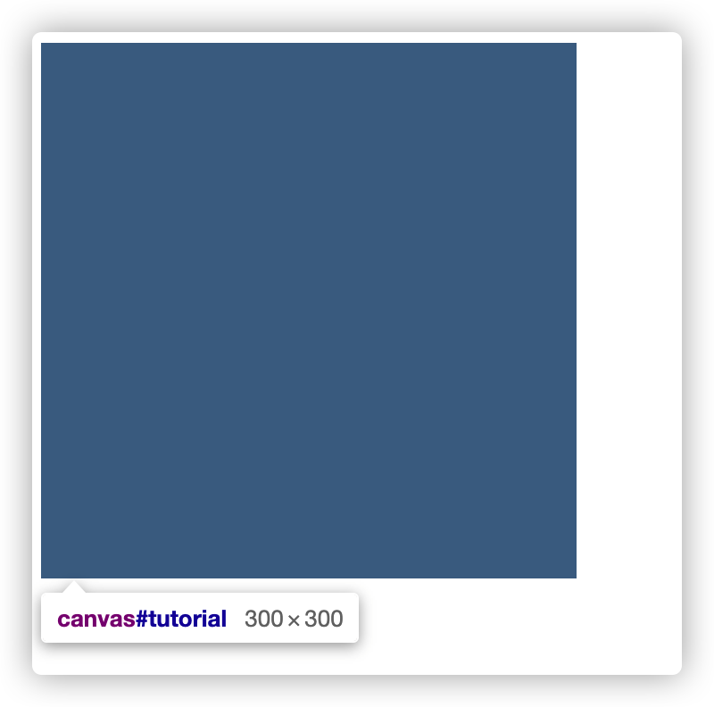

# Canvas

Canvas API 提供了一个通过JavaScript 和 HTML的 `<canvas>` 元素来绘制图形的方式，相比较浏览器 HTML 的声明式渲染页面方式，Canvas 更像似更接近底层，在系统图形绘制指令上封装的一套绘制指令系统。

Canvas API 支持

- [CanvasRenderingContext2D](https://developer.mozilla.org/zh-CN/docs/Web/API/CanvasRenderingContext2D) 接口的2D渲染
- [WebGL2RenderingContext](https://developer.mozilla.org/zh-CN/docs/Web/API/WebGL2RenderingContext) 接口的硬件加速的 2D、3D 渲染

> 本文主要以 CanvasRenderingContext2D 渲染为主

- canvas
  - 基础
    - 画布及坐标系
      - 画布跟坐标系初始重叠
    - 绘制指令
      - 状态
        - save 和 restore
        - 色彩
        - 透明
        - 线条
      - 图形
        - [路径](#路径)
        - 文本
        - 图像
      - 坐标系变换
        - 没有 transform-origin
    - 二次贝塞尔曲线及三次贝塞尔曲线
  - 进阶
    - 事件交互
      - 凸包算法
      - isPointInPath + 包围盒
    - 动画
    - 优化
      - Path2D 缓存或记录绘画指令
  - 常见问题
    - Canvas 高清适配
    - Canvas 跨域

## 画布及坐标系

```html
<script type="text/javascript">
    function draw() {
        var canvas = document.getElementById('tutorial');
        if (canvas.getContext) {
            var ctx = canvas.getContext('2d');

            ctx.fillColor = 'yellow'
            ctx.fillRect(0, 0, 150, 150)
        }
    }
</script>
<style>
    canvas {
        width: 300px;
        height: 300px;
    }
</style>

<body>
    <canvas id="tutorial" width="150" height="150">请升级最新浏览器<canvas>
</body>
```

Canvas **元素及画布**的默认大小为一致，且为 300像素×150像素（宽×高，像素的单位是px），可通过 css 样式去改变 canvas 元素在页面布局的大小，画布内容会自适应元素大小



上面案例中，我们画布大小为 150 *150，元素大小 300* 300，最后图像自适应填充了整个元素大小

> 注意：如果CSS的尺寸与初始画布的比例不一致，它会出现扭曲

### 坐标系

在画布中所有元素的位置都是在按照以左上角位置为原点（0，0），y 轴向下的坐标系中


## 路径

Canvas 只提供矩形绘制的 API（fillRect、strokeRect），其他复杂的图形需要我们自己绘制路径形成。

**路径是有一条或多条直线、曲线形成；而图形都是通过一条或者多条路径闭合形成的**

创建图形的步骤如下：

### 描绘路径

CanvasRenderingContext2D 提供了一些[描绘路径方法列表](https://developer.mozilla.org/zh-CN/docs/Web/API/CanvasRenderingContext2D#%E8%B7%AF%E5%BE%84)，其中：

- beginPath 声明开始创建路径
  
  路径是由很多子路径构成，这些子路径都是在一个**列表**中，所有的子路径（线、弧形、等等）构成图形。而每次这个方法调用之后，列表清空重置，然后我们就可以重新绘制新的图形。

- moveTo 确定路径起点
- lineTo 直线连接坐标
- closePath 闭合路径
  
  closePath 会通过绘制一条从当前点到开始点的直线来闭合图形。以 fill 填充方式绘制路径，会自动闭合。

还有其他生成路径的，如线型 lineTo、贝赛尔曲线型 bezierCurveTo、圆型 arcTo 等，请参考[文档](https://developer.mozilla.org/zh-CN/docs/Web/API/CanvasRenderingContext2D#%E8%B7%AF%E5%BE%84)。

### 绘制路径

描绘完路径后，就需要把路径绘制到屏幕上，主要有两种方式 stroke 描边和 fill 填充的方式将路径绘制到画布中。

## 绘制图像

### 裁剪、合成

## 动画

## Canvas 高清适配
