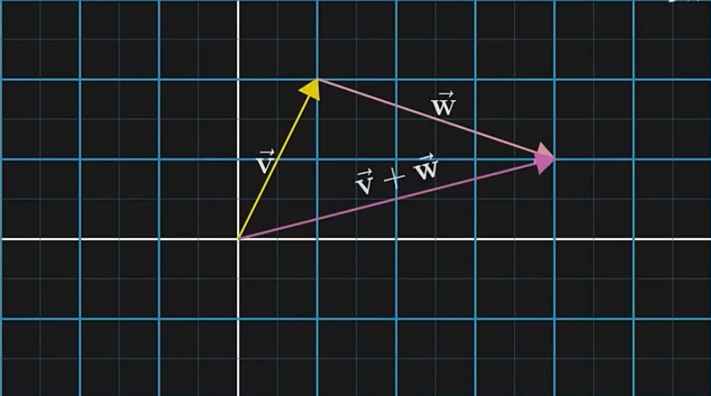

# 可视化

- 可视化
  - 视觉
    - **理论基础**
      - 数学
        - 描述几何信息
          - 几何图形维度划分：点、线、面、体
          - **直角**坐标系
            - 坐标换算（矩阵运算）
            - 坐标系变换、对称
          - 向量来描述点和线段（原点 (0,0) 到坐标 (x,y) 的一根线段）
          - 勾股定理
      - 图形学
    - 图形系统（Web）
      - HTML 和 CSS
      - SVG
        - https://developer.mozilla.org/zh-CN/docs/Web/SVG/Tutorial
        - viewBox
          - https://www.zhangxinxu.com/wordpress/2014/08/svg-viewport-viewbox-preserveaspectratio/
      - Canvas2D
        - https://github.com/jhildenbiddle/canvas-size
        - 局部图形、分层
      - WebGL
    - 图形库
      - [SpriteJS](https://spritejs.org/#/)
      - ThreeJS
      - [pixijs](https://pixijs.com/)
    - 工具
    - 数据驱动框架
      - [D3.js](https://d3js.org/)
  - 数据
    - 设计语言
    - 数据建模
    - 数据分析
  - 性能优化
  - 数据可视化（数据驱动）

  

## SVG vs Canvas

1. SVG 作为一种浏览器支持的图像格式，既可以作为 HTML 内嵌元素使用，也可以作为图像通过 img 元素加载，或者绘制到 Canvas 内
2. SVG 声明式写法
3. SVG 通过 DOM 渲染方式，图形交互比 Canvas 方便
4. SVG 的图形元素会非常多，这会导致 DOM 渲染成为性能瓶颈
5. SVG 生成某些图形，然后用 Canvas 来渲染。这样，我们就既可以享受 SVG 的便利性，又可以享受 Canvas 的高性能了

## 向量和向量空间

方向、大小（长度）
一组有序的特征（数字）列表

向量运算
- 加法
- 乘法

向量加法
向量加法的定义差不多是线性代数中唯一允许向量离开原点的情况
  
 
  

基向量

缩放向量相加