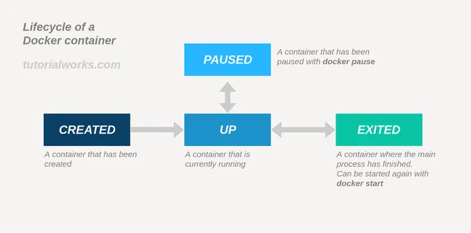
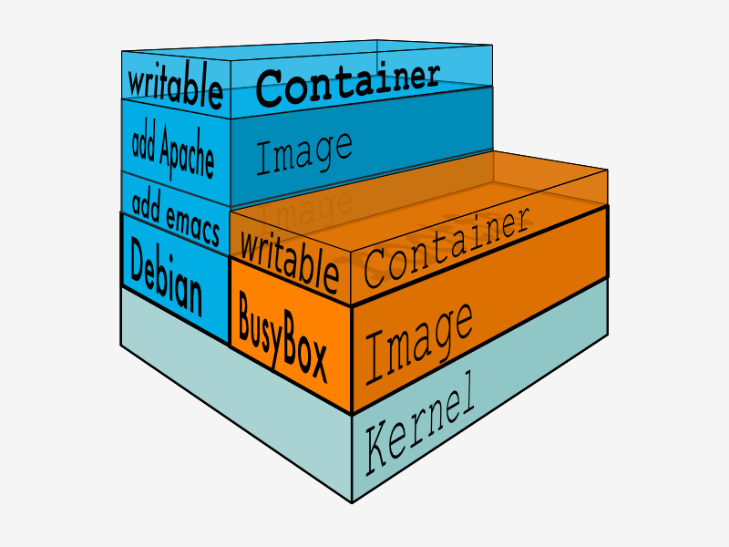

# 容器技术

- 容器
  - 核心
    - 技术原理：namespace、cgroup、chroot
    - [术语介绍](https://developers.redhat.com/blog/2018/02/22/container-terminology-practical-introduction#)
    - 容器技术 = 镜像 + 镜像仓库 + 容器 + 容器运行时
    - 容器标准：[OCI（开放容器倡议）](https://opencontainers.org/)
    - [容器镜像机制](#容器镜像机制)
    - 容器生命周期   
  - 工具
    - Podman：pod 和容器镜像管理器
      - pod
      - daemon-less：不依赖于守护进程，而是将容器和 Pod 作为子进程启动
    - [Buildah：镜像构建器](https://buildah.io/)
  - CLI
    - 镜像管理
      - `pull`
      - `images`
        - `-a`：为了加速镜像构建、重复利用资源，Docker 会利用中间层镜像，-a 显示包括中间层镜像在内的所有镜像
      - `rmi`：删除镜像
      - `tag`：镜像命名 `<name>:<tag>`
      - `inspect`：查看容器/镜像详细信息
      - `image history`：查看镜像分层
    - 镜像制作
      - 命令模式
        - `build`
          - `build -t xxx:tag <构建上下文>`
            - 构建上下文：上下文路径/URL
            - .dockerignore：忽略构建上下文中的文件
        - `commit`：将运行中的容器做成镜像
          - https://yeasy.gitbook.io/docker_practice/image/commit
      - Dockerfile
      - [Containerfile](https://www.mankier.com/5/Containerfile#Introduction)
    - 容器运行：[容器启动运行模式](./%E5%AE%B9%E5%99%A8%E5%90%AF%E5%8A%A8%E8%BF%90%E8%A1%8C%E6%A8%A1%E5%BC%8F.md)
      - `--name`：容器命名
      - `--rm`：
    - 容器交互
      - `exec`：在容器内执行命令
      - `attach`：将我们控制台的 stdin、stdout、stderr 连接到容器里正在运行的进程
      - `cp`：数据拷贝
        - eg: `podman cp a.txt 062:/tmp`
        - 如果源路径是宿主机那么就是把文件拷贝进容器，如果源路径是容器那么就是把文件拷贝出容器，注意需要用**容器名或者容器 ID **来指明是哪个容器的路径。
      - 挂载
        - `run -v`
        - `run --mount`
      - 网络互通
        - `run --network`
          - `none`
          - `host`：直接使用宿主机网络
          - `bridge`（默认）：容器和宿主机再通过虚拟网卡接入网桥进行通信
      - `run -p <主机端口>:<容器端口>`：端口映射
    - 容器管理
      - `top`
      - `kill`
      - `ps`
      - `stop`
      - `rm`
    - 容器编排
      - Kubernetes
  - 资料
    - [Podman 基础知识：面向初学者和专家的资源](https://developers.redhat.com/articles/2022/05/02/podman-basics-resources-beginners-and-experts#)

## 容器镜像机制

容器镜像的一个最主要的特征：分层。

容器镜像内部并不是一个平坦的结构，而是由许多的镜像层组成的，每层都是只读不可修改的一组文件，相同的层可以在镜像之间共享，然后多个层像搭积木一样堆叠起来，再使用一种叫“Union FS 联合文件系统”的技术把它们合并在一起，就形成了容器最终看到的文件系统。

  

而**容器其实就是在静态镜像的基础上加个可写层**。

## 容器学习路径

容器技术是后端应用领域的一项重大创新，它彻底变革了应用的开发、交付与部署方式，是“云原生”的根本

从本质上来说，容器属于虚拟化技术的一种，和虚拟机（Virtual Machine）很类似，都能够分拆系统资源，隔离应用进程，但容器更加轻量级，运行效率更高，比虚拟机更适合云计算的需求。

容器是一种隔离（命名空间）且受约束（通过 cgroups、capabilities、seccomp）的进程。