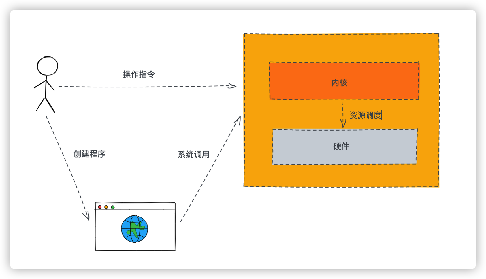
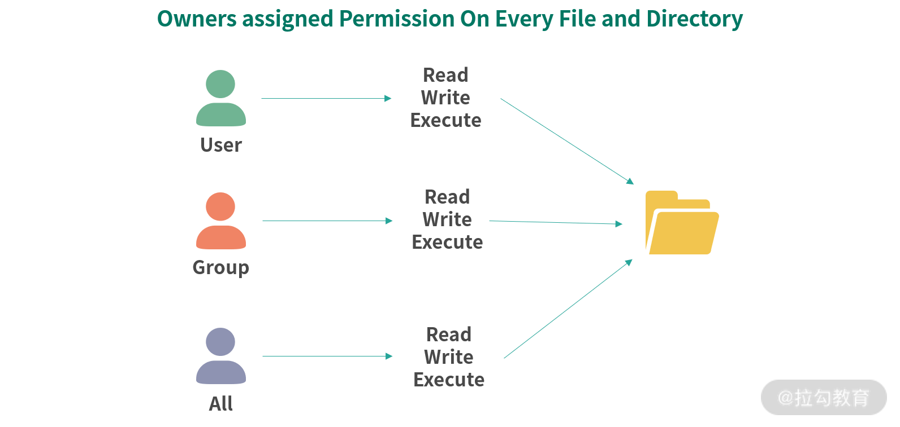

Linux 是一个多用户平台，允许多个用户同时登录系统工作

用户分类：

- root
- 普通用户
- 用户组
- 所有用户

指令：

- `useradd`: 创建用户，`sudo useradd foo`
- `groups`： 查看当前用户的分组
- `id`: 查看当前用户的分组及id


Linux 对用户、文件、系统调用等都进行了完善的抽象，让系统安全、稳定且用户、程序之间相互制约、相互隔离

内核是操作系统连接硬件，提供操作硬件、磁盘、内存分页、进程等最核心的能力，并拥有直接操作全部内存的权限，因此内核不能把自己的全部能力都提供给用户，而且也不能允许用户通过shell指令进行系统调用。Linux 下内核把部分进程需要的系统调用以 C 语言 API 的形式提供出来。部分系统调用会有权限检查，比如说设置系统时间的系统调用。



权限架构思想

1. 最小权限原则

2. 权限职责划分

3. 分级分层保护：外层调用内层，需要多层检验保护


一个完整的权限管理体系，要有合理得将系统资源抽象，包括对用户、进程、文件、内存、系统调用等抽象：

- 文件

  - 权限划分

    - 读权限（r）：控制读取文件。

    - 写权限（w）：控制写入文件。

    - 执行权限（x）：控制将文件执行，比如脚本、应用程序等。

      第一个符号为文件类型，-代表普通文件、d代表目录、p代表管道等

      Linux 中文件的权限可以用 9 个字符，3 组rwx描述：第一组是用户权限，第二组是组权限，第三组是所有用户的权限

      `ls -l` 命令可查看

      

      

  - 文件初始权限

    谁创建谁拥有，每个用户创建一个同名分组，被创建文件所属的分组是当时用户所在的工作分组

  - 修改文件权限

    ```shell
    # 使用符号修改：
    # 设置foo可以执行
    chmod +x ./foo
    # 不允许foo执行
    chmod -x ./foo
    # 也可以同时设置多个权限
    chmod +rwx ./foo
    
    # 使用二进制或者十进制：
    # 设置rwxrwxrwx (111111111 -> 777)
    chmod 777 ./foo
    # 设置rw-rw-rw-(110110110 -> 666)
    chmod 666 ./foo
    ```
  
  - 修改文件所属用户
  
    ```shell
    # 修改foo文件所属的用户为bar
    chown bar ./foo
    
    # 修改foo的分组位g，用户为u
    chown g.u ./foo
    ```
  
  - 执行文件
  
    当一个文件被分配执行权限，用户输入一个文件名，如果没有指定完整路径，Linux 就会在一部分目录中查找这个文件，可以通过echo $PATH看到 Linux 会在哪些目录中查找可执行文件


