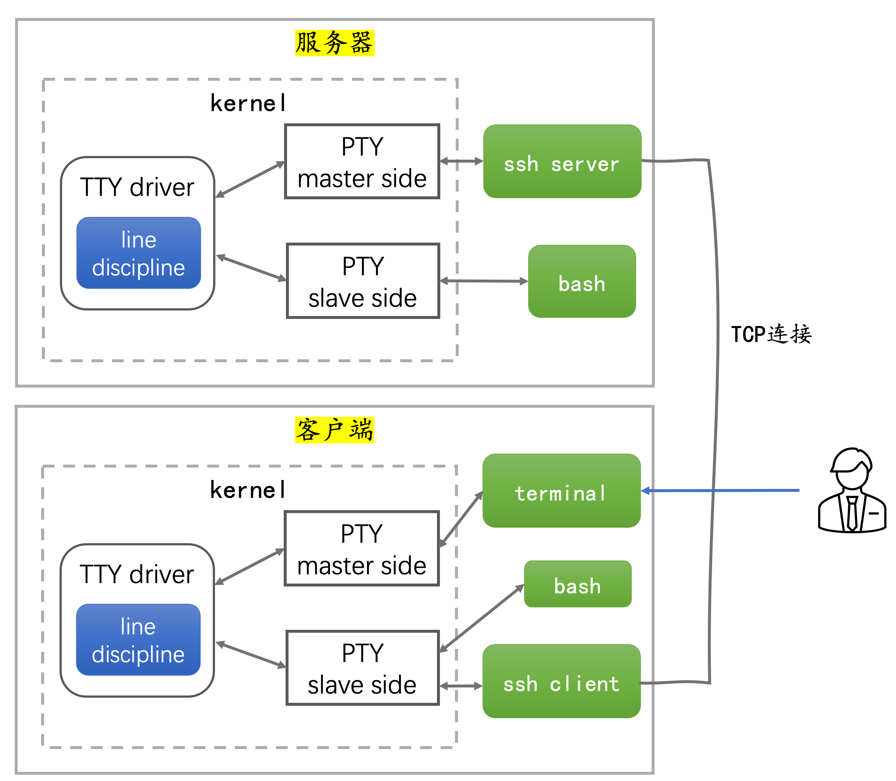

# TTY

> 推荐阅读
>
> - [Linux 终端(TTY)](https://mp.weixin.qq.com/s/QgYoGRC0VyalT5rKnmE2Ww)
> - [理解 Linux 终端、终端模拟器和伪终端](https://xie.infoq.cn/article/a6153354865c225bdce5bd55e)
> - [The TTY demystified](http://www.linusakesson.net/programming/tty/)

TL;DR：

1. 终端是一个附加在计算机上的输入输出设备；而过去 TTY (电传打字机 teletype 的缩写) 则是计算机一个文本输入输出的终端设备；
2. 随着硬件终端逐渐演化成了软件的概念，出现了软件仿真终端，称为终端模拟器。如今 TTY 是计算机系统一个文本输入输出的虚拟终端的概念，运行在内核态的 TTY 都由一个特殊的设备文件 `/dev/tty[n]` 所表示，与这个虚拟终端的交互，是通过对这个设备文件的读写操作，以及使用 ioctl 系统调用操作这个设备文件进行的。通过执行 tty 命令可以查看代表当前虚拟终端的设备文件：
   ```shell
   $ tty
   /dev/tty3
   ```
3. 而 gnome-terminal 这类运行用户态的仿终端软件被称为伪终端 PTY（pseudo TTY），PTY 是通过打开特殊的设备文件 /dev/ptmx 创建，由一对双向的字符设备构成，称为 PTY master 和 PTY slave
4. 比如启动 gnome-terminal 终端程序，一般会：
   - 先分配一个伪终端
   - 让 gnome-terminal 持有 PTY master 的文件描述符 `/dev/ptmx`
   - fork 一个 shell 子进程，并让 shell 持有 PTY slave 的设备文件 `/dev/pts/[n]`
   - PTY master 和 PTY slave 之间通过 TTY 驱动会话交流
   - 输入的命令由 shell 子进程执行
   -   
5. TTY 驱动包含的 line discipline 是一个逻辑组件。line discipline 主要有以下功能：
   - 缓存字符，回车发送
   - 拦截处理一些特殊的功能键，发送进程信号，如当用户按 `CTRL+c` 时，它向连接到 PTY slave 的进程发送 `kill -2（SIGINT）` 信号
6. 可通过 `stty` 查看设置 TTY 的特征和 line discipline 规则


## 远程终端

> TODO: 实现一个远程终端玩具
>   
