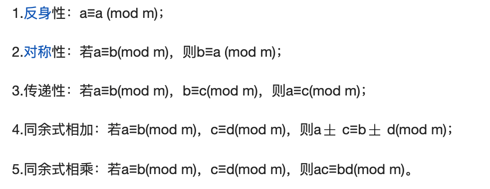

- 数学与应用
  - 余数
    - 同余定理：两个整数a和b，如果他们除以正整数m得到的余数相等，我们可以说a和b对于模m同余。
    - 应用：
      - 同余定理其实是用来分类的。
      - 将无限数固定在一定范围，比如散列函数将任意长度的输入，通过哈希算法，压缩为某一固定长度的输出；加密算法。
    - 同余性质
        
  - 数学分析
  - 概率论
  - 线性代数