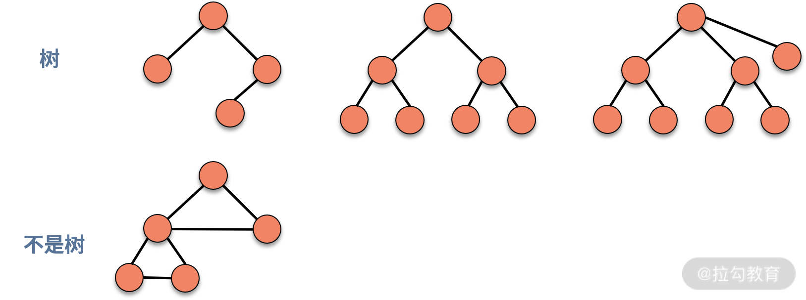
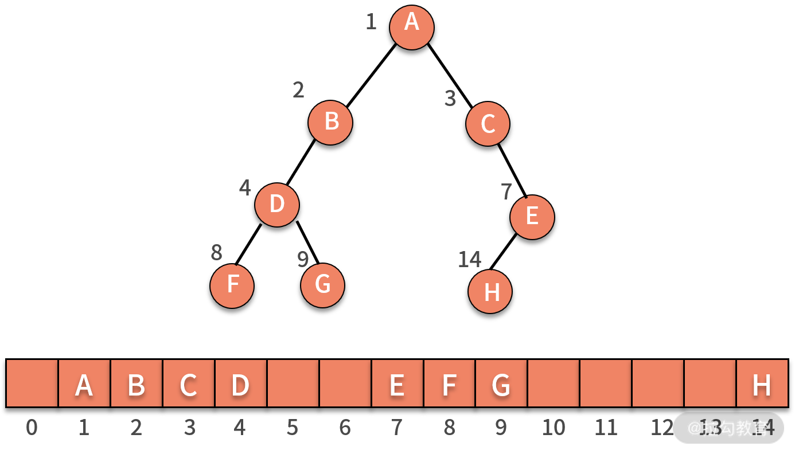
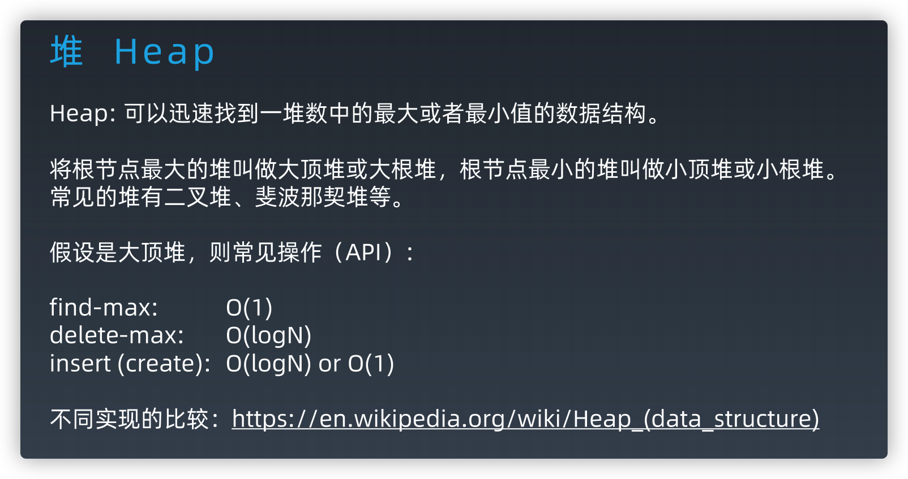

## 树

树是由结点和边组成的，自顶而下，不存在环的一种数据结构。

  

特性：根、子节点、深度（树中结点的最大层次数，就是这棵树的树深）


### 树的遍历

- 前序遍历
- 中序遍历
- 后序遍历
- 层序遍历

这里的序指的是父结点的遍历顺序，前序就是先遍历父结点，中序就是中间遍历父结点，后序就是最后遍历父结点。

```js
function traverse(TreeNode root) {
    // 前序遍历代码位置
    traverse(root.left);
    // 中序遍历代码位置
    traverse(root.right);
    // 后序遍历代码位置
}
```

层序遍历

```js
let queue = [root]
while (queue.length) {
    //...
}
```

### 二叉树、满二叉树、完全二叉树（重点）、二叉搜索树（重点）

#### 二叉树

每个结点最多有两个子结点，分别称作左子结点和右子结点。

#### 满二叉树

只有最后一层无任何子结点，其他所有层上的所有结点都有两个子结点的二叉树。

#### 完全二叉树

除了最后一层以外，其他层的结点个数都达到最大，并且最后一层的叶子结点都靠左排列。

  

完全二叉树的由来，主要是跟“非完全二叉树”的树结构以及对应的存储结构做对比

  

完全二叉树上节点对应的索引刚好可以完全落应在数组上。

为了方便计算，i 从 1 开始。结构特点：

- 索引为i的左孩子的索引是 2i
- 索引为i的左孩子的索引是 2i+1
- 索引为i的父结点的索引是 Math.floor(i/2)

#### 非完全二叉树

非完全二叉树，树的中间结构上是不完全的，导致在数组上存储是有浪费的。

  

#### 二叉搜索树

- 左子树中的每个结点的值都小于父结点
- 右子树中的每个结点的值都大于父结点
- 对二叉查找树进行中序遍历，就可以输出一个从小到大的有序数据队列
- 查找操作，普通二叉树复杂度 O(n)，二叉查找树则是 O(logn)

## 堆




​		堆(heap)，又称为优先队列(priority queue)。尽管名为优先队列，但堆并不是队列。在队列中，我们可以进行的操作是向队列中添加元素和按照元素进入队列的选后顺序取出元素。而在堆中，我们不是按照元素进入队列的先后顺序，而是按照元素的优先级取出元素，大顶堆的优先级越往上。

二叉堆

**堆只是一个抽象概念，具体有不同的实现方式，一般只考察学习二叉堆的实现**

1. 因为完全二叉树的结构很是整齐，且极少有人类能玩转指针，我们的堆通过数组来实现。当使用数组实现时，堆的节点之间有如下关系（假设根节点的索引为0）：


根节点为 0 时的节点关系很容易依此推出。

1. 树中任意结点的优先级 >= 子结点


操作都是 log n	 

			 		 		 	

