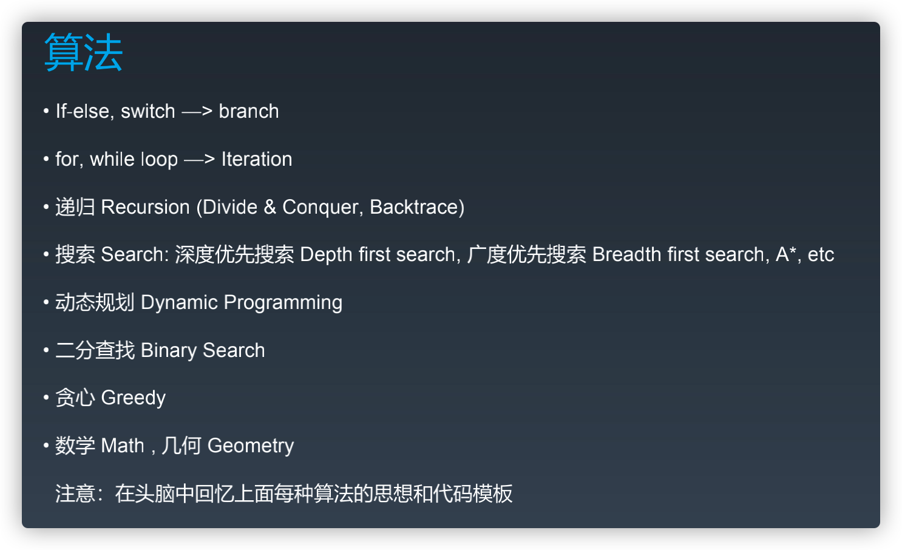

# 数据结构与算法

- 数据结构与算法
  - 复杂度
  - 数据结构
    - 一维
      - 基础
        - array 数组
        - linked list 链表
      - 高级
        - stack 栈
        - queue 队列、双端队列
        - set 集合
        - map 映射
    - 二维
      - tree 树
        - binary search tree 二叉搜索树
        - heap 堆
      - graph 图
  - 算法
    - [排序算法](./排序算法.md)
    - 二分查找
    - 动态规划


- 算法

  


## 二分查找

前提

- 单调性（递增、递减)
- 存在上下边界
- 索引查找（最好是数组索引，操作起来方便）

数据单调性是**二分查找从中间位置往左往右的判断依据**，但不一定，有些题目，如果能根据条件得到判断条件还是可以使用二分法
[搜索旋转排序数组](https://leetcode-cn.com/problems/search-in-rotated-sorted-array/)

代码模板

```txt
left, right = 0, len(array) - 1
while left <= right # 可能没有等于，不需要 if array[mid] == target 时就不要等于
  mid = (left + right) / 2
  if array[mid] == target:
    # break or return 
  # 大于等于、加一减一的边界，如果数据已经判断使用过了就不需要等于
  elif array[mid] < target:
    left = mid + 1
  else 
    right = mid - 1
```
