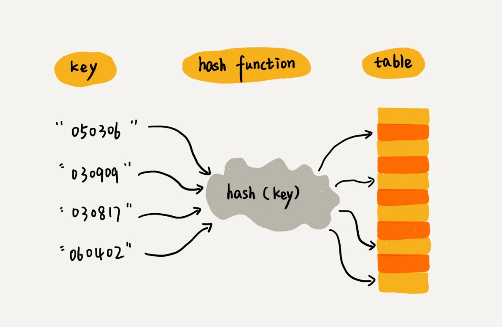
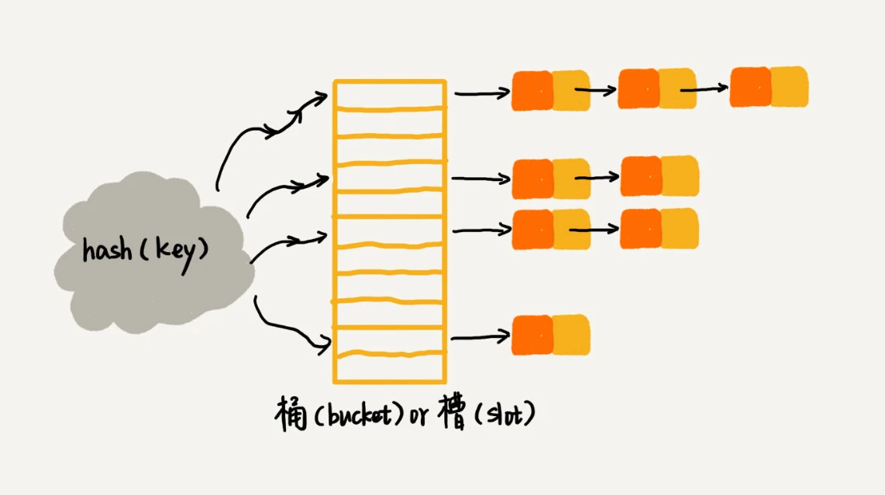
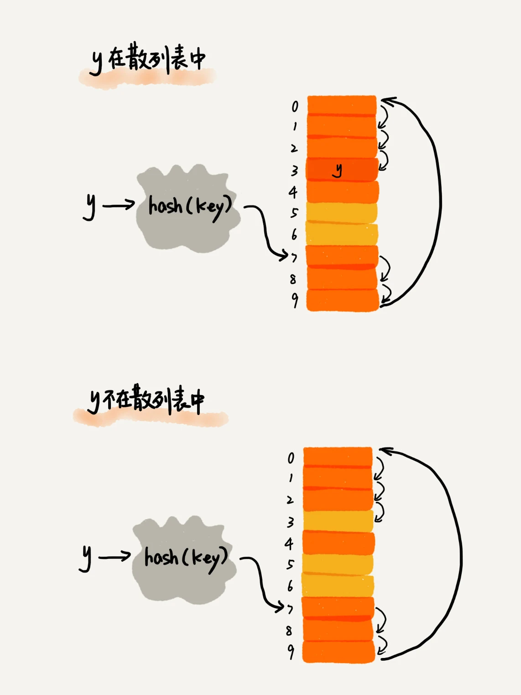
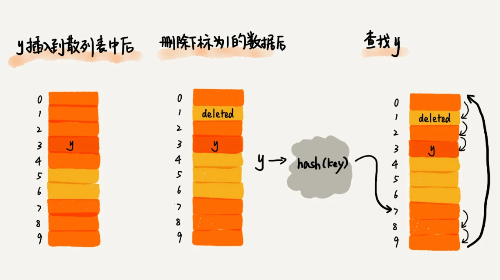

---
tags:
 - 数据结构
 - 算法
---

# 数据结构与算法

- 数据结构与算法
  - 复杂度
    - 时间复杂度
    - 空间复杂度
  - 数据结构
    - [数组、链表](./底层存储结构：数组、链表.md)
    - [树和二叉树、二叉堆](./树和二叉树、二叉堆.md)
      - 堆是一种特殊的基于树的数据结构，主要有二叉堆
    - 栈、队列、优先队列
      - 栈：先进后出
      - 队列：先进先出
        - 循环队列
      - 优先队列：实现资源**排队等待**以及**优先关系**
        - 优先队列可以使用数组、链表、堆数据结构或二叉搜索树来实现
    - 散列表：散列表用的是数组支持按照下标随机访问数据的特性，所以散列表其实就是数组的一种扩展
        
      - 散列冲突/哈希碰撞
        - 开放寻址法：发生散列冲突，我们就重新探测一个空闲位置，将其插入（不管采用哪种探测方法，当散列表中空闲位置不多的时候，散列冲突的概率就会大大提高）
          - [线性探测](#线性探测)
          - 二次探测
          - 双重散列
        - 链表法
            
    - 图
  - 算法
    - [排序算法](./排序算法.md)
      - 快排
      - 归并排序
        - 归并思想：交替合并有序序列
        - 应用：多路归并排序解决大数据排序问题
      - 堆排序
    - 搜索查找算法
      - 散列表：索引
      - 线性表：循环迭代
        - 优化
          - 搜索记忆：**散列表**
          - 结构升维：多维数据结构比如 跳表，或者像树形结构，如二叉搜索树（logN）
          - 滑动窗口/双指针：压缩遍历，同一层循环中同时查找多个数
            - 需要确定多指针间的关系，从问题发现规律
            - 常见模式
              - 基于排序大小：夹包或者扩撒
              - 基于序号：快慢指针
          - [二分查找（分治）](./二分查找.md)
      - 非线性表：递归
        - 深度优先搜索
        - 广度优先搜素
        - 启发式搜索
    - 算法思想：[递归、分治、贪心、回溯、动态规划、枚举](./递归分治、贪心、回溯、动态规划.md)
    - 字符串匹配
    - 其他
      - LRU Cache
      - 位运算
      - 布隆过滤器
  - 问题分类
    - 字符串
    - 区间
      - 重叠判断
      - 区间合并
    - 子序
      - 子序列，不是子串
    - 枚举类
      - 多少
      - 最优解

## 复杂度

复杂度是一个关于输入数据量 n 的函数，用 O(n) 表示。

通常，复杂度的计算方法遵循以下几个原则：

1. 复杂度与具体的常系数无关
2. 多项式级的复杂度相加的时候，选择高者作为结果
3. O(1) 也是表示一个特殊复杂度，表示与输入数据量 n 无关


用大 O 标记法表示时间复杂度的时候，会省略掉常数、系数和低阶。对于常量级时间复杂度的算法来说，O(1) 有可能表示的是一个非常大的常量值

## 线性探测

  

将删除的元素，特殊标记为 deleted。当线性探测查找的时候，遇到标记为 deleted 的空间，并不是停下来，而是继续往下探测，直到空才停止查找。

  


## 问题分类

### 区间

`[[2,6], [1,3],[8,10],[15,18]]`

#### 区间重叠判断

```
a = 区间1
b = 区间2

b[0] > a[1] 没有重叠
```

#### 区间合并

[leetcode 合并区间](https://leetcode-cn.com/problems/merge-intervals/)

1. 按区间的开始进行递增排序，保证合并区间的开始为最小
2. 区间重叠判断，否放入结果集
3. 是则区间合并，选择最大的结束点为合并区间的结点


