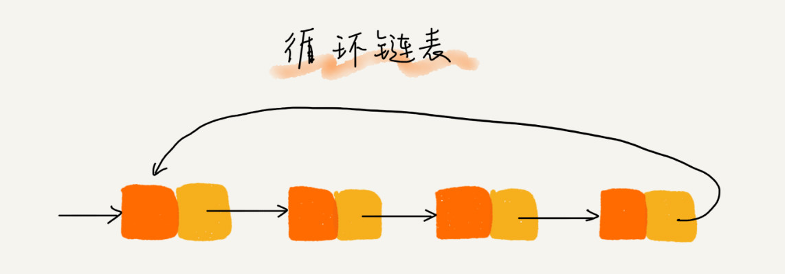

# 底层存储结构：数组、链表

数据结构种类很多，底层实现无非数组或者链表，但它们存在的目的都是在不同的应用场景合理组织数据，尽可能高效地查找、修改，也就是更好的时间换空间策略。

数据查找：遍历 + 索引；  
遍历：线性表就是 for/while 迭代为代表，非线性表就是递归为代表。

- 数组

  数组（Array）是一种**线性表数据结构**。它用一组**连续**的内存空间，来存储一组具有**相同类型**的数据。

  由于是紧凑连续存储,可以随**机访问**，时间复杂度为 O(1)。通过索引快速找到对应元素，而且相对节约存储空间。但正因为连续存储，内存空间必须一次性分配够，所以说数组如果要扩容，需要重新分配一块更大的空间，再把数据全部复制过去，时间复杂度 O(N)；而且**你如果想在数组中间进行插入和删除，每次必须搬移后面的所有数据以保持连续，时间复杂度 O(N)**。

- 链表
  
  因为元素不连续，而是靠指针指向下一个元素的位置，所以不存在数组的扩容问题；如果知道某一元素的前驱和后驱，**操作指针即可删除该元素或者插入新元素，时间复杂度 O(1)**。但是正因为存储空间不连续，你无法根据一个索引算出对应元素的地址，所以**不能随机访问，只能顺序访问，时间复杂度 O(n)**；而且由于每个元素必须存储指向前后元素位置的指针，会**消耗相对更多的储存空间**。

## 链表

链表（linkedList）是一种线性表数据结构，链表通过指针将一组零散的内存块串联在一起。其中，我们把内存块称为链表的“结点”。为了将所有的结点串起来，每个链表的结点除了存储数据之外，还需要记录链上的下一个结点的地址。

- 链表
  - 单链表
  - 双向链表
  - 双向循环链表
  - 链表操作
  - 链表技巧
  - 高级：跳表

### 单链表

一般情况下说的链表指的是单链表。

记录下个结点地址的指针叫作后继指针 next，前继指针 previous。

第一个结点叫作头结点（head），把最后一个结点叫作尾结点（tail）。

### 循环链表

循环链表是一种特殊的单链表。单链表的尾结点指针指向空地址，而循环链表的尾结点指针是指向链表的头结点。

### 双向链表

双向链表，每个结点不止有一个后继指针 next 指向后面的结点，还有一个前驱指针 prev 指向前面的结点。

双向链表要比单链表占用更多的内存空间，但还是比单链表的应用更加广泛的原因，因为空间换时间。利用前驱指针，双向链表在某些情况下的插入、删除等操作都要比单链表简单、高效。

### 双向循环链表

### 链表操作

#### 插入、删除（O(1)）

插入：`x->next=c; b->next=x`

删除：`a->next=b->next->next`

#### 遍历（O(n)）

内存上，数组的缺点是大小固定，一经声明就要占用整块连续内存空间。因为链表中的数据并非连续存储的，所以无法像数组那样，根据首地址和下标，通过寻址公式就能直接计算出对应的内存地址，而是需要根据指针一个结点一个结点地依次遍历，直到找到相应的结点。

### 链表技巧

带头链表: 

链表中的“哨兵”节点是解决边界问题的，不参与业务逻辑。如果我们引入“哨兵”节点，则不管链表是否为空，head指针都会指向这个“哨兵”节点。我们把这种有“哨兵”节点的链表称为带头链表，相反，没有“哨兵”节点的链表就称为不带头链表。

重点留意边界条件处理:

- 如果链表为空时，代码是否能正常工作？
- 如果链表只包含一个结点时，代码是否能正常工作？
- 如果链表只包含两个结点时，代码是否能正常工作？
- 代码逻辑在处理头结点和尾结点的时候，是否能正常工作？

### 跳表

类似链表，查找操作如果需要加速，可以添加多级索引，变成跳表，以提升效率
思想推广一下就是，一维数据结构的某项操作如果需要加速，则可以进行升维，使其更多附加信息，以提升效率。
本质是空间换时间

