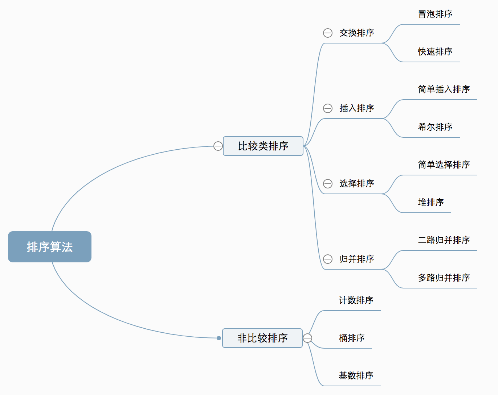
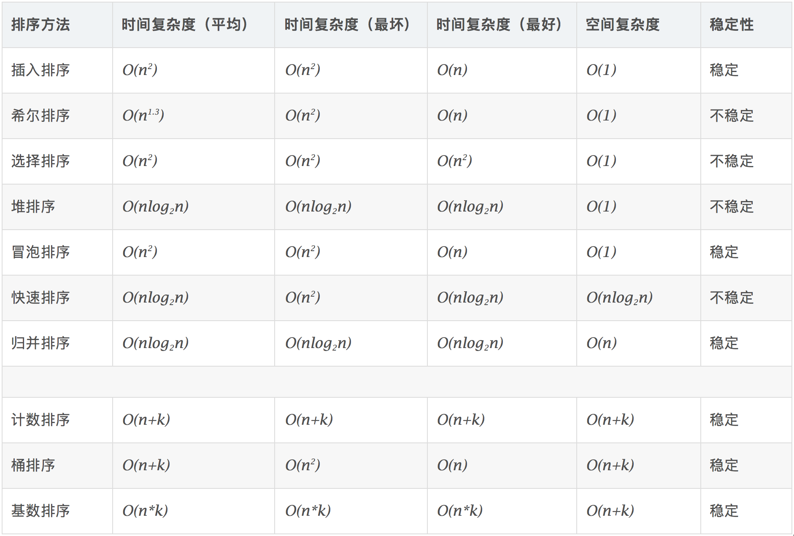

先阅读 [十大经典排序算法（动图演示）](https://www.cnblogs.com/onepixel/p/7674659.html)

  

比较类排序，需要比较来决定元素间的相对次序，其时间复杂度不能突破O(nlogn)，非比较类排序则不需要对比元素。

  

稳定性，即当 a = b 时，a 不需要发生位移，依旧在 b 的前面。

## 初级排序 - O(n^2)
1. 冒泡排序（Bubble Sort）
嵌套循环，每次查看相邻的元素如果逆序，则交换。

```js
function bubbelSort(nums) {
    for(let i = nums.length - 1; i > 0; i--) {
        for(let j = 0; j <= i; j++) {
            if(nums[j] > nums[j + 1]) {
                let tmp = nums[j]
                nums[j] = nums[j + 1]
                nums[j + 1] = tmp
            }
        }
    }
    return nums
}
```

2. 选择排序（Selection Sort）
每次找最小值，最后与待排序数组的起始位置交换。

```js
function selectionSort(nums){

    for(let i = 0; i < nums.length; i++) {
        let min = i
        for(let j = i + 1; j < nums.length; j++) {
            if(nums[min] > nums[j]) {
                min = j
            }
        }

        let tmp = nums[i]
        nums[i] = nums[min]
        nums[min] = tmp
    }

    return nums
}
```

2. 插入排序（Insertion Sort）
从前到后逐步构建有序序列；对于未排序数据，在已排序序列中从后
向前扫描，找到相应位置并插入。

```js
function insertionSort(nums){
    for(let i = nums.length - 1; i >= 0; i--) {
        let min = nums[i]
        let j = i - 1;
        while(j >= 0 && nums[j] > min) {
            nums[j + 1] = nums[j--]
        }
        nums[j + 1] = min
    }
    return nums
}
```

## 高级排序 - O(N*LogN) （重点掌握！）