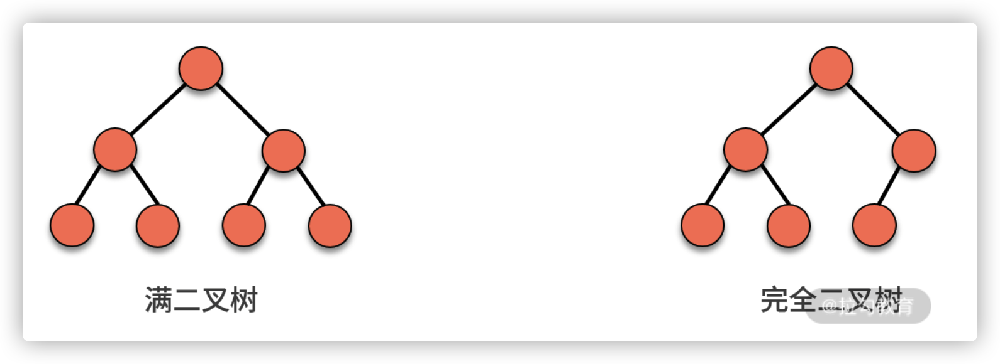
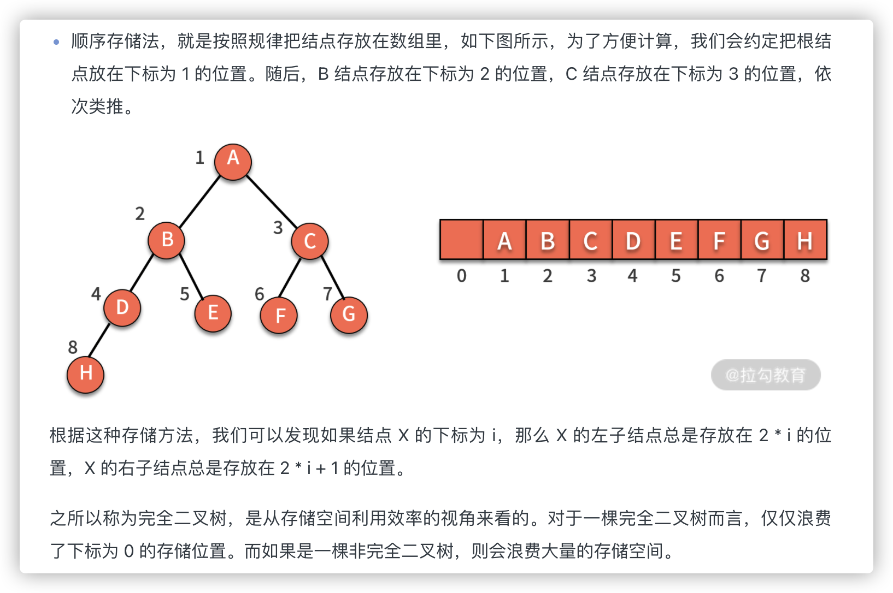

树

## 遍历模板

```js
function traverse(root) {
    // 前序遍历代码位置
    traverse(root.left);
    // 中序遍历代码位置
    traverse(root.right);
    // 后序遍历代码位置
}
```


- 概念
  - 树是由结点和边组成的，不存在环的一种数据结构
  - 树跟图的区别在于结点有没有形成环
  - 父结点、子结点、叶子结点
  - 层次、深度
- 操作
  - 遍历
    - 递归
      - 前序，根左右
      - 中序，左根右
      - 后序，左右根
      
      ```java
      // 先序遍历
      
      public static void preOrderTraverse(Node node) {
      
          if (node == null)
      
              return;
      
          System.out.print(node.data + " ");
      
          preOrderTraverse(node.left);
      
          preOrderTraverse(node.right);
      
      }
      
      // 中序遍历
      
      public static void inOrderTraverse(Node node) {
      
          if (node == null)
      
              return;
      
          inOrderTraverse(node.left);
      
          System.out.print(node.data + " ");
      
          inOrderTraverse(node.right);
      
      }
      
      // 后序遍历
      
      public static void postOrderTraverse(Node node) {
      
          if (node == null)
      
              return;
      
          postOrderTraverse(node.left);
      
          postOrderTraverse(node.right);
      
          System.out.print(node.data + " ");
      
      }
      
      ```
      
    - 迭代
      - 模拟栈
  - 插入
  - 删除
- 类别
  - **二叉树**，每个结点最多有两个分支，即每个结点最多有两个子结点，分别称作左子结点和右子结点
  
  - 满二叉树，定义为只有最后一层无任何子结点，其他所有层上的所有结点都有两个子结点
  
  - **完全二叉树**，定义为除了最后一层以外，其他层的结点个数都达到最大，并且最后一层的叶子结点都靠左排列
  
    
  
    
  
  - 二叉搜索树、二叉查找树、二叉排序树、有序二叉树、排序二叉树
    
    - 左子树的**所有结点**值小于根
    - 右子树的**所有结点**值大于根


