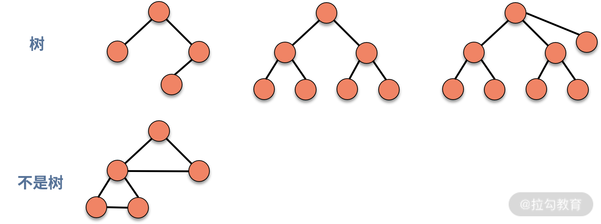
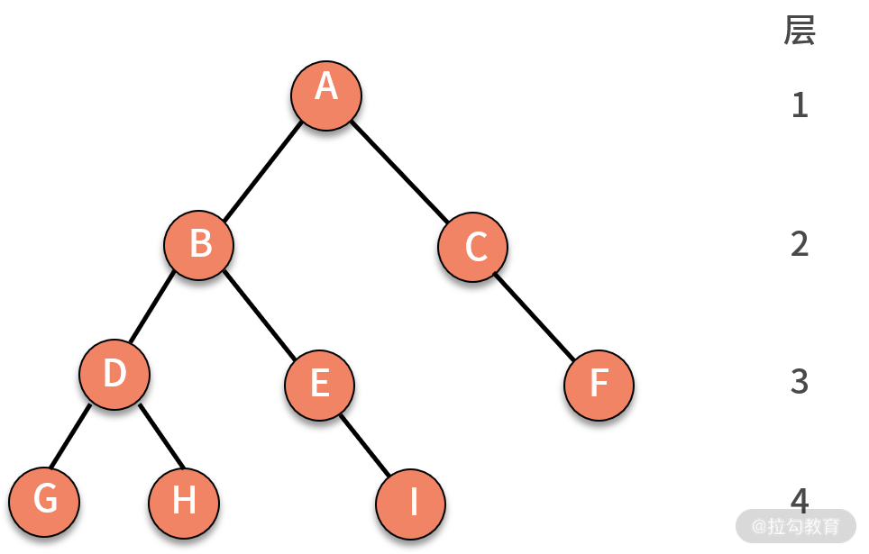
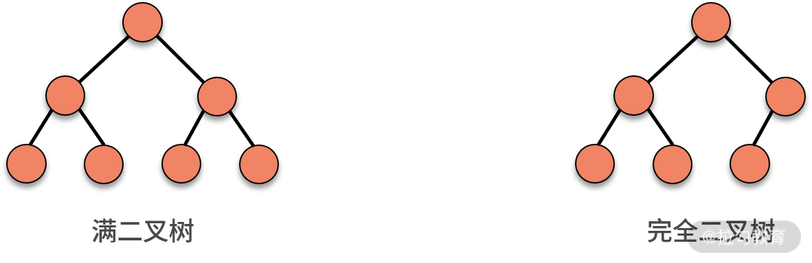
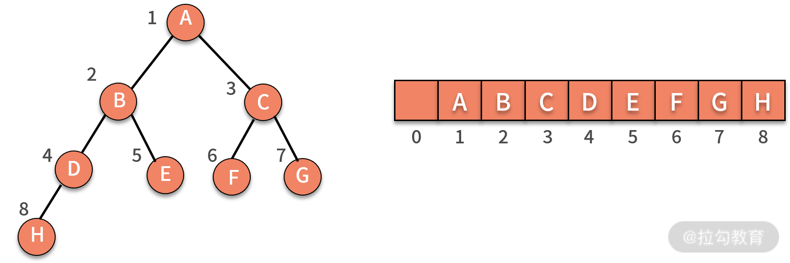
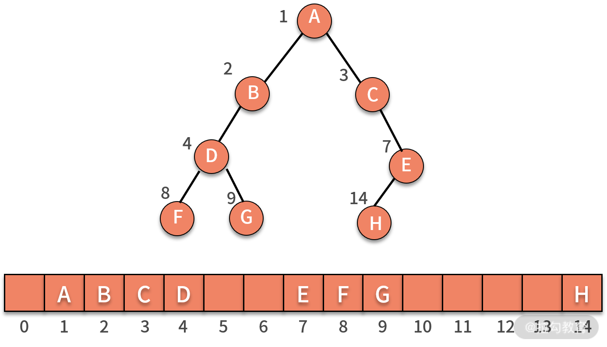
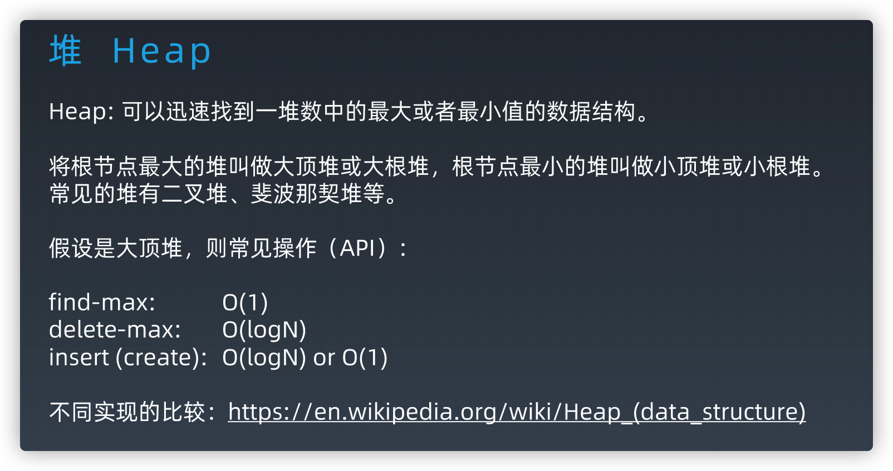
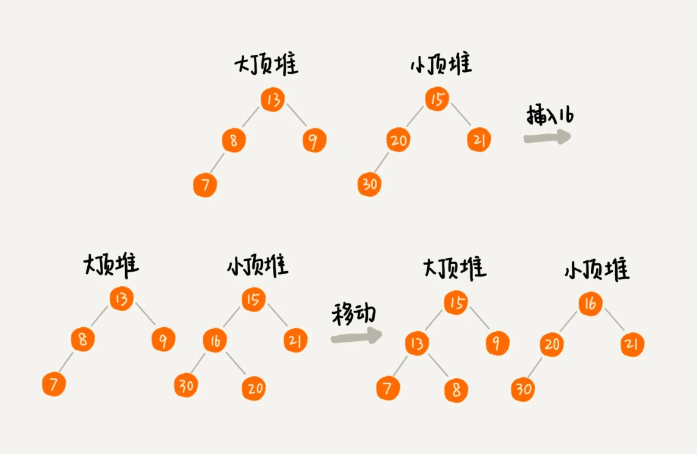
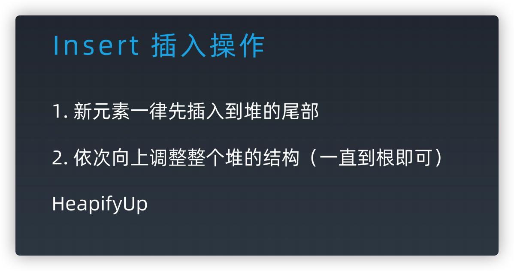
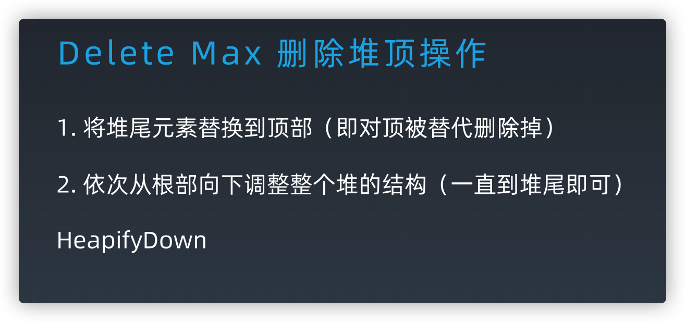

# 树和二叉树、二叉堆

- 树
  - 树的遍历
    - DFS：前序遍历、中序遍历、后序遍历：节点的处理位置不同
      ```js
      function traverse(TreeNode root) {
          if (root == null) {
              return;
          }

          // 前序遍历代码位置
          traverse(root.left);
          // 中序遍历代码位置
          traverse(root.right);
          // 后序遍历代码位置
      }
      ```
    - BFS：层序遍历
      ```js
      let queue = [root]
      while (queue.length) {
          let node = queue.shift()
          let [left, right] = node

          if(left) {
            queue.push(left)
          }

          if(right) {
            queue.push(right)
          }
      }
      ```
- 堆是一种特殊的基于树的数据结构，主要有二叉堆

## 树

树是由结点和边组成的，自顶而下，不存在环的一种数据结构。

  

特性：根、子节点、深度（树中结点的最大层次数，就是这棵树的树深）



### 二叉树、满二叉树、完全二叉树（重点）、二叉搜索树（重点）

#### 二叉树

每个结点最多有两个子结点，分别称作左子结点和右子结点。

#### 满二叉树

只有最后一层无任何子结点，其他所有层上的所有结点都有两个子结点的二叉树。

#### 完全二叉树

除了最后一层以外，其他层的结点个数都达到最大，并且最后一层的叶子结点都靠左排列。

  

完全二叉树的由来，主要是跟“非完全二叉树”的树结构以及对应的存储结构做对比

  

完全二叉树上节点对应的索引刚好可以完全落应在数组上。

为了方便计算，i 从 1 开始。结构特点：

- 索引为i的左孩子的索引是 2i
- 索引为i的左孩子的索引是 2i+1
- 索引为i的父结点的索引是 Math.floor(i/2)

#### 非完全二叉树

非完全二叉树，树的中间结构上是不完全的，导致在数组上存储是有浪费的。

  

#### 二叉搜索树

- 左子树中的每个结点的值都小于父结点
- 右子树中的每个结点的值都大于父结点
- 对二叉查找树进行中序遍历，就可以输出一个从小到大的有序数据队列
- 查找操作，普通二叉树复杂度 O(n)，二叉查找树则是 O(logn)

## 堆

堆是一种特殊的**基于树**的数据结构，一种称为优先级队列的抽象数据类型的实现。  
堆分为「大顶堆」和「小顶堆」，大（小）顶堆：任意节点的值不大于（小于）其父节点的值。

> [堆和树有什么区别？堆为什么要叫堆，不叫树呢？ - Severus的回答 - 知乎](https://www.zhihu.com/question/36134980/answer/87490177)



堆应用：
- 优先队列（优先级队列是一种特殊的队列，优先级高的数据先出队，而不再像普通的队列那样，先进先出）
- Top K 问题
  > 建堆后，如果元素比堆顶元素大，我们就把堆顶元素删除，并且将这个元素插入到堆中；如果比堆顶元素小，则不做处理。
- 中位数
  > 1. 排序后分成两部分前后分别为大、小顶堆，大顶堆顶部元素即为中位数
  > 2. 如果新加入的数据小于等于大顶堆的堆顶元素，我们就将这个新数据插入到大顶堆；否则，我们就将这个新数据插入到小顶堆。
  > 3. 堆调整    
  > 保证大顶堆的数量为奇（偶）数，小顶堆为偶数

### 二叉堆

基于**完全二叉树**性质的数据结构，一般使用数组存储。 

[js 二叉堆实现](./数据结构实现/binaryHeap.js)。

一个包含 n 个节点的完全二叉树，树的高度不会超过 log2​n。堆化的过程是顺着节点所在路径比较交换的，所以堆化的时间复杂度跟树的高度成正比，也就是 O(logn)。插入数据和删除堆顶元素的主要逻辑就是堆化，所以，往堆中插入一个元素和删除堆顶元素的时间复杂度都是 O(logn)。

	

		 		 	
