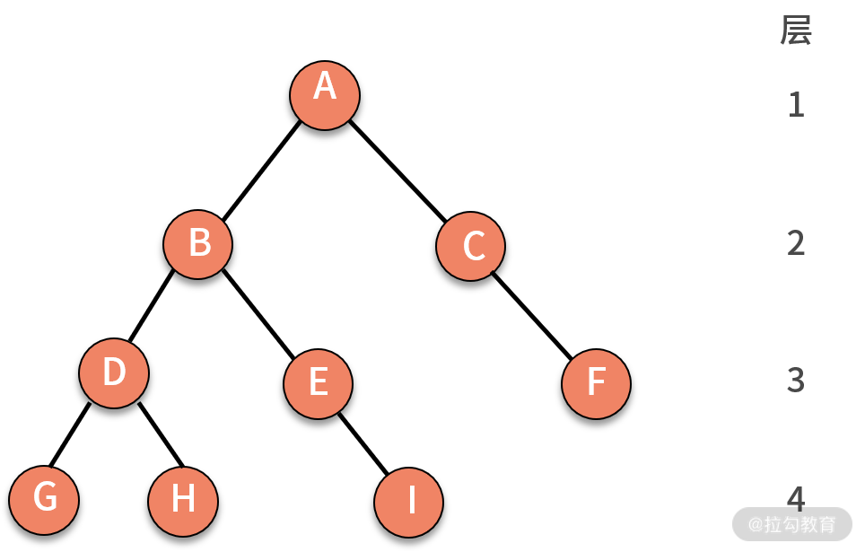
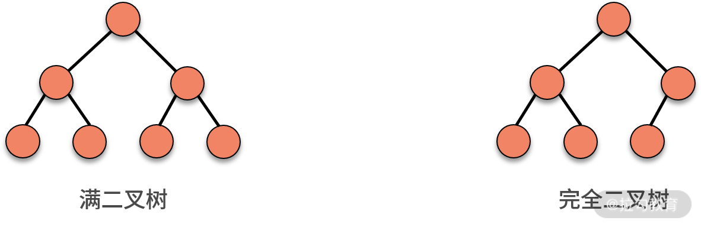
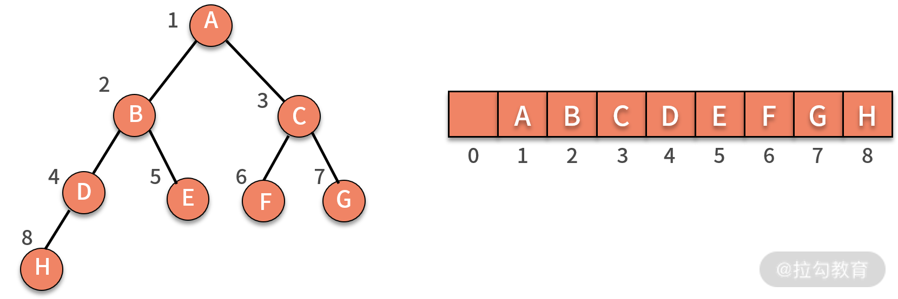
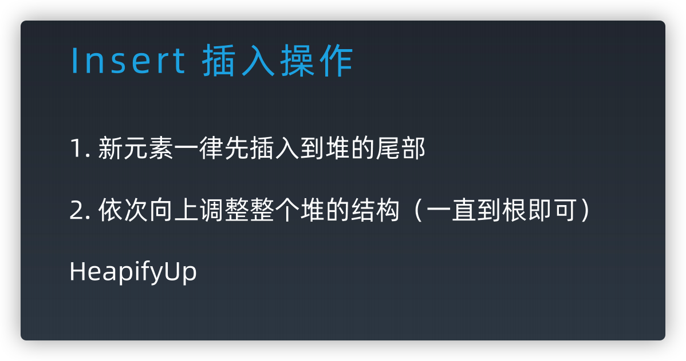

## 树

树是由结点和边组成的，自顶而下，不存在环的一种数据结构。

  

特性：根、子节点、深度（树中结点的最大层次数，就是这棵树的树深）



### 树的遍历

- 前序遍历
- 中序遍历
- 后序遍历
- 层序遍历

这里的序指的是父结点的遍历顺序，前序就是先遍历父结点，中序就是中间遍历父结点，后序就是最后遍历父结点。

```js
function traverse(TreeNode root) {
    // 前序遍历代码位置
    traverse(root.left);
    // 中序遍历代码位置
    traverse(root.right);
    // 后序遍历代码位置
}
```

层序遍历

```js
let queue = [root]
while (queue.length) {
    //...
}
```

### 二叉树、满二叉树、完全二叉树（重点）、二叉搜索树（重点）

#### 二叉树

每个结点最多有两个子结点，分别称作左子结点和右子结点。

#### 满二叉树

只有最后一层无任何子结点，其他所有层上的所有结点都有两个子结点的二叉树。

#### 完全二叉树

除了最后一层以外，其他层的结点个数都达到最大，并且最后一层的叶子结点都靠左排列。

  

完全二叉树的由来，主要是跟“非完全二叉树”的树结构以及对应的存储结构做对比

  

完全二叉树上节点对应的索引刚好可以完全落应在数组上。

为了方便计算，i 从 1 开始。结构特点：

- 索引为i的左孩子的索引是 2i
- 索引为i的左孩子的索引是 2i+1
- 索引为i的父结点的索引是 Math.floor(i/2)

#### 非完全二叉树

非完全二叉树，树的中间结构上是不完全的，导致在数组上存储是有浪费的。

  

#### 二叉搜索树

- 左子树中的每个结点的值都小于父结点
- 右子树中的每个结点的值都大于父结点
- 对二叉查找树进行中序遍历，就可以输出一个从小到大的有序数据队列
- 查找操作，普通二叉树复杂度 O(n)，二叉查找树则是 O(logn)

## 堆

堆是一种特殊的基于树的数据结构，一种称为优先级队列的抽象数据类型的实现。  
堆分为「大顶堆」和「小顶堆」，大（小）顶堆：任意节点的值不大于（小于）其父节点的值。


### 二叉堆

基于**完全二叉树**的数据结构，一般使用数组实现。 

	

		 		 	
[js 二叉堆实现](./数据结构实现/binaryHeap.js)。
