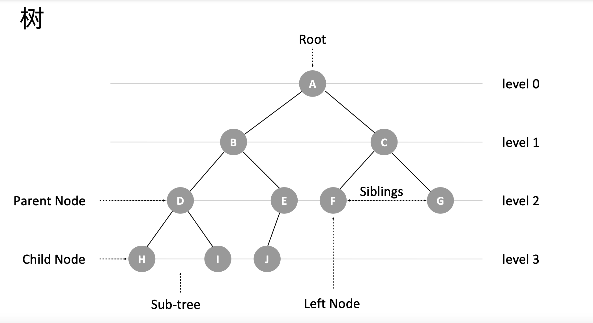
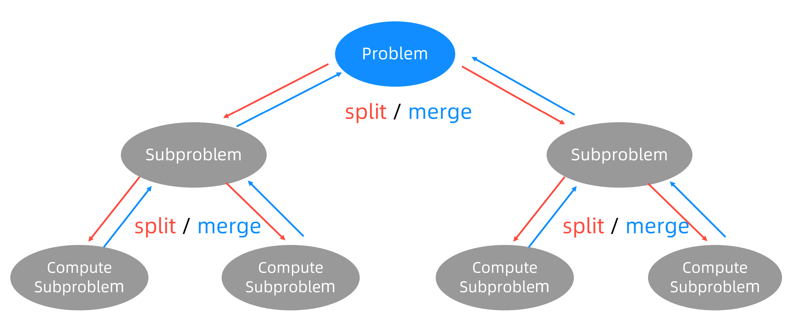

  
# 递归、分治、枚举、回溯、贪心、动态规划

## 递归

递归是一种应用非常广泛的算法思维或者编程技巧。

从计算机角度来看：**递归本质就是循环**。通过函数体，**自己调自己**来进行的循环。故递归需要存在**递归终止条件**，不然会造成堆栈溢出。所以写递归关键：

- 寻找**重复问题**
- **终止条件**

题目 [翻转二叉树](https://leetcode-cn.com/problems/invert-binary-tree/description/)，树的结构定义中其节点都是**相同的**，所以树的问题一般都适合采用递归的形式。

  

相比较于常规循环，**递归写出来的代码更加简洁抽象**，符合人类对问题思考。但我们在看到或者写递归时，我们要**避免不自觉得剖析递归过程**：把递归平铺展开，脑子里就会循环，一层一层往下调，然后再一层一层返回，试图想搞清楚计算机每一步都是怎么执行的，这样就很容易被绕进去。

因此我们在写递归的时候**只需要关注重复的问题本身**以及如何把**原问题与子问题递归关系**即可，而不需要过分关注这个子问题是如何被解决的。

回到翻转二叉树的题目，我们只需要专注于单一节点问题进行解决思考：翻转二叉树就是把当前节点的左右子节点对调，然后对子树同样重复操作即可。

```js
var invertTree = function (root) {
    if (!root) {
        return null
    }

    [root.right, root.left] = [invertTree(root.left), invertTree(root.right)]

    return root
};
```

基于递归形式的自我调用特征，我们可以从数学角度把问题看作 `f(n)` 与 `f(n - 1)` 等的递推关系式进行求解。那么写递归代码的关键就是找到**如何将大问题分解为数据规模更小的问题的规律**，并且基于此写出**递推公式**，然后再推敲终止条件，最后将递推公式和终止条件翻译成代码。

题目[《509. 斐波那契数》](https://leetcode.cn/problems/fibonacci-number/description/)。

斐波那契数列中元素的性质是，某个数等于它前面两个数的和；也就是 `f(n + 2) = f(n + 1) + f(n)`。至于起始两个元素，则分别为 0 和 1。根据这条规律，代码如下：

```js
var fib = function(n) {
    if (n < 2) {
        return n
    }

    return fib(n - 1) + fib(n - 2)
};
```

如果画出上面的递归树，你会发现**递归是一种自顶向下求解模型**，去的过程叫“递”，回来的过程叫“归”。

## 分治法

分治思想，即**分而治之**，形式上分为**拆分问题、独立处理、合并结果**。

在计算机科学中可体现为**分治法**（英语：Divide and conquer）：一种基于多项分支递归的一种很重要的**算法范型**。具体上就是将原问题划**分**成 n 个规模较小，并且结构与原问题相似的子问题，如果分割后的问题**仍然无法直接解决**，那么就继续分割子问题，直到每个小问题都可解，然后再合并其结果，就得到原问题的解。

> 分治思想更多的是一种“拆分”问题的解决思路 🤔。而其分治法模型未必就高效，但分治法是很多高效算法的基础，如归并排序、快速排序。

分治法在每轮递归上，都包含了分解问题、解决问题和合并结果这 3 个步骤：

1. 分解：将原问题分解成一系列子问题；
2. 解决：递归地求解各个子问题，若子问题足够小，则直接求解，无需再分；
3. 合并：将子问题的结果合并成原问题（合并操作的复杂度不能太高，否则就起不到减小算法总体复杂度的效果了）。

  

分治法中原问题所分解出的各个子问题是相互**独立**的，即子问题之间不包含公共的子问题，**没有重叠子问题，这一点是分治算法跟动态规划的明显区别**。

## 枚举、回溯、贪心、动态规划

题目[《零钱兑换》](https://leetcode.cn/problems/coin-change/)。

给你一个整数数组 coins ，表示不同面额的硬币；以及一个整数 amount ，表示总金额。  
计算并返回可以凑成总金额所需的**最少**的硬币个数 。如果没有任何一种硬币组合能组成总金额，返回 -1 。

```
输入：coins = [1, 2, 5], amount = 11
输出：3 
解释：11 = 5 + 5 + 1
```

### 枚举

面对最值问题（求最大、最小、最优之类）的求解，本质上还是需要进行穷举，即**枚举所有的可能，从所有候选答案中去搜索正确的解**（枚举思想）。

针对上面题目，我们需要从 `[1, 2, 5]` 中列出不同的组合选择出刚好符合条件的结果。

### 回溯

**回溯算法本质上就是一种暴力的穷举搜索算法**：我们枚举所有的解，找到满足期望的解。为了有规律地枚举所有可能的解，避免遗漏和重复，我们采用试错的方式，把问题求解的过程分为多个阶段。每个阶段，我们都会面对一个岔路口，我们先随意选一条路尝试，当发现这条路走不通的时候（不符合期望的解），就“回溯”到上一个岔路口，选择另选一种走法继续走，这就是回溯算法的思想。

回溯算法非常适合用递归代码实现，而且递归这种形式，正是赋予了回溯这种可以回退一步的能力：它通过堆栈保存了上一步的当前状态。

回溯算法的框架：

```js
result = []
def backtrack(路径, 选择列表):
    if 满足结束条件:
        result.add(路径)
        return
    
    for 选择 in 选择列表:
        做选择
        backtrack(路径, 选择列表)
        撤销选择
```

  

```js
var coinChange = function (coins, amount) {
    return dfs(coins, amount, 0)
};
var temp = {}
function dfs(coins, amount, level = 0) {
    if (amount === 0) return level

    if (temp[amount]) return temp[amount]

    let min = Infinity
    for (const c of coins) {
        let _amount = amount - c
        if (_amount >= 0) {
            temp[amount] = dfs(coins, _amount, level + 1)
            min = Math.min(min, temp[amount])
        }
    }

    return min === Infinity ? -1 : min
}
```

不过回溯算法使用剪枝函数，剪去一些不可能到达 最终状态（即答案状态）的节点，从而减少状态空间树节点的生成。

剪枝优化：

- 利用预设条件减少搜索路径，优化最优组合搜索方案
  - 贪心策略
- 重叠子问题：备忘录/记忆化搜索

### 动态规划

含有备忘录的递归算法已经与动态规划从效率上说基本相差无几，即都是消除重叠子问题的重复计算。那么什么是动态规划？

带备忘录的递归解法使用的是自顶向下的处理方式来解题，它离我们日常看到的动态规划还有差距。可以说：

- 回溯 + 备忘录：递归方式（自顶向下处理模型）
- 动态规划：递推方式（自底向上处理模型）

动态规划问题解题的关键是找出“**状态转移方程**”。在之前我们先看问题是否符合动态规划的三个特征：

1. 最优子结构：即能够通过子问题的最优解，推导出问题的最优解。
   
   > 我先举个很容易理解的例子：假设你们学校有 10 个班，你已经计算出了每个班的最高考试成绩。那么现在我要求你计算全校最高的成绩，你会不会算？当然会，而且你不用重新遍历全校学生的分数进行比较，而是只要在这 10 个最高成绩中取最大的就是全校的最高成绩。

   这一点跟分治类似，分治通过分解问题、合并子问题得到最终解；动态规划关键是方程，方程也是问题与子问题之间关系式，如 `f(n) = f(n - 1) + f(n - 2)`，所以解题时，**我们需要分析“最优子结构”，从而找出状态转移方程**。

2. 重叠子问题：即存在重复问题。
   
   分治中子问题是独立的，而方程之间 `f(n) = f(n - 1) + f(n - 2)` 我们在递推求解过程总是会存在重复问题，刚好可以利用 DP 表去缓存，避免重复计算。

3. 无后效性：子问题之间的依赖是单向性的，某阶段状态一旦确定，就不受后续决策的影响。

那么如何列出正确的状态转移方程？

1. 确定「状态」，也就是原问题和子问题中会变化的变量。题目中，目标金额 `amount` 是变量，而硬币的面额也是题目给定的，硬币数量是因变量，也就是我们要的解
2. 确定「关系」，也就是导致「状态」产生变化的行为，变量与因变量之间的关系式
3. 定义 DP 表：DP 一般根据变量来定义，有两个变量通常定义为二维数组，一个变量一维数组或者散列表都可
4. 确定 base case，从 base case 递推填 DP 表到最终目标

题目的状态转移方程如下：

```
f(n) = Math.min(f(n - 1), f(n - 2), f(n - 5)) + 1
```

```js
var coinChange = function (coins, amount) {
    if (amount === 0) return 0

    let i = 1;
    let temp = coins.reduce((obj, key) => (obj[key] = 1, obj), {})
    while (i <= amount) {
        temp[i] ??= Math.min(...coins.map(c => (temp[i - c] ??= Infinity))) + 1
        i++
    }

    return temp[amount] === Infinity ? -1 : temp[amount]
};
```

## 总结

分治、贪心、回溯、动态规划可以归为一类，而分治单独可以作为一类，因为它跟其他三个都不大一样。为什么这么说呢？前三个算法解决问题的模型，都可以抽象成**多阶段决策最优解模型**，而分治算法解决的问题尽管大部分也是最优解问题，但是，大部分都不能抽象成多阶段决策模型。

多阶段决策最优解模型：解决问题的过程，需要经历多个决策阶段。每个决策阶段都对应着一组状态，然后通过当前阶段的状态集合，来推导下一个阶段的状态集合，经过一组决策序列，能够产生最终期望求解的最优值。


- 回溯算法是个“万金油”。基本上能用的动态规划、贪心解决的问题，我们都可以用回溯算法解决。回溯算法相当于穷举搜索。穷举所有的情况，然后对比得到最优解。不过，回溯算法的时间复杂度非常高，是指数级别的，只能用来解决小规模数据的问题。对于大规模数据的问题，用回溯算法解决的执行效率就很低了
  
  - 尽管动态规划比回溯算法高效，但是，并不是所有问题，都可以用动态规划来解决。能用动态规划解决的问题，需要满足三个特征，最优子结构、无后效性和重复子问题。在重复子问题这一点上，动态规划和分治算法的区分非常明显。分治算法要求分割成的子问题，不能有重复子问题，而动态规划正好相反，动态规划之所以高效，就是因为回溯算法实现中存在大量的重复子问题。
  - 所有贪心的思路就是我们最优化求解的根本思想，所有的方法只不过是针对贪心思路的改进和优化而已。回溯解决的是正确性问题，而动态规划则是解决时间复杂度的问题,即消除重叠子问题的重复计算。
  
  - 贪心算法实际上是动态规划算法的一种特殊情况。它解决问题起来更加高效，代码实现也更加简洁。不过，它可以解决的问题也更加有限。它能解决的问题需要满足三个条件，最优子结构、无后效性和贪心选择性（这里我们不怎么强调重复子问题）。
  - 其中，最优子结构、无后效性跟动态规划中的无异。“贪心选择性”的意思是，通过局部最优的选择，能产生全局的最优选择。每一个阶段，我们都选择当前看起来最优的决策，所有阶段的决策完成之后，最终由这些局部最优解构成全局最优解。

## 学习参考

- [回溯算法解题套路框架](https://labuladong.gitee.io/algo/1/8/)
- [动态规划解题套路框架](https://labuladong.gitee.io/algo/3/25/69/)
- 极客专栏《数据结构与算法之美》
- [什么是动态规划（Dynamic Programming）？动态规划的意义是什么？ - 阮行止的回答 - 知乎](https://www.zhihu.com/question/23995189/answer/613096905)
