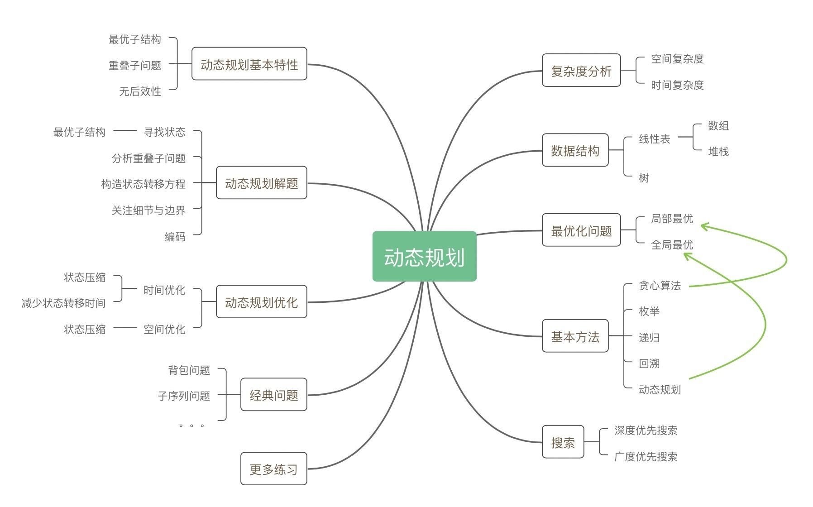

# 递归、分治、贪心、回溯、动态规划

- 递归
  - 递归模板
  - 堆栈溢出、重复计算（备忘录）
  - 递归转循环（模拟栈）
- 分治：分而治之 ，也就是将原问题划分成 n 个规模较小，并且结构与原问题相似的子问题，递归地解决这些子问题，然后再合并其结果，就得到原问题的解
  - 子问题可以独立求解，子问题之间没有相关性
- 贪心：每次选择局部最优，从而希望最终的结果就是全局最优
- 回溯：枚举搜索
  - 为了有规律地枚举所有可能的解，避免遗漏和重复，我们把问题求解的过程分为多个阶段，**在每个阶段进行选择搜索**，比如我们都会面对一个岔路口，我们先随意选一条路走，当发现这条路走不通的时候（不符合期望的解），就回退到上一个岔路口，另选一种走法继续走
- 动态规划

题目

- 贪心
  - 背包问题
  - 最短路径
  - 硬币找零：有几种不同面值的硬币，求最少各需要几枚就能达到目标金额
- 回溯
  - 八皇后
  - 背包
    - 对于一组不同重量、不可分割的物品，我们需要选择一些装入背包，在满足背包最大重量限制的前提下，背包中物品总重量的最大值是多少呢？
  - 背包2
    - 对于一组不同重量、不同价值、不可分割的物品，我们选择将某些物品装入背包，在满足背包最大重量限制的前提下，背包中可装入物品的总价值最大是多少呢？

寻找最优解的时候，本质上还是需要进行枚举（穷举）

穷举 + 找最

递归是搜索组合的一种非常直观的思路。

枚举是获得最优解的理想方法。而递归可以帮助我们获得所有可能答案的组合。

递归这种形式，正是赋予了回溯这种可以回退一步的能力：它通过堆栈保存了上一步的当前状态。

优化暴力递归：剪枝与优化
- 利用预设条件减少搜索路径，优化最优组合搜索方案
  - 贪心策略
- 重叠子问题：备忘录

所有贪心的思路就是我们最优化求解的根本思想，所有的方法只不过是针对贪心思路的改进和优化而已。回溯解决的是正确性问题，而动态规划则是解决时间复杂度的问题,即消除重叠子问题的重复计算。

重叠子问题
- 备忘录
- 动态规划

含有备忘录的递归算法已经与动态规划思想十分相似了，从效率上说也是如此。即消除重叠子问题的重复计算

动态规划问题一定具备以下三个特征

重叠子问题：在穷举的过程中（比如通过递归），存在重复计算的现象；
无后效性：子问题之间的依赖是单向性的，某阶段状态一旦确定，就不受后续决策的影响；
最优子结构：子问题之间必须相互独立，或者说后续的计算可以通过前面的状态推导出来。

动态规划问题的核心是写出正确的状态转移方程
- 初始化状态
- 状态参数：找出子问题与原问题之间会发生变化的变量
- 初始化状态 -> 确定状态参数 -> 设计决策的思路
- 递推
- DP table 数组 f(x, y) = value


## 递归

递归是一种应用非常广泛的算法思维或者编程技巧（循环）。

从计算机角度来看：**递归本质是循环**，通过函数体，自己调自己来进行的循环。递归需要存在**递归终止条件**，不然会造成堆栈溢出。

从问题思考角度来看：递归是**一种自顶向下分层分解成相似子问题（数据规模更小的问题，求解思路完全一样）的求解模型**，去的过程叫“递”，回来的过程叫“归”。

写递归代码的关键：

1. 抵制人肉递归、人肉枚举
2. 递：向下分解，找最近重复子问题
3. 推：使用数学归纳法推导**递推公式**

递归是自顶向下的求解问题，从未知到已知。递推是从初值出发反复进行某一运算得到所需结果，从已知到未知。递归是数学归纳法衍生出来的，利用递推的原理。当你无法通过自顶向下分解问题，可通过归纳法，寻找递推公式。 

题目： [爬楼梯](https://leetcode-cn.com/problems/climbing-stairs/)。

1 阶：1  
2 阶：2  
3 阶：2 阶 + 1 阶  
4 阶：3 阶 + 2 阶  
...

递推公式：f(n) = f(n - 1) + f( n - 2)

```javascript
var climbStairs = function(n) {
    if(n === 1) {
        return 1
    }
    if(n === 2) {
        return 2
    }
  	// 缓存计算
    if(!climbStairs.tmp) {
        climbStairs.tmp = {}
    }

    return climbStairs.tmp[n] || (climbStairs.tmp[n] = climbStairs(n-1) + climbStairs(n-2))
};
```

### 递归模板

```js
function recursion(level) {
  // 终止条件
  // 递归缓存返回（可选）
  // 逻辑处理
  // 递归调用
  // 状态重置（可选）
}
```

## 贪心算法


问题能够分解成子问题，子问题的最优解能够递推到到最终问题的最优解，这种子问题最优解称为最优子结构


题目：[括号生成](https://leetcode-cn.com/problems/generate-parentheses/)

生成 n 对有效括号（阶段），即为 2*n 个占位需要写入左括号或者右括号（这就是一个重复操作问题）

```javascript
var generateParenthesis = function(n) {
    const res = []
    dfs(str = '', n, n, res)
    return res
};

// 生成左括号或者右括号
var dfs = function (str, left, right, res) {
    // 左边括号数等于右边括号数
    if (left === 0 && right === 0) {
        res.push(str)
        return
    }
    // 生成左括号或者右括号
    if (left !== 0) {
        dfs(str + '(', left - 1, right, res)
    }

    // 生成右括号
    // 右括号大于左括号
    if (right !== 0 && right > left) {
        dfs(str + ')', left, right - 1, res)
    }
}
```


#### 深度优先

一般用深度优先遍历：
- 代码好写，使用递归的方法，直接借助系统栈完成**状态的转移**；
- 广度优先遍历得自己编写结点类和借助队列。

```python
#Python

# 缓存计算，防止重复计算
visited = set() 

def dfs(node, visited):    
    if node in visited: # terminator    	
        # already visited     	
        return 	visited.add(node) 	
        
    # process current node here. 	
    ...	
     
    for next_node in node.children(): 		
        if next_node not in visited: 			
            dfs(next_node, visited)
```

非递归写法，模拟栈调用

```python
#Pythondef DFS(self, tree): 	
    if tree.root is None: 		
        return [] 	

    visited, stack = [], [tree.root]	

    while stack: 		
        node = stack.pop() 		
        visited.add(node)		

        process (node) 		
        nodes = generate_related_nodes(node) 		
        stack.push(nodes) 	
    
    # other processing work 	
    ...
```
#### 广度优先

```python
# Python

def BFS(graph, start, end):
    # 队列    
    queue = [] 	
    queue.append([start]) 	
    
    while queue: 		
        node = queue.pop() 		
        process(node) 		
        
        # 将 children 排进下一队列中
        nodes = generate_related_nodes(node) 		
        queue.push(nodes)	
        
        # other processing work 	...
```

## 回溯

回溯算法，暴力穷举算法。

状态复制转移

根据重复性怎么构造怎么分解，就分为分治、回溯等各种方法

动态规划是一类算法问题，肯定是让你求最值的。因为动态规划问题拥有 最优子结构，可以通过状态转移方程从小规模的子问题最优解推导出大规模问题的最优解。

关于重复性：
1. 最近重复性：涉及到各种办法
2. 最有重复性：即为动态规划

能够顺应思维就用迭代
不能，就更抽象，用递归之类

1. 找重复性
2. 分n阶段
   1. 回溯
   2. 最优解 动态规划
3. 分治问题、缩小数据规模、缩小问题
4. 归纳法、递推

组合、排列、子集 回溯


## 动态规划

  

- 动态规划
  - （全局）最优问题：比如最优解、最大值或者最小值等
  - 特征
    - 最优子结构
    - 重叠子问题：重复计算的问题
    - 无后效性


动态规划 = 分治 + 最优子结构

动态规划与分治没有什么区别，关键看有无最优子结构

动态规划要素

- 最优子结构
- 中间状态（dp table）
- 递推方程（dp，状态转移方程）

1. 子问题状态定义（无后效性、问题状态关联）
2. 状态数组定义（阶段状态）
3. DP 方程

## 总结

- 数据结构上的问题
  1. 暴力求解
  2. 事件
- 求最值问题
  1. 计算机解决问题其实没有任何奇技淫巧，它唯一的解决办法就是穷举
  2. 但抵制人肉枚举、人肉递归
  3. 就只能找最近重复性（计算机简单指令集：分支、循环基础算法）
     1. 枚举条件进行组合选择（回溯？）
     2. 从原问题问题分解相似子问题角度 => 递推方程
        > 子问题具有
        > - 独立
        > - 最优子结构 
        每个子问题都是最优解，逐步舍取选择推导到全局最优解
        1. 自顶向下（递归 + 记忆化搜索）
        2. 自底向上（数学归纳法 + dp table（子问题的状态记录））


动态规划是通过拆分问题，定义问题状态和状态之间的关系，使得问题能够以递推（或者说分治）的方式去解决。动态规划是通过拆分问题，定义问题状态和状态之间的关系，使得问题能够以递推（或者说分治）的方式去解决。
动态规划方法要寻找符合“最优子结构“的状态和状态转移方程的定义，在找到之后，这个问题就可以以“记忆化地求解递推式”的方法来解决。而寻找到的定义，才是动态规划的本质。


复用上一状态

1. 穷举
2. 贪心：当下做局部最优判断，不能回退
3. 回溯：能够回退
   1. 穷举？
4. 动态规划：根据以前结果做选择 + 回退 + 记忆
5. 所有贪心的思路就是我们最优化求解的根本思想，所有的方法只不过是针对贪心思路的改进和优化而已。回溯解决的是正确性问题，而动态规划则是解决时间复杂度的问题。

- 找硬币
- 背包
- 子序
  - 最长公共子串长度

多维
阶段 + 状态


- 动态规划
  - 多阶段决策最优解模型
    - 需要经历多个决策阶段，每个决策阶段都对应着一组状态
  - 特征
    - 最优子结构
    - 无后效性
    - 重复子问题
  - 解法
    - 状态转移方程式：递归 + 备忘录
    - table：循环 + table

我们把问题分解为多个阶段，每个阶段对应一个决策。我们记录每一个阶段可达的状态集合（去掉重复的），然后通过当前阶段的状态集合，来推导下一个阶段的状态集合，动态地往前推进。这也是动态规划这个名字的由来，你可以自己体会一下，是不是还挺形象的？
