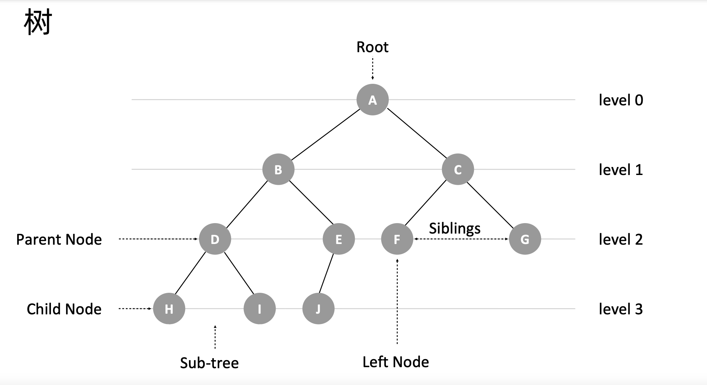

# 递归、分治、贪心、回溯、动态规划

- 枚举：枚举法的本质就是从所有候选答案中去搜索正确的解
- 递归
  - 递归模板
  - 堆栈溢出
  - 重复计算（备忘录）
  - 递归转循环（模拟栈）
- 分治：分而治之 
- 回溯：枚举搜索
- 贪心：每次选择局部最优，从而希望最终的结果就是全局最优
- 动态规划


- 递归
  - 自顶向下分层分解模型
- 递推
  - 自底向上、使用数学归纳法推导**递推公式**


```py
# 自顶向下递归的动态规划
def dp(状态1, 状态2, ...):
    for 选择 in 所有可能的选择:
        # 此时的状态已经因为做了选择而改变
        result = 求最值(result, dp(状态1, 状态2, ...))
    return result

# 自底向上迭代的动态规划
# 初始化 base case
dp[0][0][...] = base case
# 进行状态转移
for 状态1 in 状态1的所有取值：
    for 状态2 in 状态2的所有取值：
        for ...
            dp[状态1][状态2][...] = 求最值(选择1，选择2...)
```


- 最值问题
  - 经典问题
    - 分治
      - 二维平面上有 n 个点，如何快速计算出两个距离最近的点对
      - `有两个 n*n 的矩阵 A，B，如何快速求解两个矩阵的乘积 C=A*B？`
    - 回溯
      - 八皇后
      - 子集（不选空的组合）
      - 组合
      - 排列
    - 背包问题 1：对于一组**不同重量**、不可分割的物品，我们需要选择一些装入背包，在满足背包最大重量限制的前提下，背包中物品总重量的最大值是多少呢？
    - 背包问题 2：对于一组**不同重量、不同价值**、不可分割的物品，我们选择将某些物品装入背包，在满足背包最大重量限制的前提下，背包中可装入物品的总价值最大是多少呢？
    - 最短路径
    - 硬币找零：有几种不同面值的硬币，求最少各需要几枚就能达到目标金额
    - 最长公共子序列
    - 最长递增子序列
    - 最长回文子串
    - 编辑距离
    - 找硬币
    - 斐波那契数列
    - 爬楼梯
    - 买卖股票的最佳时机Ⅱ
    - 分发饼干
- 
  - 如何穷举
    - 循环迭代
    - 递归：枚举是获得最优解的理想方法。而递归可以帮助我们获得所有可能答案的组合。
      - 重复字问题
      - 优化暴力递归：剪枝与优化
        - 利用预设条件减少搜索路径，优化最优组合搜索方案
          - 贪心策略
        - 重叠子问题：备忘录
      - 回溯 + 备忘录
        - 回溯
          - 递归这种形式，正是赋予了回溯这种可以回退一步的能力：它通过堆栈保存了上一步的当前状态。
        - 含有备忘录的递归算法已经与动态规划思想十分相似了，从效率上说也是如此。即消除重叠子问题的重复计算
        - 带备忘录的递归解法从传统意义上说已经是动态规划思想的范畴了，但它使用的是自顶向下的处理方式来解题，它离我们日常看到的动态规划还有差距。
      - 动态规划
- 动态规划，多阶段决策最优解模型：解决问题的过程，需要经历多个决策阶段。每个决策阶段都对应着一组状态，然后通过当前阶段的状态集合，来推导下一个阶段的状态集合，经过一组决策序列，能够产生最终期望求解的最优值。
  - 组合模型？
  - 特征
    - 在穷举的过程中（比如通过递归），存在重复计算的现象；（可能会产生重复的状态）
    - **最优子结构：**
      - 子问题都是最优解，通过子问题的最优解，推导出问题的最优解，
      - 子问题之间必须相互独立，或者说后续的计算可以通过前面的状态推导出来
      - 符合最优子结构：可以从子问题的最优结果推出更大规模问题的最优结果
    - 无后效性：子问题之间的依赖是单向性的，某阶段状态一旦确定，就不受后续决策的影响。前面阶段状态一旦确定，就不受之后阶段的决策影响（只要满足前面提到的动态规划问题模型，其实基本上都会满足无后效性）
- 解题思路
  - 暴力：回溯 + 备忘录
  - 定义状态（dp table）+ 找最优子结构 - 写状态转移方程
  - 状态转移表法：回溯算法实现 - 定义状态 - 画递归树 - 找重复子问题 - 画状态转移表 - 根据递推关系填表 - 将填表过程翻译成代码
  - 状态转移方程法：状态转移方程法有点类似递归的解题思路。我们需要分析，某个问题如何通过子问题来递归求解，也就是所谓的最优子结构。根据最优子结构，写出递归公式，也就是所谓的状态转移方程。
    - 找最优子结构 - 写状态转移方程 - 将状态转移方程翻译成代码
      - 递归 + “备忘录”
      - 迭代递推 + dp table
- 动态规划问题的核心是写出正确的状态转移方程
- 那分治、贪心、回溯、动态规划可以归为一类，而分治单独可以作为一类，因为它跟其他三个都不大一样。为什么这么说呢？前三个算法解决问题的模型，都可以抽象成我们今天讲的那个多阶段决策最优解模型，而分治算法解决的问题尽管大部分也是最优解问题，但是，大部分都不能抽象成多阶段决策模型
  - 回溯算法是个“万金油”。基本上能用的动态规划、贪心解决的问题，我们都可以用回溯算法解决。回溯算法相当于穷举搜索。穷举所有的情况，然后对比得到最优解。不过，回溯算法的时间复杂度非常高，是指数级别的，只能用来解决小规模数据的问题。对于大规模数据的问题，用回溯算法解决的执行效率就很低了
  - 尽管动态规划比回溯算法高效，但是，并不是所有问题，都可以用动态规划来解决。能用动态规划解决的问题，需要满足三个特征，最优子结构、无后效性和重复子问题。在重复子问题这一点上，动态规划和分治算法的区分非常明显。分治算法要求分割成的子问题，不能有重复子问题，而动态规划正好相反，动态规划之所以高效，就是因为回溯算法实现中存在大量的重复子问题。
  - 所有贪心的思路就是我们最优化求解的根本思想，所有的方法只不过是针对贪心思路的改进和优化而已。回溯解决的是正确性问题，而动态规划则是解决时间复杂度的问题,即消除重叠子问题的重复计算。
    - 裁剪、合并
  - 贪心算法实际上是动态规划算法的一种特殊情况。它解决问题起来更加高效，代码实现也更加简洁。不过，它可以解决的问题也更加有限。它能解决的问题需要满足三个条件，最优子结构、无后效性和贪心选择性（这里我们不怎么强调重复子问题）。
  - 其中，最优子结构、无后效性跟动态规划中的无异。“贪心选择性”的意思是，通过局部最优的选择，能产生全局的最优选择。每一个阶段，我们都选择当前看起来最优的决策，所有阶段的决策完成之后，最终由这些局部最优解构成全局最优解。
- 重叠子问题、最优子结构、状态转移方程
- 状态转移方程
  - 递推公式


In a word, 分治法 —— 各子问题独立；动态规划 —— 各子问题重叠。

1. 递归本质是循环，所以用递归的前提是找到重复子问题
2. 递归模型
3. 求解时只需要关注原问题本身以及如何划分子问题的结构上

## 递归

递归是一种应用非常广泛的算法思维或者编程技巧。

从计算机角度来看：**递归本质就是循环**，通过函数体，自己调自己来进行的循环。递归需要存在**递归终止条件**，不然会造成堆栈溢出。所以写递归关键：
- 寻找重复问题
- 终止条件

从问题模型思考角度来看：递归可以用于**一种自顶向下逐层分解成相似子问题（数据规模不一样）的求解模型**，去的过程叫“递”，回来的过程叫“归”。

递归求解模型有两种
- 分治模型（分治思想）
- 搜索模型（回溯思想）

> 算法思想上的区别下面再述

先说这两种模型形式上的区别是分治模型：先递归调用再处理本层逻辑，而搜索模型则是：是先处理本层问题再递归调用，这种往往需要**传递上层的状态结果**或者**全局变量**。体现在下面递归模板中3、4步骤的顺序不同：

递归模板：

```js
function recursion(level) {
  // 1. 终止条件
  // 2. 递归缓存返回（可选）
  // 3. 逻辑处理
  // 4. 递归调用
  // 5. 状态重置（可选）
}
```

题目 [翻转二叉树](https://leetcode-cn.com/problems/invert-binary-tree/description/)，树的结构定义本身就符合“逐层分解相似子问题的递归模型”，所以树的问题一般都采用递归的形式。

  

并且相比较于常规循环，**递归写出来的代码更加简洁抽象**，符合人类对问题思考。但当看到递归时，我们要**避免不自觉得剖析递归过程**：把递归平铺展开，脑子里就会循环，一层一层往下调，然后再一层一层返回，试图想搞清楚计算机每一步都是怎么执行的，这样就很容易被绕进去。因此，**求解时只需要关注问题本身以及如何把原问题如何划分成符合条件的子问题，而不需要过分关注这个子问题是如何被解决的**。

回到翻转二叉树的题目，专注于当个节点（问题）进行解决思考，就是把当前节点的左右子节点对调。

```js
// 分治模型
var invertTree = function (root) {
    if (!root) {
        return null
    }

    [root.right, root.left] = [invertTree(root.left), invertTree(root.right)]

    return root
};

// 搜索模型
var invertTree2 = function (root) {
    if (!root) {
        return null
    }

    [root.right, root.left] = [root.left, root.right]

    invertTree(root.left)
    invertTree(root.right)

    return root
};
```

虽然此题目上边两种写法乍一看没什么区别，但是当我们思考是先交换当前节点还是子节点的左右子树时，不同思维下就会有两种递归模型写法的差异。

## 分治

前面说到，分治模型是递归模型的一种，Why？

分治算法（divide and conquer）的核心思想其实就是四个字，分而治之 ，也就是将原问题划分成 n 个规模较小，并且结构与原问题相似的子问题，递归地解决这些子问题，然后再合并其结果，就得到原问题的解。

大概的流程可以分为三步：分解 -> 解决 -> 合并：

1. 分解：将原问题分解成一系列子问题；
2. 解决：递归地求解各个子问题，若子问题足够小，则直接求解；
3. 合并：将子问题的结果合并成原问题。

  

从模型上看，分治算法可以用递归去表达。

分治子问题特征
- 该问题具有最优子结构性质，利用该问题分解出的子问题的解可以合并为该问题的解。
- 该问题所分解出的各个子问题是相互独立的，即子问题之间不包含公共的子问题（**没有重叠子问题，这一点是分治算法跟动态规划的明显区别**）

## 枚举、回溯、贪心、动态规划

对于一组**不同重量、不同价值**、不可分割的物品，我们选择将某些物品装入背包，在满足背包最大重量限制的前提下，背包中可装入物品的总价值最大。

假设背包重量：`w = [2，2，4，6，3]` 价值：`v = [3，4，8，9，6]`

### 枚举

面对最值问题（求最大、最小、最优之类）的求解，本质上还是需要进行穷举，然后做对比所有可能的结果，找出满足条件的解（枚举思想）。

穷举的方式无非就是循环迭代还有递归

### 回溯

回溯法采用**试错的思想**，它尝试分步的去解决一个问题。在分步解决问题的过程中，当它通过尝试发现现有的分步答案不能得到有效的正确的解答的时候，它将取消上一步甚至是上几步的计算，再通过其它的可能的分步解答再次尝试寻找问题的答案。

回溯算法非常适合用递归代码实现

回溯算法本质上就是枚举搜索，枚举搜索所有的解，找到满足期望的解。

为了有规律地枚举所有可能的解，避免遗漏和重复，我们把问题求解的过程分为多个阶段。每个阶段，我们都会面对一个岔路口，我们先随意选一条路走，当发现这条路走不通的时候（不符合期望的解），就回退到上一个岔路口，另选一种走法继续走。


剪枝
记忆化搜索

题目： [爬楼梯](https://leetcode-cn.com/problems/climbing-stairs/)。

1 阶：1  
2 阶：2  
3 阶：2 阶 + 1 阶  
4 阶：3 阶 + 2 阶  
...

递推公式：f(n) = f(n - 1) + f( n - 2)

```javascript
var climbStairs = function (n) {
  if (n === 1) {
    return 1;
  }
  if (n === 2) {
    return 2;
  }
  // 缓存计算
  if (!climbStairs.tmp) {
    climbStairs.tmp = {};
  }

  return (
    climbStairs.tmp[n] ||
    (climbStairs.tmp[n] = climbStairs(n - 1) + climbStairs(n - 2))
  );
};
```


## 贪心算法

题目：[括号生成](https://leetcode-cn.com/problems/generate-parentheses/)

生成 n 对有效括号（阶段），即为 2\*n 个占位需要写入左括号或者右括号（这就是一个重复操作问题）

```javascript
var generateParenthesis = function (n) {
  const res = [];
  dfs((str = ""), n, n, res);
  return res;
};

// 生成左括号或者右括号
var dfs = function (str, left, right, res) {
  // 左边括号数等于右边括号数
  if (left === 0 && right === 0) {
    res.push(str);
    return;
  }
  // 生成左括号或者右括号
  if (left !== 0) {
    dfs(str + "(", left - 1, right, res);
  }

  // 生成右括号
  // 右括号大于左括号
  if (right !== 0 && right > left) {
    dfs(str + ")", left, right - 1, res);
  }
};
```


动态规划是一类算法问题，肯定是让你求最值的。因为动态规划问题拥有 最优子结构，可以通过状态转移方程从小规模的子问题最优解推导出大规模问题的最优解。


- 最优子结构 => 递推方程（dp，状态转移方程）
- 中间状态（dp table）


动态规划是通过拆分问题，定义问题状态和状态之间的关系，使得问题能够以递推（或者说分治）的方式去解决。动态规划是通过拆分问题，定义问题状态和状态之间的关系，使得问题能够以递推（或者说分治）的方式去解决。
动态规划方法要寻找符合“最优子结构“的状态和状态转移方程的定义，在找到之后，这个问题就可以以“记忆化地求解递推式”的方法来解决。而寻找到的定义，才是动态规划的本质。


