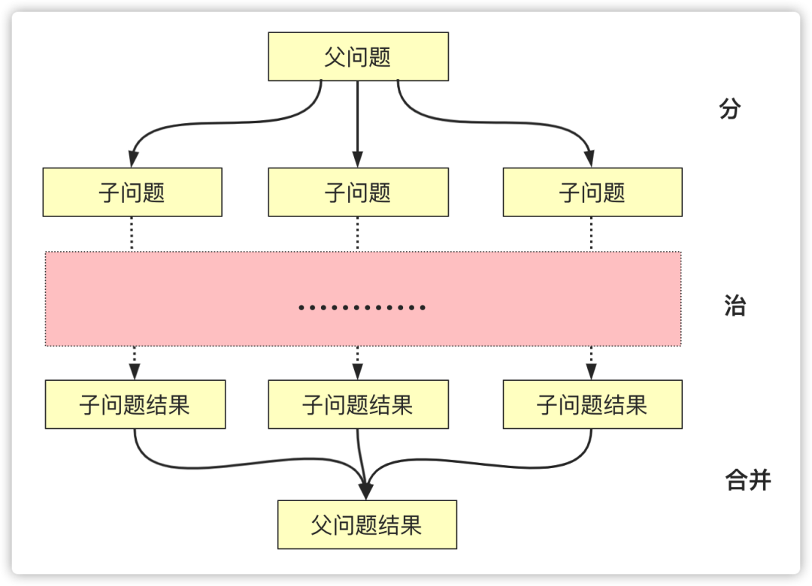

# 递归、分治、贪心、回溯、动态规划

- 递归
  - 递归模板
  - 堆栈溢出、重复计算（备忘录）
  - 递归转循环（模拟栈）

## 递归

递归是一种应用非常广泛的算法思维或者编程技巧（循环）。

从计算机角度来看：**递归本质是循环**，通过函数体，自己调自己来进行的循环。递归需要存在**递归终止条件**，不然会造成堆栈溢出。

从问题思考角度来看：递归是**一种自顶向下分层分解成相似子问题（数据规模更小的问题，求解思路完全一样）的求解模型**，去的过程叫“递”，回来的过程叫“归”。

写递归代码的关键：

1. 抵制人肉递归、人肉枚举
2. 递：向下分解，找最近重复子问题
3. 推：使用数学归纳法推导**递推公式**

递归是自顶向下的求解问题，从未知到已知。递推是从初值出发反复进行某一运算得到所需结果，从已知到未知。递归是数学归纳法衍生出来的，利用递推的原理。当你无法通过自顶向下分解问题，可通过归纳法，寻找递推公式。 

题目： [爬楼梯](https://leetcode-cn.com/problems/climbing-stairs/)。

1 阶：1  
2 阶：2  
3 阶：2 阶 + 1 阶  
4 阶：3 阶 + 2 阶  
...

递推公式：f(n) = f(n - 1) + f( n - 2)

```javascript
var climbStairs = function(n) {
    if(n === 1) {
        return 1
    }
    if(n === 2) {
        return 2
    }
  	// 缓存计算
    if(!climbStairs.tmp) {
        climbStairs.tmp = {}
    }

    return climbStairs.tmp[n] || (climbStairs.tmp[n] = climbStairs(n-1) + climbStairs(n-2))
};
```

### 递归模板

```js
function recursion(level) {
  // 终止条件
  // 递归缓存返回（可选）
  // 逻辑处理
  // 递归调用
  // 状态重置（可选）
}
```

## 贪心算法

贪心算法，**每次选择最优，从而希望最终的结果就是全局最优**。

> 局部最优、希望结果最优，说明贪心算法在日常生活和工程中一般不能得到我们想要的结果

- 回溯，能够回退
- 贪心算法，当下做局部最优判断，不能回退
- 动态规划，根据以前结果做选择 + 回退

问题能够分解成子问题，子问题的最优解能够递推到到最终问题的最优解，这种子问题最优解称为最优子结构


题目：[括号生成](https://leetcode-cn.com/problems/generate-parentheses/)

生成 n 对有效括号（阶段），即为 2*n 个占位需要写入左括号或者右括号（这就是一个重复操作问题）

```javascript
var generateParenthesis = function(n) {
    const res = []
    dfs(str = '', n, n, res)
    return res
};

// 生成左括号或者右括号
var dfs = function (str, left, right, res) {
    // 左边括号数等于右边括号数
    if (left === 0 && right === 0) {
        res.push(str)
        return
    }
    // 生成左括号或者右括号
    if (left !== 0) {
        dfs(str + '(', left - 1, right, res)
    }

    // 生成右括号
    // 右括号大于左括号
    if (right !== 0 && right > left) {
        dfs(str + ')', left, right - 1, res)
    }
}
```


#### 深度优先

一般用深度优先遍历：
- 代码好写，使用递归的方法，直接借助系统栈完成**状态的转移**；
- 广度优先遍历得自己编写结点类和借助队列。

```python
#Python

# 缓存计算，防止重复计算
visited = set() 

def dfs(node, visited):    
    if node in visited: # terminator    	
        # already visited     	
        return 	visited.add(node) 	
        
    # process current node here. 	
    ...	
     
    for next_node in node.children(): 		
        if next_node not in visited: 			
            dfs(next_node, visited)
```

非递归写法，模拟栈调用

```python
#Pythondef DFS(self, tree): 	
    if tree.root is None: 		
        return [] 	

    visited, stack = [], [tree.root]	

    while stack: 		
        node = stack.pop() 		
        visited.add(node)		

        process (node) 		
        nodes = generate_related_nodes(node) 		
        stack.push(nodes) 	
    
    # other processing work 	
    ...
```
#### 广度优先

```python
# Python

def BFS(graph, start, end):
    # 队列    
    queue = [] 	
    queue.append([start]) 	
    
    while queue: 		
        node = queue.pop() 		
        process(node) 		
        
        # 将 children 排进下一队列中
        nodes = generate_related_nodes(node) 		
        queue.push(nodes)	
        
        # other processing work 	...
```
## 分治

分治算法，分而治之 ，也就是将原问题划分成 n 个规模较小，并且结构与原问题相似的子问题，递归地解决这些子问题，然后再合并其结果，就得到原问题的解。

原问题分解成的**子问题可以独立求解，子问题之间没有相关性**。

> 分治相比递归，就是多了不断重复分治合并的处理

通过不断缩小问题的数据规模而降低问题难度，从而能够从最小问题快速解决起，逐渐，
## 回溯

回溯算法，暴力穷举算法。

状态复制转移

根据重复性怎么构造怎么分解，就分为分治、回溯等各种方法

动态规划是一类算法问题，肯定是让你求最值的。因为动态规划问题拥有 最优子结构，可以通过状态转移方程从小规模的子问题最优解推导出大规模问题的最优解。

关于重复性：
1. 最近重复性：涉及到各种办法
2. 最有重复性：即为动态规划

能够顺应思维就用迭代
不能，就更抽象，用递归之类

1. 找重复性
2. 分n阶段
   1. 回溯
   2. 最优解 动态规划
3. 分治问题、缩小数据规模、缩小问题
4. 归纳法、递推

组合、排列、子集 回溯


## 分治算法

分治（英语：Divide and Conquer），字面上的解释是“分而治之”，就是把一个复杂的问题分成两个或更多的相同或相似的子问题，直到最后子问题可以简单的直接求解，原问题的解即子问题的解的合并。

> 这和递归的概念很吻合，所以在分治算法通常以递归的方式实现(当然也有非递归的实现方式)。

  


:thinking:

## 动态规划

动态规划问题的一般形式就是求最值（最优解、最大值或者最小值等）

动态规划 = 分治 + 最优子结构

动态规划与分治没有什么区别，关键看有无最优子结构

动态规划要素

- 最优子结构
- 中间状态（dp table）
- 递推方程（dp，状态转移方程）

1. 子问题状态定义（无后效性、问题状态关联）
2. 状态数组定义（阶段状态）
3. DP 方程

## 总结

- 数据结构上的问题
  1. 暴力求解
  2. 事件
- 求最值问题
  1. 计算机解决问题其实没有任何奇技淫巧，它唯一的解决办法就是穷举
  2. 但抵制人肉枚举、人肉递归
  3. 就只能找最近重复性（计算机简单指令集：分支、循环基础算法）
     1. 枚举条件进行组合选择（回溯？）
     2. 从原问题问题分解相似子问题角度 => 递推方程
        > 子问题具有
        > - 独立
        > - 最优子结构 
        每个子问题都是最优解，逐步舍取选择推导到全局最优解
        1. 自顶向下（递归 + 记忆化搜索）
        2. 自底向上（数学归纳法 + dp table（子问题的状态记录））


动态规划是通过拆分问题，定义问题状态和状态之间的关系，使得问题能够以递推（或者说分治）的方式去解决。动态规划是通过拆分问题，定义问题状态和状态之间的关系，使得问题能够以递推（或者说分治）的方式去解决。
动态规划方法要寻找符合“最优子结构“的状态和状态转移方程的定义，在找到之后，这个问题就可以以“记忆化地求解递推式”的方法来解决。而寻找到的定义，才是动态规划的本质。


复用上一状态