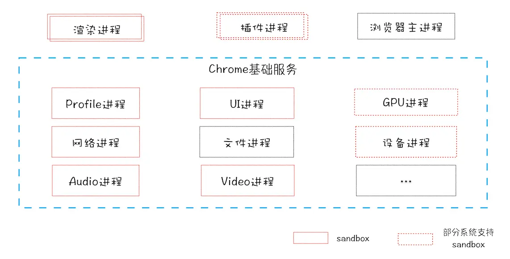
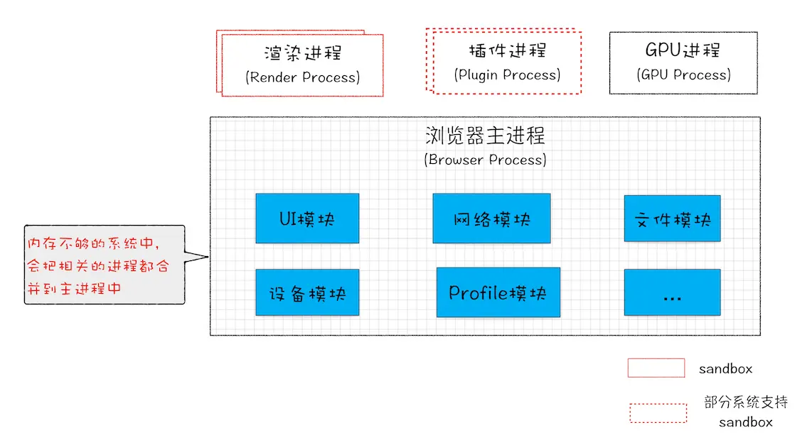
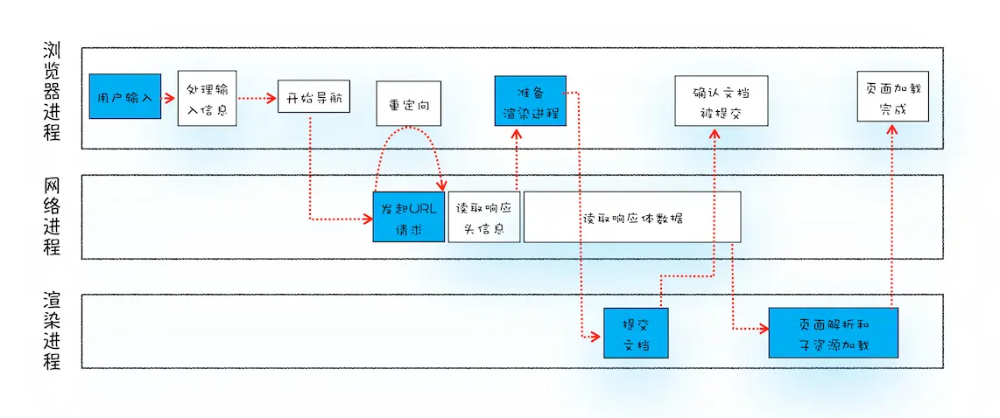

# Chrome 多进程架构

## 线程 VS 进程

定义

- 进程是资源分配和调度的基本单位
- 线程是 CPU 运算调度的最小单位

关系及特点

- 线程是依附于进程的，一个进程能有多个线程，但任意一线程执行出错，都会导致整个进程的崩溃
- 线程之间共享进程中的数据
- 进程关闭，操作系统会回收进程所占用的内存
- 进程之间的内容相互隔离

## Chrome 多进程架构

  

- 浏览器进程，主要负责界面显示、用户交互、子进程管理，同时提供存储等功能。
- GPU进程 
- 网络进程，网络资源加载。
- 渲染进程，渲染页面、运行 JavaScript。
- 插件进程 

### 站点隔离

通常情况下，每个 tab 页即一个渲染进程，Chromium 提供了四种进程模式，不同的进程模式会对 tab 页做不同的处理。

- Process-per-site-instance (default) 每一个站点实例使用一个进程
- Process-per-site 每一个 site 使用一个进程
- Process-per-tab 每个 tab 使用一个进程
- Single process 所有 tab 共用一个进程

> "同一站点(same-site)"，具体地讲，我们将“同一站点”定义为根域名（例如，geekbang.org）+ 协议（例如，https:// 或者http://）相同。

**Process-per-site** 同一个站点下的页面都使用同一个进程，但同一站点下不同域的服务可能会发生冲突，所以隔离相同域名下毫无关联的页面，会更加安全。

**Process-per-site-instance** 每个站点实例一个进程，意味着下几乎每个 tab 页即一个渲染进程。特殊情况，如果两个页面可以在脚本代码中获得彼此的引用，才使用同一进程，比如

1. 用户通过 `<a target="_blank">` 这种方式点击打开的新页面
2. JavaScript code 打开的新页面（比如 window.open)，通过 window.opener 访问另一个页面

### 未来面向服务的架构

将浏览器主进程中更多的内部功能分出来，独立化成服务。

  

  

## 多进程协同工作

多进程架构下，不同进程是如何配合完成 URL 到页面生成工作？

1. 导航阶段  
   用户发出 URL 请求到页面开始解析的这个过程，就叫做导航。
   **导航阶段，主要涉及多个进程协同以及 http 请求**
2. 渲染阶段  
   主要是渲染进程进行页面渲染。

### 导航阶段  

  

1. 用户输入处理  
   浏览器进程处理用户输入，将 URL 转发给网络进程
2. 导航阶段
   1. http 请求
      1. 缓存查找
      2. DNS 域名解析
      3. TCP 队列等待（请求数限制）
      4. 建立 TCP 连接
      5. 建立 TSL 连接（https，可选）
      6. 发送请求
      7. 读取 http 响应
         1. 重定向，回 2.1.
         2. Content-Type 响应数据类型处理
            1. 通知浏览器准备渲染进程 （跳 3.）
            2. application/octet-stream 通知下载器下载文件，导航结束
      8.  断开 TCP 连接
   2. 提交导航  
      浏览器会发出“提交文档”消息给渲染进程，渲染进程收到消息后，会和网络进程建立传输数据的“管道”后，渲染进程会返回“确认提交”的消息给浏览器进程，浏览器进程接收到确认消息后更新浏览器界面状态，完成导航。
3. 页面渲染

接下来就进入渲染进程页面渲染阶段。

参考
- [Inside look at modern web browser (part 2)](https://developers.google.com/web/updates/2018/09/inside-browser-part2#step_5_commit_navigation)
- 浏览器工作原理与实践