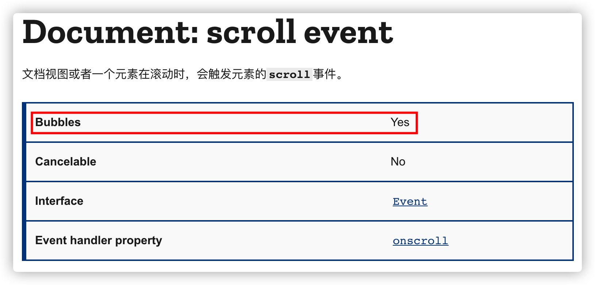
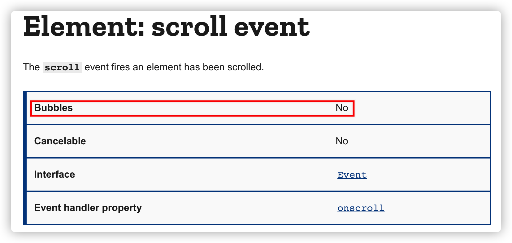

# DOM 事件模型

DOM2 Events 规范规定事件流分为 3 个阶段: **事件捕获、到达目标 和 事件冒泡**。

## 事件处理程序

1. HTML 事件处理程序

    `<input type="button" value="click me" onclick="console.log('click')" />`

   处理函数有一个特殊的局部变量：`event` 用来保存 `event` 对象

2. DOM0 事件处理程序

   `btn.onclick = xxx`

   DOM0 事件处理是发生在程序赋值时注册在事件流的冒泡阶段的，

   如果有多个 DOM0 事件处理程序的话，后面的是会把前面的给覆盖掉

3. DOM2 事件处理程序

> 1级 DOM 标准中并没有定义事件相关的内容，所以没有所谓的1级DOM事件模型。

   DOM 节点上通过 `addEventListener()` 和 `removeEventLinstener()` 来添加和移除事件处理程序，

   都接收 3 个参数：事件名、事件处理函数 和 一个 option 对象或一个布尔值 `useCapture`

   option 参数如下:

   - capture:  Boolean，表示 listener 会在该类型的事件捕获阶段传播到该 EventTarget 时触发。
   - once:  Boolean，表示 listener 在添加之后最多只调用一次。如果是 true， listener 会在其被调用之后自动移除。
   - passive: Boolean，设置为true时，表示 listener 永远不会调用 preventDefault()。如果 listener 仍然调用了这个函数，客户端将会忽略它并抛出一个控制台警告。

### passive

[Use passive listeners to improve scrolling performance](https://web.dev/uses-passive-event-listeners/)

## Event 对象

- type 事件类型
- currentTarget 事件流阶段调用对象
- target 事件触发对象
- preventDefault
- stopPropagation 阻止事件传播
- stopImmediatePropagation 阻止其他相同的事件处理
- [更多属性参考](https://developer.mozilla.org/zh-CN/docs/Web/API/Event)

## 相关实践

### scroll 与滚动穿透

**滚动穿透**，总得来说就是，上层元素发生滚动，相互叠层的下层元素也跟着滚动。

我们有一个认知误区就是我们设置了一个和屏幕一样大小的遮罩层，盖住了下面的内容，按理说我们应该能屏蔽掉下方的所有事件也就是说不可能触发下面内容的滚动。

scrollable 对象可分为两种类型（详见[W3C规范](https://www.w3.org/TR/2016/WD-cssom-view-1-20160317/#scrolling-events)）：

1. viewport ，target 为 Document
2. overflow scroll element，element 上的 scroll 事件是不冒泡的，document 上的 scroll 事件冒泡。

**并不是所有的事件都会冒泡**，也就是说并不是遮罩元素触发 scroll 冒泡到外层元素导致滚动。如果当前元素没有设置 overflow scroll 这样的属性，同时也没有 preventDefault 处理掉原生的滚动/滑动事件，那么此时触发的是 viewport 的滚动，即目标为 document。

#### 解决方案

1. 设置 body 的 overflow: hidden

   暴力解决，滚动是由于文档超出了一屏产生的，那么就让它超出部分 hidden 掉就好了。

2. 阻止会触发滚动行为的事件，移动端上主要是 touch 滑动行为触发滚动，监听 touch 事件，`e.preventDefault` 阻止默认的滚动行为，详细参考 [解析移动端滚动穿透](https://segmentfault.com/a/1190000020321154)。

3. 第三方库 [body-scroll-lock](https://github.com/willmcpo/body-scroll-lock)