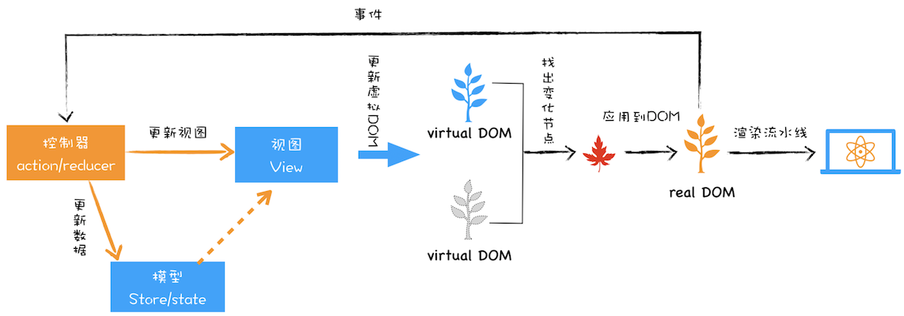

---
tags:
 - chrome
 - 浏览器原理
 - web
 - html
---
# 浏览器原理及API

本系列都是以 chrome/chromium 为主，参考学习资料：
- 极客时间《浏览器原理及API》
- [Inside look at modern web browser 系列](https://developers.google.com/web/updates/2018/09/inside-browser-part1)
- [Blink 文档链接](https://www.chromium.org/blink)

## 浏览器原理

- 多进程架构
    
  - 浏览器进程，主要负责界面显示、用户交互、子进程管理，同时提供存储等功能。
  - GPU进程 
  - 网络进程，网络资源加载。
  - 渲染进程，渲染页面、运行 JavaScript等。
  - 插件进程 
- [页面导航流程](./页面导航流程.md)
- [页面渲染流程](./页面渲染流程.md)
- [事件循环与消息队列](./消息队列与事件循环.md)
  - [Jake Archibald: 在循环 - JSConf.Asia](https://www.youtube.com/watch?v=cCOL7MC4Pl0)
  - [Tasks, microtasks, queues and schedules](https://jakearchibald.com/2015/tasks-microtasks-queues-and-schedules/)

## Web 安全策略

- 同源策略
  - js设置document.domain实现跨域
  - 跨域资源共享(CORS)
- 内容安全策略（CSP）

## Web 性能优化

- [Web 前端性能优化](./Web%20前端性能优化.md)
- 性能测试监控工具
  - Chrome DevTools
  - Lighthouse
  - [PagesTest](https://webpagetest.org/)

## Web API

- Web API 参考资料
  - [MDN](https://developer.mozilla.org/)
- Web API
  - 页面
    - DOM
      - [视图中的各种宽高偏移](./视图中的各种宽高偏移.md)
      - [DOM 事件模型](./DOM%20事件模型.md)
    - [WebComponent](./WebComponent.md)
    - [Canvas](./Canvas.md)
  - 存储
    - cookie
    - localStorage
    - sessionStorage
    - indexDB
  - 通信
    - 不同上下文（窗口、iframe、worker）
      - 页面：同源限制
        - window.opener + iframe.contentWindow（引用通信）
        - localStorage + storageEvent
        - SharedWorker + 消息通道
        - ServiceWorker
      - 消息通道机制
        - window.postMessage
        - MessageChannel
        - BroadcastChannel（同源限制）
    - 后端
      - 同源
        - ajax
        - fetch
      - 非同源
        - CORS
        - JSONP
        - (ProxyServer)
  - 硬件
    - [WebWork](./WebWork.md)
      - [task-worklet](https://github.com/developit/task-worklet)
      - [workerize](https://github.com/developit/workerize)
    - WebAssembly
      - [A cartoon intro to WebAssembly](https://hacks.mozilla.org/2017/02/a-cartoon-intro-to-webassembly/)
      - [Debugging WebAssembly with modern tools](https://developer.chrome.com/blog/wasm-debugging-2020/)
  - 其他
    - [PWA](./PWA.md)
      - https://lavas-project.github.io/pwa-book/
  - ResourceHints
    - [prerender](https://web.dev/speculative-prerendering/)
  - SanitizerAPI
    - [Safe DOM manipulation with the Sanitizer API](https://web.dev/sanitizer/)
  - WebRTC
    - [做一个视频通话给自己用吧](https://juejin.cn/post/7047309196445876231#heading-18)

## 场景分类

- 下载
  - [文件下载，搞懂这9种场景就够了](https://mp.weixin.qq.com/s/PysSe6MykjYzVrWQCKJXvg)
  - [动态表格大文件下载可以这样优化！](https://mp.weixin.qq.com/s/14bJxJ9U9mG76tw-Z93UqQ)
- 登陆鉴权
  - session-cookie
  - token
    - JWT

MVC，其核心思想就是将数据和视图分离
通过通信方式和控制器的不同实现，又分为
MVP
MVVM

 

DOM 操作会引发浏览器重排、重绘、合成操作
对 DOM 操作不当的话甚至还会触发强制同步布局和布局抖动的问题

虚拟 DOM？

