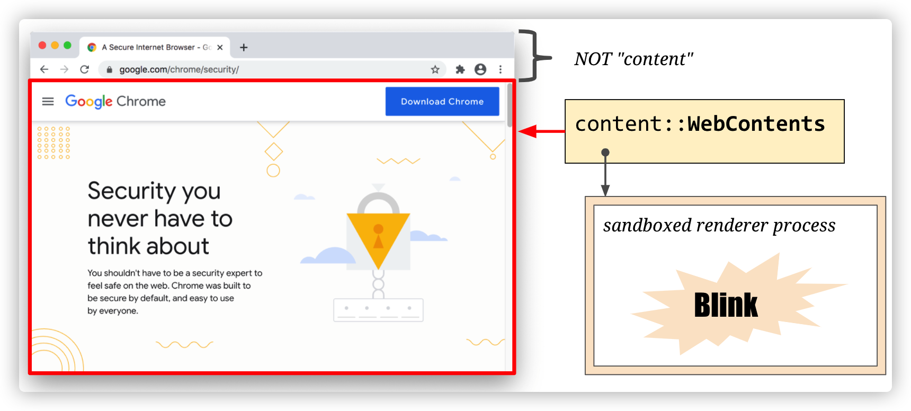

---
tags:
 - chrome
 - 浏览器原理
---
# 浏览器原理及API

> 本系列都是以 chrome/chromium 为主  
> 参考学习资料：
> - 极客时间《浏览器原理及API》
> - [Inside look at modern web browser 系列](https://developers.google.com/web/updates/2018/09/inside-browser-part1)
## 浏览器原理

- [多进程架构](./Chrome 多进程架构.md)
- [页面导航流程](./页面导航流程.md)
- [页面渲染流程](./页面渲染流程.md)
- [事件更新流程](./事件更新流程.md)
- 任务调度之事件循环

Web 安全策略
- 同源策略
- 内容安全策略（CSP）

## Web 应用性能优化
## Web API

- DOM
  - [视图中的各种宽高偏移](./视图中的各种宽高偏移.md)
- 页面通信
  - 同源
    - Broadcast Channel API
    - postMessage API
    - localStorage + storage 事件
  - 非同源
    - postMessage API
- [PWA](./PWA.md)
- [WebComponent](./WebComponent.md)
- WebWork
- [Canvas](./Canvas.md)

### 场景分类

- 下载
  - [文件下载，搞懂这9种场景就够了](https://mp.weixin.qq.com/s/PysSe6MykjYzVrWQCKJXvg)

## Blink（渲染引擎）

浏览器是如何将 web content 转变成屏幕显示的像素，也就是我们看到的页面

web content 一般指的是构成网页的物件（文本、图片、HTML、CSS、JS），
其他内容 `<video>`, `<canvas>`, `WebAssembly`, `WebGL`, `WebVR`, `PDF`, … 则通过其他方式进行。
因为只有 web content 的才是由渲染进程(沙箱模式)进行处理渲染的。

其中 Blink 是一个 Web 渲染引擎，主要功能如下：
- 实现了 HTML 标准规范
- 嵌入 V8 引擎去执行 JavaScript 代码
- 请求网络资源？TODO
- 构建 DOM 树
- 计算样式和布局
- 嵌入 [Chrome Compositor](https://chromium.googlesource.com/chromium/src/+/HEAD/cc/README.md) 去绘制图形

Blink 作为渲染引擎被嵌入到 Chromium、Opera，WebView 等浏览器客户端中并提供 [content public APIs](https://chromium.googlesource.com/chromium/src/+/HEAD/content/public/README.md) 使用。

Blink 就像是胶水一样，连接调用不同基础组件（V8、Skia等），处理 web 标准规范的 content。（PS：这也是 web 能够快速发展的原因，并不需要通过编译打包，只需要输入纯文本的HTML、JS、CSS，内部便帮我即时处理渲染）

**渲染引擎解析处理 web content 后转换成底层操作系统提供的图形库调用去显示页面像素**，在多平台的今天，有标准 API 图形库 OpenGL，但在 window 平台，还需要额外转换成 DirectX API 调用，未来还将实现更多图形库支持，如 vulkan

> [Blink 文档链接](https://www.chromium.org/blink)

> 注：由于 Chrome 对 Blank 引擎某些实现的修改，某些我们之前熟知的类名有了变化，比如 RenderObject 变成了 LayoutObject，RenderLayer 变成了 PaintLayer。感兴趣的看以参阅 [Slimming Paint](https://www.chromium.org/blink/slimming-paint?spm=taofed.bloginfo.blog.2.1d175ac8atKvCQ)