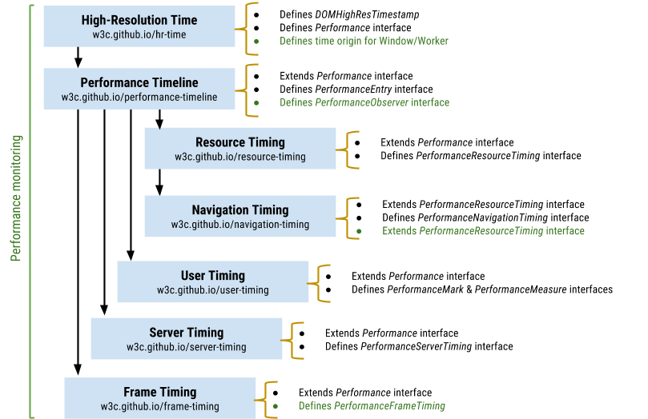
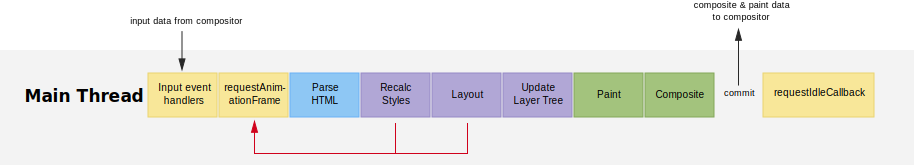

# Web 前端性能优化

Web 前端性能优化，其实本质就是要让页面更快地显示和响应。性能优化的手段有很多种，关键是

1. 制定**性能指标**
2. 性能测试、监控
   1. 前端异常监听
   2. 错误上报
3. 系统化的**性能优化**指导
  
## 性能指标

- 加载速度
- 加载响应
- 交互响应
- 视觉稳定性
- 平滑度

以用户为核心的性能指标：

- FLP（Largest Contentful Paint）：最大内容绘制，可视区域内可见的最大图像或文本块完成渲染的时间
- 加载响应度
  - FID（First Input Delay）：首次输入延迟，标识用户第一次与页面交互到浏览器真正能够开始处理事件处理程序以响应该交互的时间
      
  - TTI（Time to Interactive）：表示网页首次完全达到可交互状态的时间点
  - TBT（Total Blocking Time）：总阻塞时间，FCP 和 TTI 之间发生的每个长任务的阻塞时间总和，用于量化在页面交互性变为可靠前，不可交互程度的严重性
- CLS（累积布局偏移）：测量视觉稳定性

Core Web Vitals

文档加载过程：TTFB
DCL：空白到出现内容所花费的时间
L：onLoad 事件触发所需时间

LCP：视窗内最大的元素绘制的时
首屏时间：页面可视区域内容以完全呈现时间，FSP
- 加载
- 渲染
  - 白屏时间：页面空白时间，FP&FCP
    - FP（First Paint）：首次绘制的时间点，可以视为白屏时间
    - FCP（First Contentful Paint）：首次内容绘制，页面首次出现文本或图像（背景、图片、svg 元素或非白色的 canvas 元素）内容
- 交互
  - 可交互时间：用户首次可交互时间，FCI
  - 可持续交互时间：用户首次可完全可持续交互时间，TTI
  - FPS

工具
- **在实验室中：**使用工具在稳定、受控的环境中模拟页面加载
- 在实际情况中：基于真实用户的实际页面加载与页面交互

  
## 性能测试工具

- 线下实验测试
- 线上真实测试

- Performance API
- web-vitals
- [Chrome 开发者工具](https://developer.chrome.com/docs/devtools/)
- Lighthouse
- [PageSpeed Insights](https://pagespeed.web.dev/?utm_source=psi&utm_medium=redirect)：关注性能 + 用户数据测试

## 性能优化指南

- 资源加载（了解 浏览器 http 请求流程）
  - Queuing：浏览器资源调度
    - 资源优先级
    - 域名请求数限制（http/1.1 浏览器为每个域名最多维护 6 个连接导致的）
      - 链接并发
      - 域名分片
      - 资源合并打包
        - 雪碧图
      - http/2.0（多路复用）
  - TTFB：服务端响应速度的重要指标
    - 请求过大
      - 发送请求头时带上了多余的用户信息
        - http/2.0（头部压缩）
    - 服务器响应
  - Content Download
    - 响应数据过大
      - 前端资源
        - 去掉注释、混淆、压缩
        - 按需引入
        - tree-shaking 去掉不必要的代码
        - 分包、懒加载
  - 网络因素
    - 宽带速度
    - TCP：丢包
    - （缩短）请求链路
        - CDN
        - http 缓存
- 加载
  - 白屏（当浏览器发起页面请求后到提交数据阶段，这时页面展示出来的还是之前页面的内容。渲染进程“确认提交”之后会创建一个空白页面，我们通常把这段时间称为**解析白屏**，这也就是 Web 应用与原生应用体验最大的区别之一，这对用户体验影响很大。）：加载关键渲染资源（Html、JavaScript、CSS 等）阻塞到关键渲染路径（Critical Rendering Path）
    - 减少关键资源个数
      - 合并请求，通过内联 JavaScript、CSS 来移除这两种类型的文件下载
      - async 或者 defer
    - 减少关键资源大小
      - 压缩 HTML、JS、CSS 压缩
      - 删除注释
      - JS
        - tree-shaking
        - 拆分文件
          - 懒加载
          - 异步加载
          - 按需加载，第三方组件库依赖过大,会给首屏加载带来很大的压力，一般解决方式是按需求引入组件。
      - CSS
        - 异步加载
          - loadCSS
- 交互渲染
  - 绘制一帧生命周期  
    
  - 生成一帧的方式，有重排、重绘和合成三种方式
    - 通知主线处理事件：JavaScript 修改 DOM 或者 CSSOM，导致渲染流水线
      - 重排
      - 重绘
      - 合成线程直接进行页面合成
  - 性能优化原则：避免抢占主线程过多时间，让渲染引擎稳定生成更多帧，提高帧率
    - 对输入处理程序防抖
    - 减少 JavaScript 脚本执行时间
      - 时间分片
      - 多线程：WebWork
    - 避免[强制同步布局和布局抖动](#强制同步布局和布局抖动)
      - 尽量不要在修改 DOM 结构时再去执行 DOM 查询操作
      - 异步更新、批量处理方式
    - 合理利用分层合成机制
      > 合成操作是在合成线程上完成的，这也就意味着在执行合成操作时，是不会影响到主线程执行的
      - 利用 CSS3 实现动画
      - 将元素提升单独图层：减少重绘范围
        - will-change，能够将要执行动画的某个元素提前单独生成一个图层
        - translateZ
    - 避免频繁的垃圾回收
      - 避免内存泄漏
    
### 关键资源加载优化

> 阻塞网页首次渲染的资源称为关键资源

JavaScript、CSS 这类关键资源的加载会阻塞到页面渲染，而且还涉及到一个很关键的用户体验指标“**首屏渲染**”。

## 渲染阻塞

- html
  - 流式解析：HTML 解析器并不是等整个文档加载完成之后再解析的，而是网络进程加载了多少数据，HTML 解析器便解析多少数据
  - 预解析：当渲染引擎收到字节流之后，会开启一个预解析线程，用来分析 HTML 文件中包含的 JavaScript、CSS 等相关文件，解析到相关文件之后，预解析线程会提前下载这些文件
  - 浏览器可以增量地构建 DOM 树、增量渲染，只要有可用的 DOM 就不需要等待 DOM 完全解析再渲染
- js：阻止 DOM 解析
- css：css 解析不是增量过程，如果浏览器在解析样式表内容时开始逐步构建 CSSOM，它将导致渲染树的多次渲染，造成 FOUC 因为 css 的可重叠样式规则
  - 内嵌：会阻塞 DOM 解析，直到内嵌 CSS 解析完成
  - 外链
    - link in head
      - 一般不会阻塞 DOM 解析
      - 但如果后面跟 JS 脚本的情况，会阻塞后面 JS 脚本执行，相当于间接导致阻塞 DOM 解析
        > JavaScript 引擎在解析 JavaScript 之前，是不知道 JavaScript 是否操纵了 CSSOM 的，所以渲染引擎在遇到 JavaScript 脚本时，不管该脚本是否操纵了 CSSOM，都会执行 CSS 文件下载，解析操作，再执行 JavaScript 脚本。
      - 阻塞渲染
        > - 浏览器在渲染页面的过程需要解析 HTML、CSS 以得到 DOM 树和 CSS 规则树，它们结合后才生成最终的渲染树并渲染，一旦浏览器发出获取外部样式表的请求，渲染树的构建就会停止，因此，关键渲染路径( CRP ) 也被卡住，屏幕上没有渲染任何内容
        > - 浏览器可以使用 CSSOM 树的旧状态来生成渲染树，因为 HTML 正在被解析以在屏幕上逐步渲染事物。但这有一个巨大的缺点。在这种情况下，一旦样式表被下载和解析，并且 CSSOM 被更新，渲染树将被更新并呈现在屏幕上。现在，使用旧 CSSOM 生成的渲染树节点将使用新样式重新绘制，并且还可能导致无样式内容( FOUC )闪烁，这对 UX 非常不利。因此浏览器将等到样式表被加载和解析。一旦样式表被解析并且 CSSOM 被更新，渲染树被更新，并且CRP 被解锁，这导致渲染树在屏幕上的绘制。由于这个原因，建议尽可能早地加载所有外部样式表，可能在head部分中。
    - link in body

- 资源预获取/预加载（prefetch/preload）
- JS 资源优化，async 或 defer 标记外链脚本
  - 加载顺序控制
    - defer 
      - 不会阻塞页面
      - 等到 DOM 解析完毕，但在 DOMContentLoaded 事件之前执行
      - 具有 defer 特性的脚本保持其相对顺序，就像常规脚本一样
    - async
      - 不阻塞页面
      - 加载就绪时运行
    - preload
    - 动态脚本，类似 async
      - 显式地设置了 `script.async=false`，则可以改变这个规则。然后脚本将按照脚本在文档中的顺序执行，就像 defer 那样
- css
  - media，拆分CSS

通过确定加载哪些资源的优先级、控制它们的加载顺序以及减小这些资源的文件大小来提高页面加载速度。性能提示包括 1) 通过推迟下载、将它们标记为异步或完全消除它们来最小化关键资源的数量，2) 优化所需的请求数量以及每个请求的文件大小，以及 3) 优化在通过优先下载关键资源加载哪些关键资源，缩短关键路径长度。

### 强制同步布局和布局抖动

正常情况下渲染任务中的样式计算、布局计算都是在另外的任务中异步完成的

  

如果在修改 DOM 结构时候再去执行 DOM 查询操作，就会发生强制同步布局。

所谓强制同步布局，是指 JavaScript 强制将计算样式和布局操作提前到当前的任务中。

 

布局抖动，是指在一次 JavaScript 执行过程中，多次执行强制布局和抖动操作。

  

**如此频繁会大大影响当前函数的执行效率，从而阻塞其他渲染任务执行**。

## 123

DOMContentLoaded，这个事件发生后，说明页面已经构建好 DOM 了，这意味着构建 DOM 所需要的 HTML 文件、JavaScript 文件、CSS 文件都已经下载完成了。
Load，说明浏览器已经加载了所有的资源（图像、样式表等）

时间换空间
- 缓存
- 空间换时间
- 压缩

图片
- webp

RTT 就是这里的往返时延。它是网络中一个重要的性能指标，表示从发送端发送数据开始，到发送端收到来自接收端的确认，总共经历的时延。通常 1 个 HTTP 的数据包在 14KB 左右，所以 1 个 0.1M 的页面就需要拆分成 8 个包来传输了，也就是说需要 8 个 RTT。

在优化实际的页面加载速度时，你可以先画出优化之前关键资源的图表，然后按照上面优化关键资源的原则去优化，优化完成之后再画出优化之后的关键资源图表。

- 文本文件（html、svg、js、css等）
- 二进制文件
  - 字体
  - 图片
    - 格式
    - 压缩
    - 根据预期用途调整图像大小

使用 Chrome DevTools 快速确定绘制瓶颈

除 transform 或 opacity 属性之外，更改任何属性始终都会触发绘制。
坚持使用 transform 和 opacity 属性更改来实现动画。

使用 will-change 或 translateZ 提升移动的元素。
避免过度使用提升规则；各层都需要内存和管理开销。

降低选择器的复杂性；使用以类为中心的方法，例如 BEM。
减少必须计算其样式的元素数量。

计算元素的计算样式的最糟糕的开销情况是元素数量乘以选择器数量

Monitor and analyze the app

优化加载顺序

减少打包时间：缩减范围、缓存副本、定向搜索、提前构建、并行构建、可视结构
减少打包体积：分割代码、摇树优化、动态垫片、按需加载、作用提升、压缩资源

提交数据之后渲染进程会创建一个空白页面，我们通常把这段时间称为解析白屏，并等待 CSS 文件和 JavaScript 文件的加载完成，生成 CSSOM 和 DOM，然后合成布局树，最后还要经过一系列的步骤准备首次渲染。