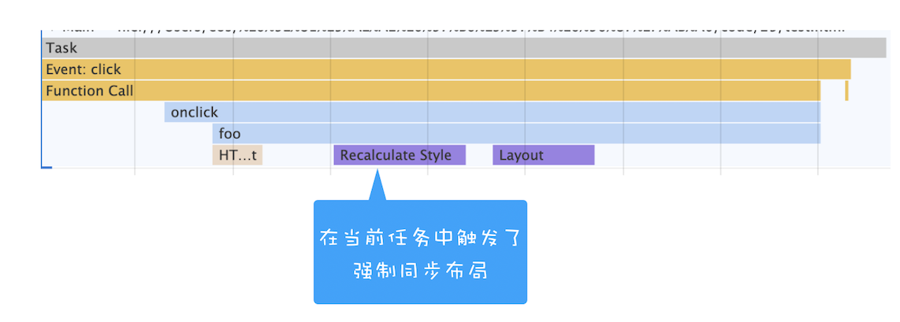
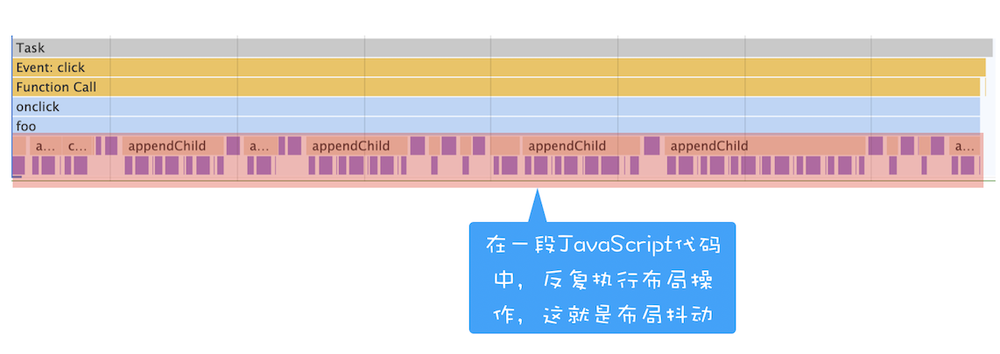

# Web 前端性能优化

通常一个页面有三个阶段：

- 加载阶段，是指从发出请求到渲染出完整页面的过程（首次渲染），影响到这个阶段的主要因素有网络和 JavaScript 脚本。
  - 网络请求
  - 页面加载与 DOM 生成
- 交互阶段，主要是从页面加载完成到用户交互的整合过程，影响到这个阶段的主要因素是 JavaScript 脚本。
  > 原则就是避免抢占主线程过多时间，让渲染任务更快执行，提高渲染帧的输出速度
  - 减少 JavaScript 脚本执行时间
    - 耗时任务分片
    - webwork
  - 避免强制同步布局和布局抖动
    - 尽量不要在修改 DOM 结构时再去执行 DOM 查询操作
  - 合理利用 CSS 合成动画
    - will-change，能够将要执行动画的某个元素提前单独生成一个图层
  - 避免频繁的垃圾回收
- 关闭阶段，主要是用户发出关闭指令后页面所做的一些清理操作。

## 交互阶段：页面更新

页面交互阶段基本会发生页面更新。

更新渲染流水线

合成线程监听页面交互事件，通知主线处理事件。

大部分情况下，生成一个新的帧都是由 

1. JavaScript 通过修改 DOM 或者 CSSOM 来触发的
2. CSS 来触发的

CSS 触发的都是通过 CSS 实现一些变形、渐变、动画等特效，这种直接在合成线程上执行的，它不会触发重排或者重绘，而且合成操作本身的速度就非常快，所以执行合成是效率最高的方式。

而 JavaScript 修改 DOM 或者 CSSOM 来触发的，会导致重排或者重绘，然后触发后续渲染流水线的一系列操作，这个代价是非常大的。

## 强制同步布局和布局抖动

正常情况下渲染任务中的样式计算、布局计算都是在另外的任务中异步完成的

  

如果在修改 DOM 结构时候再去执行 DOM 查询操作，就会发生强制同步布局。

所谓强制同步布局，是指 JavaScript 强制将计算样式和布局操作提前到当前的任务中。

 

布局抖动，是指在一次 JavaScript 执行过程中，多次执行强制布局和抖动操作。

  

**如此频繁会大大影响当前函数的执行效率，从而阻塞其他渲染任务执行**。

## 页面加载与 DOM 生成

`DOM => 页面首次渲染`

DOM 的生成会影响页面首次渲染

`JS => DOM`

《script〉

CSS => CSSOM => JS

不过 Chrome 浏览器做了很多优化，其中一个主要的优化是预解析操作。当渲染引擎收到字节流之后，会开启一个预解析线程，用来分析 HTML 文件中包含的 JavaScript、CSS 等相关文件，解析到相关文件之后，预解析线程会提前下载这些文件。

而 JavaScript 引擎在解析 JavaScript 之前，是不知道 JavaScript 是否操纵了 CSSOM 的，所以渲染引擎在遇到 JavaScript 脚本时，不管该脚本是否操纵了 CSSOM，都会执行 CSS 文件下载，解析操作，再执行 JavaScript 脚本。

JavaScript 会阻塞 DOM 生成，而样式文件又会阻塞 JavaScript 的执行

这些能阻塞网页首次渲染的资源称为关键资源

- 关键资源个数
  - 资源内联
  - 当 JavaScript 标签加上了 async 或者 defer、CSSlink 属性之前加上了取消阻止显现的标志后，它们就变成了非关键资源了。
- 关键资源大小
  - 资源压缩
  - 移除移除 HTML、CSS、JavaScript 文件中不必要的内容，如注释和代码
- 关键资源的 RTT 次数
  - 如何减少关键资源 RTT 的次数？可以通过减少关键资源的个数和减少关键资源的大小搭配来实现。除此之外，还可以使用 CDN 来减少每次 RTT 时长。

总的优化原则就是减少关键资源个数，降低关键资源大小，降低关键资源的 RTT 次数

1. `<script>` 元素会阻塞 HTML 解析
2. 因为 JavaScript 文件的下载过程会阻塞 DOM 生成。Chrome 浏览器做了很多优化，其中一个主要的优化是预解析操作
3. 页面生成是等全部 html parse 完还是 body 开始解析？
4. defer/async/preload等属性来标记<script>标签，来控制 JavaScript 的加载顺序。
5. 如果 JavaScript 文件中没有操作 DOM 相关代码，就可以将该 JavaScript 脚本设置为异步加载，通过 async 或 defer 来标记代码
6. async 和 defer 虽然都是异步的，不过还有一些差异，使用 async 标志的脚本文件一旦加载完成，会立即执行；而使用了 defer 标记的脚本文件，需要在 DOMContentLoaded 事件之前执行。
7. defer标记的多个脚本需要按顺序执行？ 而aysnc标记的多个脚本是无序的
8. async 脚本如果有 DOM 操作结果如何
9. 浏览器在渲染页面的过程需要解析 HTML、CSS 以得到 DOM 树和 CSS 规则树，它们结合后才生成最终的渲染树并渲染。因此，我们还常常将 CSS 放在<head>里，可用来避免浏览器渲染的重复计算。

如果我们直接在document.body上进行事件委托，可能会带来额外的问题。由于浏览器在进行页面渲染的时候会有合成的步骤，合成的过程会先将页面分成不同的合成层，而用户与浏览器进行交互的时候需要接收事件。此时，浏览器会将页面上具有事件处理程序的区域进行标记，被标记的区域会与主线程进行通信。

如果我们document.body上被绑定了事件，这时候整个页面都会被标记。即使我们的页面不关心某些部分的用户交互，合成器线程也必须与主线程进行通信，并在每次事件发生时进行等待。这种情况，我们可以使用passive: true选项来解决。

JS 会阻塞 DOM
如果有 CSS 加载，那么 CSS 会阻塞 JS执行

所以如果代码里引用了外部的 CSS 文件，那么在执行 JavaScript 之前，还需要等待外部的 CSS 文件下载完成，并解析生成 CSSOM 对象之后，才能执行 JavaScript 脚本。

RTT 就是这里的往返时延。它是网络中一个重要的性能指标，表示从发送端发送数据开始，到发送端收到来自接收端的确认，总共经历的时延。

老师，如果操作dom引起了重拍或重绘，是整个页面从0开始吗，哪些没变化的地方也会重拍重绘吗？比如我把页面最后的元素大小改变了，上面的都没发生变化，这样上面哪些没有变化的也会重拍重绘吗？

HTMLParser
HTML 解析器并不是等整个文档加载完成之后再解析的，而是网络进程加载了多少数据，HTML 解析器便解析多少数据。

那详细的流程是怎样的呢？网络进程接收到响应头之后，会根据响应头中的 content-type 字段来判断文件的类型，比如 content-type 的值是“text/html”，那么浏览器就会判断这是一个 HTML 类型的文件，然后为该请求选择或者创建一个渲染进程。渲染进程准备好之后，网络进程和渲染进程之间会建立一个共享数据的管道，网络进程接收到数据后就往这个管道里面放，而渲染进程则从管道的另外一端不断地读取数据，并同时将读取的数据“喂”给 HTML 解析器。你可以把这个管道想象成一个“水管”，网络进程接收到的字节流像水一样倒进这个“水管”，而“水管”的另外一端是渲染进程的 HTML 解析器，它会动态接收字节流，并将其解析为 DOM。

额外说明一下，渲染引擎还有一个安全检查模块叫 XSSAuditor，是用来检测词法安全的。在分词器解析出来 Token 之后，它会检测这些模块是否安全，比如是否引用了外部脚本，是否符合 CSP 规范，是否存在跨站点请求等。如果出现不符合规范的内容，XSSAuditor 会对该脚本或者下载任务进行拦截。详细内容我们会在后面的安全模块介绍，这里就不赘述了。

解析将停止，当它遇到<link>，<script>和<style>标签