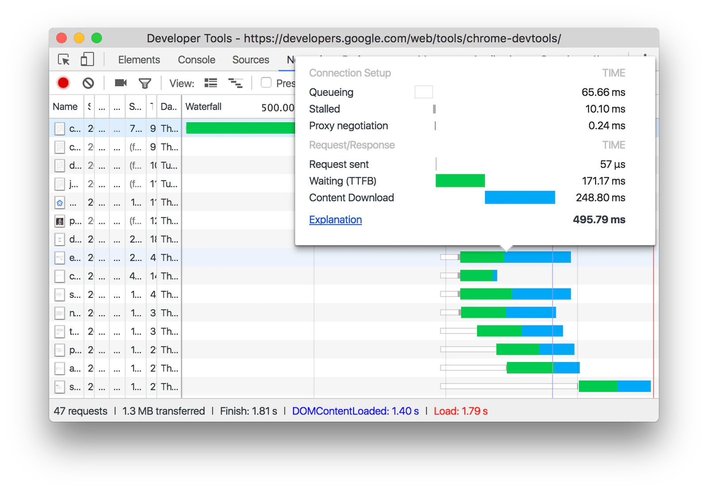

# Web 前端性能优化

Web 前端性能优化，其实本质就是要让页面更快地显示和响应。

性能优化的手段有很多种，关键是

1. 制定**性能指标**
2. 搭建**性能监控**
3. 形成系统的**性能优化**指导思想
  
## 性能指标

## 性能优化

- 网络层面
  - http 缓存
  - CDN
  - 构建工具：打包压缩
    - （资源）分割代码、懒加载、摇树优化、动态垫片、按需加载、作用提升、压缩资源
- 渲染层面
  - 首屏渲染（关键渲染资源 JavaScript、CSS 等加载）
  - 交互渲染（性能优化原则：避免抢占主线程过多时间，让渲染引擎稳定生成更多帧，提高帧率。）
    - 减少 JavaScript 脚本执行时间
      - 时间分片（针对耗时任务）
      - WebWork
    - 避免[强制同步布局和布局抖动](#强制同步布局和布局抖动)
      - 尽量不要在修改 DOM 结构时再去执行 DOM 查询操作
    - 合理利用[分层合成机制](#分层合成的机制)
      > 合成操作是在合成线程上完成的，这也就意味着在执行合成操作时，是不会影响到主线程执行的
      - 利用 CSS3 合成动画
      - 将元素提升单独图层
      - will-change，能够将要执行动画的某个元素提前单独生成一个图层
    - 避免频繁的垃圾回收
      - 避免内存泄漏

- 页面加载阶段
  > 是指从发出请求到渲染出完整页面的过程，影响到这个阶段的主要因素有 http 请求和阻塞渲染的关键资源 JavaScript、CSS。
  - [http 请求](#浏览器%20http%20请求流程)
    - 网络优化
    - 请求数量
      - 并发请求（http 队头阻塞、浏览器TCP连接限制）
        - 域名分片
        - 升级 http2
      - 内联请求（资源合并）
    - 减少资源大小
      - 压缩、混淆
      - 删除无效内容
    - 资源分割
      - 懒加载
  - 关键资源加载优化（首屏渲染）
    - 减少关键资源个数
      - 合并请求，通过内联 JavaScript、CSS 来移除这两种类型的文件下载
      - async 或者 defer
    - 减少关键资源大小
      - 压缩 HTML、JS、CSS 压缩
      - 删除注释
      - JS
        - tree-shaking
        - 拆分文件
          - 懒加载
          - 异步加载
          - 按需加载，第三方组件库依赖过大,会给首屏加载带来很大的压力，一般解决方式是按需求引入组件。
      - CSS
        - 异步加载
          - loadCSS
  
  

### 浏览器 http 请求流程

浏览器 http 请求流程: 

#### DevTool 网络面板查看请求时间线

  

- Queuing: 等待 TCP 队列
  - 页面中的资源是有优先级的，CSS、HTML、JavaScript 等核心资源优先级最高；图片、视频等相对比较低
    >   
  - TCP 数量限制，浏览器会为每个域名最多维护 6 个 TCP 连接
- Waiting (TTFB)，通常也称为“第一字节时间”。 
  - 反映服务端响应速度的重要指标
  - 网络因素
- Content Download，资源内容下载
  - 资源大小
  - 网络因素
- [其他 timing-explanation](https://developer.chrome.com/docs/devtools/network/reference/#timing-explanation)

### 关键资源加载优化

> 阻塞网页首次渲染的资源称为关键资源

JavaScript、CSS 这类关键资源的加载会阻塞到页面渲染，而且还涉及到一个很关键的用户体验指标“**首屏渲染**”。

### 首屏渲染

当浏览器发起页面请求后到提交数据阶段，这时页面展示出来的还是之前页面的内容。渲染进程“确认提交”之后会创建一个空白页面，我们通常把这段时间称为**解析白屏**，这也就是 Web 应用与原生应用体验最大的区别之一，这对用户体验影响很大。

> 导航流程

白屏时间主要是因为加载解析执行 JavaScript、CSS 这些阻塞页面渲染的关键资源

- html
  - 边加载边解析：HTML 解析器并不是等整个文档加载完成之后再解析的，而是网络进程加载了多少数据，HTML 解析器便解析多少数据
  - 预解析：当渲染引擎收到字节流之后，会开启一个预解析线程，用来分析 HTML 文件中包含的 JavaScript、CSS 等相关文件，解析到相关文件之后，预解析线程会提前下载这些文件
  - 只有 js 脚本会阻塞 DOM 构建（解析），其他资源都不会
- js 
  - 内嵌
    - 停止 DOM 解析，等待执行 JS 完毕
  - 外链
    - 停止 DOM 解析，等待加载并执行 JS 完毕
- css
  > css 解析不是增量过程，如果浏览器在解析样式表内容时开始逐步构建 CSSOM，它将导致渲染树的多次渲染，因为 css 的可重叠样式规则
  - 内嵌
    - 会阻塞 DOM 解析，直到内嵌 CSS 解析完成
  - 外链
    - 不会阻塞 DOM 解析
    - 但会阻塞后面 JS 脚本执行，相当于间接导致阻塞 DOM 解析
    > JavaScript 引擎在解析 JavaScript 之前，是不知道 JavaScript 是否操纵了 CSSOM 的，所以渲染引擎在遇到 JavaScript 脚本时，不管该脚本是否操纵了 CSSOM，都会执行 CSS 文件下载，解析操作，再执行 JavaScript 脚本。
    - 阻塞渲染
    > - 浏览器在渲染页面的过程需要解析 HTML、CSS 以得到 DOM 树和 CSS 规则树，它们结合后才生成最终的渲染树并渲染，一旦浏览器发出获取外部样式表的请求，渲染树的构建就会停止，因此，关键渲染路径( CRP ) 也被卡住，屏幕上没有渲染任何内容
    > - 浏览器可以使用 CSSOM 树的旧状态来生成渲染树，因为 HTML 正在被解析以在屏幕上逐步渲染事物。但这有一个巨大的缺点。在这种情况下，一旦样式表被下载和解析，并且 CSSOM 被更新，渲染树将被更新并呈现在屏幕上。现在，使用旧 CSSOM 生成的渲染树节点将使用新样式重新绘制，并且还可能导致无样式内容( FOUC )闪烁，这对 UX 非常不利。因此浏览器将等到样式表被加载和解析。一旦样式表被解析并且 CSSOM 被更新，渲染树被更新，并且CRP 被解锁，这导致渲染树在屏幕上的绘制。由于这个原因，建议尽可能早地加载所有外部样式表，可能在head部分中。
  - link in body
  - 第一个是提供给 JavaScript 操作样式表的能力，第二个是为布局树的合成提供基础的样式信息。

- JS 资源优化，async 或 defer 标记外链脚本
  - 加载顺序控制
    - defer 
      - 不会阻塞页面
      - 等到 DOM 解析完毕，但在 DOMContentLoaded 事件之前执行
      - 具有 defer 特性的脚本保持其相对顺序，就像常规脚本一样
    - async
      - 不阻塞页面
      - 加载就绪时运行
    - preload
    - 动态脚本，类似 async
      - 显式地设置了 `script.async=false`，则可以改变这个规则。然后脚本将按照脚本在文档中的顺序执行，就像 defer 那样
- css
  - media，拆分CSS

通过确定加载哪些资源的优先级、控制它们的加载顺序以及减小这些资源的文件大小来提高页面加载速度。性能提示包括 1) 通过推迟下载、将它们标记为异步或完全消除它们来最小化关键资源的数量，2) 优化所需的请求数量以及每个请求的文件大小，以及 3) 优化在通过优先下载关键资源加载哪些关键资源，缩短关键路径长度。

浏览器可以增量地构建 DOM 树、增量渲染，只要有可用的 DOM 就不需要等待 DOM 完全解析再渲染。
## 交互阶段：页面更新

页面交互阶段基本会发生页面更新，如何保证页面不卡顿，就是页面帧率尽量达到显示器刷新频率。

### 显示器显示图像原理

每个显示器都有固定的刷新频率，通常是 60HZ，也就是每秒 60 次读取显卡的**前缓冲区**。

显卡的职责就是合成新的图像，并将图像保存到后缓冲区中，一旦显卡把合成的图像写到后缓冲区，系统就会让后缓冲区和前缓冲区互换，这样就能保证显示器能读取到最新显卡合成的图像。

渲染引擎会通过渲染流水线生成新的图片，并发送到显卡的后缓冲区。

> 在 GPU 加速的场景下渲染引擎则是借助 GPU 去合成图片

渲染引擎生成的每一张图片称为一帧，每秒更新了多少帧称为帧率，比如 1 秒更新了 60 帧，那么帧率就是 60Hz（或者 60FPS）。为了保证图像显示流程，那么帧率就需要尽量达到显示器刷新频率，比如大多数设备屏幕的更新频率是 60 次 / 秒，那么渲染引擎需要每秒更新 60 张图片到显卡的后缓冲区。

> 现在大多数显示器刷新率在 60Hz，

### 渲染流水线的更新流程

渲染流水线生成一帧的方式，有重排、重绘和合成三种方式。

更新流程

- 合成线程监听页面交互事件
  - 通知主线处理事件
    - JavaScript 修改 DOM 或者 CSSOM，导致渲染流水线
      > 重排和重绘操作都是在渲染进程的主线程上执行的，会占用主线程
      - 重排
      - 重绘
  - 合成线程直接进行页面合成

## 强制同步布局和布局抖动

正常情况下渲染任务中的样式计算、布局计算都是在另外的任务中异步完成的

  

如果在修改 DOM 结构时候再去执行 DOM 查询操作，就会发生强制同步布局。

所谓强制同步布局，是指 JavaScript 强制将计算样式和布局操作提前到当前的任务中。

 

布局抖动，是指在一次 JavaScript 执行过程中，多次执行强制布局和抖动操作。

  

**如此频繁会大大影响当前函数的执行效率，从而阻塞其他渲染任务执行**。

## 分层合成的机制

为了提升每帧的渲染效率，Chrome 引入了分层和合成的机制，相较于重排和重绘，合成操作的在渲染流水路径就显得非常短了。

分层合成的机制主要分为

- 分层
- 分块
- 合成

浏览器把页面分成多个图层，每个图层就像是一张单独图片。页面发生更新时，合成线程只需要对单个图层进行整体修改，然后直接将所有图层合成图片即可。

通常情况下，页面的内容都要比屏幕大得多，分块的目的是为了优先绘制可视区域的内容。

> 渲染流程

> 不涉及图层的内容的操作能直接在合成线程中完成，比如操作的是整个图层的几何变换，透明度变换，阴影等，这些变换都不会影响到图层的内容，而文字信息的改变，布局的改变，颜色的改变，统统不会涉及，涉及到这些内容的变化就要牵涉到重排或者重绘了。

首屏渲染优化问题,资源加载所带来的白屏问题

小程序采用的技术手段仍脱离不了 Web 渲染方案，即采用 WebView 作为渲染引擎、JSBridge 的封装和离线包机制等，但是其最大创新之处在于将渲染层和逻辑层进行了分离，提供一个干净纯粹的 JavaScript 运行时，多 WebView 的架构使得用户体验进一步逼近原生体验。

和之前的 Web 渲染技术相比较来看，小程序采用多 WebView + 双线程模型的架构
1. 使用双线程架构将渲染层和逻辑层进行了分离
2. 渲染层使用多 WebView 架构进一步提升性能体验

原生渲染方案的基本思路是在 UI 层采用前端框架，然后通过 JavaScript 引擎解析 JS 代码，JS 代码通过 Bridge 层调用原生组件和能力，代表的框架是 React Native 和 Weex。
从原生渲染方案的实现思路不难看出，顶层采用类 Web 框架用于降低开发成本和统一技术栈，UI 的渲染通过 JSBridge 由原生控件直接接管，从而获得性能和体验的提升。

网络因素
- 丢包问题