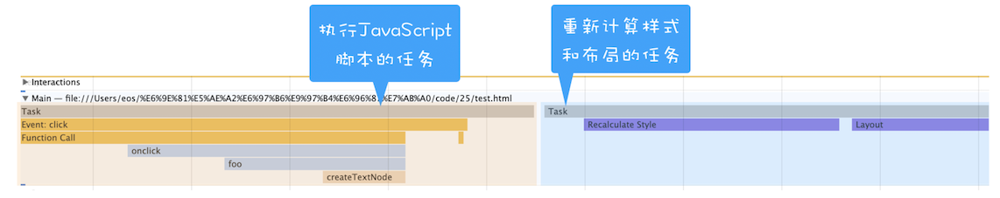

# Web 前端性能优化

通常一个页面有三个阶段：

- 加载阶段，是指从发出请求到渲染出完整页面的过程，影响到这个阶段的主要因素有网络和 JavaScript 脚本。
  - 资源请求
  - 资源加载与 DOM 生成
- 交互阶段，主要是从页面加载完成到用户交互的整合过程，影响到这个阶段的主要因素是 JavaScript 脚本。
  > 原则就是避免抢占主线程过多时间，让渲染任务更快执行，提高渲染帧的输出速度
  - 减少 JavaScript 脚本执行时间
    - 任务时间分片
    - web work
  - 避免强制同步布局和布局抖动
    - 尽量不要在修改 DOM 结构时再去执行 DOM 查询操作
  - 避免频繁的垃圾回收
  - 合理利用 CSS 合成动画
    > 合成动画是直接在合成线程上执行的，避免抢占主线程任务，即使主线繁忙，CSS 动画依然能流畅执行
    - will-change，能够将要执行动画的某个元素提前单独生成一个图层
- 关闭阶段，主要是用户发出关闭指令后页面所做的一些清理操作。

## 强制同步布局和布局抖动

正常情况下渲染任务中的样式计算、布局计算都是在另外的任务中异步完成的

  

如果在修改 DOM 结构时候再去执行 DOM 查询操作，就会发生强制同步布局。

所谓强制同步布局，是指 JavaScript 强制将计算样式和布局操作提前到当前的任务中。

 

布局抖动，是指在一次 JavaScript 执行过程中，多次执行强制布局和抖动操作。

  

如此频繁会大大影响当前函数的执行效率，从而阻塞其他渲染任务执行。

DOMContentLoaded，这个事件发生后，说明页面已经构建好 DOM 了，这意味着构建 DOM 所需要的 HTML 文件、JavaScript 文件、CSS 文件都已经下载完成了。Load，说明浏览器已经加载了所有的资源（图像、样式表等）。

HTML 解析器是等整个 HTML 文档加载完成之后开始解析的，还是随着 HTML 文档边加载边解析的
渲染进程准备好之后，网络进程和渲染进程之间会建立一个共享数据的管道，网络进程接收到数据后就往这个管道里面放，而渲染进程则从管道的另外一端不断地读取数据

因为 JavaScript 文件的下载过程会阻塞 DOM 解析

Chrome 浏览器做了很多优化，其中一个主要的优化是预解析操作。预加载

另外，如果 JavaScript 文件中没有操作 DOM 相关代码，就可以将该 JavaScript 脚本设置为异步加载，通过 async 或 defer 来标记代码

async 和 defer 虽然都是异步的，不过还有一些差异，使用 async 标志的脚本文件一旦加载完成，会立即执行；而使用了 defer 标记的脚本文件，需要在 DOMContentLoaded 事件之前执行。

defer标记的多个脚本需要按顺序执行 而aysnc标记的多个脚本是无序的

JS 会阻塞 DOM
如果有 CSS 加载，那么 CSS 会阻塞 JS执行

所以如果代码里引用了外部的 CSS 文件，那么在执行 JavaScript 之前，还需要等待外部的 CSS 文件下载完成，并解析生成 CSSOM 对象之后，才能执行 JavaScript 脚本。