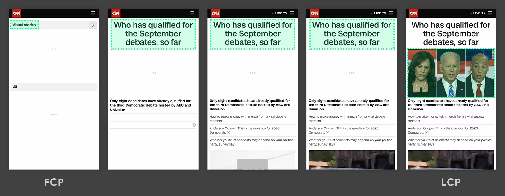
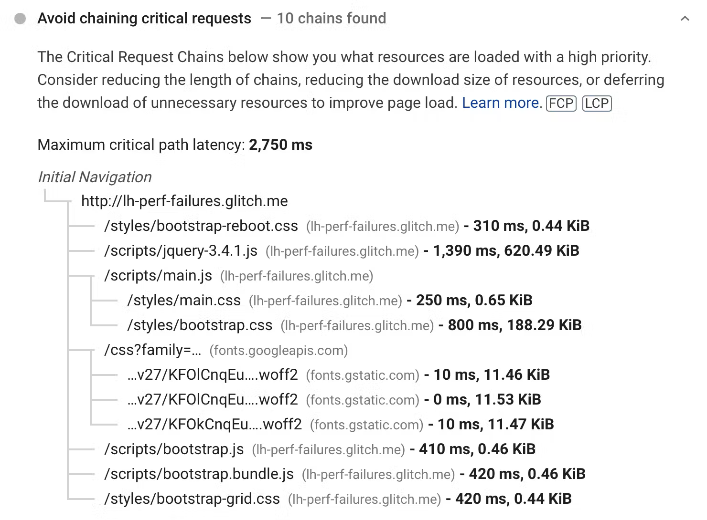
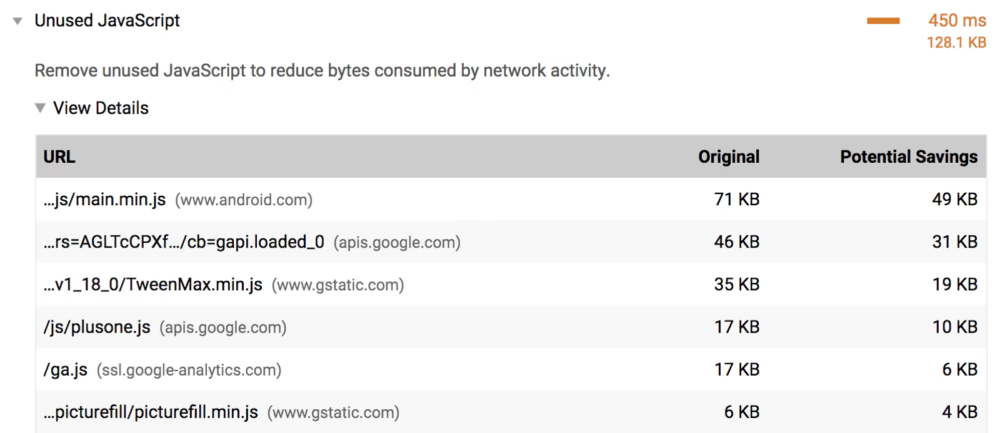
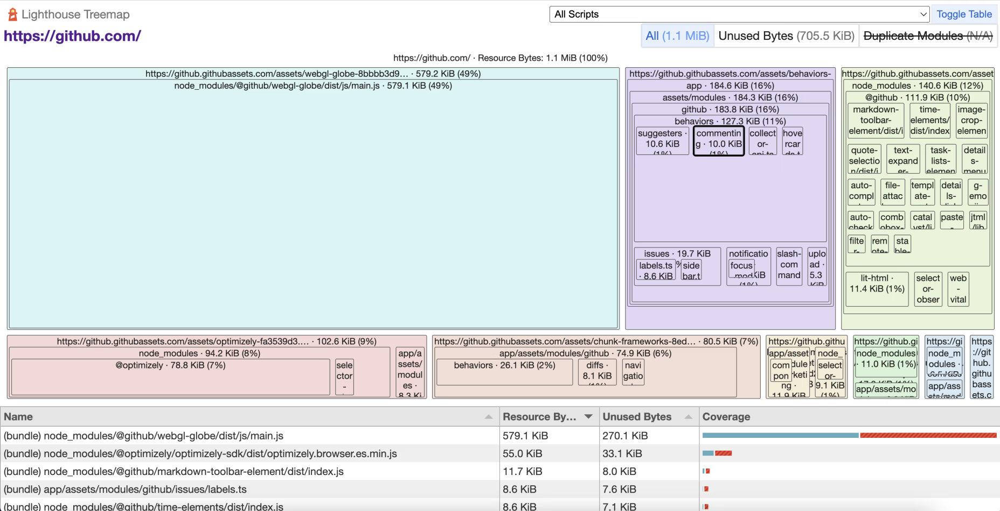

# Web 前端性能优化

- 制定性能指标
  - [Web 性能指标](#web-性能指标)
  - 自定义性能指标
- 本地或 CI 中性能预算测试：时间预算、资源/包大小预算
  - 测试工具
    - [WebPageTest](https://www.webpagetest.org/)
    - [lighthouse](https://web.dev/learn/#lighthouse)
    - [lighthouse-ci](https://github.com/GoogleChrome/lighthouse-ci)
    - [Web Vitals Chrome 扩展程序](https://github.com/GoogleChrome/web-vitals-extension)
    - [PageSpeed Insights](https://pagespeed.web.dev/)：集成 Lighthouse 性能审计 + [Chrome 用户体验报告](https://developers.google.com/web/tools/chrome-user-experience-report/)
    - size
      - [size-limit](https://github.com/ai/size-limit)
      - [bundlesize](https://github.com/siddharthkp/bundlesize)
  - 调试工具
    - [Chrome DevTools](https://developer.chrome.com/docs/devtools/)
- [前端监控](#前端监控)
- [优化策略](#性能优化策略)

## Web 性能指标

- 性能指标分类
  - 加载速度
    - Time to First Byte (TTFB)：第一个字节的响应时间
    - First Paint（FP）首次绘制
    - [First Contentful Paint 首次内容绘制 (FCP)](https://web.dev/fcp/)：文本、图像首次渲染出现的时间
      - 图像：图片、背景图、`<svg>` 元素或非白色的 `<canvas>` 元素
    - [Largest Contentful Paint 最大内容绘制 (LCP)](https://web.dev/lcp/)：视窗内最大的元素绘制的时间
      - 最大的元素：文本块、图像（图片、背景图）
      - LCP 与 FCP 区别
        
    - FMP
  - 响应速度
    - [First Input Delay 首次输入延迟 (FID)](https://web.dev/fid/)：标识用户第一次与页面交互到浏览器真正能够开始处理事件处理程序以响应该交互的时间（不包括处理时间）
      - 如果交互没有事件侦听器怎么办？测量接收到输入事件的时间点与主线程下一次空闲的时间点之间的差值
      - FID 只关注不连续操作对应的输入事件，如点击、轻触和按键
    - [Time to Interactive 可交互时间 (TTI)](https://web.dev/tti/)：表示网页首次完全达到可交互状态的时间点
      - TTI 在主线程至少有五秒钟没有长任务且不超过两个正在处理的网络 GET 请求时，即为最后一个长任务结束时间点，如果没有找到长任务，则相当于 FCP 的时间点。
        
    - [Total Blocking Time 总阻塞时间 (TBT)](https://web.dev/tbt/)：FCP 和 TTI 之间发生的每个长任务的阻塞时间总和，用于量化在页面交互性变为可靠前，不可交互程度的严重性
      
    - Long Task
  - 页面稳定性
    - [Cumulative Layout Shift 累积布局偏移 (CLS)](https://web.dev/cls/)
  - 画面流畅度
    - 帧率（FPS）
  - 内存占用
- 以用户为中心的核心 Web 指标：Core Web Vitals 
  > 其中 FID 无法在某些实验工具中测量，如 lighthouse 使用 TBT 代替 FID

## 前端监控

- 监控方式
  - 合成监控：场景模拟，在受控环境监控页面的性能
  - 真实用户监控：线上代码中注入脚本，上传真实用户场景数据
- 前端埋点
  - 代码埋点：前端开发人员在代码中自定义监听和收集
  - 可视化埋点
  - 无痕埋点（全埋点）：通过技术手段无差别地记录用户在前端页面上的行为，然后在后端数据清洗
- 数据采集
  - 前端性能指标采集方式
    - 加载性能
    - [Performance API](#performance-api)
    - [web-vitals](https://github.com/GoogleChrome/web-vitals)：基于 Performance API 的 Web Vitals 封装
  - 前端异常分类及采集
    - JS 错误
    - promise
    - 资源加载失败
    - 网络请求失败
- 数据上报
  - 尽量不影响应用的性能
  - 使用非阻塞 API，避免阻塞主线程
  - sendBeacon
    - 不受跨域限制
    - 不阻塞页面
  - requestIdleCallback
  - img
- 数据清洗、持久
- 数据聚合、报告
- 报警通知

### 前端异常分类及采集

- 前端异常分类
  - JS 错误
    - 编译时（语法错误）
    - 运行时
  - Promise
  - 资源加载、网络请求失败
- 捕获错误
  - `try ... catch ...`

### 数据上报

数据上报原则：
- 尽量不影响应用的性能

## Performance API

Web 标准提供性能相关的 API 及继承关系如下图：

- Performance API

## 性能优化策略

通常一个页面有三个阶段：加载阶段、交互阶段和关闭阶段，Web 性能优化主要有两个方向：优化页面加载、优化加载后交互。

- 页面加载
  - 指标
    - 白屏（FP、FCP）：浏览器发起页面请求后到提交数据阶段，这时页面展示出来的还是之前页面的内容。当渲染进程“确认提交”之后会创建一个空白页面，我们通常把这段时间称为**解析白屏**（这也就是 Web 应用与原生应用体验最大的区别之一，这对用户体验影响很大）。
    - 首屏
    - 首屏可交互时间（FID、TBT、TTI）
  - 优化策略
    - 资源网络请求（可打开 Chrome Devtools 工具的网络面板做性能分析）
      - Queuing：请求排队，因为[资源优先级](#资源优先级)以及 TCP 连接数量限制（HTTP/1.1 浏览器为每个域名最多维护 6 个连接导致的）
        - 并发请求
          - 域名分片
          - HTTP/2（多路复用）
        - 请求合并（资源合并）
          - 图标：雪碧图
          - 代码打包
      - TTFB：第一字节时间 
        - [HTTP 缓存](../HTTP/http%20缓存.md)
        - [preconnect（预连接）、dns-prefetch（DNS 预查询）](https://web.dev/preconnect-and-dns-prefetch/)
        - HTTP/1 keep-alive
        - 减少请求数据大小
          - HTTP/2（头部压缩）
        - 提高服务器性能
      - Content Download：资源下载时间
        - 减少资源大小：压缩/缩小
        - 提高宽带吞吐
        - CDN
    - 关键渲染路径
      - 消除[渲染阻塞资源](#渲染阻塞资源)
        - JS
          - defer
            - 异步加载
            - 等到 DOM 解析完毕，但在 DOMContentLoaded 事件之前执行
            - 具有 defer 特性的脚本保持其相对顺序，就像常规脚本一样
          - async
            - 异步加载
            - 加载就绪时运行
        - CSS
          - media: [loadCSS](https://github.com/filamentgroup/loadCSS)
      - 减少关键资源大小：以减少下载时间（往返次数 RTT）
        - 数据压缩
          - Gzip
          - Brotli
        - 代码缩小
          - 删除空格、注释、混淆
          - 消除未使用代码
            - TreeShaking
            - 代码按需引入：第三方库依赖过大，会给首屏加载带来很大的压力，一般解决方式是按需求引入对应文件。
          - 发布传输现代化代码
      - 减少[关键资源](#关键资源)数量
        - 延迟加载非关键资源
          - 代码（非关键内容）拆分 + 懒加载
            - [代码拆分分析](#代码拆分分析)
            - [延迟加载非关键 CSS](https://web.dev/defer-non-critical-css/)
          - 图片懒加载
      - 最小化关键请求链路：提高关键请求优先级，缩短关键路径长度
        - 页面结构设计：将 CSS 放在文件头部，JavaScript 文件放在底部
        - 资源内联：通过 HTML 内联 JavaScript、CSS 来移除文件下载时间
          - 内联内容不易过大，否则拆分成单文件，利用缓存
          - 内容大小参考 [TCP 慢启动](https://hpbn.co/building-blocks-of-tcp/#slow-start-restart)，首屏内容保持在 14 KB （压缩）以下，即 1-RTT 最佳 🤔
        - Resource Priority Hints
          - preload
          - prefetch
          - fetchpriority
    - 渲染模式
      - CSR
        - SSR
        - prerender（预渲染）
- 页面交互
  - 指标
    - 帧率
    - 交互响应速度
  - 绘制一帧生命周期  
    
  - 生成一帧的方式，有重排、重绘和合成三种方式
    - 重排
    - 重绘
    - 合成线程直接进行页面合成
  - 优化原则：避免抢占主线程过多时间，让渲染引擎稳定生成更多帧，提高帧率
    - 对输入处理程序防抖
    - 减少 JavaScript 脚本执行时间
      - 时间分片
      - 多线程：WebWork
    - 避免[强制同步布局和布局抖动](#强制同步布局和布局抖动)
      - 读写分离：尽量不要在修改 DOM 结构时再去执行 DOM 查询操作
      - 批量处理 + 异步更新
        - 使用 DOMFragment 缓存批量化 DOM 操作
    - 合理利用分层合成机制
      > 合成操作是在合成线程上完成的，这也就意味着在执行合成操作时，是不会影响到主线程执行的
      - 利用 CSS3 实现动画
      - 将元素提升单独图层：减少重绘范围
        - will-change，能够将要执行动画的某个元素提前单独生成一个图层
        - translateZ
    - 避免频繁的垃圾回收
      - 避免内存泄漏

## 资源优先级

在优先请求队列中，浏览器对不同资源类型请求有相应的优先级，高优先级的先进行请求。

> 可通过 Chrome NetWork 面板查看 Priority 列。 

[Chrome 资源优先级文档](https://docs.google.com/document/d/1bCDuq9H1ih9iNjgzyAL0gpwNFiEP4TZS-YLRp_RuMlc/edit)

| 资源类型 | 优先级 |
| -------- | ------ |
| HTML      | Highest        |
| Font | Highest|
| Font (preload) | High|
| CSS | Highest |
| CSS | Highest |
| Images | 默认是 Low，在初始视口中渲染时升级为 High |
| JS | Highest |
| Ajax, XHR, or fetch() API | High |

## 关键资源

关键资源是指对页面初始视口的首屏渲染所需要的资源。

如何确定关键资源？从界面上感性角度去理解

  

或者通过 DevTools Performance 面板观察 FP、FCP、LCP 或者自定义首屏指标之前发起的请求链去进行确认，在指标之前的请求大致可认为是关键资源：

  

Lighthouse 性能审计：以高优先级的资源为关键资源

  

## 代码拆分分析

可通过DevTools 中的 Coverage 面板查看资源利用率，一般可挑选体积大和利用率低的文件进行拆分

  

或者 Lighthouse 性能审计板块

  

文件依赖分析，可通过相应的构建工具如 webpack 的[Webpack Bundle Analyzer](https://github.com/webpack-contrib/webpack-bundle-analyzer)

  

Lighthouse Treemap 工具（需要开启 sourcemap）

> [Explore JavaScript Dependencies With Lighthouse Treemap](https://sia.codes/posts/lighthouse-treemap/)

  

最后代码中删除未使用的库或文件！

## 渲染阻塞资源

HTML、JS、CSS 资源加载行为会导致浏览器关键渲染路径（Critical Rendering Path）阻塞，了解浏览器对 HTML、JS、CSS 的加载行为：

- HTML
  - 流式解析：HTML 解析器并不是等整个文档加载完成之后再解析的，而是网络进程加载了多少数据，HTML 解析器便解析多少数据
  - 预加载扫描：当渲染引擎收到字节流之后，会开启一个预解析线程，用来分析 HTML 文件中包含的 JavaScript、CSS 等相关文件，解析到相关文件之后，预解析线程会提前下载这些文件
  - 流式渲染：现代浏览器增量构建 DOM，只要有可用的 DOM 就无需等待 HTML 完全解析再渲染，除非 CSS 渲染阻塞
- JS：无论内联还是外链，都会阻塞 DOM 解析，直到 JS 加载执行完成
- CSS：CSS 解析不是增量过程，如果浏览器在解析样式表内容时开始逐步构建 CSSOM，它将导致渲染树的多次渲染，造成样式闪烁（FOUC）因为 css 的可重叠样式规则
  - 内联：会阻塞 DOM 解析，直到内联 CSS 解析完成
  - 外链
    - link in head
      - 一般不会阻塞 DOM 解析 
      - 但如果后面跟 JS 脚本的情况，会阻塞后面 JS 脚本执行，相当于间接导致阻塞 DOM 解析 
        JavaScript 引擎在解析 JavaScript 之前，是不知道 JavaScript 是否操纵了 CSSOM 的，所以渲染引擎在遇到 JavaScript 脚本时，不管该脚本是否操纵了 CSSOM，都会执行 CSS 文件下载，解析操作，再执行 JavaScript 脚本。
      - 阻塞渲染
        - 浏览器在渲染页面的过程需要解析 HTML、CSS 以得到 DOM 树和 CSS 规则树，它们结合后才生成最终的渲染树并渲染，一旦浏览器发出获取外部样式表的请求，渲染树的构建就会停止，因此，关键渲染路径( CRP ) 也被卡住，屏幕上没有渲染任何内容
        - 浏览器可以使用 CSSOM 树的旧状态来生成渲染树，因为 HTML 正在被解析以在屏幕上逐步渲染事物。但这有一个巨大的缺点。在这种情况下，一旦样式表被下载和解析，并且 CSSOM 被更新，渲染树将被更新并呈现在屏幕上。现在，使用旧 CSSOM 生成的渲染树节点将使用新样式重新绘制，并且还可能导致无样式内容( FOUC )闪烁，这对 UX 非常不利。因此浏览器将等到样式表被加载和解析 w 完成，CRP 才会被解锁。正因为如此，建议尽可能早地加载所有外部样式表，可能在 head 部分中。
    - link in body：这是一种缺失规范，浏览器之间怪异的行为
      - Safari：阻止渲染，直到所有 CSS 加载执行完毕
      - Firefox：不会阻塞渲染，可能导致样式闪烁
      - Chrome/Edge：阻塞 DOM 解析，但可渲染之前的内容

总的来说，HTML 可流式渲染，主要是 JS 阻塞解析，而 CSS 阻塞渲染，也可能间接阻塞 HTML 解析。

但也并不是所有的 JS、CSS 会造成渲染阻塞，比如：

`<script>` tags in the `<head>` which do not have at least one of the following attributes: **async, defer, module**
Stylesheet `<link>` tags in the `<head>` without a **disabled** attribute or a **media query** which does not match (e.g., print)

## 资源优先级

### 强制同步布局和布局抖动

正常情况下渲染任务中的样式计算、布局计算都是在另外的任务中异步完成的

如果在修改 DOM 结构时候再去执行 DOM 查询操作，就会发生强制同步布局。

所谓强制同步布局，是指 JavaScript 强制将计算样式和布局操作提前到当前的任务中。

布局抖动，是指在一次 JavaScript 执行过程中，多次执行强制布局和抖动操作。

**如此频繁会大大影响当前函数的执行效率，从而阻塞其他渲染任务执行**。

## 123

DOMContentLoaded，这个事件发生后，说明页面已经构建好 DOM 了，这意味着构建 DOM 所需要的 HTML 文件、JavaScript 文件、CSS 文件都已经下载完成了。
Load，说明浏览器已经加载了所有的资源（图像、样式表等）

RTT 就是这里的往返时延。它是网络中一个重要的性能指标，表示从发送端发送数据开始，到发送端收到来自接收端的确认，总共经历的时延。通常 1 个 HTTP 的数据包在 14KB 左右，所以 1 个 0.1M 的页面就需要拆分成 8 个包来传输了，也就是说需要 8 个 RTT。

除 transform 或 opacity 属性之外，更改任何属性始终都会触发绘制。
坚持使用 transform 和 opacity 属性更改来实现动画。

使用 will-change 或 translateZ 提升移动的元素。
避免过度使用提升规则；各层都需要内存和管理开销。

降低选择器的复杂性；使用以类为中心的方法，例如 BEM。
减少必须计算其样式的元素数量。

计算元素的计算样式的最糟糕的开销情况是元素数量乘以选择器数量

减少打包时间：缩减范围、缓存副本、定向搜索、提前构建、并行构建、可视结构
减少打包体积：分割代码、摇树优化、动态垫片、按需加载ć作用提升、压缩资源

提交数据之后渲染进程会创建一个空白页面，我们通常把这段时间称为解析白屏，并等待 CSS 文件和 JavaScript 文件的加载完成，生成 CSSOM 和 DOM，然后合成布局树，最后还要经过一系列的步骤准备首次渲染。

RAIL

1、影响白屏时间的因素：网络，服务端性能，前端页面结构设计。
2、影响首屏时间的因素：白屏时间，资源下载执行时间。

- hints
  - DNS 预解析（dns-prefetch）
  - 预连接（preconnect）
  - prerender
  - prefetch
  - preload
- 页面可见性
- 分片

## 参考

- [How the browser renders a web page? — DOM, CSSOM, and Rendering](https://medium.com/jspoint/how-the-browser-renders-a-web-page-dom-cssom-and-rendering-df10531c9969)
- [The future of loading CSS](https://jakearchibald.com/2016/link-in-body/)
- [How to Eliminate Render-Blocking Resources: a Deep Dive](https://sia.codes/posts/render-blocking-resources/)
- [Eliminate render-blocking resources](https://web.dev/render-blocking-resources/)
- [The Critical Request: How to Prioritise Requests to Improve Speed](https://calibreapp.com/blog/critical-request)
- [Explore JavaScript Dependencies With Lighthouse Treemap](https://sia.codes/posts/lighthouse-treemap/)

不要@import 在样式表中使用来加载更多样式表。浏览器直到稍后才会发现它。最好<link>在 HTML 中使用标签加载它们

- webpack 构建优化

  - 减少打包时间：缩减范围、缓存副本、定向搜索、提前构建、并行构建、可视结构
    - 配置 include/exclude 缩小 Loader 对文件的搜索范围
    - 配置 cache 缓存 Loader 对文件的编译副本
    - 配置 resolve 提高文件的搜索速度
    - 并行构建
      - thread-loader
    - 配置 BundleAnalyzer 分析打包文件结构
  - 减少打包体积：分割代码、摇树优化、动态垫片、按需加载、作用提升、压缩资源
    - splitChunks
    - 动态垫片：通过垫片服务根据 UA 返回当前浏览器代码垫片
      - polyfill.io/v3/polyfill.min.js
      - "https://polyfill.alicdn.com/polyfill.min.js
      - 压缩资源
        - js
          - terser-webpack-plugin

内容分发网络简称 CDN，其核心特征是缓存和回源，缓存是把资源复制到 CDN 服务器里，回源是资源过期/不存在就向上层服务器请求并复制到 CDN 服务器里。
基于 CDN 的就近原则所带来的优点

- webpack
  - 缩小
    - mini-css-extract-plugin
    - terser
  - 文本压缩
  - 压缩
    - compression-webpack-plugin
  - [Webpack Bundle Analyzer](https://github.com/webpack-contrib/webpack-bundle-analyzer)

PRPL 模式

推送 (Push)（或预加载）最重要的资源。
尽快渲染 (Render) 初始路线。
预缓存 (Pre-cache) 剩余资产。
延迟加载 (Lazy load) 其他路线和非关键资产。

问题-原则-策略

Priority Hints
- preload
- dns-prefetch
- prefetch
- preconnect
- prerender
- fetchpriority

压缩/缩小、延迟加载（既阻塞又不占其他资源宽带）
优先关键
异步非关键
  media
  preload =》 stylesheet
避免在 CSS 文件中使用 @import

CDN
- 就近原则
- 缓存
- 负载均衡
- 图像优化
- 边缘计算

代码拆分
- 业务代码
- 公共代码
- 第三方代码
  - 运行时
  - 库工具

- 网络层
- 资源/包大小
  - 图像
    - 格式
    - 压缩
    - 响应式图片
      - `@media`
      - `image-set`
      - imagesrcset & imagesizes
      - 延迟加载屏幕外图像
- 代码优化