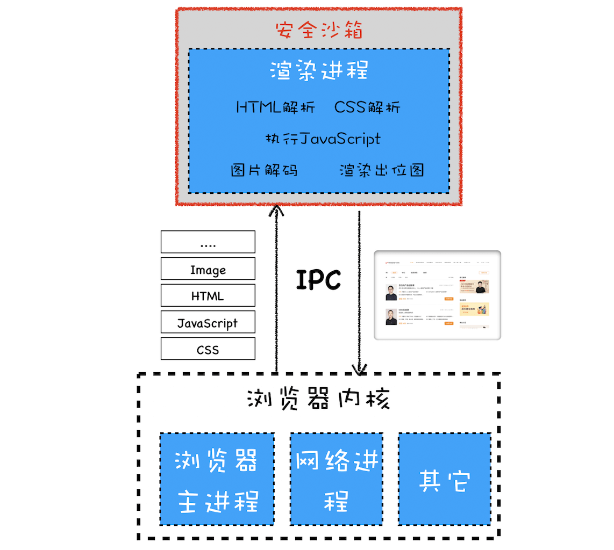
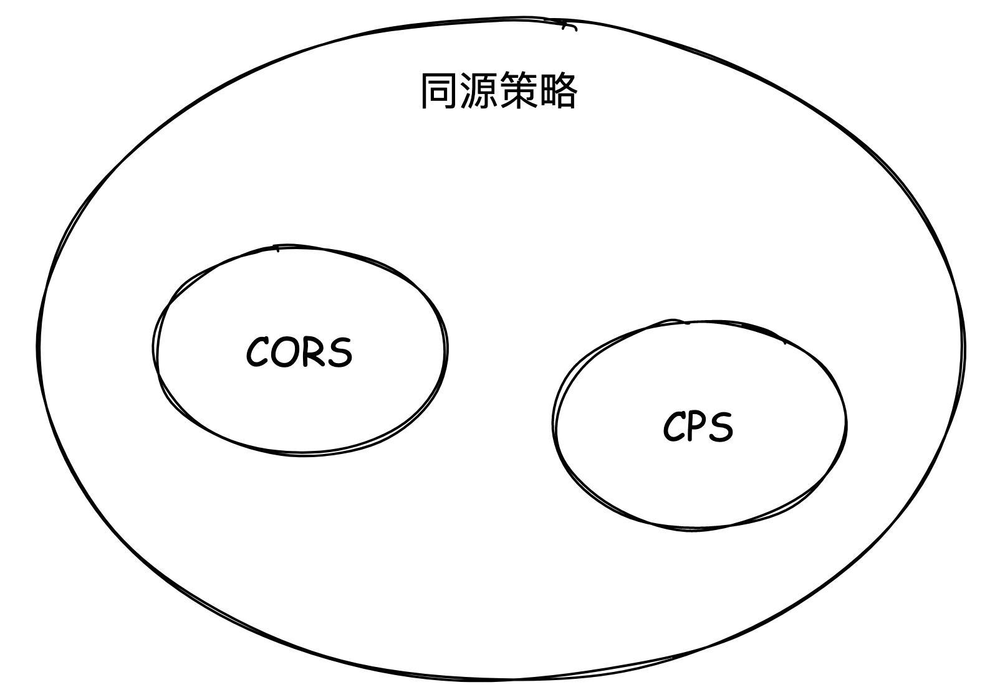
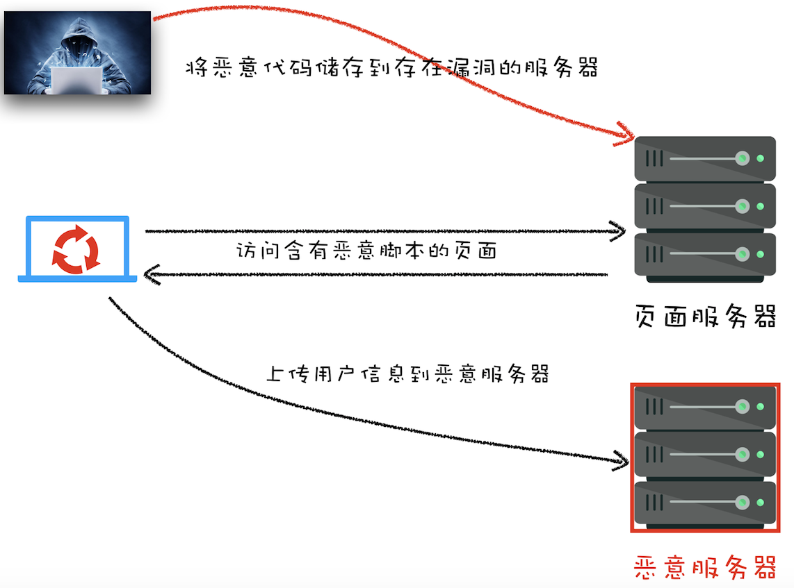

# Web 安全

- Web 安全
  - 页面安全（针对 DOM 等 Web API 操作限制）
    - 核心：[同源策略](#同源策略)
    - 同源策略下的“妥协”
      - 页面中可以引入第三方资源
        - [XSS 攻击](#跨站脚本攻击xss)
          - [XSS 攻击阻止方法](#如何阻止-xss-攻击)
            - [CSP 内容安全策略](https://developer.mozilla.org/zh-CN/docs/Web/HTTP/CSP)
      - 跨域资源共享（CORS）
      - 跨文档通信机制（window.postMessage）
    - [CSRF 攻击与 cookie 机制](#csrf-攻击与-cookie-机制)
      - [防止 CSRF 攻击](#防止-csrf-攻击)
    - web 前端框架的安全防范
  - 网络安全
    - DNS 劫持
    - HTTP/1 明文传输：[中间人攻击](#中间人攻击)
      - [HTTPS](../HTTP/https.md)
  - 浏览器系统安全
    - 多进程架构
        
    - 渲染进程沙箱隔离
    - 站点隔离

## 同源策略

网站**同源**需要满足以下三个方面：

- 协议相同
- 域名相同
- 端口相同

**同源策略**：浏览器默认相同源之间的页面是可以相互访问资源和操作 DOM 的。

非同源，则以下行为会受到限制：

- 数据：Cookie、LocalStorage 和 IndexDB 无法读取
- DOM：DOM 无法获取
- 资源请求：ajax、fetch 请求不能发送

同源策略是浏览器大局方面的安全策略，限制不同源的 web 页面之间的相互操作，以此来保证安全性，但是却极大地降低了便利性。在安全和便利性的权衡下，同源策略又做出了一些安全妥协。

1. 页面中可以嵌入第三方资源

   容易被中间人劫持导致 XSS 攻击，为了解决 XSS 攻击，浏览器中引入了内容安全策略，称为 CSP。

2. 跨域资源共享（CORS）
3. 跨文档消息机制（window.postMessage）

其中 CSP 和 CORS 是在这种大策略“妥协”下的设置的阀门，保证一定便利性的同时确保安全。

## 跨站脚本攻击（XSS）

XSS 全称是 Cross Site Scripting，为了与“CSS”区分开来，故简称 XSS，翻译过来就是“跨站脚本”。XSS 攻击是指黑客往 HTML 文件中或者 DOM 中**注入恶意脚本**，从而在用户浏览页面时利用注入的恶意脚本对用户实施攻击的一种手段。

恶意脚本注入方式有：

- 存储型 XSS 攻击

  1. 用户**通过输入**向服务器储存恶意脚本
  2. 服务器返回带有恶意脚本的页面
     

- 反射型 XSS 攻击

  1. 反射型 XSS 攻击是将恶意代码拼接在 URL 处，常见于网站搜索、跳转等，一个特点是需要黑客诱导用户点击 URL 实现代码注入
  2. 服务端不做处理直接拼接在 HTML 处返回

  反射型 XSS 跟存储型 XSS 的区别是：**存储型 XSS 的恶意代码存在数据库里，反射型 XSS 的恶意代码存在 URL 里**。

- 基于 DOM 的 XSS 攻击
  
  通过修改页面 DOM 节点形成的 XSS，称之为 DOM Based XSS。

  1. 中间人劫持在页面传输过程中修改 HTML 页面的内容
  2. 由于前端页面不严谨的代码产生的安全漏洞，导致注入了恶意代码。比如使用 `.innerHTML`、`document.write()`、`document.outerHTML` 这些能够修改页面结构的 API 时要注意防范恶意代码，尽量使用 `.textContent`、`.setAttribute()` 等。

DOM 型 XSS 跟前两种 XSS 的区别：**基于 DOM 的 XSS 攻击是不牵涉到页面 Web 服务器的**。DOM 型 XSS 攻击中，取出和执行恶意代码由浏览器端完成，属于前端 JavaScript 自身的安全漏洞，而其他两种 XSS 都属于服务端的安全漏洞。

### 如何阻止 XSS 攻击

1. 客户端和服务器对**输入**脚本进行过滤或转码、限制其输入长度
2. 充分利用 CSP
3. cookie 使用 HttpOnly 属性

### CSP 策略

CSP 的核心思想是让服务器决定浏览器能够加载哪些资源，让服务器决定浏览器是否能够执行内联 JavaScript 代码。

[MDN 内容安全策略( CSP )](https://developer.mozilla.org/zh-CN/docs/Web/HTTP/CSP)。

## CSRF 攻击（跨站请求伪造）

CSRF（Cross-site request forgery），称为“跨站请求伪造”，攻击者诱导受害者进入**第三方网站**，在第三方网站中，向被攻击网站发送跨站请求。利用受害者在被攻击网站已经获取的注册凭证，绕过后台的用户验证，达到冒充用户对被攻击的网站执行某项操作的目的。

和 XSS 不同的是，CSRF 攻击不需要将恶意代码注入用户的页面，仅仅是利用**服务器的漏洞**和**用户的登录状态**来实施攻击。

### 防止 CSRF 攻击

- 登陆机制
   - cookie：Cookie 通常是浏览器和服务器之间维护登录状态的一种方式，浏览器处理 cookie 的机制是当某个域的请求，自动会把这个域的 cookie 带上，而大多数 CSRF 攻击正是利用这一点
      - token 机制（有 XSS 风险） 
        - httpOnly + SameSite
1. 重要接口加验证参数
2. 验证请求的来源站点（通过 HTTP 请求头中的 Referer 和 Origin 属性）
3. CSRF Token

### 站点隔离

通常情况下，每个 tab 页即一个渲染进程，Chromium 提供了四种进程模式，不同的进程模式会对 tab 页做不同的处理。

- Process-per-site-instance (default) 每一个站点实例使用一个进程
- Process-per-site 每一个 site 使用一个进程
- Process-per-tab 每个 tab 使用一个进程
- Single process 所有 tab 共用一个进程

> "同一站点(same-site)"，具体地讲，我们将“同一站点”定义为根域名（例如，geekbang.org）+ 协议（例如，https:// 或者http://）相同。

**Process-per-site** 同一个站点下的页面都使用同一个进程，但同一站点下不同域的服务可能会发生冲突，所以隔离相同域名下毫无关联的页面，会更加安全。

**Process-per-site-instance** 每个站点实例一个进程，意味着下几乎每个 tab 页即一个渲染进程。特殊情况，如果两个页面可以在脚本代码中获得彼此的引用，才使用同一进程，比如

1. 用户通过 `<a target="_blank">` 这种方式点击打开的新页面
2. JavaScript code 打开的新页面（比如 window.open)，通过 window.opener 访问另一个页面