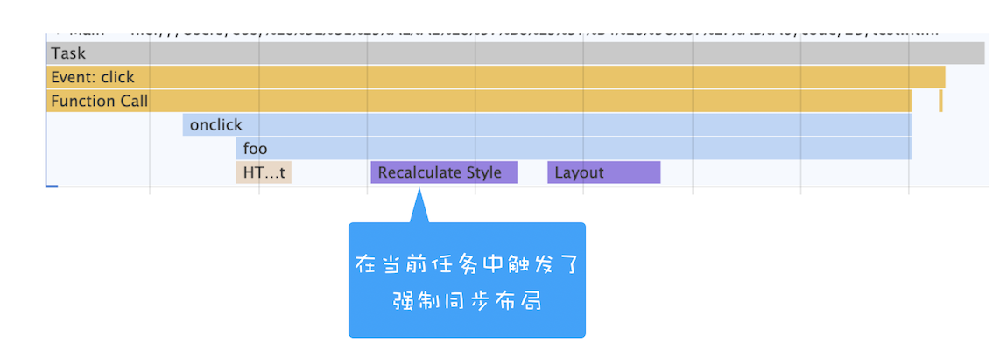

---
tags:
  - 性能优化
---
# Web 前端性能优化

通常一个页面有三个阶段：
> 重点关注加载阶段和交互阶段，这两个阶段最影响用户体验
- 加载阶段
  > 是指从发出请求到渲染出完整页面的过程（首屏渲染），影响到这个阶段的主要因素有网络和阻塞渲染的关键资源 JavaScript、CSS。
  - 资源网络请求
    - 比如通过 webpack 等工具移除一些不必要的注释，并压缩 JavaScript 文件。
    - 懒加载
    - 缓存
  - 控制关键资源加载，防止阻塞渲染流程
    - 资源控制
    - 减少文件大小，比如通过 webpack 等工具移除一些不必要的注释，并压缩 JavaScript 文件
  - 合并请求
    - 通过内联 JavaScript、内联 CSS 来移除这两种类型的文件下载
  - 减少文件大小
    - 移除一些不必要的注释，tree-skaing 移除不必要的代码、并压缩 JavaScript 文件
    - 拆分文件
      - 懒加载
      - 异步加载
- 交互阶段，主要是从页面加载完成到用户交互的整合过程，影响到这个阶段的主要因素是 JavaScript 脚本。
  > 原则就是避免抢占主线程过多时间，让渲染任务更快执行，提高渲染帧的输出速度
  - 减少 JavaScript 脚本执行时间
    - 耗时任务分片
    - webwork
  - 避免强制同步布局和布局抖动
    - 尽量不要在修改 DOM 结构时再去执行 DOM 查询操作
  - 合理利用 CSS 合成动画
    - will-change，能够将要执行动画的某个元素提前单独生成一个图层
  - 避免频繁的垃圾回收
- 关闭阶段，主要是用户发出关闭指令后页面所做的一些清理操作。

## 交互阶段：页面更新

页面交互阶段基本会发生页面更新。

更新渲染流水线

合成线程监听页面交互事件，通知主线处理事件。

大部分情况下，生成一个新的帧都是由 

1. JavaScript 通过修改 DOM 或者 CSSOM 来触发的
2. CSS 来触发的

CSS 触发的都是通过 CSS 实现一些变形、渐变、动画等特效，这种直接在合成线程上执行的，它不会触发重排或者重绘，而且合成操作本身的速度就非常快，所以执行合成是效率最高的方式。

而 JavaScript 修改 DOM 或者 CSSOM 来触发的，会导致重排或者重绘，然后触发后续渲染流水线的一系列操作，这个代价是非常大的。

## 强制同步布局和布局抖动

正常情况下渲染任务中的样式计算、布局计算都是在另外的任务中异步完成的

  

如果在修改 DOM 结构时候再去执行 DOM 查询操作，就会发生强制同步布局。

所谓强制同步布局，是指 JavaScript 强制将计算样式和布局操作提前到当前的任务中。

 

布局抖动，是指在一次 JavaScript 执行过程中，多次执行强制布局和抖动操作。

  

**如此频繁会大大影响当前函数的执行效率，从而阻塞其他渲染任务执行**。

## 页面资源加载与首屏渲染

Web 首屏渲染速度直接影响到了用户体验。当浏览器发起页面请求后到提交数据阶段，这时页面展示出来的还是之前页面的内容。渲染进程“确认提交”之后会创建一个空白页面，我们通常把这段时间称为**解析白屏**，这也就是 Web 应用与原生应用体验最大的区别之一，这对用户体验影响很大。

白屏时间主要是因为加载解析执行 JavaScript、CSS 这些阻塞页面渲染的关键资源

- html
  - 边加载边解析：HTML 解析器并不是等整个文档加载完成之后再解析的，而是网络进程加载了多少数据，HTML 解析器便解析多少数据
  - 预解析：当渲染引擎收到字节流之后，会开启一个预解析线程，用来分析 HTML 文件中包含的 JavaScript、CSS 等相关文件，解析到相关文件之后，预解析线程会提前下载这些文件
  - 除了脚本（.js）文件请求外，其他资源请求不会阻塞 DOM 解析
- script 
  - 内嵌
    - 停止 DOM 解析，等待执行 JS 完毕
  - 外链
    - 停止 DOM 解析，等待加载并执行 JS 完毕
- css
  > css 解析不是增量过程，如果浏览器在解析样式表内容时开始逐步构建 CSSOM，它将导致渲染树的多次渲染，因为 css 的可重叠样式规则
  - 内嵌
    - 会阻塞 DOM 解析，直到内嵌 CSS 解析完成
  - 外链
    - 不会阻塞 DOM 解析
    - 但会阻塞 JS 执行直到加载解析完成，相当于间接导致阻塞 DOM 解析
    > JavaScript 引擎在解析 JavaScript 之前，是不知道 JavaScript 是否操纵了 CSSOM 的，所以渲染引擎在遇到 JavaScript 脚本时，不管该脚本是否操纵了 CSSOM，都会执行 CSS 文件下载，解析操作，再执行 JavaScript 脚本。
    - 阻塞渲染
    > - 浏览器在渲染页面的过程需要解析 HTML、CSS 以得到 DOM 树和 CSS 规则树，它们结合后才生成最终的渲染树并渲染，一旦浏览器发出获取外部样式表的请求，渲染树的构建就会停止，因此，关键渲染路径( CRP ) 也被卡住，屏幕上没有渲染任何内容
    > - 浏览器可以使用 CSSOM 树的旧状态来生成渲染树，因为 HTML 正在被解析以在屏幕上逐步渲染事物。但这有一个巨大的缺点。在这种情况下，一旦样式表被下载和解析，并且 CSSOM 被更新，渲染树将被更新并呈现在屏幕上。现在，使用旧 CSSOM 生成的渲染树节点将使用新样式重新绘制，并且还可能导致无样式内容( FOUC )闪烁，这对 UX 非常不利。因此浏览器将等到样式表被加载和解析。一旦样式表被解析并且 CSSOM 被更新，渲染树被更新，并且CRP 被解锁，这导致渲染树在屏幕上的绘制。由于这个原因，建议尽可能早地加载所有外部样式表，可能在head部分中。
  - 第一个是提供给 JavaScript 操作样式表的能力，第二个是为布局树的合成提供基础的样式信息。

- JS 资源优化，async 或 defer 标记外链脚本
  - 加载顺序控制
    - defer 
      - 不会阻塞页面
      - 等到 DOM 解析完毕，但在 DOMContentLoaded 事件之前执行
      - 具有 defer 特性的脚本保持其相对顺序，就像常规脚本一样
    - async
      - 不阻塞页面
      - 加载就绪时运行
    - preload
    - 动态脚本，类似 async
      - 显式地设置了 `script.async=false`，则可以改变这个规则。然后脚本将按照脚本在文档中的顺序执行，就像 defer 那样
- css
  - media，拆分CSS

老师，如果操作dom引起了重拍或重绘，是整个页面从0开始吗，哪些没变化的地方也会重拍重绘吗？比如我把页面最后的元素大小改变了，上面的都没发生变化，这样上面哪些没有变化的也会重拍重绘吗？

解析将停止，当它遇到`<link>`，`<script>`和`<style>`标签

1. 重拍跟重绘是会导致整个过程重新开始？

到目前为止，我们还没有在屏幕上绘制一个像素。我们拥有的是不同的层（位图图像），它们应该以特定的顺序绘制在屏幕上。在合成操作中，这些层被发送到 GPU 以最终将其绘制在屏幕上。
发送整个图层进行绘制显然是低效的，因为每次发生回流（布局）或重绘时都必须这样做。因此，图层被分解为不同的图块，然后将在屏幕上绘制

在大多数情况下，在后台下载脚本文件时停止 DOM 解析是完全没有必要的。因此 HTML5 为我们async提供了script标签的属性。当 DOM 解析器遇到script带有async属性的外部元素时，它不会在后台下载脚本文件时停止解析过程。但是一旦文件被下载，解析将停止并且脚本（代码）将被执行

defer 但与该async属性不同的是，即使文件完全下载，脚本也不会执行。与async脚本不同，所有defer脚本都按照它们在 HTML 文档（或 DOM 树）中出现的顺序执行

因为script元素是解析器阻塞的。每个外部文件请求，如image、stylesheet、pdf、video等，都不会阻塞 DOM 构建（解析），脚本（.js）文件请求除外。

浏览器可以增量地构建 DOM 树、增量渲染，只要有可用的 DOM 就不需要等待 DOM 完全解析再渲染。

渲染流水线是流式动态的

除了解析器阻止脚本文件之外的任何外部资源请求都不会阻止 DOM 解析过程。因此CSS（包括嵌入式）不会阻止DOM解析

DOM 和 CSSOM 树的构建都发生在主线程上，并且这些树是同时构建的。它们一起形成了用于在屏幕上打印内容的渲染树，随着 DOM 树的构建，它也在逐步构建。？
当浏览器找到`<style>`块时，它将解析所有嵌入的 CSS 并使用新的 CSS（样式）规则更新 CSSOM 树。之后，它将继续以正常方式解析 HTML。内联样式也是如此。

外部样式表文件不会阻止解析器资源，因此浏览器可以在后台静默下载它，DOM 解析将继续。

Likeasync或deferattribute 使script元素成为非解析器阻塞，外部样式表也可以使用该属性标记为非渲染阻塞media。使用media属性值，浏览器可以做出明智的决定何时加载样式表。

DCL等待 DOM 以及 css 解析完毕

DCL是网站性能指标之一。我们应该优化DCL尽可能小（它发生的时间）。最佳实践之一是尽可能使用defer和async标记script元素，以便浏览器可以在后台下载脚本时执行其他操作。其次，我们应该优化脚本阻塞和渲染阻塞样式表。

## 合成机制下的 CSS3 动画

### 显示器显示图像原理

每个显示器都有固定的刷新频率，通常是 60HZ，也就是每秒 60 次读取显卡的**前缓冲区**。

显卡的职责就是合成新的图像，并将图像保存到后缓冲区中，一旦显卡把合成的图像写到后缓冲区，系统就会让后缓冲区和前缓冲区互换，这样就能保证显示器能读取到最新显卡合成的图像。

渲染引擎会通过渲染流水线生成新的图片，并发送到显卡的后缓冲区。

> 在 GPU 加速的场景下渲染引擎则是借助 GPU 去合成图片

渲染引擎生成的每一张图片称为一帧，每秒更新了多少帧称为帧率，比如 1 秒更新了 60 帧，那么帧率就是 60Hz（或者 60FPS）。为了保证图像显示流程，那么帧率就需要尽量达到显示器刷新频率，比如大多数设备屏幕的更新频率是 60 次 / 秒，那么渲染引擎需要每秒更新 60 张图片到显卡的后缓冲区。

### 分层和合成的机制

渲染流水线中生成一整

任意一帧的生成方式，有重排、重绘和合成三种方式

为了提升每帧的渲染效率，Chrome 引入了分层和合成的机制，主要分为

- 分层
- 分块
- 合成

1. DOM
2. layout
3. layer
4. paint
5. composite

复制好基本的布局树结构之后，渲染引擎会为对应的 DOM 元素选择对应的样式信息，这个过程就是样式计算。样式计算完成之后，渲染引擎还需要计算布局树中每个元素对应的几何位置，这个过程就是计算布局

阻塞网页首次渲染的资源称为关键资源
总的优化原则就是减少关键资源个数，降低关键资源大小，降低关键资源的 RTT 次数

如何减少关键资源的个数
- 将 JavaScript 和 CSS 改成内联的形式
- async 或者 defer
- media

如何减少关键资源的大小
- 压缩 CSS 和 JavaScript 资源
- 移除 HTML、CSS、JavaScript 文件中一些注释内容
- tree-shaking 删除
- 拆分
  - 懒加载
  - 第三方组件库依赖过大,会给首屏加载带来很大的压力，一般解决方式是按需求引入组件。按需加载

http 缓存
CDN 来减少每次 RTT 时长

生成一个新的帧
- DOM 解析
- 都是由 JavaScript 通过修改 DOM 或者 CSSOM 来触发的。
- 还有另外一部分帧是由 CSS 来触发的。

在交互阶段，帧的渲染速度决定了交互的流畅度。让渲染引擎稳定生成更多帧，提高帧率。

内存泄漏

CRP
1. DOM
2. CSSOM
3. RenderTree
4. Layout
5. Paint
6. Compositing

WebPageTest

loadCSS

通过确定加载哪些资源的优先级、控制它们的加载顺序以及减小这些资源的文件大小来提高页面加载速度。性能提示包括 1) 通过推迟下载、将它们标记为异步或完全消除它们来最小化关键资源的数量，2) 优化所需的请求数量以及每个请求的文件大小，以及 3) 优化在通过优先下载关键资源加载哪些关键资源，缩短关键路径长度。

Chrome DevTools、Lighthouse 和 pagestest.org

Jamstack

