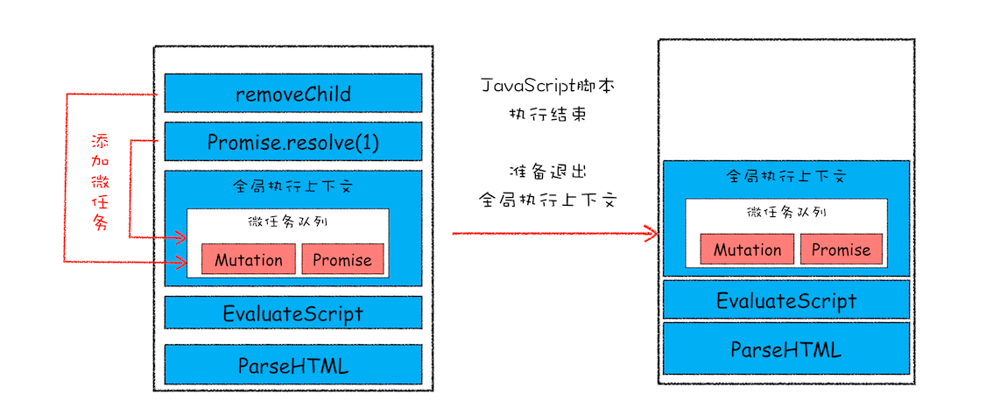
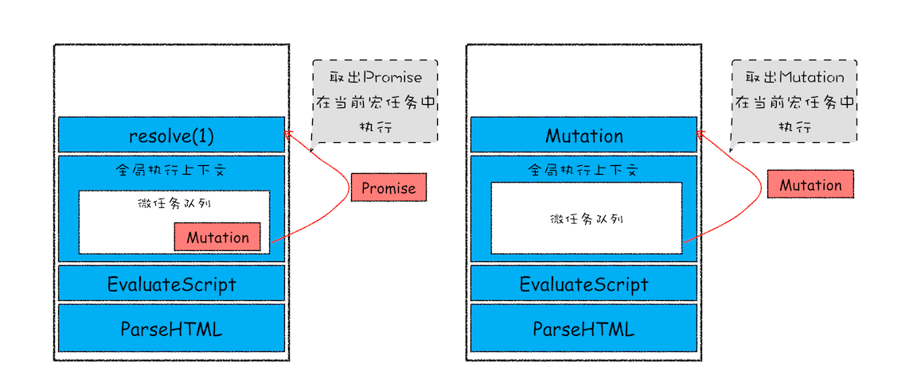

# 消息队列和事件循环系统

1. 事件循环系统是 HTML 标准定义的，用户代理实现，而不是 JavaScript 引擎提供的
2. 事件循环系统的本质是一个 user agent 上协调调度各类事件任务的机制

   > 每个渲染进程都有一个主线程，并且主线程非常繁忙，既要处理 DOM，又要计算样式，还要处理布局，同时还需要处理 JavaScript 任务以及各种输入事件。要让这么多不同类型的任务在主线程中有条不紊地执行，这就需要一个系统来统筹调度这些任务，这个统筹调度系统就是消息队列和事件循环系统。

3. 消息队列中分为**宏任务队列**和**微任务队列**两种类型队列（由宿主环境执行的任务为宏任务，引擎执行的为微任务）
4. 心智模型：事件循环系统

   1. 主线程从宏任务队列取一任务执行
   2. 再循环执行完微任务队列里的所有任务
   3. 重复 1、2 步骤

   

   心智代码：

   ```js
   for (let task of macroQueue) {
     task();

     for (let microTask of microQueue) {
       microTask();
     }
   }
   ```

5. 在心智模型建设上，为了方便，只抽象了一个宏任务队列，但实际实现上并不是单消息队列架构
6. 异步任务调度

- 宏任务
  - script
  - MessageChannel、postMessage
  - requestAnimationFrame：跟随系统 VSync 信号调度，在每一帧渲染前
  - setTimeout、setInterval
  - ajax、fetch
- 微任务（微任务其实是一个需要异步执行的函数，执行时机是在主函数执行结束之后、当前宏任务结束之前）
  - promise.then、promise.reject
  - MutationObserver
  - queueMicrotask


- 队头阻塞问题
- 低优先级任务会阻塞高优先级任务

多消息队列架构

将任务划分为多个不同的优先级，来实现更加细粒度的任务调度


## 多个消息队列及优先队列

### setTimeout 延迟队列

在 Chrome 中除了正常使用的消息队列之外，还有另外一个消息队列，这个队列中维护了需要延迟执行的任务列表，包括了定时器和 Chromium 内部一些需要延迟执行的任务。所以当通过 JavaScript 创建一个定时器时，渲染进程会将该定时器的回调任务添加到延迟队列中。

ProcessDelayTask 函数会根据发起时间和延迟时间计算出到期的任务，然后依次执行这些到期的任务。等到期的任务执行完成之后，再继续下一个循环过程。通过这样的方式，一个完整的定时器就实现了。

使用 setTimeout 的一些注意事项

1. 如果当前任务执行时间过久，会影响定时器任务的执行
2. 如果 setTimeout 存在嵌套调用，那么系统会设置最短时间间隔为 4 毫秒
3. 未激活的页面，setTimeout 执行最小间隔是 1000 毫秒
4. 延时执行时间有最大值 大约 24.8 天

### 微任务队列

微任务就是一个需要异步执行的函数，执行时机是在主函数执行结束之后、当前宏任务结束之前。

MutationObserver（DOM4 规范实现，注入到引擎中）、Promise（JS 规范实现即引擎自带）

当 JavaScript 执行一段脚本的时候，V8 会为其创建一个全局执行上下文，在创建全局执行上下文的同时，V8 引擎也会在内部创建一个微任务队列。当前宏任务中的 JavaScript 快执行完成时，也就在 JavaScript 引擎准备退出全局执行上下文并清空调用栈的时候，JavaScript 引擎会检查全局执行上下文中的微任务队列，然后按照顺序执行队列中的微任务。WHATWG 把执行微任务的时间点称为检查点。

如果在执行微任务的过程中，产生了新的微任务，同样会将该微任务添加到微任务队列中，V8 引擎一直循环执行微任务队列中的任务，直到队列为空才算执行结束。





## requestAnimationFrame

使用 requestAnimationFrame 不需要设置具体的时间，由系统来决定回调函数的执行时间，requestAnimationFrame 里面的回调函数是在页面刷新之前执行，它跟着屏幕的刷新频率走，保证每个刷新间隔只执行一次，内如果页面未激活的话，requestAnimationFrame 也会停止渲染，这样既可以保证页面的流畅性，又能节省主线程执行函数的开销

promise 实现

1. executor
2. 延迟绑定回调函数
3. 链式调用
4. 回调函数返回值穿透到最外层
5. 错误冒泡

回调地狱的问题：

1. 多层嵌套的问题，不符合人的线性思维方式、直观
2. 还要分别回调处理这两种成功失败可能性

Generator 的底层实现机制——协程（Coroutine）

async/await 使用了 Generator 和 Promise 两种技术，

yield

- 根据消息类型实现不同优先级的消息队列
  - 交互
  - 合成
  - 默认（普通）
  - 空闲

渲染事件（如解析 DOM、计算布局、绘制）；用户交互事件（如鼠标点击、滚动页面、放大缩小等）；JavaScript 脚本执行事件；网络请求完成、文件读写完成事件。

MutationObserver 和 IntersectionObserver 两个性质应该差不多。我这里简称 ob。ob 是一个微任务，通过浏览器的 requestIdleCallback，在浏览器每一帧的空闲时间执行 ob 监听的回调，该监听是不影响主线程的，但是回调会阻塞主线程。当然有一个限制，如果 100ms 内主线程一直处于未空闲状态，那会强制触发 ob。
