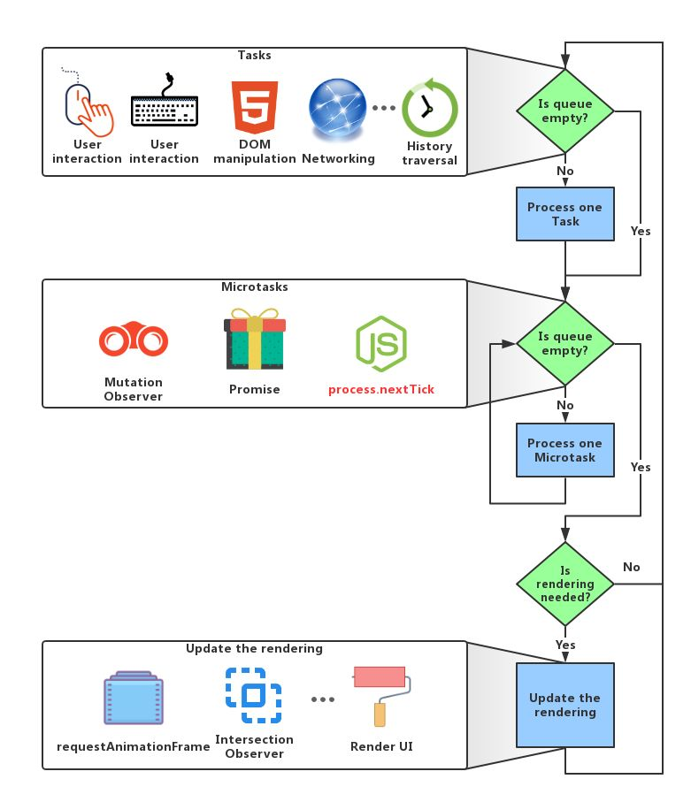
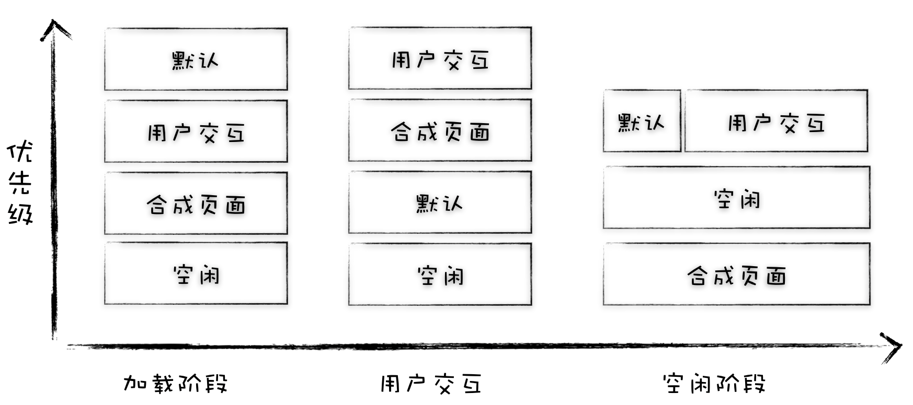
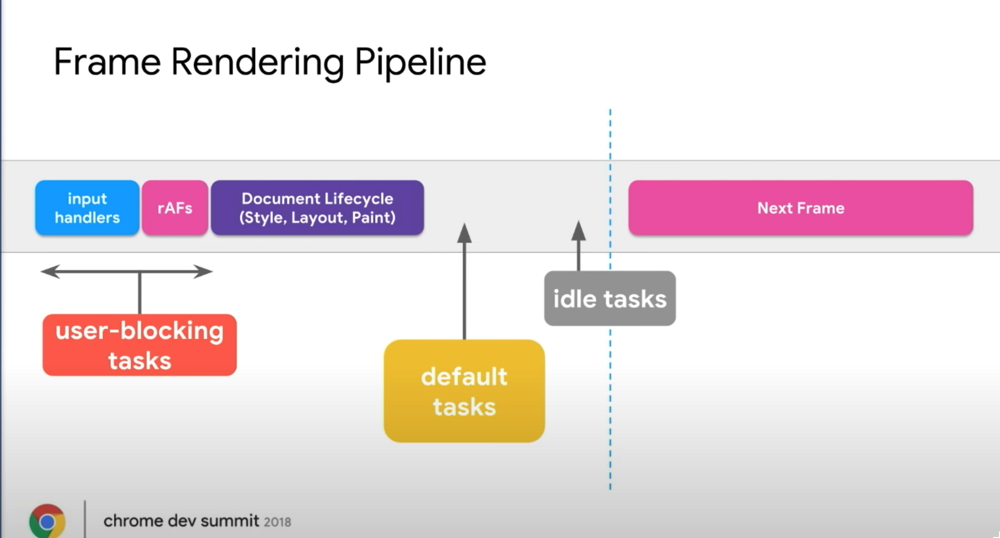
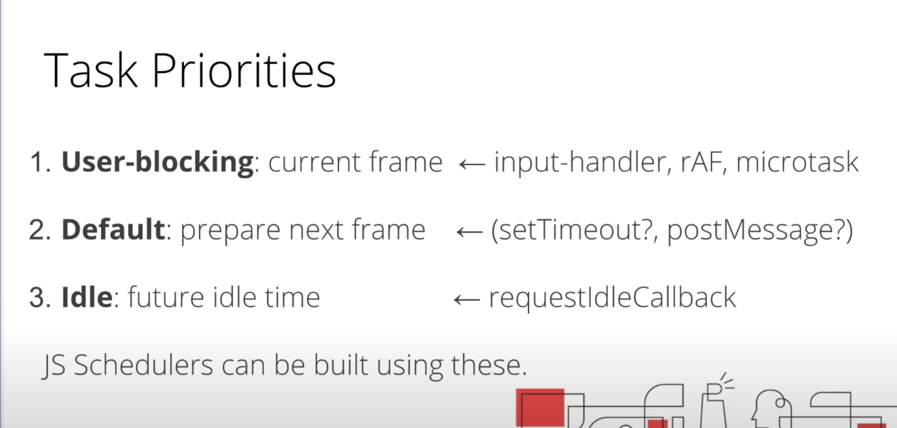

# 消息队列和事件循环系统

> 网上对事件循环介绍的文章太多了，本文笔者只总结浏览器事件循环的心智模型及要点

1. 事件循环系统是 HTML 标准定义的，用户代理实现，而不是 JavaScript 引擎提供的，JavaScript 引擎只是等待用户代理分发 JS 任务
2. 事件循环系统的本质是一个用户代理上协调各类事件任务的机制
   > 为了防止资源竞争，在 Chrome 中每个渲染进程只有一个主执线程，主执行线循环不断得各类事件，比如处理 DOM 构建、计算样式、处理布局，同时还需要处理 JavaScript 任务以及各种输入事件。要让这么多不同类型的任务在主线程中有条不紊地执行，这就需要一个系统来统筹调度这些任务，这个统筹调度系统就是消息队列和事件循环系统。
3. 消息队列分为**宏任务队列**和**微任务队列**两种类型队列
4. 宏任务队列就是宿主环境协调的各类事件的队列，微任务队列就是 JavaScript 引擎内部执行的任务队列
5. 宏任务类型
   - script
   - 用户输入事件处理
   - MessageChannel、postMessage
   - requestAnimationFrame
     - 由系统 VSync 信号触发调度，在每一帧渲染之前执行
     - 如果页面未激活的话，requestAnimationFrame 也会停止渲染，这样既可以保证页面的流畅性，又能节省主线程执行函数的开销
   - UI 渲染
   - 计时器 setTimeout、setInterval
     - 计时器的回调不一定在指定时间后能执行。而是在指定时间后，将回调函数放入事件循环的队列中，如果当前任务执行时间过久，会影响定时器任务的执行
     - setTimeout
       - 在 Chrome 中，定时器被嵌套调用 5 次以上，那么系统会设置最短时间间隔为 4 毫秒
       - 未激活的页面，setTimeout 执行最小间隔是 1000 毫秒
       - 延时执行时间有最大值 大约 24.8 天
   - 网络请求 ajax、fetch
   - requestIdleCallback
6. 微任务
   - promise.then、promise.reject（JS 引擎实现）
   - MutationObserver（DOM4 规范实现，注入到引擎中）
   - queueMicrotask
7. 心智模型

   1. 主线程从宏任务队列取一任务执行执行完后
   2. 再循环执行完微任务队列里的所有任务
   3. UI 渲染判断
   4. 重回到 1

   

   心智代码：

   ```js
   for (let task of macroQueue) {
     task();

     for (let microTask of microQueue) {
       microTask();
     }
   }
   ```

8. 宏任务队列实际实现上并不是单消息队列架构而是多消息队列架构，比如队列分为；而微任务队列只有一个队列
9. Blink 任务调度细节
  - 按照不同的任务类型来划分任务优先级
  - 基于不同的场景来动态调整消息队列的优先级
      
      
    
  - 设置队列权重：如果连续执行了一定个数的高优先级的任务，那么中间会执行一次低优先级的任务，这样就缓解了任务饿死的情况
10. 在每一次的事件循环最后不一定会执行渲染，除非任务里发生重排重绘操作，而且多次操作会被积累起来只做一次渲染
11. JS 任务主要是单线程同步执行，对于异步任务的实现主要是通过环境提供的异步 API + 异步回调的范式去支持

## 参考

- [JavaScript 事件循环：从起源到浏览器再到 Node.js](https://mp.weixin.qq.com/s/q_5c4wzsxOHiqHlPfqarzQ)
- [Task scheduling in Blink](https://chromium.googlesource.com/chromium/src/+/master/third_party/blink/renderer/platform/scheduler/TaskSchedulingInBlink.md)


promise 实现

1. executor
2. 延迟绑定回调函数
3. 链式调用
4. 回调函数返回值穿透到最外层
5. 错误冒泡

回调地狱的问题：

1. 多层嵌套的问题，不符合人的线性思维方式、直观
2. 还要分别回调处理这两种成功失败可能性

Generator 的底层实现机制——协程（Coroutine）

MutationObserver 采用了“异步 + 微任务”的策略。通过异步操作解决了同步操作的性能问题；通过微任务解决了实时性的问题。
