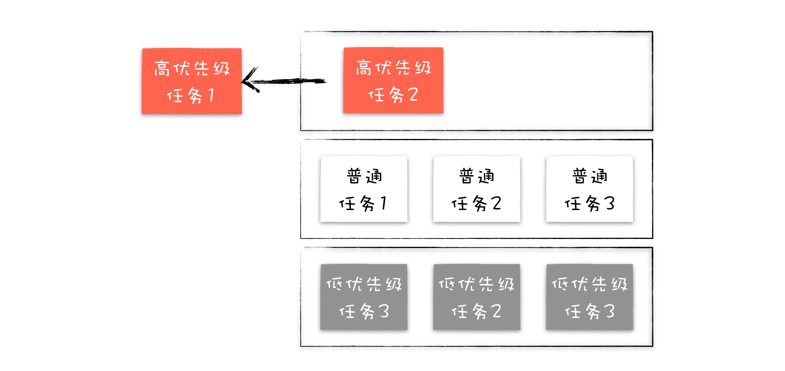

单线程、事件循环

渲染进程的任务调度系统

渲染进程内部的大多数任务都是在主线程上执行的，诸如 JavaScript 执行、DOM、CSS、计算布局、V8 的垃圾回收等任务。要让这些任务能够在主线程上有条不紊地运行，就需要引入消息队列。

主线程维护了一个普通的消息队列和一个延迟消息队列，调度模块会按照规则依次不断取出这两个消息队列中的任务，并在主线程上执行。

宏任务
微任务

等宏任务中的主要功能都直接完成之后，这时候，渲染引擎并不着急去执行下一个宏任务，而是执行当前宏任务中的微任务

单消息队列架构
- 队头阻塞问题
- 低优先级任务会阻塞高优先级任务

多消息队列架构

将任务划分为多个不同的优先级，来实现更加细粒度的任务调度

  

在渲染进程中引入一个任务调度器，负责从多个消息队列中选出合适的任务，通常实现的逻辑，先按照顺序从高优先级队列中取出任务，如果高优先级的队列为空，那么再按照顺序从低优级队列中取出任务。