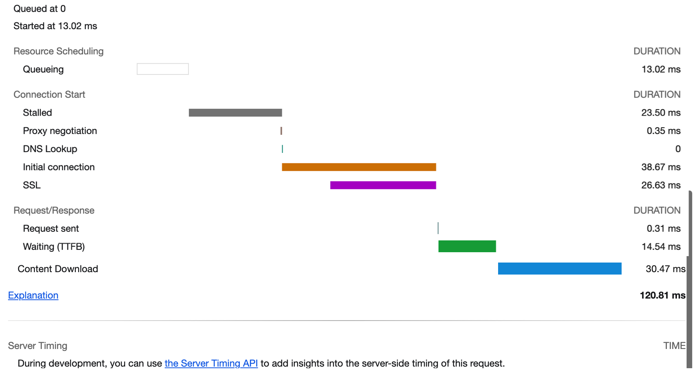

JS 与 CSS 是否阻塞 DOM 的渲染和解析？
  
即一般把`<script>`放在`<body>`尾部，`<link>`标签放在`<head>`内部，而页面通过CDN引入第三方框架或库时，基本都是将其`<script>`标签放在`<link>`标签前面。

DOM 的解析和 CSS 的解析是分开的，但 render tree的生成是依赖 DOM Tree和 CSSOM Tree的，因此CSS必然会阻塞DOM的渲染，
因此 CSS 不会阻塞 DOM 解析，但是会阻塞 DOM 渲染

JS 会阻塞 DOM 解析
CSS 会阻塞 JS 的执行
浏览器无法预先知道脚本的具体内容，因此在碰到`<script>`标签时，只好先渲染一次页面，确保`<script>`脚本内能获取到DOM的最新的样式。倘若在决定渲染页面时，还有尚未加载完成的CSS样式，只能等待其加载完成再去渲染页面。

扫描预加载

浏览器解析 Html 是自上而下一句一句解析

浏览器遇到`<script>`标签且没有defer或async属性时会触发页面渲染

遇到 script 会阻塞 DOM 解析

如果下载 CSS 文件阻塞了，会阻塞 DOM 树的合成吗？会阻塞页面的显示吗？

## 从输入一个 url 地址到页面的过程

1. 用户输入处理  
   浏览器进程处理用户输入，将 URL 转发给网络进程
2. 导航阶段
   1. http 请求
      1. 请求排队（请求数限制）
      2. 缓存查找
      3. DNS 域名解析
      4. 建立 TCP 连接
      5. 建立 TSL 连接（https，可选）
      6. 发送请求
      7. 处理响应
         1. 重定向，回 2.1.
         2. Content-Type 响应数据类型处理
            1. 通知浏览器准备渲染进程 （跳 3.）
            2. application/octet-stream 通知下载器下载文件，导航结束
      8.  断开 TCP 连接
   2. 提交导航  
      浏览器会发出“提交文档”消息给渲染进程，渲染进程收到消息后，会和网络进程建立传输数据的“管道”后，渲染进程会返回“确认提交”的消息给浏览器进程，浏览器进程接收到确认消息后更新浏览器界面状态，完成导航。
3. 页面渲染

## 网络请求性能优化

Timing

- http 缓存
- 排队（Queuing）时间过久
  - 页面资源优先级
  - 域名请求数限制（http/1.1 浏览器为每个域名最多维护 6 个连接导致的）
    - 域名分片
    - 打包请求内容
      - 雪碧图
    - http/2.0（没有域名限制、多路复用）
- 第一字节时间（TTFB）时间过久
  - 网络因素
    - CDN
  - 服务器响应过慢（TTFB 是反映服务端响应速度的重要指标，对服务器来说，TTFB 时间越短，就说明服务器响应越快）
- Content Download 时间过久
  - 传输字节数过多
    - 压缩、去掉不必要的注释
    - tree-shaking 去掉不必要的代码
    - 分包、懒加载

那详细的流程是怎样的呢？网络进程接收到响应头之后，会根据响应头中的 content-type 字段来判断文件的类型，比如 content-type 的值是“text/html”，那么浏览器就会判断这是一个 HTML 类型的文件，然后为该请求选择或者创建一个渲染进程。渲染进程准备好之后，网络进程和渲染进程之间会建立一个共享数据的管道，网络进程接收到数据后就往这个管道里面放，而渲染进程则从管道的另外一端不断地读取数据，并同时将读取的数据“喂”给 HTML 解析器。你可以把这个管道想象成一个“水管”，网络进程接收到的字节流像水一样倒进这个“水管”，而“水管”的另外一端是渲染进程的 HTML 解析器，它会动态接收字节流，并将其解析为 DOM。