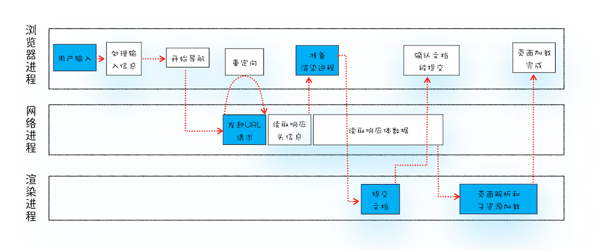

# 页面导航流程：从输入一个 url 地址到页面的过程

  

1. 用户输入处理：浏览器进程处理用户输入，构成完整 URL 转发给网络进程
2. 导航阶段
   1. http 请求流程
      1. 请求排队（可选）
         1. 资源优先级调度
         2. 域名请求数限制
      2. 重定向
      3. 查找缓存
      4. DNS 域名解析
      5. 建立 TCP 连接 
      6. TSL（https，可选）
      7. 发送 HTTP 请求
      8. 处理 HTTP 响应
         1. 重定向，回 2.1.1
         2. Content-Type 响应数据类型处理
            - text/html 通知浏览器准备渲染进程 （跳 3.）
            - application/octet-stream 通知下载器下载文件，导航结束
   2. 提交文档：浏览器会发出“提交文档”消息给渲染进程
      1. 渲染进程收到消息后，会和网络进程建立传输数据的“管道”
      2. 渲染进程会返回“确认提交”的消息给浏览器进程
   3. 完成导航：浏览器进程接收到确认消息后更新浏览器界面状态，完成导航
3. 渲染阶段
4. TCP 断开

## 处理 HTTP 响应

网络进程接收到响应头之后，会根据响应头中的 content-type 字段来判断文件的类型，比如 content-type 的值是“text/html”，那么浏览器就会判断这是一个 HTML 类型的文件，然后为该请求选择或者创建一个渲染进程。渲染进程准备好之后，网络进程和渲染进程之间会建立一个共享数据的管道，网络进程接收到数据后就往这个管道里面放，而渲染进程则从管道的另外一端不断地读取数据，并同时将读取的数据“喂”给 HTML 解析器。你可以把这个管道想象成一个“水管”，网络进程接收到的字节流像水一样倒进这个“水管”，而“水管”的另外一端是渲染进程的 HTML 解析器，它会动态接收字节流，并将其解析为 DOM。

## 参考

- 极客时间《浏览器工作原理与实践》