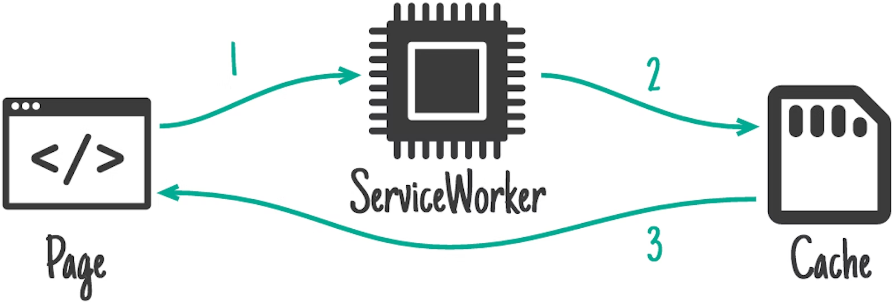
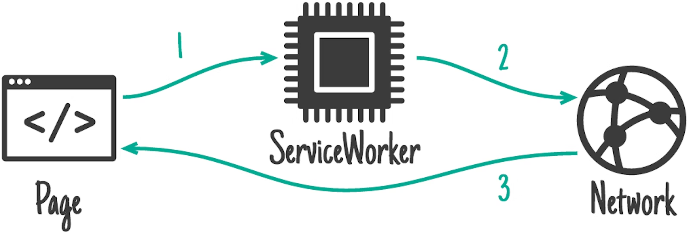
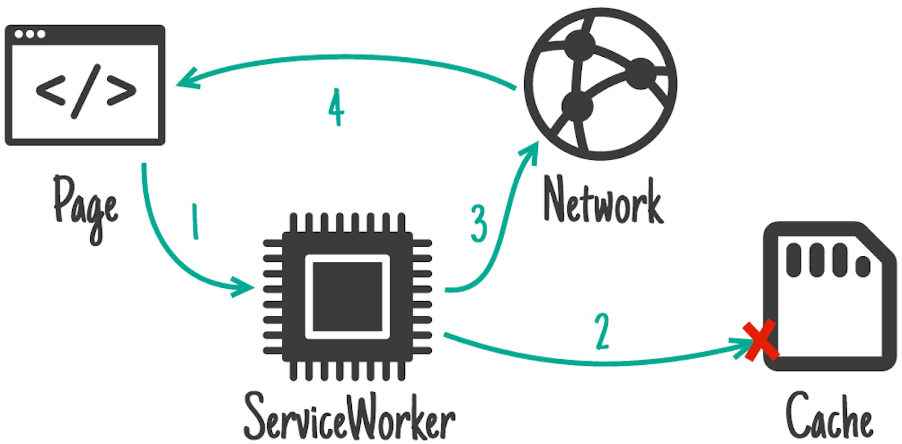
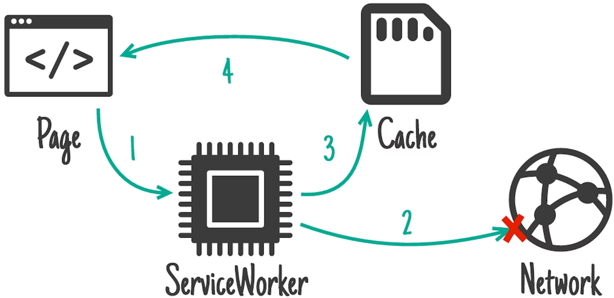
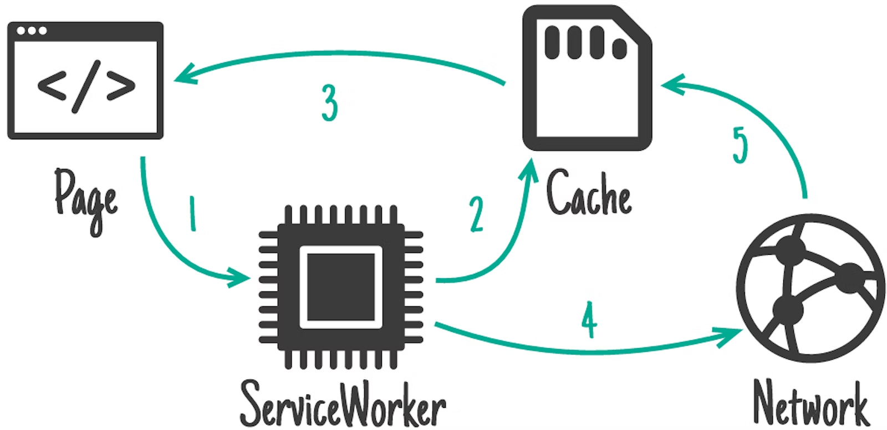

# PWA

- PWA 是一系列技术集合
  - [Manifest](https://developer.mozilla.org/zh-CN/docs/Web/Manifest)
  - [Service Worker](#service-worker)
  - CacheStorage
  - Notification
  - Push Message

## Service Worker

- 安全限制：HTTPS/localhost
- 控制范围
  - 默认下由 SW 文件路径决定其控制范围：兄弟路径或者其子路径
  - 手动作用域设置
    - `navigator.serviceWorker.register('sw.js', {scope: xxx})`
    - HTTP 响应设置 Service-Worker-Allowed 头部
  - `navigator.serviceWorker.controller` 获取当前作用域的 Service Worker 实例
  - **作用域冲突**
    - 每个范围只允许一个 ServiceWorker 实例
    - 子域注册的服务会优先于父域的服务，这就导致一些全局功能失效：
      - 功能拆封，各个域的服务主动引入
      - 功能提升：全部整合到根作用域，以插件机制动态注册功能
- [生命周期](#生命周期)

### 生命周期

1. 注册：下载、解析和执行 Service Worker
2. 安装：一旦 Service Worker 注册完，就激活 `install` 事件（首次安装、更新安装时触发）
3. 等待：安装成功后，如果已有旧版本在运行，新版便会进入等待状态，除非
   - 旧版本 Service Worker 控制下的页面全部关闭
   - 强制跳过等待 `self.skipWaiting();`
4. 激活：安装成功后进入激活状态，触发 `activate` 事件
  - 首次注册激活时，已打开的页面只有在刷新后才会受控
  - 强制控制页面 `self.clients.claim`
  - 监听事件
    - `fetch`
    - `push`
    - `sync`
- 注销：`registration.unregister();`
- 废弃
  - 安装失败
  - 激活失败
  - 用户执行了注销操作
  - 新版本的 Service Worker 替换了它并成为激活状态

### Service Worker 实战

- SW 版本管理
- 路由拦截
- [缓存策略](https://developer.chrome.com/docs/workbox/caching-strategies-overview/)
  - 预缓存（通常在 Service Worker 的安装过程中实现）
  - 运行时缓存：指在运行时从网络请求资源时将缓存策略应用于资源
    - 仅缓存    
    - 仅限网络    
    - 缓存优先：优先使用缓存，资源不存在则退为网络请求    
    - 网络优先：优先网络请求，网络失败则退为使用缓存    
    - SWR(Stale-while-revalidate)：  


- 实战
  - SW 版本管理（注册更新）
  - 离线模式
  - 预缓存

 安装阶段通常是实现预缓存方案：

  ```js
  // /sw.js
  self.addEventListener("install", (event) => {
    const cacheKey = "MyFancyCacheName_v1";

    event.waitUntil(
      caches.open(cacheKey).then((cache) => {
        // Add all the assets in the array to the 'MyFancyCacheName_v1'
        // `Cache` instance for later use.
        return cache.addAll([
          "/css/global.bc7b80b7.css",
          "/css/home.fe5d0b23.css",
          "/js/home.d3cc4ba4.js",
          "/js/jquery.43ca4933.js",
        ]);
      })
    );
  });
  ```

### SW 版本管理（注册更新）

避免更改你的 service worker 脚本的 URL

```html
 <!-- In index.html, for example: -->
 <script>
   // Don't register the service worker
   // until the page has fully loaded
   window.addEventListener("load", () => {
     // Is service worker available?
     if ("serviceWorker" in navigator) {
       navigator.serviceWorker
         .register("/sw.js")
         .then(() => {
           console.log("Service worker registered!");
         })
         .catch((error) => {
           console.warn("Error registering service worker:");
           console.warn(error);
         });
     }
   });
 </script>
 ```

SW 更新原理：

- 注册的 SW 的 URL 或者 Scope  发生改变
- 或判断内容变化
- 否则，直接激活

 HTTP 缓存保留它，也不要更改其文件名

手动触发更新检查

```js
navigator.serviceWorker.ready.then((registration) => {
  registration.update();
});
```

### 离线检测

**Navigator**

```javascript
if (navigator.online) {
  // 正常工作
} else {
  // 执行离线任务
}
```

为了检测应用是否离线，在页面加载后，最好先通过 navigator.onLine 取得初始状态，然后监听离线事件，确认网络连接状态是否变化。

```
window.addEventListener('online/offline', () => {alert('onLine')})
```

## 学习参考

- [sw-101-gdgdf](https://huangxuan.me/2016/11/20/sw-101-gdgdf/)
- [The service worker lifecycle](https://web.dev/service-worker-lifecycle/)

- [渐进式 Web 应用（PWA）](https://developer.mozilla.org/zh-CN/docs/Web/Progressive_web_apps)
- [Progressive Web App Training](https://www.youtube.com/playlist?list=PLNYkxOF6rcIB2xHBZ7opgc2Mv009X87Hh)
- [Progressive Web Apps](https://web.dev/progressive-web-apps/)
