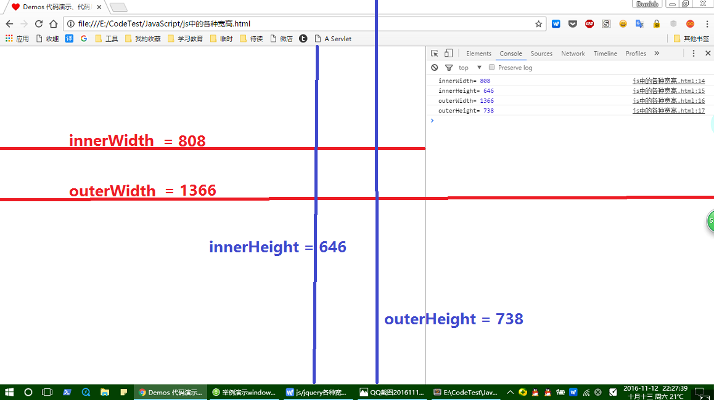
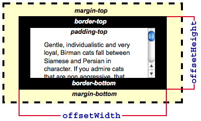
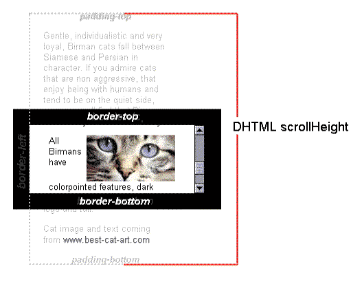
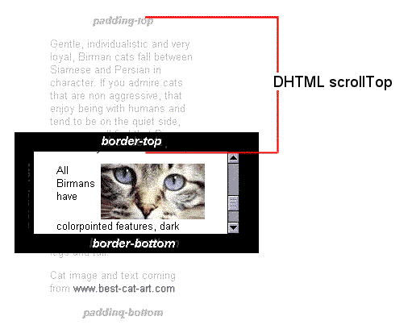

---
tags:
  - width
  - height
  - client
  - offset
  - scroll
  -	window
  -	screen
---

# 视图中的各种宽高偏移

### screen

- width
- height
- availHeight 返回浏览器窗口在屏幕上可占用的垂直空间，即最大高度。

### window

- innerWidth
- innerHeight
- outerWidth
- outerHeight

### element

- client

  ​		元素的内容可视部分宽度和高度，即`padding+conten` 不包含滚动条

  - clientWidth

  - clientHeight

    

    

    元素的边框

  - clientLeft

  - clientTop

- offset

  ​		元素整体大小（ content + padding + scroll + border  ）

  - offsetWidth

  - offsetHeight

    

    

    当前元素相对于  [HTMLElement.offsetParent](https://developer.mozilla.org/zh-CN/docs/Web/API/HTMLElement/offsetParent) 的偏移

  - offsetLeft

  - offsetTop

    

- scroll

  ​		元素的滚动内容宽高

  - scrollWidth

  - scrollHeight

    

  

  ​		元素内容超出的距离

  - scrollLeft

  - scrollTop

    