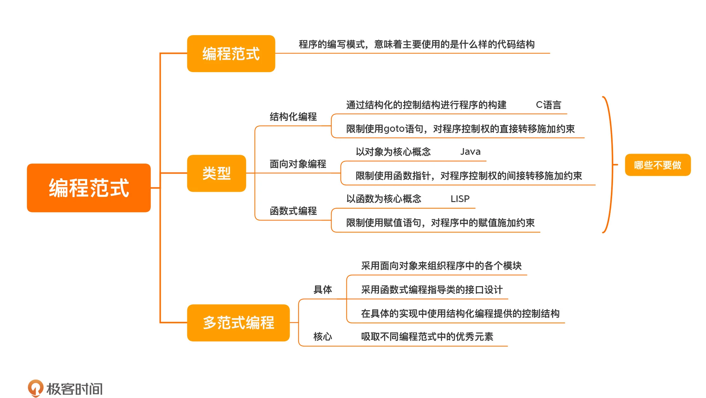

---
tags:
 - 编程范式
---
# 编程范式

编程范式，是编程世界里程序员们造物的世界观与方法论、是编程语言代码的编写模式或者风格（编程语言的语法和风格与其所支持的编程范式密切相关），同时也代表了这门语言的思想及设计方向。

虽然编程语言和编程范式是多对多的关系，但每一种编程语言都有自己的主流编程范式。比如 C 语言主要是结构化编程，而 Java 主要是面向对象编程。但如今编程语言为了更好的抽象解决问题，开始支持多范式编程。

编程范式的分类：从宏观上，编程语言可以大致分为两类，一类是命令式，一类是声明式。

- 命令式：通过一系列顺序指令来告诉计算机怎么做
- 声明式：只需要说明实现的目标，总而言之就是它是定义结果而不是定义步骤

现在主流的编程范式有三种：

- 结构化编程（structured programming）
- 面向对象编程（object-oriented programming）
- 函数式编程（functional programming）

## 结构化编程（过程式编程）

常见的编程范式：

- 命令式编程：一系列顺序指令
  - 结构化编程：
    - 过程式编程：基于函数（或过程）的方式来进行流程控制，而基于类和对象的程序结构表示被称为面向对象
      - 面向对象编程：使用对象作为程序的基本单元，将程序和数据结构化封装成对象，本质上就是一堆对象之间的交互，但对象消息通信也是过程式调用
        - 基于类
        - 基于原型
        - 面向接口
      - 事件驱动编程
- 声明式
  - 函数式编程
  - 逻辑式编程
- 泛型编程

结构化编程，限制使用 goto 语句，它是对程序控制权的直接转移施加了约束。面向对象编程，限制使用函数指针，它是对程序控制权的间接转移施加了约束。函数式编程，限制使用赋值语句，它是对程序中的赋值施加了约束。

Computer = Data（存储单元）+ Calc（计算算单元） + Control（控制单元）
Data = Value + Type + Var
Programs = Algorithms + Data Structures
Algorithm = Logic + Control

类型的本质。

类型是对内存的一种抽象。不同的类型，会有不同的内存布局和内存分配的策略。
不同的类型，有不同的操作。所以，对于特定的类型，也有特定的一组操作。

- 类型系统
  - 静态、动态
    - 动态
      - 类型检查
  - 强弱类型
    - 弱类型
      - 类型转化
        - 访问到了不同的地址和内存空间，这就导致程序出现严重的问题
    - 强类型
      - 类型抽象 =〉泛型

C 语言是一个有结构化程序设计、具有变量作用域以及递归功能的过程式语言；

采用面向对象来组织程序，而在每个类具体的接口设计上，采用函数式编程的风格，在具体的实现中使用结构化编程提供的控制结构。

数据结构不复杂，复杂的是算法，也就是我们的业务逻辑是复杂的。我们的算法由两个逻辑组成，一个是真正的业务逻辑，另外一种是控制逻辑。程序中有两种代码，一种是真正的业务逻辑代码，另一种代码是控制我们程序的代码，叫控制代码，这根本不是业务逻辑，业务逻辑不关心这个事情。

Logic 部分是真正意义上的解决问题的算法，而 Control 部分只是影响解决这个问题的效率。程序运行的效率问题和程序的逻辑其实是没有关系的。我们认为，如果将 Logic 和 Control 部分有效地分开，那么代码就会变得更容易改进和维护。

有效地分离 Logic、Control 和 Data 是写出好程序的关键所在！

在编程世界中，我们需要处理好两件事。

第一件事是编程语言中的类型问题。
第二件事是对真实世界中业务代码的抽象、重用和拼装。

diff 属性变化 => 通过编译时找出变化的属性进行diff

多范式编程
我们采用面向对象来组织程序，而在每个类具体的接口设计上，采用函数式编程的风格，在具体的实现中使用结构化编程提供的控制结构。

  

算法对抗的是数据的规模，而软件设计对抗的是需求的规模。软件设计，实际上就是应对需求的“算法”。

大多数人在理解一个软件时，总会出现一个问题，就是眉毛胡子一把抓，直奔代码细节而去。这样不仅增加了我们的时间成本，还会迷失在细节之中，只见树木不见森林。所以在这个课程中，我会教你一个快速了解现有软件设计的方法，那就是抓住这个软件最核心的三个部分：模型、接口和实现。