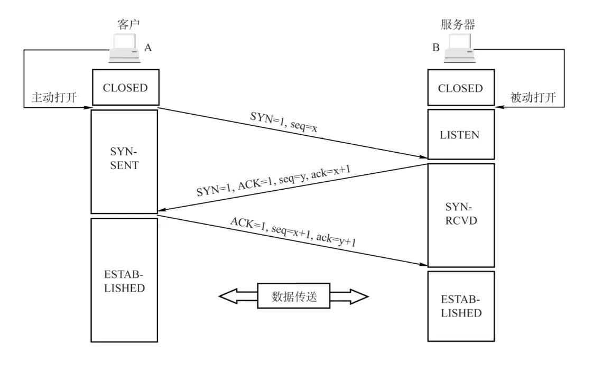
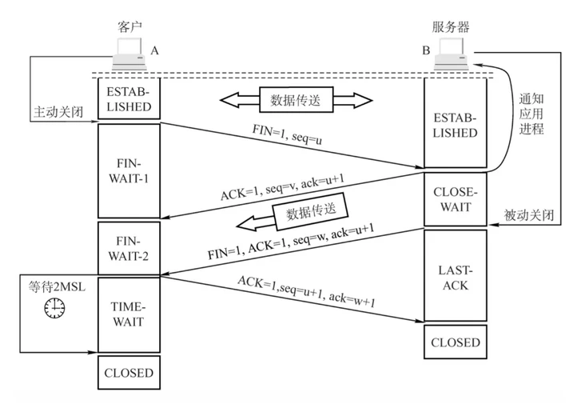

# TCP

TCP（Transport Control Protocol）是一个传输层协议，提供 Host-To-Host 数据的可靠传输，支持全双工，是一个连接导向的协议。

## TCP 包数据结构

  

- 序号(seq)：在一个 TCP 连接中传送的字节流中的每一个字节都按顺序编号。  
  例如，一报文段的序号是 101，共有 100 字节的数据。这就表明：本报文段的数据的第一个字节的序号是 101，最后一个字节的序号是 200。显然，下一个报文段的数据序号应当从 201 开始，即下一个报文段的序号字段值应为 201。
- 确认号(ack)：期望收到对方下一个报文段的第一个数据字节的序号，ack = 已接受序号 + 1
- 标识符
  - SYN：请求连接
  - FIN：连接终止
  - ACK：表示发来的数据已确认接收无误
  - PSH
  - RST
  - URG

## 三次握手：建立连接的过程

TCP 是一个面向连接的协议，也就是通信前需要建立连接。

连接是通信双方的一个约定，目标是让两个在通信的程序之间产生一个默契，保证两个程序都在线，而且尽快地响应对方的请求，这就是连接（Connection）。连接是网络行为状态的记录。在传输之前，建立一个连接。具体来说，数据收发双方的内存中都建立一个用于维护数据传输状态的对象，如ip地址、端口号等。

三次握手就是为了确认双方的接收能力和发送能力是否正常，初始状态：指定自己的 初始化序列号(Init Sequense Number, ISN) 为后面的可靠性传输做准备。

  

### 你可能以为 2 次握手就足够了，为什么需要第三次握手？

三次握手的其中一个重要功能是客户端和服务端交换 ISN(Initial Sequence Number)建立状态，以便让对方知道接下来接收数据的时候如何按序列号组装数据。

> ISN (Initial Sequence Number) 不可以是固定，当一端为建立连接而发送它的 SYN 时，它会为连接选择一个初始序号。ISN 随时间而变化，因此每个连接都将具有不同的 ISN。如果 ISN 是固定的，攻击者很容易猜出后续的确认号，因此 ISN 是动态生成的。

TCP 可靠性基于请求-应答模式，接收方收到数据后，都需要给发送方一个 ACK（Acknowledgement）响应。如果一个请求没有响应，发送方可能会认为自己需要重发这个请求。

服务端还没有确定客户端是否准备好了、接受到信息。服务端马上给客户端发送数据，这个时候客户端可能还没有准备好接收数据。因此还需要增加一个过程。

## 四次挥手：断开连接

  

其中第四次挥手后，客户端需要经过时间等待计时器设置的时间 2MSL（一个报文的来回时间） 后才会进入 CLOSED 状态（这样做的目的是确保服务端收到自己的 ACK 报文。如果服务端在规定时间内没有收到客户端发来的 ACK 报文的话，服务端会重新发送 FIN 报文给客户端，客户端再次收到 FIN 报文之后，就知道之前的 ACK 报文丢失了，然后再次发送 ACK 报文给服务端）。服务端收到 ACK 报文之后，就关闭连接了，处于 CLOSED 状态。

### 为什么四次挥手

因为TCP是全双工通信的。当主动方发送断开连接的请求（即FIN报文）给被动方时，仅仅代表主动方不会再发送数据报文了，但主动方仍可以接收数据报文。当被动方也发送FIN报文时才意味着连接可以断开。无论是哪方收到消息后，都需要给发送方一个 ACK（Acknowledgement）响应。如果一个请求没有响应，发送方可能会认为自己需要重发这个请求。所以总共四次挥手。

## 参考

- [关于 TCP 三次握手和四次挥手，满分回答在此](https://segmentfault.com/a/1190000039165592)