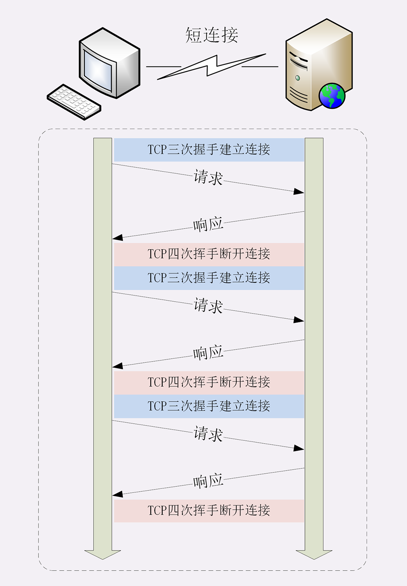
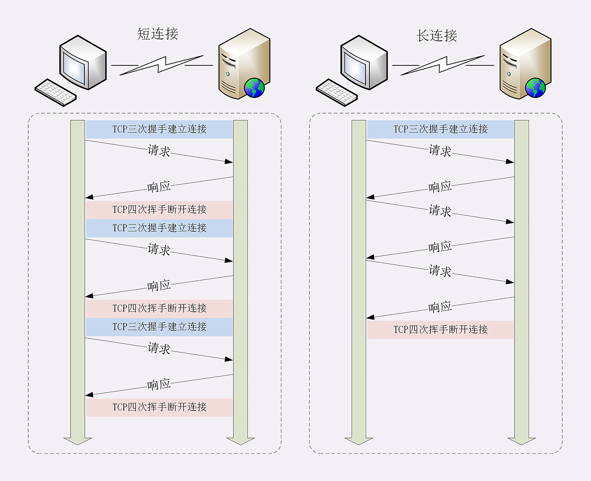
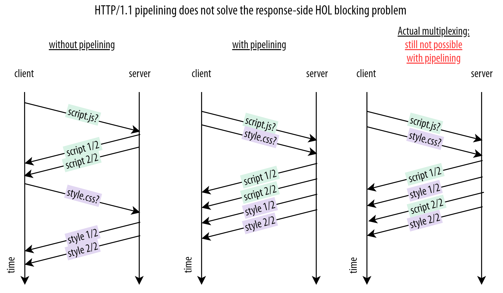
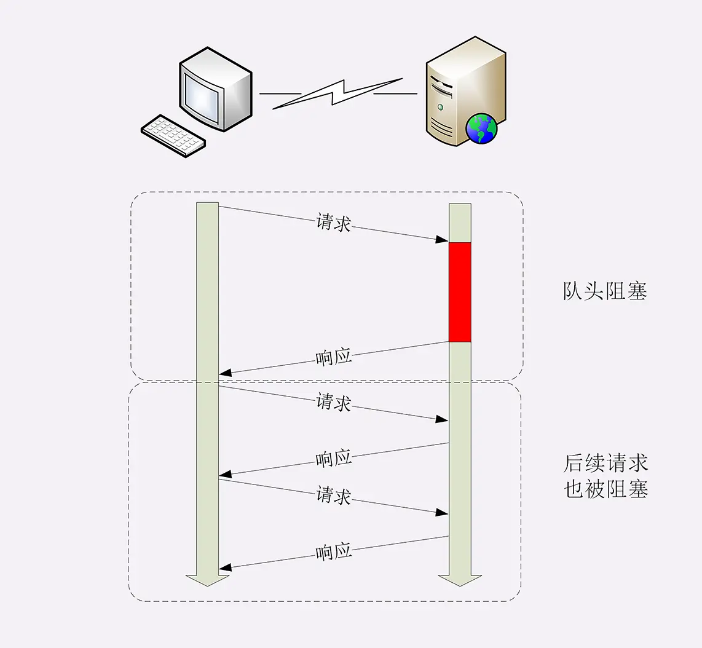
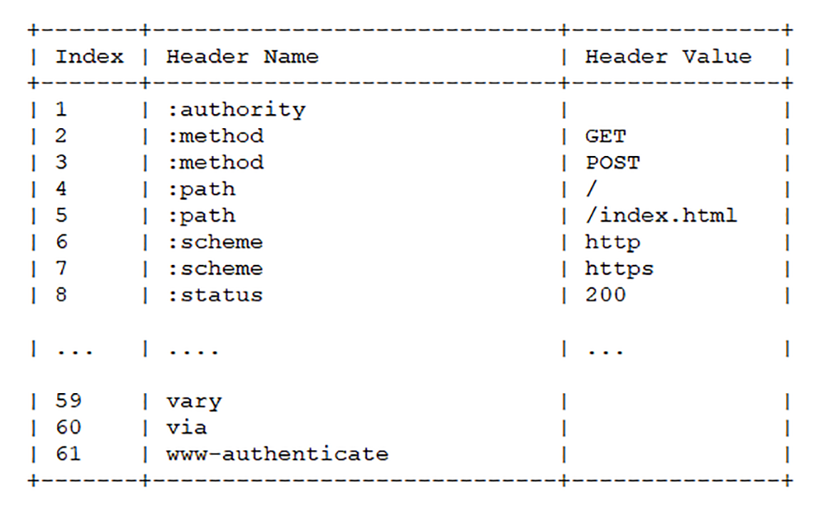
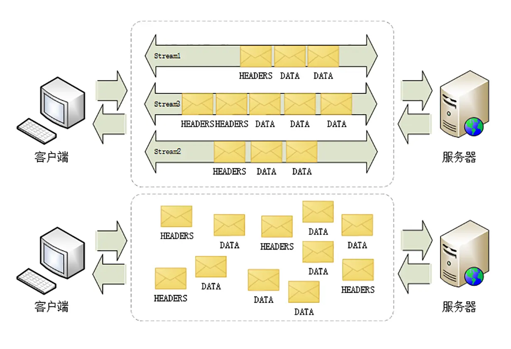
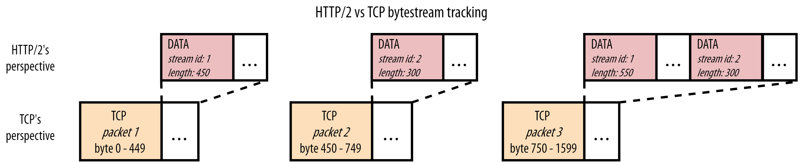
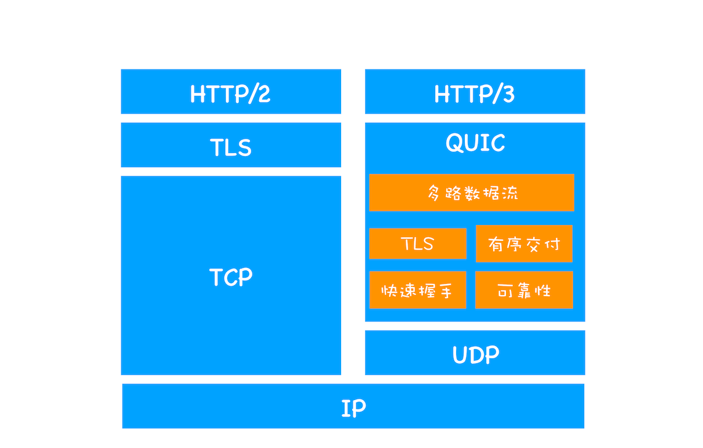

# HTTP 各版本协议对比

- HTTP/0.9
  - 只传输 ASCII 编码的超文本内容 HTML，并且只有一个请求行且只支持GET请求
- HTTP/1.0
  - 增加了 HEAD、POST 等新方法；
  - 增加了响应状态码；
  - 引入了 HTTP Header（头部）的概念，让 HTTP 处理请求和响应更加灵活；
  - 支持多种文件类型传输
- HTTP/1.1
  - 增加了 PUT、DELETE、OPTIONS、PATCH 等新的方法
  - 支持响应数据分块传输
  - 增加了 cache-control
  - 增加了 cookie 机制
  - [默认开启 keep-alive 长连接](#keep-alive-长连接)
  - [引入管道机制](#管道pipelining)
- HTTP/2：改进性能，解决了 [HTTP 队头阻塞问题](#http-队头阻塞)
  - [头部压缩](#头部压缩)
  - [二进制分帧传输](#二进制分帧)
  - [多路复用](#多路复用)
    - 流
      - 唯一 ID
      - 优先级及依赖关系
      - 双向性
  - 帧控制
  - [服务推送](#服务器推送)
- [HTTP/3](#http3基于-udp-实现的-quic-协议)：主要解决 [TCP 队头阻塞](#tcp-队头阻塞)、TCP 及 TSL 握手消耗
  - 基于 UDP 实现的 QUIC 协议

## keep-alive 长连接

在 HTTP/1.1 之前，客户端与服务器端的的**每次请求都需要创建 TCP 连接，服务器响应后断开 TCP 连接**，再请求再创建断开。因为客户端不会与服务器保持长时间的连接状态，所以就被称为“短连接”（short-lived connections）。

  

TCP 的连接和关闭非常耗时间，**长连接即在一个请求结束后保持 TCP 连接不关闭**，其他多个请求可以复用到同一 TCP 连接。

  

## 管道(pipelining)

在一个 TCP 连接可以同时发送多个请求，但要求服务端必须按照请求发送的顺序返回响应，当顺序请求多个文件时，其中一个请求因为某种原因被阻塞时，在后面排队的所有请求也一并被阻塞。管道解决了请求的队头阻塞，而不是响应的队头阻塞，这是因为 http 队头阻塞的问题。管道机制依旧没解决队头阻塞问题，而且大多数浏览器实际上并没有在现实中使用 HTTP/1.1 管道。

  

## http 队头阻塞

http 队头阻塞，设计之初是一个简单纯文本传输协议，基本上是一个字符流，消息必须作为一个连续的数据流完整地发送，并且连接不能用于其他任何事情，只能传输该消息直到它完成，这造就了 http 是一个请求-应答模式。

即使是使用了长连接，但在同一条 TCP 连接中，由于 http 的请求应答模式，决定了 http 是“半双工”，只能一发一回收发数据，队列后边的请求必须等待队首完成，如果队首的请求因为处理的太慢耽误了时间，那么队列里后面的所有请求也不得不跟着一起等待，这就是 http 队头阻塞的根源。

  

## 头部压缩

http 请求头可能带有很多字段或者每次传输重复字段都会导致带宽浪费，HTTP/2 使用 “HPACK” 算法进行“头部压缩”：

1. 浏览器和服务器会维护一个相同的静态表和一个动态表，以及内置一个静态霍夫曼编码表
2. 静态表存储的是常见的一些头部，和一些很常见的头部键值对
     
3. 动态表初始为空，添加在静态表后面，结构相同
4. 请求、响应头部中对于静态表里未出现过的字段或者对应值则经过哈夫曼压缩编码发送之后，客户端和服务器更新自己的动态表；对应已有的则只需发送索引值
     

> [静态表、静态霍夫曼编码表参考](https://datatracker.ietf.org/doc/html/draft-ietf-httpbis-header-compression#appendix-A)

## 二进制分帧

  

二进制分帧层是在应用层和传输层之间的中间层，HTTP/2 采用了类似于 TCP 数据包二进制结构，将数据分割成多个数据帧（DATA frames），并对其进行二进制结构化编码，并且每个帧都分配给一个唯一“流” ID。

  

- 帧类型
  - 数据帧
    - HEADERS 帧
    - DATA 帧
  - 控制帧
    - SETTINGS、PING、PRIORITY 等则是用来管理流的控制帧。
- 帧标志：携带简单的控制信息
  - END_HEADERS：表示头数据结束，相当于 HTTP/1 里头后的空行（“\r\n”）
  - END_STREAM：表示单方向数据发送结束（即 EOS，End of Stream）
- 流标识符：帧所属的“流”，接收方使用它就可以从乱序的帧里识别出具有相同流 ID 的帧序列，按顺序组装起来就实现了虚拟的“流”

## 多路复用

每个帧都分配给一个“流”：这里的“流”，其实是一个虚拟的概念，在同一个 TCP 连接中所有消息都是被分成多个帧乱序发送，每条“流”其实可以看作是每个 http 请求，属于同一个 http 请求的消息往返的帧会分配一个唯一的流 ID，将同一个流ID的帧按照次序组装起来就是 HTTP/1 里的请求报文和响应报文。

  

http2 就可以在一个 TCP 同时发送接受多个请求“碎片化”的消息，这就是常说的“多路复用”（ Multiplexing）——多个往返通信都复用一个连接来处理。

## 服务器推送

http2 保留了应用层 http “请求 - 响应答” 语义，是为了兼容保证上层应用继续工作，
但底层不再 “请求 - 响答” 的工作模式，服务器不再是完全被动地响应请求，也可以新建“流”主动向客户端发送消息。比如，在浏览器刚请求 HTML 的时候就提前把可能会用到的 JS、CSS 文件发给客户端，减少等待的延迟，这被称为“服务器推送”（Server Push，也叫 Cache Push）。

  

## TCP 队头阻塞

底层 TCP 对于协议上层传输什么类型文件数据是无感的，而且也不存在 http2 的流概念，它只知道处理一系列字节，把所有的东西看作一个大流，从一台计算机传输另一台计算机。

  

当接受到数据包1、3，而数据包2丢失时，TCP 会缓冲数据包3，直到收到重新传输丢失数据包2，数据包3才可用，这相当于间接阻塞上层 http2 的流1流2。

总结，如果一个 TCP 包丢失，所有后续的包都需要等待它的重传，TCP 具有传输层队头阻塞。

## HTTP/3：基于 UDP 实现的 QUIC 协议

HTTP/2 是基于 TCP，这就意味 TCP 队头阻塞问题也是同样无可避免。在 HTTP/2 中以流的方式实现了多路复用解决队头阻塞问题，同样可以在传输层上实现多条独立的流即可。但由于不可能改变 TCP 协议本身使其具有流意识，所以需要实现一个全新的传输层协议 QUIC。
 
  

QUIC = 实现 TCP 的所有特性（可靠性、拥塞控制、流量控制、排序等） + TSL + 多路复用

- 实现了类似 TCP 的流量控制、传输可靠性的功能
- 集成了 TLS 加密功能
- 实现了 HTTP/2 中的多路复用功能
- 0-RTT 快速握手功能。由于 QUIC 是基于 UDP 的，所以 QUIC 可以实现使用 0-RTT 或者 1-RTT 来建立连接，这意味着 QUIC 可以用最快的速度来发送和接收数据，这样可以大大提升首次打开页面的速度。

> 我们把从浏览器发送一个数据包到服务器，再从服务器返回数据包到浏览器的整个往返时间称为 RTT。RTT 是反映网络性能的一个重要指标。

QUIC 的多路复用对队头阻塞的移除可能只会对有大量数据包丢失的网络场景有效，但大多数正常情况对 Web 性能起不到多大作用。多路复用允许改变响应的顺序并中断低优先级响应以获得更高优先级的响应。

因为资源多路复用通常不是 Web 性能的最佳方案

## 参考

- [HTTP/2](https://hpbn.co/http2/)
- [详解 HTTP/2 头压缩算法 —— HPACK](https://github.com/halfrost/Halfrost-Field/blob/master/contents/Protocol/HTTP:2_Header-Compression.md#3-indexing-tables)
- [Why is it said that HTTP2 is a binary protocol?](https://stackoverflow.com/questions/58498116/why-is-it-said-that-http2-is-a-binary-protocol)
- [QUIC 和 HTTP/3 队头阻塞的细节](https://mp.weixin.qq.com/s/-Z5ei-zXMfjPHUrQZs87ag)
- [Head-of-Line Blocking in QUIC and HTTP/3: The Details](https://calendar.perfplanet.com/2020/head-of-line-blocking-in-quic-and-http-3-the-details/#sec_http2)

http2.0允许服务器主动推送消息，那跟WebSocket有什么区别吗？

- tcp
  - 启动慢
  - 拥塞控制
  - 重传机制

- http1
  - keep-alive
  - 文件合并
  - 并行连接
    - 域名分片:浏览器为每个域名最多同时维护 6 个 TCP 持久连接；

QUIC 协议为什么选择 UDP

因为 UDP 是无序的，包之间没有依赖关系，所以就从根本上解决了“队头阻塞”。

UDP 是一个简单、不可靠的传输协议

QUIC 中的 0-RTT 功能能让客户端在三次握手完成之前发送应用数据。这个功能通过重用先前连接的参数实现。0-RTT 依赖于客户端记住的重要参数，并向服务器提供 TLS 会话票证（session ticket）以恢复相同的信息。