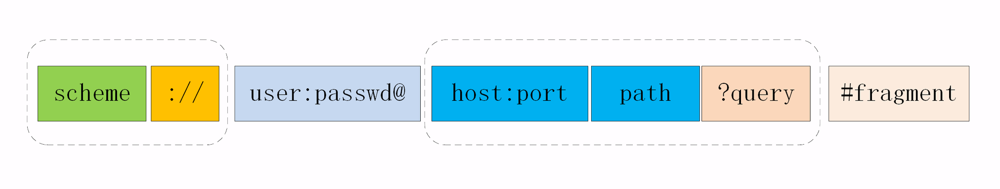
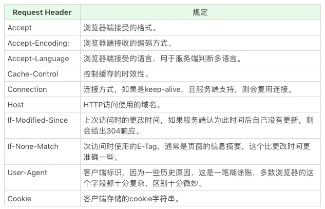

# 开发必知的 HTTP 基础

## HTTP 特点

- HTTP 特点
  - 请求-响应模式
  - 灵活、易于扩展
    - 只规定了报文的基本格式，比如用空格分隔单词，用换行分隔字段，“header+body”等，报文里的各个组成部分都没有做严格的语法语义限制，可以由开发者任意定制。  
    - 不限制具体的下层协议，不仅可以使用 TCP、UNIX Domain Socket，还可以使用 SSL/TLS，甚至是基于 UDP 的 QUIC，**下层可以随意变化，而上层的语义则始终保持稳定**。
  - 无状态（“状态”其实就是客户端或者服务器里保存的一些数据或者标志，记录了通信过程中的一些变化信息。）
    > 实现上不需要额外的资源来记录状态信息，减轻服务器的负担，能够把更多的 CPU 和内存用来对外提供服务。  
    > 而且，“无状态”也表示服务器都是相同的，没有“状态”的差异，可以轻松实现集群化，让负载均衡把请求转发到任意一台服务器，扩展性能
  - 可靠性，保证数据文件完整性到达，“可靠”只是向使用者提供了一个“承诺”，会在下层用多种手段“尽量”保证数据的完整送达
  - 缺点
    - 明文传输，数据完全肉眼可见，能够方便地研究分析
    - 不安全的，无法验证通信双方的身份，也不能判断报文是否被篡改


- HTTP 所谓的“无状态协议”，这里的状态不是指**会话状态**，而是指的是**通信协议层面的状态**（大多数人容易混淆，而且也跟 Cookies、Session 这些都没有什么大的联系，只不过我们平时会使用它们是去实现应用会话状态）
- 为什么说HTTP是无状态的协议呢？因为它的每个请求都是完全独立的，每个请求包含了处理这个请求所需的完整的数据，发送请求不涉及到状态变更
  - 无状态协议优点：会话状态与连接解耦，如果连接意外断开，整个会话就会丢失，重新连接之后一般需要从头开始
  - 无状态协议的主要缺点在于，单个请求需要的所有信息都必须要包含在请求中一次发送到服务端，这导致单个消息的结构需要比较复杂，必须能够支持大量元数据，因此HTTP消息的解析要比其他许多协议都要复杂得多
- 但 HTTP/2 应该算是一个有状态的协议了，因为有流控，所以以后说“HTTP是无状态的协议”就不太对了，最好说“HTTP 1.x是无状态的协议”
- Cookies/Session的作用是创建和维护多组独立的状态，而不是有状态。这个状态指的是后端服务的状态，而非HTTP协议本身的状态。所以说，HTTP协议是无状态的协议，这个其实跟服务的状态是无关的。一个服务不管使用何种协议，都可以在服务层面上是有状态的，因为这和通信协议无关，只需要它在响应请求时改变自己的状态即可


## http 协议格式

```
请求行（请求方法、请求的路径、协议版本）
请求头（用冒号分隔的名称和值）
/空行/
请求体

响应行（协议版本、状态码、状态文本）
响应头（用冒号分隔的名称和值）
/空行/
响应体
```

## URI

URI 的完整格式：

  

- Scheme 部分代表协议，不只有 https，还有 ftp、ssh 等。不同协议代表着不同类型的应用在提供资源。
- Host 部分代表站点，我们今天介绍的 DNS 主要作用就是根据 Host 查找 IP 地址。
- Port 是端口，代表提供服务的应用。
- Path 是路径，代表资源在服务中的路径。
- Query 是查询条件，代表需要的是资源中的某一个部分。
  - 由多个“key=value”组成的字符串，这些 KV 值用字符“&”连接
- Fragment 是二级查询条件，通常不在服务端响应，而是用于前端展示定位内容。

其他

- URI 的编码：把非 ASCII 码或特殊字符转换成十六进制字节值，然后前面再加上一个“%”。例如，空格被转义成“%20”。

## 请求方法

- GET：获取资源
- POST：提交资源
- PATCH：差量修改数据
- PUT：全量修改数据
- DELETE：删除资源
- HEAD：获取资源的元信息，HEAD 则是跟 GET 类似，但只返回响应头（想象一个业务情景：欲判断某个资源是否存在，我们通常使用GET，但这里用HEAD则意义更加明确。）
- CONNECT：建立连接隧道，这时 Web服务器充当代理的角色，多用于 HTTPS 和 WebSocket
- OPTIONS：要求服务器列出可对资源实行的操作方法，在响应头Allow字段里返回，常用于跨域资源共享
- TRACE

## 状态码

- 1xx：提示信息，表示目前是协议处理的中间状态，还需要后续的操作
  - 101 切换请求协议，从 HTTP 切换到 WebSocket
- 2xx：请求处理成功
  - 200：请求成功
  - 204：请求成功，但没有返回任何内容
  - 206：分块传输
- 3xx: 重定向，表示客户端请求的资源发生了变动，需要重新请求
  - 301：永久性重定向
  - 302：临时性重定向
  - 304：资源未被修改，客户端重定向缓存
- 4xx：客户端错误，表示请求报文有误，服务器无法处理
  - 400：请求参数错误
  - 401：未授权，请求要求身份验证
  - 403：禁止访问
  - 404：表示请求资源不存在
  - 405：请求方法错误
- 5xx：表示服务器端错误
  - 500：服务端错误
  - 503：服务端暂时性错误或者繁忙，稍后再试
  - 504：网关超时

## 请求头、响应头常见字段

  

  

